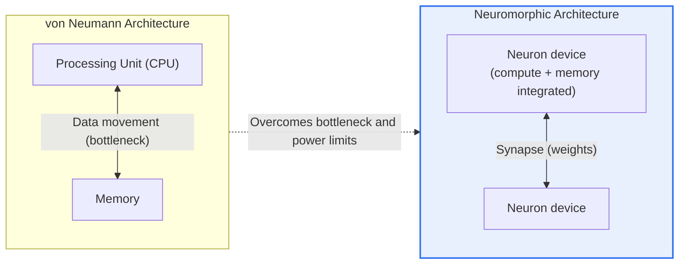
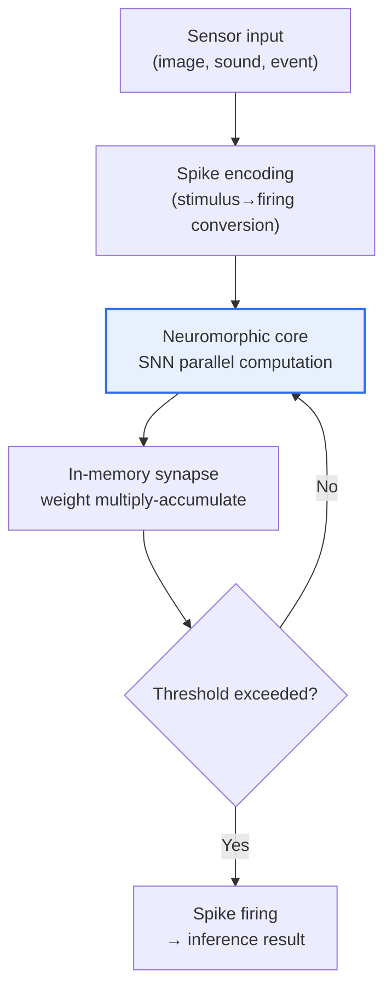

# Neuromorphic Chip

## 1. Overview

### A. Definition
> A **neuromorphic chip** is a neuro-inspired semiconductor that mimics in hardware the **structure and operating mechanisms of the brain's neurons and synapses**, integrating computation and memory and performing event-driven parallel processing to achieve ultra-low-power AI.

The core idea behind neuromorphic chips is to "**make the computer work like the brain so that it operates as efficiently as the brain**." Most of today's computers follow the **von Neumann architecture**. Because the processing unit (CPU) and memory are physically separated, instructions and data are continually shuttled between them over a bus. Computation speed has increased, but the bandwidth of this data-movement path constrains performance, and enormous power is consumed in the movement itself. This is called the **von Neumann bottleneck**, or the "memory wall." The more a task involves exchanging large volumes of data, as in large-scale deep learning, the more fatal this bottleneck becomes.

The human brain, by contrast, operates in an entirely different way. Roughly 86 billion neurons each perform computation and memory together (in-memory), send short electrical signals called spikes to neighboring neurons only when stimulated (event-driven), and operate massively in parallel. As a result, the brain handles cognitive tasks that would consume several megawatts on a supercomputer with only **about 20W** — roughly the power of a single incandescent bulb. Neuromorphic chips implement these three brain principles (integrated computation and memory, event-driven spikes, massive parallelism) in a semiconductor, thereby bypassing the von Neumann bottleneck and fundamentally raising the power efficiency of AI computation. Information representation and transmission are carried out by a **Spiking Neural Network (SNN)** that mimics the firing of biological neurons.

### B. Background
As deep learning spread, model sizes and the compute required for training and inference grew exponentially. Handling this with large clusters of GPUs made the power consumption and heat dissipation of data centers a serious constraint. At the same time, in edge environments such as smartphones, wearables, IoT, and autonomous devices that must operate continuously on batteries, there is a growing need to run AI at low power on the device itself, rather than sending data to the cloud.

As the slowdown of Moore's Law and the deepening "memory wall" made it clear that improving the existing architecture alone could not meet these demands, approaches that change the very method of computation drew attention. The demand for a new computing paradigm that overcomes the power and bottleneck limits of the von Neumann architecture is the backdrop for the emergence of neuromorphic computing.

## 2. Comparison with the von Neumann Architecture

From an overall-architecture standpoint, the fundamental difference between the two approaches is "whether computation and memory are separated." The von Neumann architecture requires a round trip of data to and from the CPU and memory, whereas in the neuromorphic approach computation and memory happen as one within the neuron and synapse devices.

The practical consequences of this architectural difference can be summarized in a table, but the "reason" behind each item is what matters. In **processing method**, von Neumann is optimized for executing instructions sequentially, one line at a time, whereas neuromorphic is event-driven — a given neuron responds only when stimulated, so not all devices are always running. This produces a large difference in **power** — because when there is no data there is almost no computation and no power consumption (sparse activity). This is the fundamental reason neuromorphic is called "low-power AI."

| Category | von Neumann Architecture | Neuromorphic Chip |
|---|---|---|
| **Structure** | Compute and memory separated | Compute and memory integrated (neurons/synapses) |
| **Processing** | Sequential (instruction execution) | Parallel and event-driven (spikes) |
| **Information representation** | Binary values (bits) | Spike firing timing and frequency |
| **Power** | High (data movement, always-on) | Very low (active only when stimulated) |
| **Strength** | General-purpose, precise computation | Low-power pattern recognition, always-on inference |

## 3. Core Technology Elements and Operating Principles

### A. Spiking Neural Network (SNN)
The software brain of a neuromorphic chip is the **SNN**. Unlike a conventional artificial neural network (ANN), in which each neuron multiplies and adds continuous real-valued signals and passes them to the next layer, an SNN fires a spike only at the moment accumulated input exceeds a threshold, just as a biological neuron does. The representative model, the LIF (Leaky Integrate-and-Fire) neuron, integrates the input current onto a membrane potential and fires when the threshold is reached; when there is no firing, the potential gradually leaks away (leaky). Information is carried not so much in the value itself as in "when and how often" spikes occur (temporal coding). This sparsity — no computation when there is no stimulus — is the key to low power. However, this discontinuous firing is hard to differentiate, so conventional back-propagation cannot be used directly, requiring separate training techniques such as surrogate gradients or ANN-to-SNN conversion.

### B. In-memory Computing and Synaptic Devices
The physical method for eliminating the von Neumann bottleneck is **In-memory Computing**. Instead of bringing data to the CPU, computing, and writing it back, computation is performed right where the data is stored in the memory device. To this end, new devices are being researched that can store the synapse's "connection strength (weight)" while simultaneously performing analog computation. A representative example, the **memristor**, is a device whose resistance changes according to the history of current passed through it; it represents synaptic weights as resistance states and physically performs multiply-accumulate (MAC) via Ohm's law and Kirchhoff's law. Devices such as PCM (phase-change memory) and ReRAM are used for the same purpose. Because computation and storage happen in a single device, data movement disappears, which directly translates into reduced power and latency.

### C. Asynchronous, Event-driven Processing
A neuromorphic chip does not synchronize the whole to a single clock and drive every device each cycle; instead, each core operates asynchronously only when a spike (event) arrives. This approach drives idle power extremely low the sparser the input, and it naturally achieves the massive parallelism of many cores processing different events simultaneously. Below is a conceptual diagram showing the data flow from sensing → spike encoding → SNN processing → inference result.

### D. The Difference Between ANN and SNN
The conventional ANN of deep learning and the SNN of neuromorphic computing differ in the very way they represent information. In an ANN, each neuron emits a single real-valued activation at every moment and all neurons are updated synchronously, so the entire network performs dense computation whether or not there is input. In an SNN, by contrast, there is an explicit time axis, and a neuron transmits a binary spike (0/1) to its neighbors only when it fires. That is, information is carried not in "the magnitude of a value" but in "the timing and frequency of firing." Because of this difference, an SNN gains the advantage that computation and power drop sharply the sparser the input, but in exchange it pays the price that a time dimension is added and firing is discontinuous, making training difficult.

The implications for training are also significant. For ANNs, back-propagation — which differentiates the error from output toward input to update the weights — is well established, but the spikes of an SNN are non-differentiable and cannot be applied directly. Hence, techniques such as the surrogate gradient (approximating the firing function with a smooth function), converting a well-trained ANN into an SNN, and biologically local rules such as STDP (spike-timing-dependent plasticity) are being researched. In accuracy, mature ANNs often still lead, but the advantages SNNs have in power efficiency and latency offset this in edge applications.

### E. Representative Chips and Training Methods
Commercial and research neuromorphic chips include Intel's **Loihi/Loihi 2**, IBM's **TrueNorth** and **NorthPole**, and the UK University of Manchester's **SpiNNaker**. Loihi 2 supports 128 asynchronous neuromorphic cores and on-chip learning, allowing it to adapt by updating synaptic weights inside the chip. Such on-chip learning is advantageous for edge AI, which learns on the device itself without sending data to the cloud. Below is a comparison of the aims of representative chips; even within "neuromorphic," design philosophies diverge, from a fully event-driven SNN (Loihi) to low-precision inference acceleration (NorthPole).

| Chip | Owner | Features |
|---|---|---|
| **Loihi 2** | Intel | 128 cores, on-chip learning, fully event-driven SNN |
| **TrueNorth** | IBM | Million-neuron class, specialized for ultra-low-power inference (research) |
| **NorthPole** | IBM | Low-precision (2–8 bit) inference acceleration, near-memory computing |
| **SpiNNaker** | Univ. of Manchester | Large-scale SNN simulation with many ARM cores |

Here, a large-scale system that bundles multiple Loihi 2 chips is the Hala Point discussed later, which shows that neuromorphic computing can scale beyond a single chip to the system level.

## 4. Application Cases and Comparison of Industry Trends

The strength of neuromorphic computing stands out in "low-power, always-on pattern recognition and anomaly detection." A representative case is its combination with an **event camera (DVS, Dynamic Vision Sensor)**. Unlike an ordinary camera, which captures the entire screen at fixed frames, an event camera asynchronously emits, as spikes, only the pixels whose brightness has changed. Because this sparse event stream matches the input format of an SNN, a neuromorphic chip can track motion with microsecond-level latency without any separate conversion. In a scene where the background is stationary, there are almost no events to transmit or compute, so power drops extremely low. This characteristic is especially advantageous for real-time perception in autonomous driving, drones, and robots, where fast reaction and low power are simultaneously required.

Second, in wearables and healthcare that must operate continuously on batteries, there is research into monitoring abnormal patterns in biosignals such as ECG and EMG at low power, without interruption. Third, in smart factories, there is predictive maintenance, which continuously learns from and monitors equipment vibration and sound signals to forecast failures early. What these three cases have in common is the sparsity of "data that is mostly quiet under normal conditions and changes sharply only during anomalies," and this is precisely the condition under which the power efficiency of event-driven neuromorphic computing is maximized.

A representative case showing progress in scale is **Hala Point**, the large-scale neuromorphic system Intel built at Sandia National Laboratories in the United States. According to published materials, this system implements about 1.15 billion neurons and tens of billions of synapses with 1,152 Loihi 2 processors, yet fits in a microwave-oven-sized 6U chassis with a maximum power consumption of about 2,600W, giving it very high power efficiency relative to its neuron count. This suggests that neuromorphic computing can scale not only to small edge devices but also to a data-center-class approach for "sustainable AI." That said, these figures are announced values at the research and demonstration stage, and effective performance on general AI workloads may vary by application.

Meanwhile, fairly comparing neuromorphic performance is not easy. GPUs have the familiar metric of floating-point operations per second (FLOPS), but for event-driven SNNs the amount of computation performed itself varies with the sparsity of the input, so they are hard to measure by the same yardstick. Therefore, one must also look at "energy per spike (pJ/spike)," "energy per inference (mJ/inference)," and latency, and must always ask how many times more power-efficient a design is than a GPU on the same task (iso-accuracy). Figures like "hundreds to thousands of times lower power" that get announced may be limited to specific sparse workloads, so generalizations that do not check the application conditions should be treated with caution.

In industry trends, neuromorphic computing is settling into a direction of dividing roles rather than replacing GPUs. It is realistic that large-scale training and general-purpose inference remain the domain of GPUs/NPUs, while neuromorphic is used as a complementary accelerator in the area of edge perception where always-on, low-power, and low-latency operation is decisive.

## 5. Deep Dive — The Software Ecosystem and Standardization Challenges

Neuromorphic computing is one of several approaches to bypassing the von Neumann bottleneck, and it is useful to understand it in relation to adjacent technologies. It shares concepts with In-memory Computing (PIM), which performs multiply-accumulate in memory; it overlaps with on-device AI and lightweight NPUs in the goal of low-power edge AI; and in the big picture of "post–von Neumann," it is grouped together with quantum computing as one branch of non–von Neumann computing. However, the character of each technology differs — whereas PIM and NPUs emphasize "accelerating" existing deep-learning computation more efficiently, neuromorphic computing aims at a more fundamental shift, changing the very method of information representation (spikes, temporal coding) to be closer to the brain. This difference is also the size of the barrier to entering the ecosystem.

The biggest reason neuromorphic computing has not been broadly commercialized despite its hardware potential is the **immaturity of the software and algorithm ecosystem**. GPU-based deep learning has a mature development stack from CUDA to PyTorch and TensorFlow, along with a vast pool of pre-trained models and a talent pool, but SNN training methods are still being established, and frameworks (e.g., Intel Lava, snnTorch, Norse) are at a relatively early stage. The fundamental difficulty that standard back-propagation is hard to use because of SNNs' discontinuous firing, the challenge of still lagging mature ANNs in accuracy, and low portability because architectures and APIs differ from chip to chip all compound one another. For this reason, academia and industry are treating as key challenges the improvement of SNN training algorithm accuracy (surrogate gradients, ANN conversion), the standardization of vendor-neutral development tools and benchmarks, and the securing of event-based sensor-to-chip integration pipelines. The key to converting the hardware's power advantage into actual application performance ultimately lies in this software ecosystem.

In short, the maturity of neuromorphic computing is decided not by "the number of neurons on a chip" but by "how well the tools, models, and standards that developers can easily use are in place." Given that the GPU ecosystem has accumulated for more than a decade around CUDA, neuromorphic computing too is likely to form its ecosystem gradually, centered on killer applications (use cases that only work if they are low-power). From a professional engineer's perspective, the maturity curve of this ecosystem and its standards, rather than hardware specifications, should be the key indicator for adoption decisions.

## 6. Considerations and Implications (Professional Engineer's Perspective)

1. **It is a promising alternative for low-power edge and on-device AI.** Because it can perform AI inference at ultra-low power in IoT, wearables, and autonomous devices that operate continuously on batteries, it becomes a breakthrough for on-device AI that reduces cloud dependence and improves privacy and latency. That said, adoption should be applied selectively to workloads where always-on, low-power pattern recognition is central.

2. **Securing the software and algorithm ecosystem is the crux of commercialization.** How quickly the SNN development tools, training techniques, and standards that are immature relative to GPUs can be put in place will determine the pace of adoption. Organizations would do well to prepare pilots while observing the maturity of frameworks (e.g., Lava) and the trend of benchmark standardization.

3. **A role-division (hybrid) perspective with GPUs/NPUs is realistic.** One should approach with a heterogeneous acceleration architecture in which GPUs handle large-scale training and neuromorphic handles always-on, low-latency edge perception; complementary adoption rather than wholesale replacement is reasonable.

4. **Maturity and reliability verification of device and process technology are needed.** Analog new devices such as memristors and PCM still have issues of variability, endurance, and precision, so reproducibility and reliability verification are prerequisites for large-scale adoption. An approach that optimizes device–circuit–algorithm together is required.

5. **It has great strategic value from a sustainable-AI perspective.** As data-center power and carbon become social constraints, the power efficiency of neuromorphic computing can be a strategic asset in terms of ESG and energy cost. Together with quantum computing, it is worth considering as a target for mid-to-long-term investment and talent acquisition as one axis of future computing that goes beyond the von Neumann limit.

## References
- Intel, "Intel Builds World's Largest Neuromorphic System (Hala Point)": https://www.intc.com/news-events/press-releases/detail/1691/intel-builds-worlds-largest-neuromorphic-system-to
- Intel Research, Neuromorphic Computing: https://www.intel.com/content/www/us/en/research/neuromorphic-computing.html
- Open Neuromorphic, "A Look at Loihi 2": https://open-neuromorphic.org/neuromorphic-computing/hardware/loihi-2-intel/

---

> **In one line**: A neuromorphic chip is a neuro-inspired semiconductor that *mimics the brain's neurons and synapses to integrate computation and memory and performs event-driven parallel computation with spikes (SNN)*; it is a promising technology for realizing ultra-low-power edge AI beyond the von Neumann bottleneck and AI's power problem, but the maturity of the SNN software ecosystem is the crux of its commercialization.
