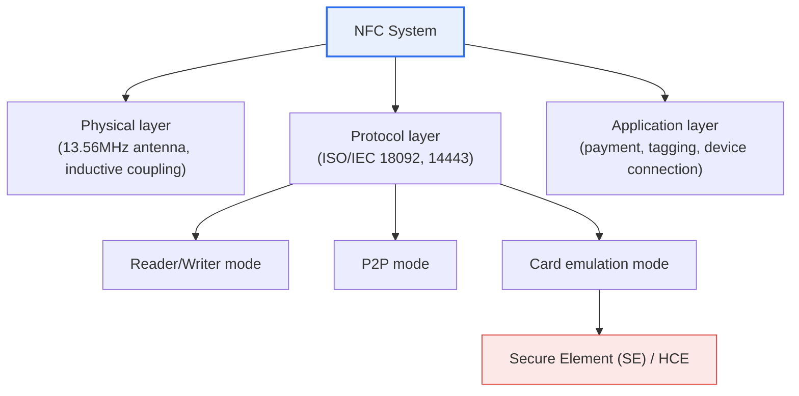
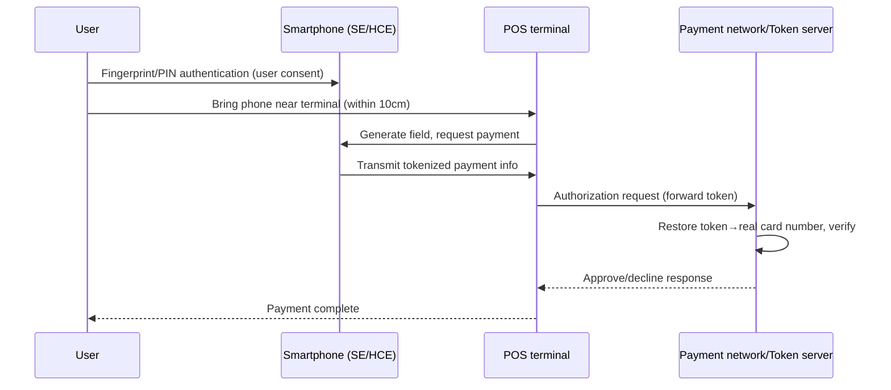

# NFC (Near Field Communication)

## 1. Overview

### A. Definition
> **NFC (Near Field Communication)** is a contactless short-range communication technology that **exchanges data wirelessly only at extremely close range, within about 10cm**, in the 13.56MHz frequency band. Developed on the basis of RFID technology, it takes ISO/IEC 18092 (NFCIP-1) and ISO/IEC 14443 as its standards and, embedded in smartphones, has become the de facto standard for payment, tagging, and device connection.

The key to understanding NFC is "**why the short reach is an advantage rather than a drawback**." Most wireless technologies aim to reach farther and faster, but NFC did the opposite, deliberately limiting its reach to within 10cm. The short distance of 10cm requires the user to **deliberately bring the device close**. Because this physical act of proximity itself becomes an explicit expression of intent — "I consent to this payment/authentication" — an intuitive yet secure interaction is possible without any separate complex pairing or password entry. The naturalness of the moment you tap your card at a subway turnstile is precisely the result of this design philosophy.

This design is based on the counterintuitive idea that "distance is security." When the communication radius is wide, an attacker can secretly intercept or forge signals from afar; but if physical access to within 10cm is required, the difficulty of an attack rises dramatically. In other words, NFC is a representative case of converting a physical constraint into a security asset, and this is the fundamental point that distinguishes it from long-range technologies such as Bluetooth and Wi-Fi.

### B. Background and Necessity
NFC standardization was driven centered on the NFC Forum, formed in 2004 by Sony, NXP (then Philips), and Nokia. Behind it was an industrial demand to **integrate, into a single smartphone without a separate dedicated card**, the contactless smart card (RFID) infrastructure already popularized by transit cards and credit cards. Users wanted to reduce the many cards in their wallets, and providers wanted to reduce the cost of issuing and distributing cards; the smartphone, a general-purpose device, became the vessel for that integration.

Especially in the payment and authentication domain, three demands exist simultaneously: it must be fast, free of misoperation, and clear in the user's intent. NFC satisfied these all at once with connection latency of tens of ms, a clear operating radius of 10cm, and flexibility spanning tag, card, and P2P; as a result, it established itself as the common interface for mobile payment, access control, and easy device-to-device connection.

### C. Characteristics and Operating Principle
NFC is characterized by low power and fast connection (tens of ms), and it supports both active and passive modes. In active mode, both devices generate a magnetic field; in passive mode, one side generates the field and the other draws power from that field. In particular, **passive tags** operate by harvesting induced power from the electromagnetic field created by the reader **even without their own power source**, which makes battery-free sticker tags and plastic cards possible. For example, a thin NFC sticker attached to an exhibition poster has no power at all, but the moment a phone is brought near, it is supplied with power from the field created by the phone and transmits a URL.

Communication is carried out by **inductive coupling**. When a high-frequency current flows through the reader's antenna coil, a 13.56MHz alternating magnetic field forms and an induced current is generated in the nearby tag coil. Data is transmitted by varying this magnetic field via load modulation and the like, at transmission speeds of around 106/212/424 kbps. This is slow for transferring large files, but it is sufficient to exchange in an instant data on the order of hundreds of bytes, such as a payment token or a tag URL.

## 2. NFC Overall Structure and Operating Modes

To outline the overall composition of an NFC system first, it is divided into a physical layer (13.56MHz, antenna), a protocol layer (ISO standards), and an application layer (payment, tagging); a smartphone consolidates these three layers into a single chip (NFC controller + secure element).

NFC's three operating modes are distinguished by **what role the smartphone plays** in the communication process. This distinction is not a mere classification but shows NFC's flexibility, in which the same hardware can become a reader in one situation and a card in another.

**A. Reader/Writer mode.** Here the phone becomes a reader that reads and writes tags. The active device, the phone, creates the magnetic field, and the passive tag responds with data within it. Typical examples are tapping a tag next to a museum exhibit to call up a description, or checking authenticity via a tag on product packaging. The core value of this mode lies in "connecting digital information to offline objects."

**B. P2P (Peer-to-Peer) mode.** Here two active devices exchange data as equals. When one side first creates a magnetic field, the other responds, and they take turns performing the role. Initially it was used for exchanging business cards and photos via Android Beam, but in practice the more useful application was **first exchanging the connection information (handover) of Bluetooth or Wi-Fi Direct over NFC** and then passing large transfers to the high-speed wireless link. That is, NFC does the "handshake" and Bluetooth handles the main conversation.

**C. Card emulation mode** is the mode with the greatest industrial impact. The phone behaves as if it were a credit card or transit card, so that an existing payment terminal (POS) recognizes the phone as a physical card. Payments via Samsung Pay (contactless), Apple Pay, and Google Wallet are all in this mode, and office access badges and mobile IDs also belong here. This mode is further divided, depending on where the payment credential is stored, into keeping it on a physical chip, the **Secure Element (SE)**, and processing it in software, **HCE (Host Card Emulation, Android 4.4+)**.

| Mode | Phone's Role | Field Generation | Representative Use |
|---|---|---|---|
| **Reader/Writer** | Reader (the reading side) | Phone | Poster/product tag lookup, authenticity verification |
| **P2P** | Equal exchange party | Alternating | Connection-info handover, business-card/file exchange |
| **Card emulation** | Card (the side being read) | POS terminal | Mobile payment, transit card, access badge, ID |

## 3. Payment Processing Procedure and Security Architecture

Looking step by step at how card-emulation-based mobile payment actually flows, one can see that NFC's security rests on a multi-layered structure of not only "distance" but also "tokenization" and "isolated storage."

What is notable in this procedure is that **the real card number (PAN) is never exposed to the terminal or the communication segment**. Instead of the card number, the phone transmits a one-time, device-bound **token**, and the restoration of the token back into the real card number is performed only by the payment network's token server. Even if communication is intercepted, all the attacker obtains is a non-reusable token, so damage is limited. This is why mobile payment is structurally safer than physical card cloning (skimming).

The second line of defense is **isolated storage**. The payment credential is stored not in the phone's ordinary storage but in a hardware-separated **Secure Element** or in a trusted execution environment separated from the OS, so that malicious apps cannot access it. The HCE approach lowers risk with cloud-based tokens and credentials of limited validity in place of a physical SE.

The third line of defense is **user authentication**. Because ownership is verified by fingerprint, face, or PIN just before payment, someone who picks up a lost phone cannot simply make a payment. In the end, the security of NFC payment is composed of four layers: "physical proximity of 10cm + tokenization + hardware isolation + biometric authentication."

## 4. Comparison with RFID

NFC is a branch of RFID, but its aim is different, and this difference stems from the "distance" the two technologies optimized for. Whereas RFID is optimized for **logistics and inventory management**, identifying many items simultaneously and quickly from several meters away, NFC specializes in **payment and authentication**, processing one transaction securely at short range. In logistics, hundreds of pallets passing through a warehouse must be read at once, so distance and multiple recognition matter; but in payment, the neighbor's card must not be read by mistake, so the distance must instead be short. In other words, although they came from the same root, their requirements are opposite, and so their designs diverged.

Also, NFC supports bidirectional communication and P2P so that two active devices can converse, whereas ordinary RFID is close to unidirectional, with the reader reading the tag. Thanks to this bidirectionality, NFC handles complex interactions such as negotiation and handover beyond simple identification.

| Category | NFC | RFID |
|---|---|---|
| **Distance** | ≤10cm | Several cm to several m (UHF up to tens of m) |
| **Frequency** | 13.56MHz (HF, fixed) | LF (125kHz), HF (13.56MHz), UHF (860–960MHz) |
| **Communication direction** | Bidirectional (P2P possible) | Mostly unidirectional |
| **Multiple recognition** | 1:1 centric | Many tags recognized simultaneously |
| **Primary use** | Payment, tagging, device connection | Logistics, inventory, access, asset tracking |

## 5. Deep Dive: Extended Uses and Latest Trends

NFC's center of gravity is shifting beyond simple payment toward **digital identity and mobile keys**. A representative case is the automotive digital key. The Digital Key standardized by the Car Connectivity Consortium (CCC) uses the phone as a car key, but places **NFC — strong at proximity and low power — as a backup channel** so the car can be unlocked even when the battery is dead, while adopting a combination in which UWB and BLE handle hands-free entry during normal use. That is, NFC survives by dividing roles with other wireless technologies thanks to its strength in "authentication at the definite moment of a tap."

The mobile ID and e-passport domains are also expanding. E-passport chips are based on ISO/IEC 14443 and can be read by an NFC reader, and mobile driver's licenses and digital IDs are also evolving to support offline verification via NFC tagging. This is because the intuition "10cm proximity = presenting oneself in person" remains valid in the identity-verification context as well.

From a competing/complementary technology standpoint, NFC coexists with QR payment, BLE, and UWB. QR payment spread quickly among small merchants because it is possible with just a camera, without dedicated hardware (NFC antenna, SE), but because it requires an aiming-and-scanning process, it does not match the immediacy of NFC, which "completes the moment you tap." UWB is more resistant to relay attacks with centimeter-level precise ranging, but its hardware penetration is low. As such, each technology has clear trade-offs, so rather than a single technology fully replacing another, a structure of using them together by situation is taking hold.

The latest security topic is countering **relay attacks**. This is an attack in which an attacker connects the communication between a legitimate phone and a legitimate terminal via relay equipment, neutralizing the "distance constraint." Countermeasures are being reinforced with **distance bounding** techniques that precisely measure response time, and with the aforementioned combination of UWB precise positioning. Since the physical premise of "short range" can be forged by technology, NFC's "distance = security" formula continues to be reinforced with additional verification.

## 6. Considerations and Implications (Professional Engineer's Perspective)

1. **Core infrastructure and standard interface of the mobile-payment ecosystem.** NFC is a representative case of user-experience innovation in that it integrated cards, transit, and access into a single smartphone without a separate dedicated card or hardware. In a professional-engineer answer, its status should be framed not as a mere communication technology but as "a common platform for the payment and authentication industry."

2. **Security must be designed as a multi-layered structure that does not rely on physical distance alone.** Effective safety is secured only when layer-by-layer defenses — the 10cm constraint, tokenization, SE/HCE isolation, biometric authentication, and relay-attack countermeasures — are combined. The assertion that "it is safe because the distance is short" collapses in the face of a relay attack, so it must be treated with caution.

3. **A strategy of dividing roles with competing/complementary technologies is important.** One should understand the trade-offs with QR (ubiquity), BLE (continuity), and UWB (precise positioning), and it is reasonable to place NFC in "authentication and payment requiring a clear expression of intent." A design that hierarchically combines multiple wireless technologies, as in the automotive digital key, is becoming the practical standard.

4. **Interoperability and standards compliance in preparation for expansion into digital identity and mobile keys are required.** Compliance with standards such as ISO/IEC 18092 and 14443, NFC Forum tag specifications, and CCC Digital Key ensures compatibility across heterogeneous devices and infrastructure. The further one goes into high-trust domains such as IDs and car keys, the more standards conformance and certification schemes determine the success or failure of adoption.

5. **Controls from a personal-data and privacy standpoint must also proceed in parallel.** In preparation for tag-based location/behavior tracking and skimming concerns, minimal collection, encryption, and user-consent procedures should be included in the design, and policies for storing and disposing of sensitive information such as payment history should be prepared together.

## References
- NFC Forum (standards and technical overview): https://nfc-forum.org/
- ISO/IEC 18092 (NFCIP-1): https://www.iso.org/standard/56692.html
- Car Connectivity Consortium — Digital Key: https://carconnectivity.org/digital-key/

---

> **In one line**: NFC is *contactless short-range communication at 13.56MHz within 10cm* that instead turns its short reach into an advantage of security and intuitiveness; it supports the three modes of reader, P2P, and card emulation, and, combined with the multi-layered defense of tokenization, secure element (SE/HCE), biometric authentication, and distance bounding, it has become central to mobile payment and is expanding into digital identity and mobile keys.
