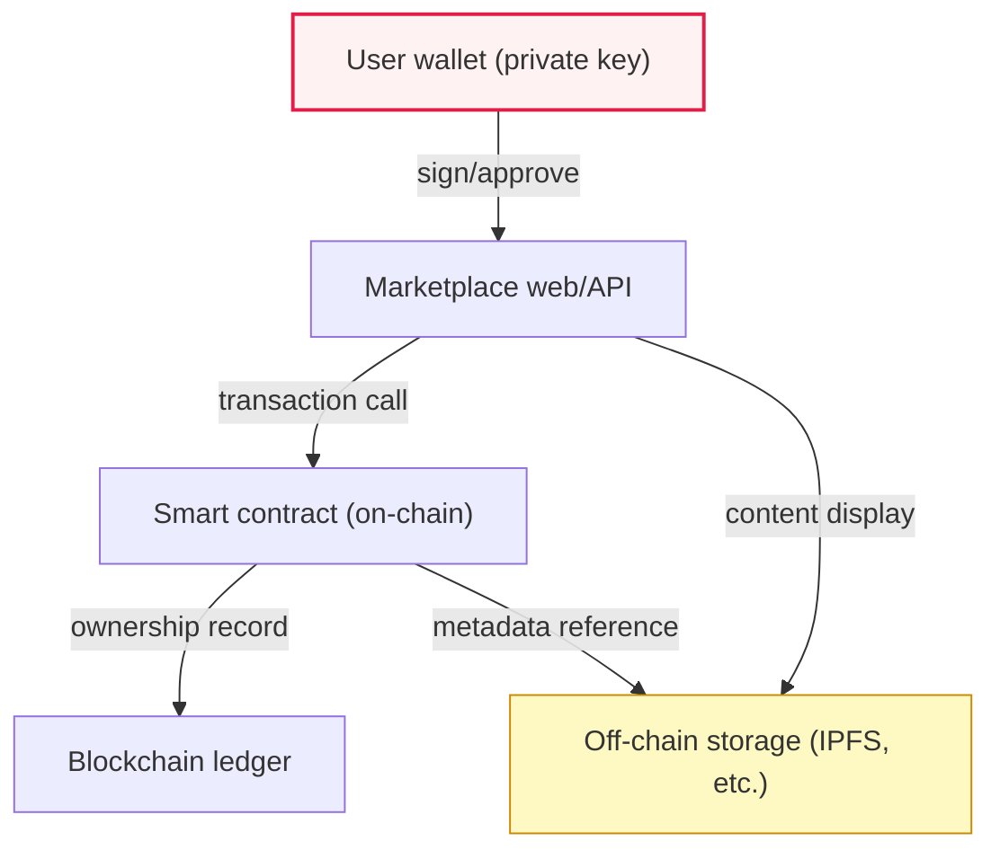
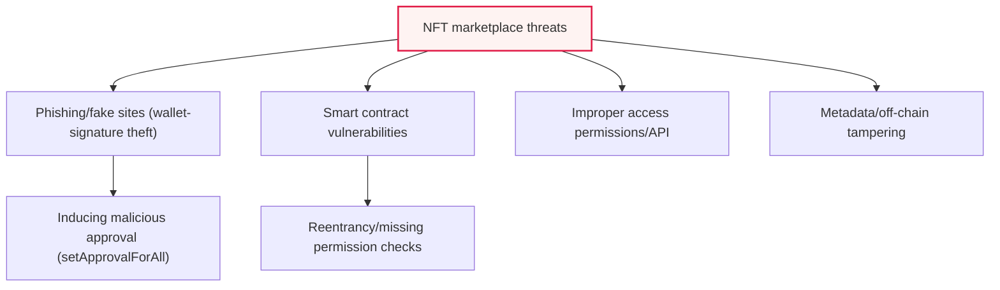

# Characteristics and Security Vulnerabilities of NFT Marketplaces

## 1. Overview

### A. Definition and Background
> An **NFT (Non-Fungible Token)** is a digital asset token recorded on a blockchain that is each unique and mutually non-interchangeable, and an **NFT marketplace** is an online platform for minting, trading, and displaying these NFTs. As the market has grown, this trading venue has become a **major target for hackers**, so one must understand and respond to the new security threats born of NFTs' unique characteristics.

The fundamental reason NFT marketplaces are structurally vulnerable to security lies in "**the junction where NFT characteristics meet the blockchain, the web, and the user**." An NFT has the strengths of being tamper-proof by being recorded on a blockchain and of cryptographically clear ownership, but the marketplace that intermediates trading is an ordinary web application, and the user's control over their assets rests on the private key of their personal wallet. It is precisely at this junction that vulnerabilities arise. Even if the NFT on the blockchain itself is secure, **if the web service that buys and sells it is hacked, or the user is deceived into signing (approving a transaction) incorrectly, the assets are lost.**

In particular, the blockchain's characteristic of "**irreversibility**" is a double-edged sword. In normal transactions it is a strength that prevents double-spending and transaction tampering, but a once-stolen NFT or a wrongly approved transaction cannot be canceled or refunded, so the damage is confirmed as is. A bank account can suspend or claw back an abnormal transaction after the fact, but on-chain transactions have no such "undo button." That is, **the security of the NFT itself and the security of the services and users that handle it are separate matters**, and the key insight of this topic is that most actual incidents occur in the latter — the marketplace, wallet, and user-behavior layers.

### B. NFT Characteristics and Security Implications
NFTs' four representative characteristics each have a direct impact on security. To point out their implications before the table: **non-fungibility** means each token has unique value, so the target of theft is specific; **proof of ownership** has the two-sidedness that the history is transparent but at the same time the scale of assets is public, exposing the target; **irreversibility**, as seen above, fundamentally blocks post-facto recovery; and **off-chain linkage** implies that the expensive content (images, video) actually resides in external storage rather than on the blockchain, making that point a separate attack surface.

| Characteristic | Content | Security Implication |
|---|---|---|
| **Non-fungibility** | Each token unique (1:1 identification) | High-value assets are pinpointed and targeted |
| **Proof of ownership** | Ownership and transaction history recorded on blockchain | Transparent, but holdings and scale are exposed |
| **Irreversibility** | Transactions cannot be canceled or undone | Post-facto recovery impossible; prevention is the only response |
| **Off-chain linkage** | Actual content stored externally (IPFS, etc.) | Attack surface of link/content tampering or loss |

## 2. NFT Transaction Structure and Threat Points

An NFT transaction is not a single system but a structure in which multiple layers interoperate. The user's **wallet (private key)**, the marketplace's **web front-end/back-end API**, the on-chain **smart contract**, and the **off-chain storage (IPFS, etc.)** that holds the content together form one transaction flow. The structure diagram below shows how these layers connect, and each connecting line becomes a potential attack point.

In this structure, threats appear distributed by layer rather than at one particular place. Organizing the types of threats into a taxonomy, phishing, contract flaws, API vulnerabilities, and metadata tampering form the four axes.

### A. Phishing and Signature Theft
The most frequent path in actual NFT-theft incidents is **wallet-signature theft via phishing**. Attackers lure users with fake sites, emails, or SNS links impersonating famous marketplaces or popular projects, then demand wallet connection and signatures under plausible pretexts such as "claim an airdrop" or "join a mint." The problem is that the transaction the user thoughtlessly signs may in fact be one that transfers or approves all of their NFTs to the attacker.

Technically, the most dangerous are **broad approval functions** such as `setApprovalForAll`. With this single approval, a particular contract obtains the right to transfer the user's entire collection on their behalf, and because the wallet UI does not intuitively convey this meaning, users find it hard to recognize the risk. An attacker who has stolen the approval can then drain the assets at any time without the user's involvement, and because of the aforementioned irreversibility, once the transfer completes there is no way to undo it. In 2022, many large-scale phishing incidents targeting users of a major marketplace occurred in this way, raising social awareness.

### B. Smart Contract Vulnerabilities
Because the issuance, trading, and royalty payment of NFTs are automatically executed by smart-contract code, **a flaw in that code leads directly to asset theft**. Representative examples include reentrancy, which exploits state changes during external calls; access-control flaws, in which missing permission checks let arbitrary users call administrator functions; and integer overflows and logic errors. Once deployed, a contract is hard to modify (immutability) and is public so that anyone can analyze the code, meaning vulnerabilities are immediately exposed to attack. Therefore, expert audits and formal verification before deployment, and bug-bounty operation after deployment, are effectively essential.

### C. Access-permission/API Vulnerabilities and Metadata Tampering
If there is **improper authorization** in the marketplace's back-end API, an attacker can modify someone else's listing or conclude unauthorized transactions. Also, due to the off-chain linkage problem emphasized earlier, if an NFT's actual content and metadata are stored on a centralized server or a mutable URL, there arises the risk of **link tampering, content replacement, or loss due to service shutdown**. It actually happens that a user buys an expensive NFT only to have the picture it points to disappear or change. For this reason, content-address (hash)-based storage on IPFS or permanent storage like Arweave is recommended.

| Vulnerability | Content | Main Impact |
|---|---|---|
| **Phishing/signature theft** | Inducing wallet signing/approval via fake sites | Unauthorized asset transfer (irreversible) |
| **Smart contract flaws** | Logic vulnerabilities such as reentrancy, missing permission checks | Large-scale fund theft |
| **Access-permission/API vulnerabilities** | Unauthorized trading/manipulation via improper authorization | Listing tampering, unauthorized sale |
| **Metadata tampering** | Tampering/loss of off-chain content or links | Impairment of asset value |
| **Fake NFTs/copyright theft** | Unauthorized issuance of works, impersonated sales | Deceiving users, legal disputes |

## 3. Countermeasures (Layer-by-Layer Defense)

The core principle of the response is that, because the threats seen above are distributed by layer, **defense must also be composed by layer in an integrated way**. If only one layer is strengthened and another is breached, assets are lost. Marketplace operators are responsible for web security and contract audits, users for signing habits and wallet management, and on the asset side for integrity and authenticity verification.

| Category | Countermeasure |
|---|---|
| **Marketplace** | Web security (WAF, MFA authentication), smart-contract audit/formal verification, API least-privilege/strengthened authorization, abnormal-transaction detection |
| **User** | Check permissions before wallet signing (beware `setApprovalForAll`), beware phishing sites/links, use hardware wallets, periodically revoke unused approvals |
| **NFT asset** | Copyright/authenticity verification, off-chain content integrity (IPFS hash, Arweave permanent storage) |
| **Transaction safety** | Abnormal-transaction/abnormal-approval detection, approval-permission minimization/auto-expiry, whitelisting when linking wallet and marketplace |

In particular, user education is the most cost-effective. This is because most actual damage originates not from code hacking but from **social engineering (phishing) that deceives users**. Just three habits — "always check what you are approving before signing," "do not connect your wallet from links of unknown origin," and "periodically revoke unused approvals" — can prevent a significant number of incidents.

### A. In-depth Countermeasures from the Marketplace (Operator) Perspective
Defense on the operator side is broader in scope than an ordinary web service in that it requires both "web application security" and "on-chain logic security." At the web layer, in addition to traditional controls such as WAF, MFA, and session protection, the operator should provide a **transparent signing UX** that clearly shows the user the meaning of the transaction being signed when connecting a wallet. The back-end API should strictly verify authorization under the principle of least privilege, and require ownership confirmation and re-authentication for sensitive operations such as listing and price changes. At the on-chain layer, contracts should undergo expert audit/formal verification before deployment, and even after deployment be continually checked via abnormal-transaction monitoring and bug bounties.

Also, even if a marketplace does not directly custody user assets, it must have a **curation and verification system** that filters out impersonation, fake collections, and copyright theft. If a counterfeit collection is displayed as if genuine, it leads directly to user deception and damaged platform trust. Verification badges for popular collections, issuer identity verification, and reporting/blocking processes are representative mechanisms.

### B. In-depth Countermeasures from the User Perspective
The user's best defense can be summarized as **key management and approval management**. It is recommended to store high-value assets in a hardware wallet (cold wallet) separated from the internet, and to adopt a wallet-separation strategy in which everyday interactions use a separate "hot wallet" holding only small amounts. On the approval side, one should not lavishly grant broad approvals such as `setApprovalForAll`, approve only as much as needed, and after a transaction ends, use approval-lookup/revoke tools to clean up unnecessary permissions. If un-revoked approvals are left unattended, one's own assets are exposed to risk should that contract be compromised later.

| Defense Layer | Key Measures | Threat Defended |
|---|---|---|
| **Key management** | Hardware wallet, hot/cold separation, offline seed storage | Key theft/leakage |
| **Approval management** | Minimal approval, periodic revocation, approval-status check | Abuse of broad approvals |
| **Transaction verification** | Check signature contents, re-verify domain/URL | Phishing signature theft |

### C. Countermeasures from the Asset/Content Integrity Perspective
Because an NFT's value ultimately lies in the content it points to, securing the **persistence and integrity of off-chain content** is the last link in asset protection. If metadata and the actual file are placed on a mutable URL on a central server, the link may break or the content may change, so it is advisable to store them on IPFS (content addressing), where the content's hash becomes the address, or on Arweave, which aims for permanent storage. Doing so means that if the content changes even slightly, the address differs, so tampering can be detected immediately. In addition, by verifying copyright and authenticity at the issuance stage to filter out unauthorized issuance and theft, one can prevent the disputes and losses that arise after a buyer "buys a fake."

## 4. Deep Dive — Latest Trends and Expected Exam Directions

Recently, the wallet and standards camps have been evolving toward helping users better understand what they are signing. **Signing standards that display signature contents in human-readable form (e.g., EIP-712 structured-data signing)**, wallet security extensions that warn about or block dangerous approvals in advance, and tools that let users look up and revoke approval status are spreading. Also drawing attention is the Account Abstraction (ERC-4337) trend, which seeks to manage assets with code-based accounts (smart-contract wallets) so as to apply **social recovery or transaction limits/whitelists when a key is lost or stolen**. On the regulatory side, as virtual-asset user protection and anti-money-laundering (AML) requirements strengthen, marketplaces' KYC and suspicious-transaction reporting obligations are trending upward.

From a professional-engineer perspective, this topic is likely to be set in forms such as "**Explain the characteristics of NFTs and discuss the marketplace security threats and countermeasures derived from them**," "**Explain the two-sidedness of blockchain irreversibility for security**," and "**The difference between on-chain and off-chain security and an integrated defense strategy**." An answer is more persuasive if it weaves together (1) the four NFT characteristics and their security implications, (2) layer-by-layer threats of wallet, web/API, contract, and off-chain, (3) the practical insight that phishing signature theft accounts for most actual damage, and (4) layer-by-layer, prevention-centric countermeasures.

## 5. Considerations and Implications

1. **Because irreversibility amplifies threats, prevention is the only response.** On-chain transactions cannot be undone, so post-facto recovery is fundamentally impossible. Therefore, resources should be concentrated on advance prevention such as checking before signing, blocking phishing, and minimizing approvals, and incident response can only focus on containment and recurrence prevention.
2. **Integrated defense that understands the separation of on-chain and off-chain security is needed.** Even if the NFT itself (on-chain) is secure, if one of the marketplace (web), wallet (user), or content (off-chain) is breached, assets are lost, so all layers should be viewed as a single threat model and protected in an integrated way.
3. **Smart-contract audit and formal verification are essential.** Because a contract flaw spreads not to an individual user but to a large-scale theft of the entire protocol, expert audit/formal verification before deployment and bug bounties/monitoring after deployment must be continually operated.
4. **Investment in UX and education for user-centric threats is key.** Because most actual damage comes not from code but from phishing that deceives people, one gains real effect only by improving the signing UX of wallets and marketplaces to "clearly show what is being approved" and by conducting user security education in parallel.
5. **Alignment with regulation and institutions must be considered.** Amid the strengthening of virtual-asset user-protection legislation, AML/KYC, and copyright-protection requirements, a marketplace must have abnormal-transaction detection, identity verification, and copyright verification systems to manage legal risk and user trust together.

## References
- OWASP Smart Contract Top 10: https://owasp.org/www-project-smart-contract-top-10/
- Ethereum, "ERC-721 Non-Fungible Token Standard": https://ethereum.org/en/developers/docs/standards/tokens/erc-721/
- Ethereum, "EIP-712: Typed structured data hashing and signing": https://eips.ethereum.org/EIPS/eip-712

---

> **In one line**: NFT marketplaces are exposed to threats of phishing signature theft, smart-contract flaws, API vulnerabilities, and metadata tampering owing to *NFT characteristics such as irreversibility and off-chain linkage*, and must be defended with integrated security across all layers — on-chain, marketplace, user, and off-chain — together with contract audits and prevention-centric user signature management.
