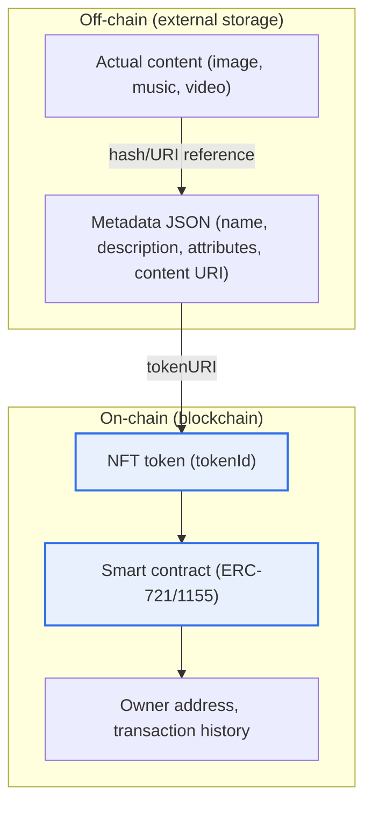
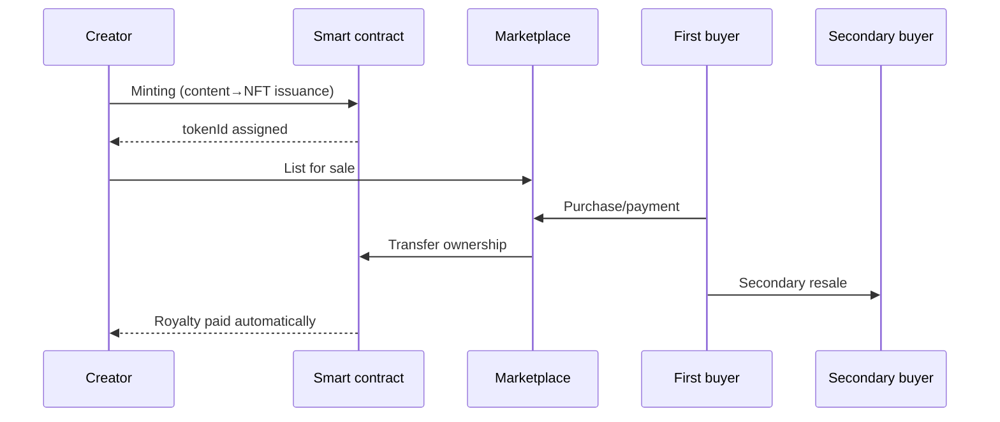

# Non-Fungible Token (NFT)

## 1. Overview

### A. Definition
> An **NFT (Non-Fungible Token)** is a digital token recorded on a blockchain that is **each unique and mutually non-interchangeable (Non-Fungible)**, serving as a means to prove, in a tamper-proof manner, the ownership and authenticity of digital and physical assets (paintings, music, collectibles, memberships, etc.).

The core idea of an NFT is "**granting a true original and ownership to a digital world where copying is free**." Because digital files can be copied infinitely and perfectly, the concept of a single "original" from the physical world did not hold. In a world where anyone can download and possess the same image, there was no way to determine "which is the true original and who its owner is." By inscribing on a blockchain — a distributed ledger — the record of "who is the current owner of this asset and through what transactions it has passed" in a tamper-proof manner, an NFT guarantees the "originality of the ownership record" no matter how many copies exist.

Here, "non-fungible" is the heart of the concept. A fungible asset is freely exchanged for another instance of the same value. One bitcoin is completely equal in value to another bitcoin, and a 10,000-won note to another 10,000-won note, so they may be swapped. An NFT, by contrast, is bound 1:1 to a distinct unique asset, so exchange is impossible. The NFT of a particular work I own is never the same as the NFT of a different work owned by someone else. Thanks to this uniqueness and indivisibility, it became possible to transplant the properties of physical goods — "one of a kind in the world" or "limited edition" — onto digital art, collectibles, game items, and memberships, to which the concept of scarcity had previously been hard to apply.

### B. Background and Necessity
The rise of NFTs is the result of technical maturity meeting market demand. Technically, it was decisive that Ethereum popularized smart contracts (self-executing programmatic contracts), making it possible to embed rules such as ownership transfer and royalty distribution into the ledger as code. In 2017, a collectible game called CryptoKitties drew enough popularity to nearly paralyze the Ethereum network, first demonstrating the popular potential of NFTs, and this became the occasion for establishing the unique-token standard (ERC-721).

On the market side, as creative and collecting activity rapidly moved to digital, there was growing demand for creators to sell the ownership of their works directly, without intermediaries (galleries, platforms), and to continue receiving royalties even on secondary sales. Under existing digital distribution, creators received nothing from resales after the first sale, but an NFT's smart contract can enforce, as code, a royalty structure that "automatically pays a fixed percentage to the original creator every time it is resold." This need to "grant ownership, scarcity, and ongoing revenue to digital assets" became the driving force behind the spread of NFTs. That said, this royalty enforcement is effective only when marketplaces respect it, which later led to the royalty-bypassing controversy discussed below.

## 2. Structure and Operating Principle

The key to understanding NFT structure is "what is kept on-chain and what is kept off-chain." The overall structure diagram below shows how the actual content, metadata, and ownership record are hierarchically connected.

Because storage cost on a blockchain is very high, the actual content — large-capacity images and music — is usually kept off-chain, on IPFS (a distributed file system), Arweave, or an ordinary server. On-chain, only a link to the "metadata" containing that content's location (URI) and properties, and the ownership and transaction history, are recorded. This layered structure simultaneously creates NFTs' strength (tamper-proof proof of ownership) and their weakness (fragile persistence of the content itself).

### A. Smart Contracts and Token Standards
The substance of an NFT is a smart contract running on a blockchain. This contract assigns each token a unique identifier (tokenId), manages the mapping of which address owns which token, and defines in code the rules for actions such as transfer, mint, and burn. The representative standard **ERC-721** implements pure non-fungibility, in which "each token differs from every other." By contrast, **ERC-1155** is a "multi-token" standard that handles both fungible and non-fungible tokens in a single contract, with the advantage of reducing gas fees in situations where "many of the same kind" must be issued, as with game items.

The reason standardization matters is interoperability. Following a standard means any marketplace or wallet can recognize and trade that NFT in the same way. Had each issuer implemented things arbitrarily, the assets would have become fragmented, usable only on specific platforms. Standard interfaces are the foundation that made the market of the NFT ecosystem possible.

### B. Issuance (Minting) and Ownership Transfer
Minting is the process of turning content into an NFT and registering it on the blockchain for the first time. When a creator prepares metadata and calls the contract's mint function, a new tokenId is created and assigned to the creator's address. At this point, on Ethereum and the like, a network usage fee called a gas fee is incurred; during network congestion this cost can reach tens of dollars, becoming a barrier to entry for low-value creative works. To alleviate this, the technique of "lazy minting" — issuing when an actual sale occurs — is used.

Ownership transfer occurs by having the smart contract atomically process payment and token transfer once a sale is concluded on a marketplace. Because all transaction history remains on the ledger, the "provenance" of a particular NFT — from the original creator to the current owner — is transparently traceable. This verifiable provenance is evaluated as the most substantial value NFTs offer in determining the authenticity of artworks.

The table below summarizes the characteristics described above, with the rationale for each item in the preceding paragraphs.

| Characteristic | Content | Practical Implication |
|---|---|---|
| Non-fungibility | Each token unique (tokenId) | Scarcity, 1:1 identification |
| Proof of ownership | On-chain ownership and transaction history | Tamper-proof provenance tracking |
| Standard/interoperability | ERC-721/1155 | Wallet and marketplace compatibility |
| Smart contract | Rules as code | Automatic royalty distribution |
| Off-chain linkage | Content external, only ownership on-chain | Persistence risk always present |

## 3. Application Areas and Cases

Looking at the typical flow of an NFT transaction from a process standpoint, it is as follows. This detailed flow diagram emphasizes the life cycle from creation and issuance to secondary trading and royalties.

The digital art and collectibles field led the early market. In 2021, the sale of a collage work by the digital artist Beeple for about USD 69.3 million at a Christie's auction made NFTs a global topic, and collectible collections in the form of profile pictures (PFPs) were traded as symbols of community membership. This showed that an NFT can become a medium of identity and belonging — "belonging to the same group" — beyond mere ownership.

In gaming, the P2E (Play to Earn) model emerged, in which items and characters are made into NFTs so that users have actual ownership and trade them even outside the game. However, early P2E collapsed in many cases due to structural fragility that relied on inflows of new money, and it is since being reshaped toward putting "fun" at the center and adding ownership as a supplement. In the membership and ticketing field, attempts are being made to issue concert tickets or memberships as NFTs to prevent tampering and scalping and to provide extra benefits only to owners.

The most practical expansion drawing attention is **Real World Asset tokenization (RWA)**. This is the direction of representing the ownership or shares of physical assets such as real estate, luxury goods, artworks, and bonds as NFTs to enhance authenticity proof, fractional ownership, and trading liquidity. For example, cases of combining a digital certificate in NFT form with expensive luxury goods to manage authenticity verification and ownership history are increasing, and this represents a trend of shifting NFTs' center of gravity away from a speculative image toward "practical utility."

| Field | Representative Use | Cases/Characteristics |
|---|---|---|
| Digital art/collectibles | Ownership/trading of art and PFPs | Beeple sold for USD 69.3 million |
| Gaming | Item ownership/trading (P2E) | Reshaped around fun |
| Membership/ticketing | Membership and admission-ticket proof | Anti-scalping, anti-forgery |
| Physical linkage (RWA) | Authenticity/fractional ownership of real estate, luxury goods | Enhanced liquidity and certification |
| Content/music | Automated creative royalties | Revenue sharing on secondary trades |

## 4. Deep Dive: Market Volatility and Regulatory/Accounting Trends

The NFT market underwent a sharp correction after the explosive boom of early 2021–2022. As trading volume and average prices fell greatly from their peak, criticism of a "bubble" arose, but the prevailing view interprets this as a natural shakeout of an early market that relied on speculative sentiment without real utility, rather than a defect of the asset itself. Since then, the market has been shifting its center of gravity from pure collecting and speculation toward "utility-based" uses such as the aforementioned RWA, ticketing, memberships, and brand loyalty programs.

Governance and regulatory issues have also come to the fore. The first is the problem of **royalty bypassing**. Because creator royalties often depend on marketplace policy rather than on the smart contract, platforms that ignore or make royalties optional appeared, shaking the creator revenue model. This is a case that exposed the gap between the ideal of "code is law" and actual market practice. The second is the **determination of securities status**. If an NFT is sold in a form that is fractionalized or promises returns, regulators in various countries may view it as a security, so whether capital-market regulation applies became a key variable in designing the issuance structure.

Domestically as well, amid the development of legislation related to virtual-asset user protection, whether an NFT qualifies as a "virtual asset" is discussed case by case. In general, a single NFT for pure collecting or appreciation is discussed in the direction of being excluded from regulated virtual assets, but where the character of a payment or investment vehicle is strong, or where it is issued in bulk or fractionally, regulation may apply; one should therefore note that its legal character varies according to the purpose and structure of issuance (since specific application depends on the relevant laws and authoritative interpretations, assertions should be avoided). On the accounting and taxation side too, standards for recognizing holding and disposal gains/losses and for tax treatment are in the process of being developed.

## 5. Considerations and Implications (Professional Engineer's Perspective)

1. **Securing the persistence of off-chain content**: The ownership record is permanent on-chain, but if the content itself points to an ordinary server URL, then the moment that server disappears one is left in a state of "having ownership but no picture to view." Integrity should be guaranteed with content-addressed distributed storage such as IPFS or Arweave and on-chain hash pinning, and further, a "fully on-chain" approach that stores images directly on-chain (e.g., via SVG) should be considered. NFT trust is complete only when ownership and content persistence are secured together.

2. **Distinguishing ownership from copyright and usage rights**: Buying an NFT does not mean acquiring copyright (rights of reproduction, distribution, and creation of derivative works). Usually the owner obtains only "ownership of that token" and the limited usage rights specified in the contract, while copyright often remains with the creator. If this distinction is unclear, unauthorized issuance, theft, and rights disputes arise, so a license that specifies the scope of use at issuance and an authenticity-verification system are essential.

3. **Managing speculation, fraud, and security risks**: Risks are ever-present, including extreme price volatility, market manipulation (wash trading), rug pulls (exit scams), wallet takeover via phishing, and marketplace vulnerabilities. Security practices such as private-key management (hardware wallets), contract audits, and minimizing approve permissions, together with valuation grounded in real utility, are key to protecting investors and users.

4. **Environment, cost, and technological transition**: Early NFTs were criticized for the high energy consumption and gas fees of Proof-of-Work (PoW) Ethereum. However, with Ethereum's transition to Proof-of-Stake (PoS), energy consumption dropped substantially, and with Layer 2 (rollup) scaling, transaction costs are also trending lower. One should recognize that sustainability and cost are not fixed limits but variables improved by technological evolution, and judge based on the latest trends.

5. **Standards/interoperability and regulatory alignment**: For interoperability across wallets, marketplaces, and chains, standards compliance and cross-chain linkage are important, and at the same time alignment with legislation on virtual assets, securities, tax, and personal data should be designed from the issuance stage. Designing a business on technical feasibility alone can let regulatory risk nullify the business itself after the fact, so a perspective of designing "technology–law–business" together is required.

## References
- Ethereum, ERC-721 Non-Fungible Token Standard, https://eips.ethereum.org/EIPS/eip-721
- Ethereum, ERC-1155 Multi Token Standard, https://eips.ethereum.org/EIPS/eip-1155
- Ethereum.org, NFT Overview, https://ethereum.org/en/nft/
- Financial Services Commission, Policy Materials on Virtual Asset User Protection, https://www.fsc.go.kr

---

> **In one line**: An NFT is a non-fungible token that *proves the uniqueness and ownership of digital and physical assets in a tamper-proof manner via blockchain smart contracts*; it is used in art, gaming, memberships, and RWA, but the persistence of off-chain content, the distinction of copyright, speculation and security risks, and regulatory alignment are its key challenges.
