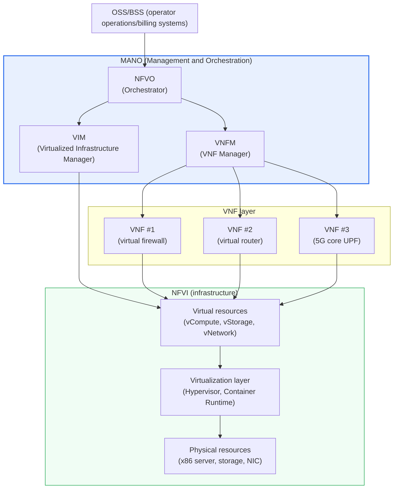
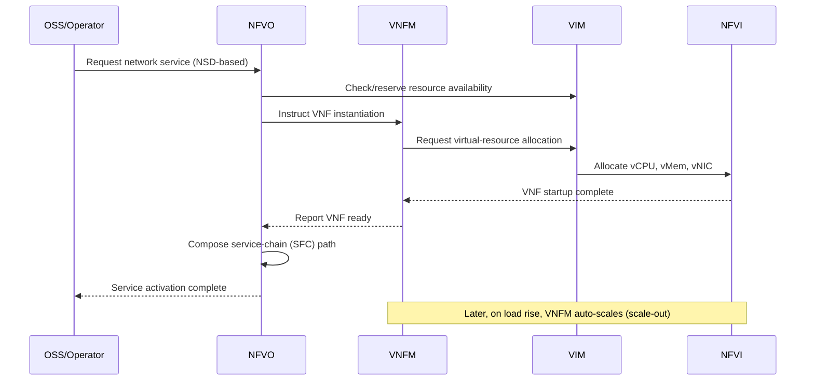

# Network Functions Virtualization (NFV)

## 1. Overview

### A. Definition
> **NFV (Network Functions Virtualization)** is an architectural technology that separates and implements **network functions previously fixed to dedicated hardware appliances** — such as firewalls, routers, load balancers, DPI, and EPC — as **software (Virtualized Network Functions, VNFs)** running on general-purpose servers (x86), so they can be deployed, scaled, moved, and deleted as needed. In 2012, the ETSI (European Telecommunications Standards Institute) NFV ISG (Industry Specification Group) began standardization, led by telecom operators.

The core idea of NFV is to "**detach network functions from hardware and turn them into software**." To understand this, one must first note the structural limits of traditional network equipment. Existing telecom networks placed, for each specific function, a physical device (dedicated hardware) optimized to a vendor's proprietary ASIC and firmware. A firewall was a firewall box, a load balancer a load-balancer box, and session management (EPC) yet another box, bought, mounted in a rack, and connected with cables. This method delivers excellent performance, but every time a new service is added, it takes weeks to months to purchase, install, cable, and configure the equipment; it locks one into a specific vendor (vendor lock-in); and when capacity is exceeded, the whole device must be replaced — an inelastic structure.

NFV fundamentally changes this structure. By redefining network functions not as "boxes" but as **software in the form of VMs or containers (VNFs)** running on general-purpose servers, one can, with just server resources, **deploy firewall, router, and 5G core functions in minutes, as if installing software**, add instances when traffic surges (scale-out), and reclaim them to return resources when no longer needed. That is, NFV extends to the network domain the flexibility that server virtualization brought to IT infrastructure, and can be summarized as "cloudification of the network."

### B. Background and Necessity
The decisive background for NFV emerging under the leadership of telecom operators (Telcos) is the **divergence between exploding traffic and worsening profitability**. Even as smartphone, OTT, and video traffic grow by tens of percent every year, data revenue (ARPU) has stagnated, so operators can no longer profit by handling growing traffic through the conventional method of adding expensive dedicated equipment. On top of this, the **network slicing** (a technology that divides one physical network into logical networks by use) and ultra-low-latency edge services demanded by 5G and IoT were practically impossible to realize by placing physical devices one by one. Operators judged that introducing "general-purpose servers + virtualization + automation" — already proven in the IT industry — into the network would let them **cut CAPEX (capital expenditure) and OPEX (operating expenditure) simultaneously** and dramatically shorten the time-to-market for new services, and this became the direct motive for the world's major telecoms gathering at ETSI in 2012 to publish the NFV white paper.

In particular, NFV is cited alongside SDN as one of "the two pillars of next-generation networking." **If SDN made the network 'programmable' by separating the control plane and the data plane, NFV made network functions 'software' by separating them from hardware.** The two are used independently, but their synergy is maximized when they complement each other, with SDN flexibly connecting traffic paths between VNFs (Service Function Chaining) and NFV handling the functions on top of it.

## 2. The Architecture of NFV (ETSI NFV MANO)

ETSI NFV broadly defines the overall structure into three domains: **① VNF (Virtualized Network Function), ② NFVI (NFV Infrastructure), and ③ MANO (Management and Orchestration)**. The figure below shows the overall structure diagram of the relationships among these three domains and their main components.

A **VNF (Virtualized Network Function)** is a software implementation of the individual network functions that dedicated equipment used to perform. Representative examples are virtual firewalls (vFW), virtual routers (vRouter), virtual load balancers, and the UPF/AMF/SMF of the 5G core. A single logical service can be composed of a combination of several VNFs, and each VNF can in turn be divided into several VNFCs (Components). Because the substance of a VNF is a VM image or a container image, it enjoys the benefits of virtualization — snapshots, replication, migration — as they are. For example, if a DDoS occurs in a particular region, one can spin up several virtual firewall instances within minutes (scale-out) to increase defense capacity and reclaim them when the attack subsides — an elastic response.

Representative types of VNFs can be organized as follows, which also shows which dedicated equipment is being replaced by software.

- **Security family** — virtual firewall (vFW), virtual IPS/IDS, virtual DPI (deep packet inspection), virtual VPN gateway
- **Networking family** — virtual router (vRouter), virtual switch, virtual load balancer (vLB), virtual NAT
- **Mobile core family** — 4G EPC (virtual S/P-GW, MME), 5G core (UPF, AMF, SMF, PCF, etc.)
- **Subscriber/access family** — vCPE (virtual customer-premises equipment), vBNG, vRAN/O-RAN functions

That functions of entirely different natures can be placed simultaneously on a single pool of physical servers is NFV's resource consolidation effect, and it is the source of the flexibility to rapidly design new services by combining different VNFs.

The **NFVI (NFV Infrastructure)** is the foundation on which VNFs actually run, composed of physical resources (x86 servers, storage, network cards), a virtualization layer that abstracts them (hypervisor or container runtime), and the virtual resources provided to VNFs on top of it (vCPU, vMemory, vStorage, vNetwork). Because NFVI performance directly governs VNF performance, acceleration technologies (DPDK, SR-IOV, SmartNIC, etc.) to overcome the packet-processing bottleneck of software-based processing are commonly applied together. This part is covered in detail in the later deep-dive section.

**MANO (Management and Orchestration)** is the brain of NFV, managing and automating the entire life cycle of VNFs and the infrastructure resources. MANO consists of the following three elements. The **NFVO (NFV Orchestrator)** is the top-level conductor that composes end-to-end network services by weaving together multiple VNFs (Service Chaining), coordinates the overall resources, and governs the service life cycle. The **VNFM (VNF Manager)** handles the life cycle of individual VNFs — instantiation, scaling, healing, termination — and monitors state to perform auto-scaling and auto-recovery. The **VIM (Virtualized Infrastructure Manager)** is the manager that actually allocates and reclaims the physical and virtual resources of the NFVI; representatively, OpenStack or Kubernetes takes this role.

| Domain | Components | Core Role | Representative Implementation |
|---|---|---|---|
| **VNF** | VNF / VNFC | Software implementation of network functions | vFW, vRouter, 5G UPF |
| **NFVI** | Physical/virtual resources, virtualization layer | Provides the foundation for running VNFs | KVM, OpenStack, containers |
| **MANO** | NFVO / VNFM / VIM | Life cycle, resource management, orchestration | OSM, ONAP, Tacker |

## 3. VNF Life Cycle and Service Function Chaining (SFC) Operation

The real value of NFV comes from **automatically deploying VNFs and chaining several VNFs in order according to the traffic flow (service chaining)**. Conventionally, one had to physically cable so that traffic flowed in the order firewall → IPS → load balancer, but in an NFV/SDN environment this path (Service Function Chain) can be instantly defined and changed by software policy alone. The sequence below shows the process by which a new network service is requested, VNFs are deployed, and a service chain is composed.

At the **design/onboarding stage**, the vendor-provided image, the **VNFD (VNF Descriptor)** describing how to deploy and configure that VNF, and the **NSD (Network Service Descriptor)** describing the entire service composed of several VNFs are registered (onboarded) in a catalog. These descriptors declaratively contain the required resources, scaling policies, and connection relationships, becoming the basis for later automation.

At the **instantiation/operation stage**, when an operator requests a service, the NFVO interprets the NSD to automatically deploy the required VNFs onto the NFVI via the VNFM and VIM, and, in conjunction with the SDN controller, sets the path so that traffic passes through the VNFs in the prescribed order. During operation, the VNFM monitors the load and state of each VNF, adds instances when a threshold is exceeded (auto-scaling), and automatically restarts/replaces (auto-healing) when a failure is detected.

At the **termination/reclamation stage**, when a service is no longer needed, the VNFs are terminated and the occupied resources are returned so that other services can reuse them. That deploy–scale–heal–reclaim is automated by software is the essence of the elasticity NFV provides.

What is notable here is that **NFV and SDN solve different problems but mesh in a single flow**. NFV handles "which functions (VNFs) to spin up, where, and how many," and SDN handles "along what path to flow traffic between those VNFs." In service chaining, when the NFVO deploys firewall, IPS, and load-balancer VNFs, the SDN controller updates the flow tables of each switch so that packets pass through them in that order. Therefore, in practical design, linking NFV's orchestration (MANO) and SDN's path control into a single closed-loop automation becomes a key design point. For example, when a particular VNF instance is newly spun up by auto-scaling, SDN must immediately distribute/redistribute traffic to the new instance so that service continuity is maintained.

## 4. Comparison of the Traditional Dedicated-Appliance Approach and the NFV Approach

The significance of NFV lies not in mere "virtualization" but in the fact that **it changes the very economics and agility of network operation**. The comparison below focuses on "why" the difference between the two approaches arises.

| Category | Traditional Dedicated Appliance | NFV Approach |
|---|---|---|
| Function implementation | Vendor-proprietary HW + firmware | SW (VNF) on general-purpose servers |
| Deployment speed | Weeks to months (purchase, cabling) | Minutes to hours (SW deployment) |
| Scalability | Device replacement (scale-up) | Add instances (scale-out) |
| Cost structure | High CAPEX, fixed cost | CAPEX↓, OPEX↓ via resource sharing |
| Vendor dependence | High (lock-in) | Low (multi-vendor VNFs) |
| Performance | Very high (ASIC) | Relatively low → complemented by acceleration tech |

The reason dedicated equipment is fast is that an ASIC dedicated to packet processing operates at the hardware level, and the reason NFV is relatively slow is that a general-purpose CPU processes packets in software, passing through the kernel and virtualization layer. This performance gap was the biggest obstacle to NFV adoption, and so acceleration technologies such as DPDK and SR-IOV became the key factors determining NFV's success or failure. Conversely, the points where NFV is overwhelmingly ahead are agility and economics. For example, when a telecom provides a new enterprise customer a combined "virtual firewall + virtual VPN" service, the dedicated-appliance approach would take weeks for purchase and installation, but with NFV one can combine catalog VNFDs to provision the service within hours and bill on a usage basis.

As a **concrete case**, domestic and overseas telecom operators are trending toward **building the 5G core network (5GC) as cloud-native NFV (CNF)** in the course of 5G commercialization. The UPF, AMF, and SMF of the 5G SA (Standalone) core are mostly implemented as container-based VNFs, and in regions where traffic concentrates, UPF is distributed to the edge (MEC) to secure ultra-low latency. AT&T's 'Domain 2.0' strategy, which converted a substantial part of its network to white boxes + virtualization (presenting a goal of software-izing most network functions by around 2020), and **ONAP**, the orchestration platform developed and donated for this purpose, are cited as representative industry cases of NFV commercialization.

The effect can also be gauged by performance figures. Early pure-software processing based on the kernel network stack was limited to several Gbps on a general-purpose server, but bypassing the kernel with DPDK can secure tens of Gbps of throughput on the same server, reaching a performance level that can substantially replace dedicated equipment. Also, the time-to-market improvement of shortening new-service provisioning from "weeks" to "hours," and the improved infrastructure utilization gained by sharing and reusing idle resources, translate directly into quantitative OPEX savings from the operator's perspective. That said, these effects are realized only when the aforementioned acceleration technology and automation are sufficiently mature, so NFV adoption demands a shift in operational capability beyond merely "replacing equipment with software."

## 5. Deep Dive — Overcoming Performance Bottlenecks and the Cloud-Native Transition (CNF)

The greatest technical challenge in the early days of NFV adoption was the **performance limit of software-based packet processing**. On a general-purpose server, the path a packet takes from NIC → kernel network stack → hypervisor → VNF involves many interrupts, context switches, and memory copies, putting it at a large disadvantage to ASICs in throughput and latency. To overcome this, three acceleration technologies are used as standard. **DPDK (Data Plane Development Kit)** bypasses the kernel (kernel bypass) to process packets directly in user space via polling, removing interrupt overhead and boosting throughput several-fold. **SR-IOV (Single Root I/O Virtualization)** divides a physical NIC into several virtual functions (VFs) so a VNF can access the NIC directly without going through the hypervisor, reducing latency. **SmartNIC/DPU** offloads packet processing, encryption, and the like to dedicated hardware, relieving the CPU. Thanks to these technologies, NFV became able to secure carrier-grade performance.

The decisive recent trend is the **transition from VM-based NFV to container/Kubernetes-based cloud-native NFV**. Early VNFs were implemented as heavy, slow-booting VMs, but as **CNFs (Cloud-native Network Functions)** — reimplemented as lightweight containers — spread, deployment speed, resource efficiency, and scalability improved considerably. In this process, the VIM role is shifting from OpenStack to **Kubernetes**, and ETSI has kept the standard current by introducing the concept of a Container Infrastructure Service Manager (CISM). CNF grafts cloud-native operating practices such as microservices, CI/CD, and GitOps onto the network, opening an era in which network functions too are continuously deployed and updated like applications. This means telecom-network operation is converging with IT DevOps culture, and it demands even changes in operator organization and processes.

Also, NFV is broadening its scope by combining with **Open RAN (O-RAN)** and **edge computing (MEC)**. A representative attempt is to virtualize even radio base-station functions (vRAN/O-RAN) in software and run them on general-purpose servers, which is part of the larger trend of breaking dependence on specific equipment vendors and reorganizing all network layers in software.

## 6. Considerations and Implications

- **Securing performance and determinism** — Because NFV is inherently software processing, guaranteeing the carrier-grade performance and latency determinism that telecom networks require makes infrastructure optimization such as DPDK, SR-IOV, CPU pinning, NUMA alignment, and hugepages essential. At adoption time, defining the target SLA and empirically verifying it with a PoC is the starting point for managing the trade-off (generality vs. performance).

- **Management complexity and automation maturity** — In exchange for physical devices disappearing, a new multi-layer software stack of VNF, NFVI, and MANO arises, so failure points and management points can actually increase. Unless one introduces MANO (OSM, ONAP), observability, and closed-loop automation together to "offset manual operation with automation," the OPEX-saving effect is halved. The organization's automation maturity is the practical prerequisite for NFV success.

- **Redefining the security perimeter** — As functions become software-ized and infrastructure is shared, new threats emerge such as hypervisor vulnerabilities, lateral movement between VNFs, and multi-tenancy isolation failures. One must design in parallel a security architecture suited to a software-defined environment — microsegmentation, VNF image integrity verification, zero trust, and confidential computing.

- **Linkage strategy with SDN, 5G, and edge** — NFV is valid on its own, but its value is maximized when combined with SDN's dynamic path control, 5G network slicing, and MEC's distributed deployment. Therefore, NFV should have its roadmap established within the big picture of a transition to "Software-Defined Infrastructure (SDI)," not as an individual technology adoption.

- **Leveraging the standards/open-source ecosystem and avoiding vendor lock-in** — One should actively leverage the ETSI NFV standards, open-source MANO such as OSM, ONAP, and Tacker, and the CNF/Kubernetes ecosystem, while securing multi-vendor VNF interoperability (onboarding, certification procedures) in advance and putting governance in place to avoid falling into a new form of software vendor lock-in.

- **Gradual transition and hybrid operation** — Given the nature of telecom networks, where existing dedicated equipment is hard to remove all at once, a hybrid segment in which physical devices and VNFs coexist is unavoidable at first. A roadmap that selects virtualization targets according to traffic characteristics (ultra-high-speed backbone vs. value-added services where flexibility matters) and transitions in stages, starting from low-risk areas, lowers the probability of failure.

## References
- ETSI, "Network Functions Virtualisation (NFV); Architectural Framework" (ETSI GS NFV 002), https://www.etsi.org/technologies/nfv
- ETSI NFV, "NFV Management and Orchestration (MANO)" (ETSI GS NFV-MAN 001), https://www.etsi.org/committee/nfv
- Linux Foundation, "Open Source MANO (OSM)", https://osm.etsi.org/
- Linux Foundation, "ONAP (Open Network Automation Platform)", https://www.onap.org/

---
> **In one line**: NFV is a network-cloudification technology that separates network functions once locked into dedicated hardware into software (VNFs) on general-purpose servers and automates their life cycle with ETSI MANO (NFVO, VNFM, VIM), realizing CAPEX/OPEX savings and agile service delivery; it is evolving into cloud-native (CNF) by combining with SDN, 5G, and edge.
