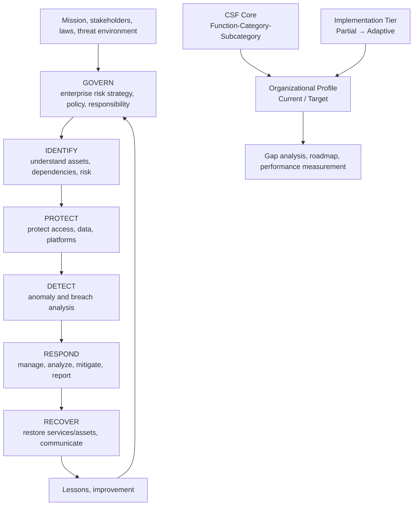
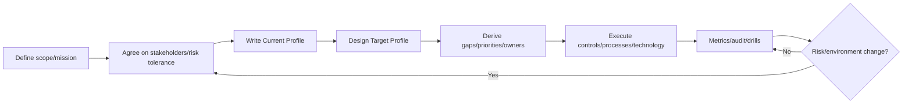

# Cybersecurity Risk Management Based on the NIST Cybersecurity Framework 2.0

## 1. Overview

> **Definition**: The NIST Cybersecurity Framework (CSF) 2.0 is a non-prescriptive, outcome-based framework for an organization to understand, prioritize, and manage cybersecurity risk.

Rather than being a specific product, control list, or certification scheme, NIST CSF is a risk-management system that organizes, in a common language, the cybersecurity outcomes an organization should achieve.
Accordingly, it does not directly command a means of implementation such as "did you install a firewall," but presents an outcome such as "is access to critical assets being managed."
An organization selects the way to achieve those outcomes to fit its size, industry, regulation, threat level, and technical environment.

CSF 2.0 was published on February 26, 2024, as NIST Cybersecurity White Paper 29.
This version expands the existing core structure while raising its generality so that it can be used not only by security operators but also by executives, the board, and those in charge of procurement, legal, HR, and audit.
In particular, it treats cybersecurity not as a technical control of the IT department alone but as part of enterprise risk management (ERM), and adds the GOVERN function at the top.

The scope of CSF 2.0 is not limited to large enterprises or critical-infrastructure operators.
Small organizations, public agencies, manufacturing OT, IoT, cloud, mobile, and AI systems — any organization that uses ICT — can select the outcomes it needs.
This is based on the awareness that, because assets and risk tolerance differ by organization, forcing a single control standard leaves only formal compliance.

In a professional-engineer answer, memorizing CSF merely as the cycle of "Identify–Protect–Detect–Respond–Recover" is insufficient.
One must explain the structure in which, in CSF 2.0, GOVERN sets the priorities and risk-acceptance criteria of the other five functions, IDENTIFY grasps current risk, and PROTECT, DETECT, RESPOND, and RECOVER connect from prevention to improvement.
One must also present together the relationship among the Core, the Organizational Profile, and the Implementation Tier, and the actual implementation procedure, to interpret the framework as an operating model.

### 1.1 Background and Necessity

As digital services became the core of business, the impact of a cyber incident is no longer limited to information leakage but extends to production stoppage, safety accidents, contract breaches, reputational decline, and impairment of shareholder value.
As cloud and SaaS, outsourced development, open source, APIs, and remote work increase, an organization's perimeter is not confined to the inside of the network.
In such an environment, managing security by a device list or department-by-department checklist makes it hard to judge together the chain of relationships among providers and services, business criticality, and recoverability.

CSF connects a risk language executives can understand with security outcomes practitioners can use.
For example, executives present a business objective such as "the allowable downtime of the online ordering service is 30 minutes," and the security/infrastructure organization can, on that basis, design outcomes for authentication strengthening, log collection, breach detection, and containment/recovery verification.
Only with this connection can investment costs be explained in terms of business impact and residual risk rather than technology fads.

### 1.2 Key Characteristics

First, CSF is outcome-centered.
The way to achieve the same security outcome may be an on-premises SIEM or a managed detection-and-response service, so a technology choice suited to the organization's conditions is possible.

Second, CSF is risk-based.
Instead of protecting all assets at the same level, it sets the order of investment by considering mission, stakeholders, regulation, threats, and risk tolerance.

Third, CSF is life-cycle-oriented.
It does not merely strengthen protective controls but includes detection, incident response, service recovery, and post-incident improvement, managing resilience on the premise that prevention will fail.

Fourth, CSF is a mappable common language.
It can connect its relationship to ISO/IEC 27001, NIST SP 800-53, CIS Controls, industry-specific regulations, and the like as Informative References, but that mapping itself does not imply mandatory controls or certification of the CSF Core.

## 2. The Overall Structure and Conceptual Diagram of CSF 2.0

CSF 2.0 consists of the CSF Core, Organizational Profiles, Implementation Tiers, and supplementary materials.
The Core expresses "what to achieve," the Profile expresses "what our organization's current and target states are," and the Tier expresses "how rigorous and integrated the risk-management practices are."
Separating these three elements allows one to manage a common standard and an organization-specific execution plan without confusing them.

### 2.1 CSF Core

The CSF Core classifies cybersecurity outcomes into the hierarchy of Function, Category, and Subcategory.
A Function is the highest-level view, a Category is a grouping of related outcomes, and a Subcategory is a specific outcome statement usable in assessment and design.
The existence of a hierarchy does not mean an actual order of execution or order of importance.

The Core's outcomes are not a command to perform every item of a checklist without omission.
An organization selects the outcomes it needs according to its business purpose and risk profile, and defines the activities and owners that achieve those outcomes.
Therefore, even when selecting the same Subcategory, a bank may design more strongly for transaction integrity and regulatory reporting, and a manufacturer for production safety and OT availability.

### 2.2 Organizational Profile

An Organizational Profile describes the Current state and the Target state of a specific organization's CSF Core outcomes.
The Current Profile expresses the outcomes currently being achieved and how they are achieved, and the Target Profile expresses the desired state, considering strategic change, new technology, regulation, and threat intelligence.

A Profile is not merely a document but the baseline of gap analysis.
Comparing Current and Target allows one to derive unmet outcomes, prerequisites, owners, investment costs, and target schedules.
For example, if the Target is "centrally analyze all authentication events of critical APIs," one records the current log gaps and per-service format differences as gaps and connects them to a roadmap of collection, standardization, and detection rules.

### 2.3 Implementation Tier

An Implementation Tier describes how connected an organization's cybersecurity risk-management practices are to business needs and how integrated they are with enterprise risk management.
A Tier is not a grade that assesses the number of security controls or the price of products; it is contextual information expressing the organization's operating characteristics and decision-making style.

| Tier | Name | Key Operating Characteristics |
|---|---|---|
| Tier 1 | Partial | Risk management is informal and ad hoc, inconsistent across the organization. |
| Tier 2 | Risk Informed | Risk information is used, but integration into enterprise policy/processes is limited. |
| Tier 3 | Repeatable | Policies and procedures are formalized, repeatable, and operated across the organization. |
| Tier 4 | Adaptive | Anticipates changing threats and business environments and continuously improves. |

It is not the case that a Tier 1 organization must unconditionally aim for Tier 4.
For a small organization, securing a Tier 2–3 level of consistent risk assessment and recovery for its core assets may be more reasonable than setting an unmanageable, sophisticated goal and halting operations.
Conversely, an organization such as a financial-transaction platform, where the ripple effect of an outage or breach is large, may select Tier 4 elements, aiming for real-time detection and response data, supply-chain integration, and adaptive improvement.

## 3. The Principles and Application of the Six Functions

### 3.1 GOVERN (GV): Governance

GOVERN is a function newly brought to the fore in CSF 2.0, establishing, communicating, and monitoring the organization's cybersecurity risk-management strategy, expectations, and policy.
Reflecting the organization's mission, stakeholders, laws/regulations/contracts, and risk appetite and tolerance, it sets the priorities of the other five functions.

The core of GOVERN is to clarify responsibility and authority so that the security team does not decide all risks on its own.
The board or executives decide whether to accept risk and set budgets, the CISO or security officer operates policies and programs, and system owners are responsible for asset-specific risk and exceptions — a division of roles.

Supply-chain risk should also be handled in GOVERN.
If external cloud, SaaS, development firms, open source, or AI services perform core functions, one must include in procurement, contracts, and operations the providers' security requirements, incident notification, vulnerability response, and conditions for termination and data return.
If a provider security assessment is done only once at contract signing and then ended, one cannot respond to service changes, mergers and acquisitions, or changes in sub-providers, so periodic monitoring is needed.

### 3.2 IDENTIFY (ID): Understanding Assets and Risk

IDENTIFY is the function of grasping the organization's data, hardware, software, systems, facilities, services, personnel, and providers and understanding the related cybersecurity risks.
Asset identification should be not the mere creation of a CMDB list but the work of connecting the business services an asset provides, data flows, dependencies, owner, exposure surface, and recovery priority.

An asset not on the asset list falls out of the scope of control.
For example, if a developer copies source code to personal cloud storage, or a business unit purchases SaaS without approval, shadow IT arises between the official asset register and the actual attack surface.
Therefore, one must combine the results of automatic discovery across network, cloud, SaaS, code repositories, and endpoints with owner confirmation, and track state changes of new and decommissioned assets.

Risk assessment is performed as a combination of an asset's value, threat likelihood, vulnerability, exposure, and impact.
For instance, because a customer authentication API has high external exposure and personal-data impact, it becomes a target for stronger authentication, logging, rate limiting, and recovery testing than an ordinary internal wiki.
If one produces only a score at this point, the basis for prioritization is weak, so one also describes downtime, the number of affected customers, legal obligations, and provider dependencies.

### 3.3 PROTECT (PR): Protective Measures

PROTECT is the function of using protective measures to reduce identified risks.
Its main scope includes identity management, authentication and access control, awareness and training, data security, platform security, and the resilience of the technology infrastructure.

Access control does not mean only the procedure of creating an account and granting permissions.
One must verify the identity of users, services, and devices and apply least privilege, separately approve and record privileged permissions, and revoke permissions upon job change, departure, or service termination.
Even when introducing passkeys or phishing-resistant MFA, one must design account recovery and emergency accounts with the same level of control so they do not become a bypass.

Data protection considers together at-rest/in-transit encryption, key management, backup, retention/disposal, integrity verification, and access logging.
Encryption alone does not make the risk of data leakage disappear; if plaintext personal data remains in application logs or a backup account is compromised, the protective measure is neutralized.
It is advisable to combine masking, tokenization, DLP, retention periods, and disposal records according to classification level and data flow.

Platform security is the secure configuration and change management of operating systems, containers, middleware, cloud settings, and the software supply chain.
Using baseline images and infrastructure-as-code lets one apply the same settings repeatedly and block policy violations before deployment.
However, because automated deployment can propagate a wrong policy at scale, one must also prepare approval, verification, staged deployment, and rollback.

### 3.4 DETECT (DE): Detection and Analysis

DETECT is the function of promptly discovering and analyzing anomalies, indicators of compromise, and adverse events that indicate the possibility of an attack or breach.
The quality of detection is decided not simply by collecting many logs but by defining the telemetry and detection hypotheses needed for critical assets.

For example, a login from an unusual country for an administrator account, a mass issuance of tokens, an abnormal API call volume, and a chain of backup deletion and encryption operations can be detection hypotheses for ransomware or account takeover.
An event must include time, subject, object, action, result, and a correlation key for analysis to be possible, and if clock synchronization and retention period are inadequate, forensic value drops.

Detection is a problem of balancing false positives and false negatives.
If every event is turned into an alert, the analysis team tires and may miss important signals, so one prioritizes by reflecting asset criticality, attack stage, confidence, and potential impact.
One manages as operational metrics not only alert accuracy but also the time taken for analysis after detection and the rate that leads to actual response.

### 3.5 RESPOND (RS): Incident Response

RESPOND is the function of containing impact after a breach is detected, analyzing the cause, and mitigating, reporting, and communicating.
An incident-response plan includes declaration criteria, chain of command, evidence preservation, containment authority, notification to customers/regulators/law enforcement, and handover conditions to recovery.

In the early stage, preventing spread can be more important than fully identifying the cause.
For example, if account takeover is suspected, one first performs token revocation and session termination, blocks malicious IPs and isolates the service, and then proceeds with forensic analysis.
However, because hasty system resets or log deletion can damage evidence, pre-approved playbooks and digital-evidence procedures are needed.

Incident communication considers technical facts, legal obligations, and customer trust together.
One should not assert an unconfirmed cause, but must consistently convey the current impact, temporary measures, and the time of the next update, and even in a provider incident, must clarify the contractual notification and the roles of joint response.

### 3.6 RECOVER (RC): Recovery and Improvement

RECOVER is the function of restoring assets and operations affected by an incident and returning to normal service.
The core of recovery is not whether one has backup files but whether one can resume service within a defined time in a trustworthy state.

Business impact analysis defines each service's RTO and RPO, recovery priority, and decision authority.
Backups should be separated from operational accounts, immutable/offline copies considered, and actual recovery testing used to confirm backup integrity, application dependencies, and the availability of keys and certificates.
In a ransomware situation, restoring an infected backup causes reinfection, so malware scanning and clean-baseline verification are needed before recovery.

When recovery is complete, one does not close the incident but reflects the lessons in the Current Profile and Target Profile.
Registering as an improvement backlog the omissions in detection rules, errors in provider contacts, excessive permissions, and bottlenecks in the recovery procedure, and confirming the effect in the next drill or actual change, is what makes it continuous improvement.

## 4. Execution Procedure and Operational Deliverables

### 4.1 Application Roadmap

The first step is to define the scope.
Rather than trying to define the entire enterprise at once, one sets the perimeter starting from services with large mission impact, such as customer authentication, payment, production control, and core data.
The scope includes the related cloud accounts, providers, users, data flows, and interdependent services.

Second, from the GOVERN perspective, one finalizes business objectives and risk tolerance.
Not "strengthen security unconditionally" but agreeing on the acceptable service downtime, personal-data impact, regulatory-violation risk, and investment constraints makes the priorities of the Target Profile realistic.

Third, one writes the Current Profile.
One uses as evidence the asset register, vulnerabilities, IAM, backups, logs, incident records, provider assessments, and audit materials, and does not regard an outcome as achieved merely because a document exists.
One confirms actual performance through operational samples, configuration queries, interviews, and drill results.

Fourth, one defines the Target Profile and the gaps.
Rather than trying to achieve all outcomes simultaneously, one prioritizes by impact, feasibility, dependency, and regulatory deadline.
For example, one can first secure administrator MFA and immutable backups for critical services, then expand detailed detection automation and supply-chain telemetry.

Fifth, one repeats execution and measurement.
One breaks policy revisions, design changes, tool introduction, education, and drills into action items with owners and deadlines, and reports residual risk and trends to executives.
When new services, incidents, and changes in regulation and threats arise, one updates the Profile and Tier judgments.

### 4.2 Main Deliverables

| Stage | Representative Deliverable | Professional Engineer's Confirming Question |
|---|---|---|
| Scope setting | Service map, asset/data flow, stakeholder list | What, if halted, would cause the mission to fail? |
| Governance | Risk appetite, policy, RACI, supply-chain requirements | Who accepts risk and who decides the budget? |
| Current diagnosis | Current Profile, evidence list, maturity/gap assessment | How do you prove actual outcomes, not documents? |
| Target design | Target Profile, priorities, roadmap | Are regulatory/threat/business changes reflected in the goals? |
| Execution | Control implementation, playbooks, education/training | When prevention fails, do detection/response/recovery follow? |
| Improvement | Metrics, audit, incident lessons, improvement backlog | Are measurement results reflected in the next investment and design? |

## 5. Comparison and Linkage

### 5.1 CSF 1.1 and CSF 2.0

CSF 2.0 is not a mere renaming of the existing five functions but a revision that expanded the scope of application and the governance perspective.
The existing Identify-Protect-Detect-Respond-Recover flow is retained, but GOVERN was added to explicitly coordinate enterprise risk management and supply chain, policy, and responsibility.

One should be careful not to interpret CSF 2.0's order of outcomes as a fixed order of execution.
Real organizations update identification information through incident response, change governance policy from recovery lessons, and improve protection and detection simultaneously.
Therefore, in an exam answer, it is appropriate to emphasize that the functions are cyclical, concurrent, and continuous.

| Category | CSF 1.1 | CSF 2.0 | Practical Meaning |
|---|---|---|---|
| Central target | Strong focus on improving critical infrastructure | General-purpose: industry, government, academia, non-profit, etc. | Extended even to SMEs and non-IT stakeholders |
| Top-level functions | Identify, Protect, Detect, Respond, Recover | Six functions including Govern | Connects ERM, responsibility, and policy to security operations |
| Profile | Current/Target centric | Expanded to Organizational Profile | Clarifies the purpose of the profile and stakeholder communication |
| Implementation context | Provides Implementation Tier | Strengthens the risk-management-integration view of the Tier | Not confused with technical maturity |
| Supplementary materials | Mapping/case centric | Quick-Start, Community Profile, Examples, etc. | Provides an application path tailored to the user's goals |

When transitioning to CSF 2.0, there is no need to discard existing assets and controls and build a new system from scratch.
The approach of preserving the current CSF 1.1 profile and control evidence, then mapping the GOVERN outcomes, the new Categories, and the changed positions of ID, PR, RS, and RC, and connecting them to the organization's risk-management governance body, reduces cost and confusion.

### 5.2 CSF and ISO/IEC 27001 / NIST RMF

CSF and ISO/IEC 27001 both support risk-based security, but their purpose and deliverables differ.
CSF organizes outcomes in a common language, making it easy to communicate the gap between current and target, while ISO/IEC 27001 focuses on the management-system requirements of establishing, operating, improving, and certifying an information security management system (ISMS).
Therefore, complementary use is possible: setting risk priorities and executive communication with CSF and executing with the management system and controls of ISO/IEC 27001.

NIST RMF is a risk-management process that performs Categorize, Select, Implement, Assess, Authorize, and Monitor over the system life cycle.
If CSF shows at a higher level "which security outcomes to achieve," RMF further concretizes the procedure of selecting system-specific security/privacy requirements and assessing, authorizing, and monitoring them.
Combining the two improves traceability descending from the enterprise Target Profile to the security requirements and authorization evidence of core systems.

## 6. Case: Applying CSF to a Cloud-based Payment Service

The following is a hypothetical case that does not refer to a specific company.
An online payment service with high monthly transaction volume uses multi-cloud and external authentication/messaging providers, and its goal is to resume core payment functions in a limited way within 30 minutes even if a security incident occurs.

First, in GOVERN, one sets the RACI of the payment-service owner, CISO, legal, cloud operator, and provider contact.
One reflects in contracts and internal policy the conditions for legal reporting and customer notification, the risk-acceptance authority, and providers' incident-notification time and emergency-isolation authority.

In IDENTIFY, one draws the data flows among the payment API, tokenization store, key management service, order DB, admin console, and external providers.
For each asset, one marks the owner, whether personal data is included, external exposure, maximum allowable downtime, recovery dependencies, and log location.

In PROTECT, one applies phishing-resistant MFA and least privilege to administrator and service accounts, and protects payment data with tokenization and key separation.
The deployment pipeline goes through code review, image signing, vulnerability scanning, and an approved-artifact policy, and operates immutable backups and a separate recovery account.

In DETECT, one makes administrator-login anomalies, mass payment failures, abnormal token issuance, backup deletion, and privilege escalation the main detection hypotheses.
One connects the API gateway, cloud audit logs, IAM, and DB audit logs by a common time axis and transaction identifier to trace one user's actions.

In RESPOND, one distinguishes account takeover and payment manipulation as separate scenarios.
On suspicion of account takeover, one revokes sessions and tokens; on suspicion of payment manipulation, one temporarily holds high-risk transactions and delivers pre-defined messages to providers, legal, and the customer-response team.

In RECOVER, after confirming the integrity of a clean image and backup, one partially resumes service in the order of read-only lookup, payment authorization, and settlement.
If key access or DNS switchover is revealed as a bottleneck in recovery testing, one registers it as an improvement backlog and updates the Target Profile.

The core of this case is not to purchase many tools.
What matters is that the business goals of 30-minute recovery and transaction integrity were connected to CSF outcomes, responsibility, technical controls, training, and measurement metrics.
In an exam, presenting the deliverables and control examples for each Function, and connecting seamlessly through providers, regulation, and recovery, makes for a highly complete answer.

## 7. Deep Dive: Expansion in Cloud, AI, and Supply-Chain Environments

CSF 2.0 presents an outcome structure that is not tied to IT alone but applies to cloud, OT, IoT, mobile, and AI systems.
For an AI system, one must identify as assets and dependencies the life cycle of not only the model itself but also the training data, prompts/retrieval sources, model provider, inference infrastructure, output users, and evaluation data.

When using an AI provider or an external model, one decides in GOVERN the purpose of use and prohibited uses, data egress, responsibility boundaries, and change-notification conditions.
In IDENTIFY, one creates an asset map of the flow of model, data, tool calls, permissions, and outputs; in PROTECT, one applies prevention of secret-information input, access permissions, and provenance verification of models/packages.
In DETECT/RESPOND, one detects prompt injection, data leakage, tool misuse, and model-performance degradation, and responds with blocking, rollback, and human review.

The software supply chain is a representative area where a change outside the organization's perimeter leads to service risk.
One must identify the trust relationships of source repositories, build runners, package registries, container images, and deployment environments, and combine build provenance, signing, SBOM, vulnerability response, and provider notification.
Submitting a single SBOM alone does not guarantee supply-chain safety; the connectivity and verifiability between the actual build artifacts and the deployed artifacts matter.

The non-prescriptiveness of CSF is both a strength and an operational difficulty.
If an organization merely copies the outcome sentences, execution responsibility and verification criteria are left empty, so one must attach to each Subcategory an owner, evidence, a measurement formula, a target level, exception approval, and a review cycle.
For example, one must concretize "manage vulnerabilities of critical assets" into a weekly criticality assessment, on-time remediation rate, exception-expiry rate, and recurrence rate.

## 8. Considerations and Implications

### 8.1 Application Strategy from a Professional Engineer's Perspective

1. **Do not separate governance and technology.** Create traceability so that the risk appetite and service criticality decided in GOVERN descend into technical priorities such as IAM, logging, and backup.

2. **Operate the Profile as a living baseline.** Do not make Current and Target for document storage; connect them to asset changes, new clouds, incidents, and audit results and update them regularly.

3. **Do not mistake the Tier for a maturity score.** Tier 4 is not always superior; one must judge whether it is an operating practice suited to business impact and to cost, personnel, and risk tolerance.

4. **Invest in preventive controls and resilience in balance.** Instead of assuming attacks are blocked 100%, lower residual risk with high-quality detection, rapid containment, clean backups, and recovery drills.

5. **Put the supply chain and third-party access into the same risk system.** Do not keep contract assessment, technical verification, continuous monitoring, incident notification, and exit strategy as a separate procurement checklist.

6. **Measure risk reduction rather than activity volume for performance metrics.** Do not report only the number of trainings and patches; look also at critical-asset coverage, mean time to detect/respond, recovery success rate, recurring-incident rate, and residual risk.

7. **Secure auditability with an evidence-centric approach.** Assign identifiers and retention periods to policy statements, configuration snapshots, access approvals, logs, training results, recovery rehearsals, and exception approvals.

8. **Map to industry/regulatory frameworks but reduce duplicate controls.** Integrate CSF, ISO/IEC 27001, privacy requirements, and cloud standards into a control catalog and design so that one piece of evidence satisfies multiple requirements.

### 8.2 Limitations and Complements

CSF shows what outcomes an organization should achieve and the direction of application, but it does not decide specific products, a minimum security level, or all legal obligations on one's behalf.
Therefore, an organization must identify separate obligations such as industry regulation, contracts, privacy, safety, and export control and map them to CSF outcomes.

Also, writing a Profile is a social process that requires stakeholder agreement.
If executives do not set risk appetite or asset owners are unclear, the technical team ends up assigning arbitrary scores, and gap analysis can degenerate into a budget competition.
In this case, it is realistic to conduct a small-scope pilot starting with critical services and expand agreement on the basis of actual incident scenarios and costs.

## References

- NIST, *The NIST Cybersecurity Framework (CSF) 2.0* (NIST CSWP 29, 2024-02-26): https://nvlpubs.nist.gov/nistpubs/CSWP/NIST.CSWP.29.pdf
- NIST, *Cybersecurity Framework 2.0*: https://www.nist.gov/cyberframework
- NIST, *Cybersecurity Framework Frequently Asked Questions*: https://www.nist.gov/cyberframework/faqs
- NIST, *CSF 2.0 Resource & Overview Guide* (SP 1299): https://nvlpubs.nist.gov/nistpubs/SpecialPublications/NIST.SP.1299.pdf

---

> **In one line**: NIST CSF 2.0 is a common framework that aligns enterprise risk with GOVERN and operates the outcomes of IDENTIFY→PROTECT→DETECT→RESPOND→RECOVER via Profiles, Tiers, and metrics to continuously improve cybersecurity.
