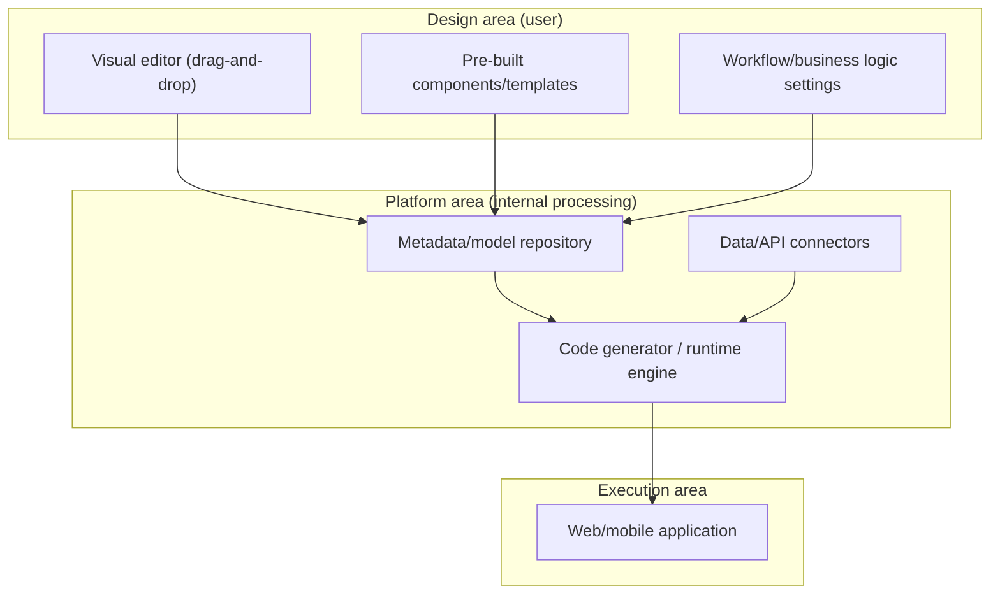
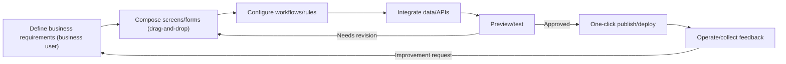

# No-Code

## 1. Overview

### A. Definition
> **No-Code** is a method of developing applications using only **a visual GUI (drag-and-drop) and pre-built components and templates** without writing programming code directly; it is a development paradigm that enables business users who are not developers (citizen developers) to build software.

The essence of no-code is the **Democratization** of software development. In the past, building apps was the exclusive domain of developers who knew how to handle programming languages and runtime environments. By replacing the entry barrier of "coding" with "visual manipulation," no-code enables business staff, who know the work best, to build the tools they need themselves. This resolves the bottleneck in which development requests piled up in the IT department and required waiting for months, and creates the speed at which business ideas immediately turn into execution.

The technical principle that makes no-code possible is **the upward movement of the abstraction layer**. As an extension of the trend in which the level of abstraction rose from assembly to high-level languages and then to frameworks, no-code raises the very means of expression called "code" one step further into a visual metamodel. When the user places forms and buttons on the screen and sets rules, the platform's internal runtime and code generator convert this into an actually executable application (web/mobile). In other words, the code has not disappeared but has been hidden behind the platform, and this simultaneously defines both no-code's advantage (productivity) and its limitations (platform dependency, opacity). For example, a marketing staffer builds a campaign application form and approval workflow directly without developer help.

### B. Background and Need
A clear supply-demand imbalance lies behind the rise of no-code. On one side, demand for digital transformation (DX) has exploded, sharply increasing the internal apps and automations each company needs; on the other side, skilled developers are chronically in short supply. As growing software demand could no longer be handled by a small number of developers, pressure increased to extend the development actor itself to business users through "development without coding." Gartner and others have forecast that a significant portion of new application development will be done via low-code/no-code methods, but since specific figures vary by research firm and point in time, it is more appropriate to understand this in general terms.

In addition, the universalization of cloud (SaaS) has supported no-code. Since the platform handles infrastructure and deployment on the user's behalf, users can build in a browser and publish immediately without knowing servers or deployment pipelines. Ultimately, no-code is a trend formed when the supply constraint of "developer shortage" and the demand characteristic of "need for immediacy" met on top of the cloud.

## 2. Architecture and Components of No-Code Platforms

A no-code platform looks like a simple editor on the outside, but internally it consists of several layers that convert the user's visual manipulations into an executable app. Examining the role of each component with a focus on principles gives the following.

The **Visual Editor** is the entry point where users compose screen layouts via drag-and-drop. The editor records the user's manipulations not as code but as **metadata (a declarative model)**. An intent such as "a form here, a submit button below, save on click" is stored internally in JSON/model form, and this declarative representation is the foundation that enables no-code's portability and automation. The completeness of the editor determines the expressive power of the platform.

**Pre-built Components** are a bundle of validated UI parts such as buttons, forms, charts, and tables, along with complete templates for specific tasks (inventory management, surveys, CRM). Since users assemble these parts rather than building from scratch, development speeds up, but conversely, requirements beyond the scope of the provided parts become hard to implement. This "prefabricated" nature simultaneously creates no-code's productivity and its flexibility limits.

The **Workflow Engine** is the part that visually defines business logic such as conditional branching, automation, and approval flows. It expresses rules such as "notify the manager on form submission → proceed to the next step if approved" in a rule-based manner, enabling actual business automation beyond simple screen building. There exists a "paradox" in which visual representation actually becomes harder to understand as logic becomes more complex, and this is where the appropriate scope of no-code is determined.

**Data/API Connectors** connect the built-in database with external SaaS and APIs to read and write data. The diversity of connectors determines the platform's practicality, and integrating with systems not provided often ultimately requires custom code. Finally, the **runtime/deployment engine** converts the metadata into an actual running app and publishes it.

Below is the actual procedure (detailed process diagram) for building a business app with no-code. Its characteristic is that everything from requirement definition to publishing and operation repeats in a shorter feedback loop than traditional development.

What stands out in this procedure is that **business users participate directly as the owners of requirement definition and validation**. In traditional development, when business users convey requirements in documents, developers interpret and implement them, and business users check them again, meaning is lost and waiting occurs in the process. No-code eliminates this round-trip loss because the person who has the requirements becomes the person who builds. However, viewed from the other side, this structure carries the risk that formal software engineering verification procedures (testing, code review, security checks) are easily skipped, which is why the governance discussion later becomes important.

## 3. No-Code vs. Low-Code Comparison

Low-Code, often mentioned together with no-code, looks similar at first glance but differs clearly in target users and flexibility. No-code **targets non-developers (business users) with absolutely no coding** and operates within a standardized scope, whereas low-code **allows minimal coding so that developers and semi-developers can build more complex and flexible apps**.

The fundamental reason for this difference is "the presence or absence of an escape hatch." Low-code is based on visual development but leaves room to insert code directly where the platform cannot cover. As a result, low-code can extend even to complex requirements close to core business systems, but requires development knowledge. No-code closes this escape hatch to maximize simplicity and accessibility, while limiting its own range of expression. The practical implication is clear: the two must be chosen according to users' IT capabilities and requirement complexity, and in reality many commercial platforms provide both characteristics together along a spectrum.

| Category | No-Code | Low-Code |
|---|---|---|
| **Target users** | Non-developers (business users, citizen developers) | Developers, semi-developers (IT department) |
| **Coding** | None (fully visual) | Minimal coding alongside (extensible) |
| **Flexibility** | Low (within standardized scope) | High (customization, integration) |
| **Suitable areas** | Simple forms, business automation, prototypes | Medium-complexity business, support for core systems |
| **Trade-off** | Accessibility↑ / Expressiveness↓ | Expressiveness↑ / Learning curve↑ |

## 4. In-Depth Analysis of Pros and Cons and Application Cases

The advantages of no-code are clear. First, development is fast. The time from idea to deployment is shortened to within a few days, making it especially powerful for prototyping and MVP validation. Second, dependence on developers and cost decrease, easing IT backlog bottlenecks. Third, because business users lead directly, the gap between requirements and results is small, reducing the repeated losses of "convey requirements → develop → re-confirm."

However, the limitations are also structural. Because it operates only within a standardized framework, it is unsuitable for complex, large-scale, or high-performance systems, and fine-grained customization is difficult. It also creates **Vendor Lock-in** to a specific platform, making migration hard and leaving users vulnerable to pricing and policy changes. Above all, **Shadow IT**, in which apps multiply outside the IT department's control, and the resulting data, security, and governance risks increase. In terms of performance and scalability, the overhead of the platform's abstraction layer may also limit high-volume traffic processing.

**To give concrete examples**, representative cases include (1) a startup building an initial service prototype with a no-code app builder without coding and using it for fundraising and market validation, (2) a business department in a large enterprise converting inventory and request handling previously managed in spreadsheets to a no-code workflow tool, greatly shortening approval lead time, and (3) nonprofits and the public sector instantly building surveys and application intake forms to respond to campaigns. What they have in common is that they fall within no-code's area of strength: "immediate automation of standardized work." Conversely, trying to build core payment or mission-critical systems that process high-volume real-time transactions solely with no-code and running into performance and flexibility limits is a typical misapplication.

| Category | Content |
|---|---|
| **Advantages** | Fast development and deployment, less developer dependence, cost reduction, business-user-led, low entry barrier |
| **Disadvantages** | Unsuitable for complex/large-scale, customization limits, vendor lock-in, Shadow IT/security/governance concerns, performance limits |

## 5. Advanced — Integration with Generative AI and Citizen Development Governance

No-code has recently been evolving a step further by **combining with generative AI**. If traditional no-code is "drag-and-drop," the AI-combined type is moving in the direction of automatically generating draft screens, data models, and workflows when you say in natural language, "Build me an app like this." This accelerates the democratization of development while also creating a new challenge: humans must verify the accuracy and security of the generated results. Since AI-generated apps may include unintended data access or faulty logic, the key point is that "generation has become easy, but the responsibility for verification remains."

In addition, **the rise of the Citizen Developer** presents organizations with governance challenges. As apps built by business users multiply, the risks of uncontrolled Shadow IT, data leakage, and regulatory violations grow. Therefore, rather than banning no-code, mature enterprises adopt **guardrail-style governance**, in which IT defines approved platforms, connectors, and the scope of data access, and business users build freely within that fence. This is a practical solution that balances control and autonomy, and it is a key management issue in the period of no-code proliferation.

## 6. Considerations and Implications (Professional Engineer's Perspective)

1. **Clear delineation of the scope of application (right tool for the right place).** No-code is efficient for standardized business automation, prototyping, and internal tools, but for core mission-critical systems requiring high performance, high availability, and complex logic, it is safer to use traditional development or combine it with low-code. A portfolio judgment of "what to do with no-code and what to do with code" must come first.

2. **Controlling Shadow IT and incorporating it into IT governance.** As business-user-led development increases, data, security, and compliance risks grow, so autonomy and control must be secured simultaneously through guardrail-style governance equipped with approved platforms, data access policies, and audit systems.

3. **Vendor lock-in and exit strategy (trade-off).** Dependence on a specific platform leads to cost and policy risks, so data standards, export capability, and migration paths must be checked in advance, and the tolerable level of dependency must be judged.

4. **Performance, scalability, and technical debt perspective.** As traffic and complexity grow with growth, no-code's abstraction limits can become a bottleneck, so it is desirable to design in advance a scenario for transitioning (rewriting) to traditional development when scaling up.

5. **Workforce and capability strategy (organizational perspective).** It is reasonable to view no-code not as a replacement for developers but as a tool that frees developers from repetitive work so they can focus on high-value areas. Training citizen developers and redefining IT's role as an enabler are the keys to successful adoption.

6. **Supplementing the quality and security verification framework.** Since no-code easily bypasses the testing, code review, and security checks of the formal development lifecycle, minimal quality gates—such as pre-approval review, least privilege, and guidelines for handling sensitive information—should be enforced at the platform level to strike a balance so that "fast" does not become "sloppy."

## References
- Gartner, "Low-Code / No-Code" Glossary, https://www.gartner.com/en/information-technology/glossary/low-code-application-platform-lcap
- Microsoft Power Platform (no-code/low-code cases), https://www.microsoft.com/power-platform

---

> **In one line**: No-code is a development democratization technology that *develops apps through visual editing without coding*, enabling participation by business citizen developers; its application scope must be delineated by weighing its advantages of fast development and low entry barriers against its limits in flexibility, performance, vendor lock-in, and governance, and it must be managed through guardrail-style IT governance.
