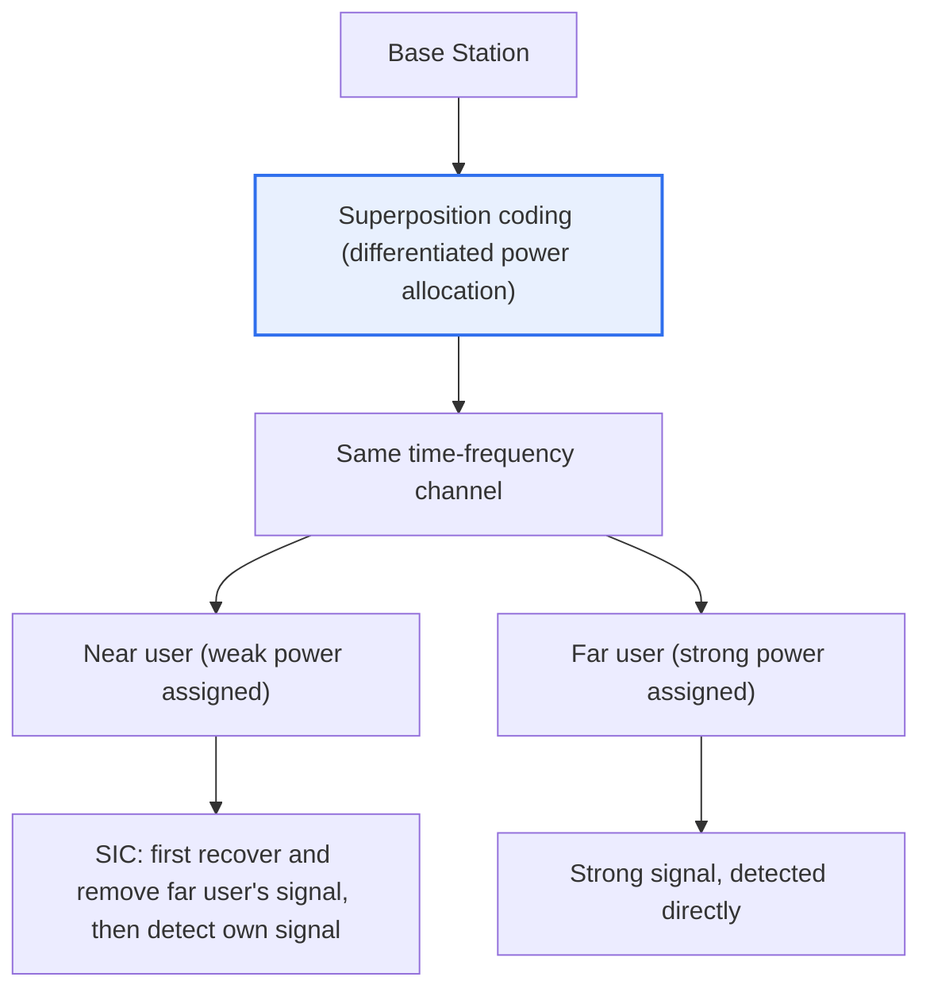
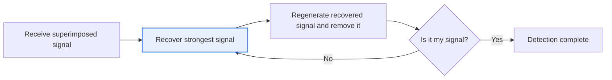

# Non-Orthogonal Multiple Access (NOMA)

## 1. Overview

### A. Definition
> A multiple access technique that **allocates the same time-frequency resources to multiple users by superimposing them with power differences (or codes)**, and separates the signals at the receiver through Successive Interference Cancellation (SIC). Unlike conventional orthogonal schemes (OMA), it overlaps resources instead of dividing them, thereby significantly increasing spectral efficiency and connection capacity.

The key to understanding NOMA is a shift in thinking: '**overlap resources instead of dividing them**.' Conventional Orthogonal Multiple Access (OMA) gives each user time (TDMA), frequency (FDMA), code (CDMA), or subcarriers (OFDMA) in a non-overlapping (orthogonal) manner so that users do not interfere with each other. This approach makes receiver processing simple and stable, but because resources are physically limited, it has a fundamental limitation: **the number of orthogonal resources becomes the upper bound on the number of users that can be served**.

NOMA overturns this premise. **Multiple users share the same time and frequency, but are assigned different power levels (Power Domain)**. The base station assigns weak power to users with good (near) channels and strong power to users with poor (far) channels, superimposing multiple signals into one (Superposition Coding) for transmission. At the receiver, **Successive Interference Cancellation (SIC)** recovers and removes signals in order starting from the strongest, isolating each user's own signal. This allows more users to be served simultaneously on the same resources and improves spectral efficiency, which is why NOMA has been continuously studied as a candidate technology for 5G/6G, where massive connectivity is required.

### B. Background and Need
Behind the rise of NOMA lies a structural contradiction: 'spectrum is finite, but connection demand is exploding.' As the number of connected devices surges due to the Internet of Things (IoT) and hyper-connectivity, the number of terminals a single cell must accommodate has grown incomparably larger than in the era of human-centric communication. In particular, **mMTC (massive Machine-Type Communications)**, one of the three usage scenarios defined for 5G, must accommodate an extremely large number of low-rate terminals in a small area, and OMA, which hands out orthogonal resources one by one, struggles to handle this density.

In addition, limited frequency spectrum is a national resource with very high auction and allocation costs, so **how much information and how many users can be carried in the same bandwidth (spectral efficiency)** becomes a core competitive advantage for mobile network operators. Because NOMA can raise the theoretical upper bound of this efficiency by overlapping resources, it has been studied as a strong alternative for overcoming the capacity limits of OMA.

## 2. Operating Principle — Power Superposition and SIC

NOMA's operation can be understood along two axes: 'overlap at the transmitter, peel apart at the receiver.' The diagram below shows the overall structure of downlink NOMA.

The base station **combines the two users' signals into one with different power levels** and sends them over the same resource. The key principle here is that '**the user with the worse channel receives more power**.' This may seem counterintuitive, but because a user with a poor (far) channel experiences heavy signal attenuation, strong power must be applied in the first place to secure minimum reception quality, while a user with a good (near) channel is adequately served with weak power. This asymmetry in power allocation is precisely the key that makes SIC possible.

**The far user (strong power)** has its own signal accounting for most of the total received power, so it treats the near user's weak signal as noise and detects its own signal directly. In contrast, **the near user (weak power)** first recovers the far user's strong-power signal, subtracts it from the received signal (interference cancellation), and only then detects its own signal from what remains. This process of 'peeling off from the strongest first' is the essence of SIC, and it is why each user can separate its own signal even when multiple users are superimposed.

From a process perspective, this can be summarized as the following sequential processing.

Because of this sequential structure, NOMA's performance **depends heavily on the accuracy of SIC**. If a strong signal is not accurately recovered and removed in an earlier stage, that error propagates directly into the detection of subsequent signals (Error Propagation), sharply degrading performance. Therefore, in practical implementations, power allocation optimization, user pairing (which users to group together), and channel estimation accuracy become the key design variables.

Let us make the principle concrete with **a simple numerical example**. Suppose the base station splits its total power between two users, giving 80% to the far user with the poor channel and 20% to the near user with the good channel (values are illustrative). From the far user's perspective, its own signal accounts for most of the received power, and the near user's 20% signal is relatively weak, so it can be treated as noise while still allowing detection. The near user, having a good channel and a high signal-to-noise ratio, first comfortably recovers and removes the strong 80% signal (belonging to the far user), then cleanly detects its own 20% share. The core intuition of NOMA is that **when the asymmetry in power ratio and the asymmetry in channel gain interlock**, two users can use the same resource and still each recover their own signal.

### C. Differences Between Downlink and Uplink
NOMA behaves differently in the downlink (base station → terminal) and the uplink (terminal → base station). In the **downlink**, the base station knows all users' signals and controls power when superimposing them, so it can jointly optimize superposition coding and power allocation, while each terminal performs SIC. In the **uplink**, by contrast, terminals at different locations transmit independently, so their signals naturally arrive at the base station at different power levels, and the base station performs SIC. Uplink NOMA combines well with grant-free access, in which terminals transmit immediately without a scheduling request, making it particularly attractive for massive IoT scenarios where access latency must be reduced. However, power control across terminals is difficult and collisions are possible, so the base station's signal separation capability becomes even more important than in the downlink.

## 3. Core Component Technologies

NOMA operates through the organic interplay of three component technologies. None of them exists in isolation; each is a prerequisite for the others.

**Power allocation (Power-domain Multiplexing)** is NOMA's starting point. Based on channel state information (CSI), power levels are assigned differentially to each user, and this allocation determines the balance between fairness and total capacity (Sum-rate) across the cell. If the power difference is not wide enough, SIC cannot distinguish the signals; if it is too wide, unfairness arises where only certain users receive good quality.

**Superposition Coding** is a transmitter technique that combines multiple users' signals into one with different power levels for transmission. It is known in information theory as a technique that achieves the capacity of the Broadcast Channel, and NOMA can be viewed as applying this long-standing theory to practical multiple access.

**Successive Interference Cancellation (SIC)** is the core receiver technique; as explained above, it separates each user's own signal by recovering and removing signals starting from the strongest. Most of the receiver complexity arises here, so in IoT environments where terminal computing capability and power consumption are constrained, a practical compromise of limiting the number of SIC stages (number of simultaneously superimposed users) is necessary. The SIC procedure can be broken into the following steps.

- **① Ordering**: Determine the processing order of the received superimposed signal starting from the strongest power (power level = processing priority).
- **② Recovery**: Demodulate and decode the strongest signal first to estimate its data.
- **③ Regeneration**: Use the estimated data to recreate (remodulate) the signal and reconstruct the original waveform.
- **④ Removal**: Subtract the regenerated signal from the received signal to eliminate the interference.
- **⑤ Repeat/Terminate**: Repeat ②–④ on the remaining signal and stop detection upon reaching one's own signal.

If recovery in ② is wrong, the removal in ③–④ becomes inaccurate and errors propagate downstream; the fact that the accuracy of each stage is linked like a chain is the fundamental difficulty of SIC design.

| Technology | Location | Role | Key Challenge |
|---|---|---|---|
| **Power allocation** | Transmitter | Differentiated power assignment by channel state | Sum-rate vs. fairness balance |
| **Superposition coding** | Transmitter | Transmit multiple signals superimposed | Achieving broadcast channel capacity |
| **SIC** | Receiver | Remove and separate from strongest signal | Complexity, error propagation |

## 4. Comparison with OMA — Why the Differences Arise

The difference between NOMA and OMA is not simply 'efficiency vs. simplicity'; it stems from **a difference in philosophy for handling interference**. OMA follows an 'interference avoidance' strategy that separates resources orthogonally so interference never arises in the first place, while NOMA follows an 'interference management' strategy that tolerates interference but actively removes it at the receiver. This difference in perspective produces all subsequent differences in characteristics.

| Category | OMA (Orthogonal) | NOMA (Non-Orthogonal) |
|---|---|---|
| **Resource allocation** | Separate per user (orthogonal) | Superimposed sharing of the same resource |
| **Interference handling** | Avoidance (blocked at source by orthogonality) | Management (removed by SIC) |
| **Separation method** | Time, frequency, code separation | Power difference (or code) |
| **Receiver processing** | Simple (low complexity) | Successive interference cancellation (high complexity) |
| **Spectral efficiency** | Relatively low | High |
| **Connection capacity** | Limited by number of orthogonal resources | Large (massive connectivity) |
| **Latency/power** | Low | Increased by SIC |

The most important practical implication of this table is that **'there is no free lunch.'** In exchange for higher spectral efficiency and connection capacity, NOMA increases receiver complexity, processing latency, and power consumption, and introduces the risk of SIC errors. Therefore, NOMA is not superior in every situation; its gain is maximized **when pairing users with large differences in channel gain**. Among users with similar channel conditions, it is hard to widen the power difference, so SIC does not work well, and OMA may actually be preferable in such cases.

**As a concrete example**, pairing a far user at the cell edge with a near user close to the base station yields a large channel gain difference, and hence a large NOMA gain. In contrast, if both users are at a similar distance in the cell center, separation in the power domain becomes ambiguous. For this reason, actual standardization discussions have considered NOMA not as a standalone scheme but as an optional overlay on top of OFDMA, or in combination with MIMO and beamforming.

## 5. Advanced — Standardization Trends and Evolution

Although NOMA has long been studied as a promising candidate, **it is difficult to assert that it has been fully adopted in commercial mobile communication standards.** During 5G NR standardization, 3GPP reviewed several multiple access candidates, including power-domain NOMA, but it is understood that OFDMA-based schemes were retained as 5G's baseline multiple access, owing to factors such as receiver complexity and maturity at the time of standardization. Nevertheless, NOMA-like techniques are partially used and studied in broadcasting, relaying, and certain uplink scenarios, and the exact scope of adoption varies by release and timing, so it is safest to understand this in general terms.

The technical evolution follows two broad directions. First, expansion into **code-domain NOMA**. Instead of the power domain, this approach uses sparse codes (SCMA, Sparse Code Multiple Access) or low-density spreading codes to distinguish users, aiming for massive access while easing SIC complexity. Second, **combination with MIMO and beamforming (MIMO-NOMA)**. This is a hierarchical structure that jointly exploits the spatial domain (antennas/beams) and the power domain, superimposing users again with NOMA within user groups separated by beams.

From a 6G perspective, NOMA is drawing renewed attention in **environments that simultaneously demand massive connectivity (numerous IoT terminals) and ultra-low latency with high reliability**. In particular, when combined with grant-free uplink access, terminals can transmit immediately without a scheduling request procedure while the base station separates the superimposed signals, greatly reducing access latency; this makes it a discussed candidate for combined mMTC-URLLC scenarios. However, this too is an area still under research and standardization, so it is more accurate not to assert it as an established commercial technology.

Summarizing **the representative areas where applications are being considered** makes the picture more concrete. First, satellite and non-terrestrial networks (NTN). Satellite cells have wide coverage, so channel gain differences between users naturally become large, making NOMA's premise (asymmetry in power and channel) hold well; it is studied as a way to serve many terminals with limited satellite resources. Second, environments with high user density and large channel variation, such as vehicular communications (V2X) and millimeter-wave small cells. Third, cases like broadcasting and multicast, where content of different quality is transmitted hierarchically to multiple receivers on a single resource (layered coding). What these cases have in common is that they all involve '**large differences in channel gain or extremely limited resources**,' which conversely shows when NOMA delivers gains.

## 6. Considerations and Implications (Professional Engineer's Perspective)

1. **SIC complexity and error propagation are the biggest challenges.** SIC, which removes signals sequentially at the receiver, has computational load that grows with the number of users, and recovery errors in earlier signals propagate downstream. In IoT, where terminal power and computing are constrained, a realistic design either limits the number of simultaneously multiplexed users (SIC stages) or compromises with lower-complexity code-domain techniques.

2. **User pairing and power allocation determine performance.** Since gains are large only when pairing users with large channel gain differences, the scheduler must optimize in real time which users to superimpose (pairing) and how to split the power (power allocation). This is a problem of resolving the trade-off between maximizing sum capacity and inter-user fairness, and it is the core algorithmic challenge in practical NOMA.

3. **Accurate channel estimation and CSI feedback are prerequisites.** Since both power allocation and SIC depend on channel state information (CSI), large channel estimation errors or feedback delays can cancel out NOMA's advantages. In situations where the channel changes rapidly, such as high-mobility environments, this prerequisite weakens and the advantage over OMA may shrink.

4. **Standardization and commercialization maturity must be assessed soberly.** NOMA has clear theoretical gains, but due to receiver complexity, implementation cost, and alignment with existing standards, full commercialization requires careful judgment. From a professional engineer's perspective, it is appropriate to position it as a 'promising but context-dependent' technology and to propose a strategy of applying it selectively to specific high-gain scenarios such as mMTC and grant-free access.

5. **Evolution through combination with other technologies is the realistic path.** Rather than replacing OMA as a standalone scheme, combining it with MIMO, beamforming, and mmWave (MIMO-NOMA) or extending it into the code domain (SCMA) is the practical direction. In line with 6G's massive connectivity and ultra-low latency requirements, NOMA should be understood not as the 'single right answer' for multiple access but as one axis of a toolbox selected according to the situation.

---

> **In one line**: NOMA is a non-orthogonal multiple access scheme that *shares the same time-frequency resource by superimposing users with power differences* and separates signals at the receiver via SIC; it overcomes OMA's capacity limits to raise spectral efficiency and connection capacity, but at the cost of SIC complexity, error propagation, and dependence on channel estimation, and it is a 5G/6G candidate technology evolving in combination with MIMO and the code domain for massive-connectivity (mMTC) scenarios with large channel gain differences.
