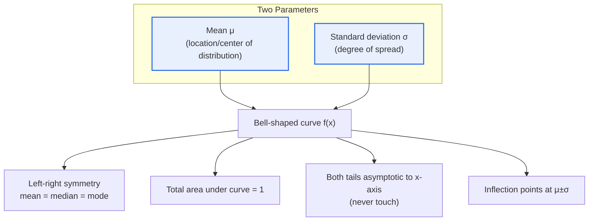
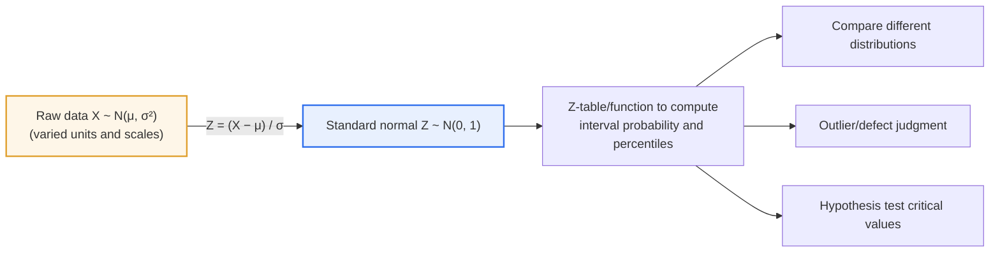

# Characteristics of the Normal Distribution

## 1. Overview

### A. Definition
> The **normal distribution** is a **bell-shaped continuous probability distribution** that is symmetric around its mean (μ). It is the distribution most widely observed in natural and social phenomena and serves as the mathematical foundation of statistical inference (estimation and testing). Its probability density function is completely determined by just two parameters, the mean μ and the variance σ² (standard deviation σ), and it is denoted X ~ N(μ, σ²).

The fundamental reason the normal distribution sits at the center of statistics lies in a twofold universality: '**countless phenomena in the world are distributed in a bell shape, and even for populations that are not, the means of samples drawn from them converge to a normal distribution**.' Values produced by adding many small, independent factors — such as human height and weight, errors arising from repeated measurements, or the dimensions of parts from a manufacturing process — naturally cluster around the mean with rare extremes, forming a bell shape unless a particular factor dominates. This is not a coincidence but a manifestation of the mathematical property that the sum of independent random variables approaches a normal distribution.

Even more decisive is the **Central Limit Theorem (CLT)**. Even if the population is not normally distributed, the distribution of the sample mean X̄, computed by repeatedly drawing samples of size n from that population, approaches the normal distribution N(μ, σ²/n) as n grows. For example, if you repeat thousands of times an experiment that draws 30 dice rolls (1–6, uniform distribution) and averages them, the histogram of sample means becomes a bell shape centered at 3.5, even though the individual rolls are uniformly distributed. Thanks to this property, parameters can be estimated and hypotheses tested 'through samples' without knowing the population distribution, and the normal distribution becomes the common language of inferential statistics as a whole — confidence intervals, hypothesis testing, regression analysis, and quality control (Six Sigma).

Finally, **the simplicity of its parameters** is also a powerful practical advantage of the normal distribution. Knowing only two values — the mean (location) and the standard deviation (spread) — fixes the shape of the entire distribution and allows the probability of any interval to be computed. This economy makes both theoretical development and field application easier.

### B. Background and Need
The normal distribution was established in the 18th–19th centuries through efforts to mathematically explain '**measurement error**' — the slight variation in values each time astronomical observations and geodetic surveys were repeated. De Moivre first dealt with the bell-shaped curve as an approximation to the binomial distribution, and later **Gauss** systematized this distribution together with the method of least squares in the theory of errors, which is why it is also called the '**Gaussian distribution**' today. The intuition that observation errors scatter symmetrically around a mean of 0 without bias in any particular direction led to the bell shape of the normal distribution. A distribution that began as an error model, then supported by the CLT through the convergence of sample means, became the standard tool for handling data in the natural sciences, engineering, social sciences, and business.

## 2. Probability Density Function and Geometric Characteristics

The shape and properties of the normal distribution are governed by the mean μ and the standard deviation σ. The figure below shows which aspects of the curve each parameter determines and which geometric properties derive from them.

The probability density function is f(x) = (1 / (σ√(2π))) · exp( −(x−μ)² / (2σ²) ). The formula may look complicated, but its structure is simple. The key is the term −(x−μ)²/(2σ²) inside the exponent: as x moves away from the mean μ, (x−μ)² grows and the negative exponent shrinks rapidly, so the curve falls quickly. The leading factor 1/(σ√(2π)) is a normalization constant that makes the total area equal to 1. Together, these two parts create a bell shape that 'is highest near the mean and decreases symmetrically toward both ends.'

**First, symmetry and coincidence of representative values.** The curve is perfectly symmetric about x=μ, so the mean, median, and mode all meet at μ. This is the key signal that distinguishes the normal distribution from skewed distributions. For data with a long right tail, such as income distributions, the mean appears larger than the median, so if the three representative values diverge, normality should be questioned.

**Second, spread determined by the standard deviation.** When σ is small, the curve rises sharply around the mean; when σ is large, it spreads out low and wide. Even with the same mean, a different σ implies an entirely different level of risk or quality. For example, even if two production lines both make parts with a mean diameter of 10mm, a line with σ of 0.05mm and one with σ of 0.20mm will have very different defect rates. In the normal distribution, the points μ±σ are also the **inflection points** where the curve changes from concave to convex, so σ becomes the 'natural unit of spread' both statistically and geometrically.

**Third, area = probability and asymptotic behavior.** The total area under the curve is always 1, and the area over a given interval [a, b] is exactly the probability P(a≤X≤b) that a value falls within it. In addition, the curve approaches the x-axis indefinitely at both ends but never touches it (asymptote). This means 'even the most extreme value does not have zero probability,' which is the starting point for the fat-tail risk discussion covered later.

| Characteristic | Description | Practical Implication |
|---|---|---|
| **Symmetry** | Symmetric about the mean; mean = median = mode | Divergence of the three suggests non-normality |
| **Bell shape** | Concentrated near mean, decreasing toward ends | Values near the mean are most common |
| **Determined by two parameters** | Fully determined by μ (location) and σ (spread) | Any interval probability computable from two values |
| **Area = 1** | Total area under curve = 1; interval area = probability | Probability derived by integration/tables |
| **Asymptotic** | Tails approach x-axis infinitely without touching | Even extreme values have nonzero probability |
| **Inflection points μ±σ** | Concave/convex transition at standard deviation | σ is the natural unit of spread |

## 3. The 68-95-99.7 Rule and the Standard Normal Distribution (Standardization)

### A. The 68-95-99.7 Empirical Rule
The most intuitive demonstration of the normal distribution's practicality is the **68-95-99.7 rule (empirical rule)**. About 68.3% of the data falls within ±1σ of the mean, about 95.4% within ±2σ, and about 99.7% within ±3σ. These proportions always hold for any normal distribution, regardless of its mean and standard deviation.

Concretely, if exam scores with a mean of 70 and a standard deviation of 10 follow a normal distribution, about 68% of students fall in the 60–80 range, about 95% in 50–90, and about 99.7% in 40–100. It immediately follows that students scoring above 90 out of 100 are only about the top 2.3%. This rule makes it possible to set management criteria such as "treat anything beyond a certain number of σ as an outlier," which underpins the control limits (±3σ) of Statistical Process Control (SPC) and outlier detection.

### B. Standardization (Z-transformation) and the Standard Normal Distribution
To compare different normal distributions on a single scale, they are converted to the **standard normal distribution** (mean 0, standard deviation 1, Z ~ N(0,1)). Converting raw data X via Z = (X − μ) / σ is called **standardization**, and the Z value means 'how many standard deviations away from the mean' a value lies. Standardization allows values with different units to be compared on a common scale. For example, a student who scored 85 in Korean (mean 70, σ 10) has a Z of +1.5, while a student who scored 85 in math (mean 60, σ 20) has a Z of +1.25. The raw score is the same 85, but standardization reveals that the achievement in Korean is relatively stronger.

The real power of standardization is the standardization of probability computation. Once any normal distribution is converted to Z, the probability of any interval can be read from a single standard normal table (or function). In the past, Z-tables were looked up by hand; today, functions such as NORM.S.DIST in spreadsheets or scipy.stats.norm in Python compute it instantly. The critical value ±1.96 (two-sided) corresponding to a 5% significance level in hypothesis testing, and ±2.58 for the 1% significance level, all come from this standard normal distribution.

| Interval | Proportion Covered | Example Use |
|---|---|---|
| **±1σ** | About 68.3% | Range of everyday variation |
| **±2σ (≈1.96σ)** | About 95.4% (exactly 95% at 1.96σ) | 95% confidence interval, 5% significance level |
| **±3σ** | About 99.7% | SPC control limits, outlier threshold |
| **±6σ** | About 99.99966% | Six Sigma quality (3.4 defects per million) |

## 4. Comparison with Similar and Related Distributions

To use the normal distribution correctly, it is important to know when to switch to another distribution. The comparison below is not a mere list but conveys the context of 'why that distribution becomes necessary.'

The t-distribution is used when the sample is small (roughly n<30) and the population standard deviation is unknown and replaced by the sample standard deviation. It has heavier tails than the normal distribution because the uncertainty in estimating the standard deviation is large for small samples. As the sample grows, the t-distribution converges to the normal distribution. The chi-square and F distributions appear when testing variances or dealing with variance ratios in analysis of variance (ANOVA). The binomial distribution deals with discrete success/failure events, but when the number of trials is large and the success probability is not extreme, it can be approximated by the normal distribution (normal approximation), making it a representative application of the CLT.

| Distribution | When Used | Relationship to the Normal Distribution |
|---|---|---|
| **Standard normal (Z)** | Population variance known or large sample | Normal distribution transformed to mean 0, σ 1 |
| **t-distribution** | Small sample, population variance unknown | Heavier tails; converges to normal as n grows |
| **Chi-square** | Variance tests, goodness-of-fit tests | Sum of squares of standard normals |
| **Binomial** | Discrete success/failure events | Normal approximation possible for large n (CLT) |

## 5. Advanced — Practical Applications and Limits of Normality

The normal distribution is widely used in industry. **Six Sigma in quality management** is a representative example. Six Sigma is a methodology that models process variation with a normal distribution and reduces variation so that specification limits lie 6σ from the mean, driving defects to extremely low levels. In practice, it corrects for the long-term drift (shift) of the process mean by ±1.5σ, defining the Six Sigma level as 'about 3.4 defects per million opportunities (DPMO 3.4).' The cases of GE and Motorola dramatically reducing quality costs with this method in the 1980s–90s are widely known.

The normal distribution also long served as the standard in **financial risk management**. Assuming returns follow a normal distribution, **VaR (Value at Risk)** — the maximum expected loss at a given confidence level — can be computed simply from the standard deviation and a Z value. For example, if the standard deviation of daily returns is 2%, the 95% VaR is estimated at about 1.65×2% = 3.3%. But there is an important limitation here. Actual financial returns have much heavier tails than the normal distribution (leptokurtic), and extreme events occur frequently. The 2008 global financial crisis showed that crashes that would occur 'once in tens of thousands of years' under the normal assumption happen repeatedly in reality, and afterward, complementary techniques that reflect heavy tails — Extreme Value Theory (EVT), the t-distribution, and historical simulation — were emphasized.

The lesson from these cases is that the normal distribution is powerful but not a panacea. Before assuming that data 'will follow' a normal distribution, a procedure to verify it with **normality tests and visual diagnostics** is needed. Commonly used are normality tests such as the Shapiro-Wilk test and the Kolmogorov-Smirnov (K-S) test, and the **Q-Q plot**, which compares data quantiles with theoretical quantiles. If points on the Q-Q plot follow a straight line, the data is consistent with normality; if both ends curve upward, this suggests heavy tails, and an S-shaped curve suggests skewness. When normality is violated, the data can be brought closer to normal through log or square-root transformations (including Box-Cox), or one can switch to nonparametric techniques that do not require normality (Mann-Whitney, Kruskal-Wallis, etc.).

## 6. Considerations and Implications (Professional Engineer's Perspective)

1. **Proceduralize verification of the normality assumption.** Many widely used parametric techniques, such as t-tests, regression analysis, and ANOVA, presuppose normality. Therefore, reliable conclusions require incorporating normality tests (Shapiro-Wilk) and Q-Q plots as standard steps in the data analysis process, and establishing in advance the criteria for branching to transformations or nonparametric techniques when the assumption is violated.

2. **Rely on the Central Limit Theorem, but secure sufficient sample size.** Because sample means converge to normality even when the population is not normal, most inference can be performed on the normal distribution. However, this presupposes 'a sufficiently large sample.' More skewed populations require larger n, so the necessary sample size should be calculated at the sampling design stage, and corrected distributions such as the t-distribution should be applied for small samples.

3. **Manage fat-tail risk separately.** In domains where extreme values have severe impact — finance, disasters, security incidents — the normal distribution underestimates tail risk. Going beyond VaR to combine Conditional VaR (Expected Shortfall), Extreme Value Theory, and stress testing to prepare for 'rare but catastrophic' events is risk design from a professional engineer's perspective.

4. **Use it as a quantitative standard for quality and operations management.** The 68-95-99.7 rule and ±3σ control limits provide the quantitative backbone for SPC, Six Sigma, and SLA outlier detection. By quantifying variation relative to specifications with process capability indices (Cp, Cpk) and establishing a system to trace causes when observations exceed control limits, quality can be continuously improved on a data-driven basis.

5. **Consider the link with machine learning and anomaly detection.** Many algorithms assume, or benefit from, normality or standardization (scaling) of input features. Z-score-based standardization is a standard preprocessing step for aligning feature scales, and anomaly detection using the normal assumption (e.g., Gaussian anomaly detection) is applied to log analysis and fraud detection. Explicitly handling distribution characteristics when designing data pipelines improves both performance and interpretability.

## References
- NIST/SEMATECH e-Handbook of Statistical Methods, "Normal Distribution": https://www.itl.nist.gov/div898/handbook/eda/section3/eda3661.htm
- Wikipedia, "Normal distribution": https://en.wikipedia.org/wiki/Normal_distribution
- Wikipedia, "Central limit theorem": https://en.wikipedia.org/wiki/Central_limit_theorem
- Wikipedia, "68–95–99.7 rule": https://en.wikipedia.org/wiki/68%E2%80%9395%E2%80%9399.7_rule

---

> **In one line**: The normal distribution is a *bell-shaped continuous distribution symmetric about its mean*, fully determined by two parameters — the mean (μ) and standard deviation (σ); it computes probabilities through the 68-95-99.7 rule and standardization (Z) and underpins statistical inference via the Central Limit Theorem, but fat-tail risk and normality verification must be addressed alongside it.
