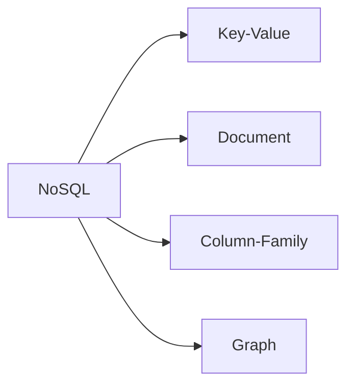

# NoSQL Types and Data Modeling Procedure

## 1. Overview

### A. Definition
> A family of data storage technologies that departs from the RDBMS premises of relational schemas, SQL, and strong consistency, and is optimized for **large-volume, unstructured, distributed, and highly scalable** requirements. As the name "Not Only SQL" suggests, it is not so much a rejection of SQL as an alternative that **complements areas that the relational model alone struggles to handle**.

### B. Background and Need
RDBMSs are powerful for structured data where consistency is critical, but to improve performance they rely on **vertical scaling (Scale-up)** — increasing server specifications — which runs into physical and cost limits. Since the 2000s, however, large-scale web services have needed **horizontal scaling (Scale-out)**, spreading exploding traffic and unstructured/semi-structured data such as logs, JSON, and social relationships across many inexpensive servers. In addition, in environments where it is hard to fix the schema from the start of a service and requirements change frequently, a fixed schema that locks an entire table just to add a column becomes an obstacle. NoSQL emerged with **flexible schemas, horizontal scaling, and high availability** as its primary goals.

### C. Comparison of Characteristics with RDBMS
What matters is what NoSQL gives up in exchange for these characteristics. Most notably, it chooses **eventual consistency (BASE) instead of strong consistency (ACID)**. When data is replicated and distributed across many nodes, keeping all nodes in an identical state at all times becomes expensive, so the model is relaxed to tolerate temporary inconsistency while ensuring eventual convergence.

| Category | RDBMS | NoSQL |
|---|---|---|
| Schema | Fixed (predefined) | Flexible (schemaless) |
| Scaling method | Vertical (Scale-up) | Horizontal (Scale-out) |
| Consistency model | ACID (strong consistency) | BASE (eventual consistency) |
| Transactions | Strong (multi-table) | Limited |
| Suitable data | Structured, relationship-centric | Unstructured, large-volume, distributed |

## 2. NoSQL Types

NoSQL is divided into four types according to the model used to hold data, and each suits different access patterns.

**Key-Value** is the simplest form, storing and retrieving values by key. Because its structure is so simple, lookups are extremely fast, making it suitable for caching and session storage (Redis). **Document** holds hierarchical documents such as JSON/BSON in the value position, allowing all data related to an entity to be stored and retrieved as a whole, which makes it strong for semi-structured data (MongoDB). **Column-Family** stores data by column rather than by row, which benefits analytics that read specific columns in bulk and time-series writes (Cassandra, HBase). **Graph** represents data as nodes and edges (relationships), performing multi-hop relationship traversal (friends of friends, recommendations) quickly without joins (Neo4j).

| Type | Data Model | Representative Products | Main Uses |
|---|---|---|---|
| **Key-Value** | Key-value pairs | Redis, DynamoDB | Cache, session, configuration |
| **Document** | JSON/BSON documents | MongoDB | Semi-structured data, catalogs |
| **Column-Family** | Column-oriented | Cassandra, HBase | Large-volume time series, logs |
| **Graph** | Node-edge | Neo4j | Relationship networks, recommendation, fraud detection |

## 3. CAP Theorem and Consistency Choices

The core theory of NoSQL design is CAP. It states that a distributed system cannot simultaneously satisfy all three of **Consistency, Availability, and Partition tolerance**, and since network partitions (P) are unavoidable in reality, **one must give up either C or A at the moment a partition occurs**. When communication between nodes is cut off, responding even with a stale value (choosing A) breaks consistency, while blocking responses to guarantee the latest value (choosing C) reduces availability.

As a result, NoSQL products diverge in orientation according to purpose. **AP-type** systems such as Cassandra and DynamoDB, which always prioritize responding, are used for services that tolerate brief inconsistency, such as social media feeds, while **CP-type** systems such as HBase and MongoDB (depending on configuration), which prioritize correctness, are used in areas where a wrong answer is fatal, such as inventory and account balances. In other words, the CAP choice is not a matter of technical taste but **a trade-off determined by business requirements**.

## 4. Data Modeling Procedure

The biggest characteristic of NoSQL modeling is that its direction is **the exact opposite** of RDB modeling. An RDB first normalizes the structure of the data (entities and relationships) and then writes the necessary queries, whereas NoSQL **first decides how data will be queried and then builds the data structure to fit.**

| Step | Description | Principle |
|---|---|---|
| **Query-First** | Analyze query patterns first | Joins are weak, so storage is shaped to read patterns |
| **Denormalization/embedding** | Data duplication, embedding within documents | Complete in a single read to avoid joins |
| **Key design** | Design partition keys and sort keys | Distribute and sort data evenly across nodes |
| **Validation/tuning** | Check performance and hotspots per access pattern | Prevent skew toward specific keys (Hotspot) |

For example, if an e-commerce "order screen shows the member name and product name together," instead of joining member, product, and order tables as in an RDB, the member name and product name are **replicated and embedded in advance** within the order document. The screen is completed with a single lookup, which is fast, but if a member changes their name, the burden of updating all replicated values arises. In this way, NoSQL modeling is a design that **accepts write complexity and duplication for the sake of read performance**. If the partition key is chosen poorly and requests concentrate on a particular node (hotspot), scalability collapses, so key design is the crux of performance.

## 5. Considerations and Implications
- **Explicit choice between consistency and availability**: The CAP trade-off must be decided consciously to fit the service's characteristics, and in areas where correctness is essential, such as finance, indiscriminate adoption of AP should be avoided.
- **Redesign burden**: If access patterns change, the data structure itself must be redesigned, so the accuracy of the initial query analysis determines long-term operating costs.
- **Polyglot Persistence**: Real-world systems are moving toward **mixing the optimal store for each purpose** — RDB for structured transactions, Key-Value for sessions, Graph for recommendations — rather than unifying on one, and NewSQL is evolving as a compromise that seeks to combine NoSQL's scalability with RDB's ACID.

---

> **In one line**: NoSQL is *a family of storage technologies optimized for large-volume, unstructured, and distributed data*, with Key-Value, Document, Column, and Graph types; it chooses between consistency and availability as a trade-off according to the CAP theorem and follows query-first modeling that defines query patterns first and avoids joins through denormalization and embedding.
