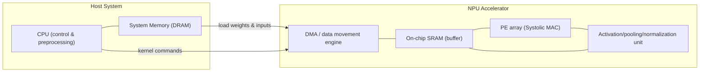
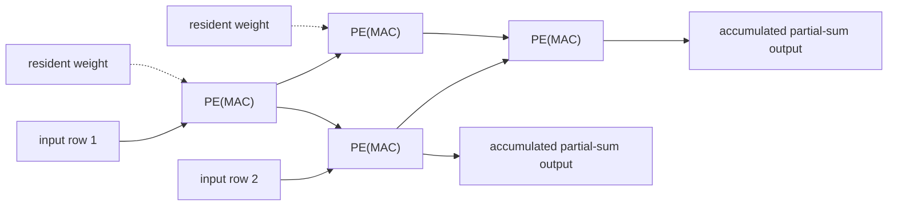
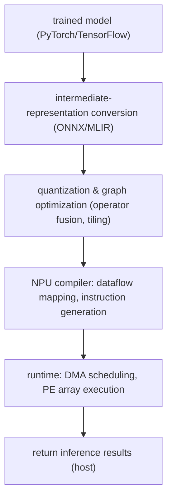

# NPU (Neural Processing Unit)

## 1. Overview

### A. Definition
> An **NPU (Neural Processing Unit)** is an **AI-dedicated accelerator (Domain-Specific Accelerator)** specialized to process the core operations of deep neural networks—**matrix/vector multiplication and Multiply-Accumulate (MAC)**—with massive parallelism. Unlike a CPU, which targets general-purpose computation, or a GPU, which originated in graphics processing, an NPU is a leading example of a **Domain-Specific Architecture (DSA)** in which the datapath, memory hierarchy, and numerical precision are all redesigned solely for the specific workload of "neural network inference and training."

A traditional CPU handles diverse tasks flexibly through control-centric optimizations such as branch prediction and out-of-order execution, but it is inefficient for the regular computations of neural networks, where the same multiply-accumulate is repeated hundreds of millions to trillions of times. GPUs have absorbed much of this parallelism with thousands of cores, but because they retain general-purpose flexibility originally intended for the graphics pipeline, there is still room for improvement in power and area efficiency. By minimizing control logic and concentrating die area on the **processing-element (PE) array and on-chip memory**, an NPU achieves far higher compute throughput (TOPS) and power efficiency (TOPS/W) at the same power. Google's TPU, Apple's Neural Engine, and the NPU blocks in Samsung and Qualcomm mobile SoCs are representative examples.

### B. Background and Necessity
Three converging pressures underlie the rise of the NPU. The first is the **explosive growth in deep learning computation**. Starting with image recognition and moving into transformer-based large language models (LLMs), model parameters and computation have grown exponentially, and general-purpose processors can no longer handle them within reasonable time and cost. The second is the **limit on energy efficiency**. With the slowdown of Moore's Law and the end of Dennard scaling, adding more transistors also raises power density, so **domain-specific acceleration**—giving up generality and specializing circuits for particular operations—has become practically the only way to push performance higher. The third is **ubiquitous inference**: as on-device demand grew for running AI continuously in battery- and heat-constrained environments such as smartphones, cars, and IoT devices, dedicated hardware that runs neural networks at low power became essential. These three pressures together established the NPU—a "chip that does only neural networks well"—as the third pillar of computing alongside the CPU and GPU.

Historically, GPUs drove the early deep learning boom, but as the scale of training and inference grew, the field reached a tipping point where "general-purpose parallelism" alone could no longer sustain cost and power, and dedicated accelerators tailored to specific workloads emerged as an inevitable solution. Google's development of the TPU around 2015 to reduce its data center inference burden was a symbolic turning point, after which embedding NPUs became standard across cloud, mobile, and automotive domains.

Looking one step deeper, the rise of the NPU reflects a shift in computing design philosophy. As semiconductor performance gains hit their limits from clock speed and expanded generality alone, **Domain-Specific Architecture (DSA)**—fitting circuits to the computational patterns of a specific application—emerged as a new breakthrough for performance and power, and neural networks became its first large-scale success. In other words, the NPU is not merely a new product but a product of the era's shift "from von Neumann generality to application specialization," and understanding this perspective makes the subsequent structural choices read consistently.

### C. Characteristics
The nature of the NPU can be summarized as **(1) specialization for specific operations (MAC-centric), (2) exploitation of massive data parallelism, (3) preference for low-precision integer arithmetic (INT8, etc.), and (4) power-efficiency-first design through maximized data reuse**. This is a design philosophy that sacrifices some "flexibility" in exchange for "efficiency," and the structure, precision, and compiler stack examined later all derive from this principle.

The four characteristics are interlocked. Because of the MAC-centric specialization (1), parallelism (2) can be maximized through regular arrays; that regularity allows dense integration of low-precision integer arithmetic (3); and data reuse (4) reduces movement energy to complete the power efficiency. Conversely, in workloads that deviate from this regularity, all four advantages weaken simultaneously—this is what defines the NPU's strengths and limits at once. Therefore, understanding the NPU means knowing under which conditions these four axes hold and under which they collapse.

## 2. Architecture and Operating Principles

The key to NPU performance lies in **how processing elements are arranged to reduce data movement**. The structural diagram below shows a typical system configuration in which a host (CPU) and an NPU cooperate.

The host CPU decomposes the model graph and delegates operations to the NPU; the DMA moves the vast weights and inputs into the **on-chip SRAM buffer**, and matrix multiplication is then performed in the **PE array**. The key here is to **maximize data reuse relative to computation**, minimizing access to the slow, power-hungry external DRAM. The more a piece of data is read once and reused many times (high operational intensity), the greater the NPU's advantage.

The principle by which this structure leads to power efficiency can be summarized as "conserve expensive resources and exploit cheap ones." In neural network computation, the real cost is not the multiplication itself but transporting its operands from distant memory. Targeting exactly this data movement, the NPU strips away control logic and invests the freed-up die area into processing elements and on-chip buffers. Below, we examine those specific design elements one by one.

### A. Systolic Array and Parallelized Multiply-Accumulate
The heart of the NPU is a two-dimensional grid of processing elements called a **systolic array**. Here, many processing elements (PEs) are connected in a lattice; data flows to adjacent PEs on each clock, like a heartbeat, and each PE performs a multiply-accumulate. When computing the product of matrices A and B, inputs flow in along one edge of the array, weights remain resident in each PE, and partial sums accumulate along the array to exit the opposite side. The decisive advantage of this approach is that **data read once is reused across many PEs as it passes through the array**, dramatically reducing the number of external memory accesses. A representative example is Google's TPU, which processed tens of thousands of MACs per cycle with a large 256×256 systolic array, pushing computational density to the extreme with almost no control overhead.

The detailed diagram below is a reduced 2×2 example showing the data flow of a systolic array: inputs flow in from the left, weights remain resident in each PE, and partial sums accumulate downward.

The key is that a once-injected input/weight is used repeatedly across many PEs as it passes through the array, and this reuse is the source of reduced external memory access. A systolic array is efficient not simply "because it has many cores" but because its **data movement pattern is regular and local**. Whereas a GPU shares data flexibly through vast register files and caches, a systolic array passes data only through wiring between adjacent PEs, reducing wire length and power. However, such regularity is effective only when the multiply-accumulates are densely packed, so it also carries the limitation that PE utilization can drop for sparse or irregular computations.

### B. Dataflow and Reuse Strategy
Another axis governing performance and power in NPU design is the dataflow, which determines **what data to hold stationary and what to let flow**. There are three main kinds. **Weight Stationary** keeps weights resident in PEs to maximize their reuse, which is advantageous for convolution and fully connected layers that apply the same weights repeatedly across many inputs. **Output Stationary** has each PE responsible for accumulating one output value to completion, eliminating the movement of partial sums; and **Row Stationary** comprehensively balances the reuse of inputs, weights, and partial sums (e.g., MIT's Eyeriss). Which is optimal depends on the shape of the layer (number of channels, kernel size, batch size), so real NPUs support multiple dataflows or select one to match a specific workload. In this way, the design of "what to reuse" determines power efficiency.

Meanwhile, dataflow selection is intertwined with the design of the on-chip memory hierarchy. An NPU has a multi-level memory hierarchy running from external DRAM, to a large on-chip **global buffer (SRAM)**, to a small **register file** inside each PE, with access energy dropping sharply at higher levels. Therefore, keeping data close to the PEs (registers/local buffers) for as long as possible to reuse it is the key to power efficiency, and dataflow is nothing more than a policy that decides "where in this hierarchy to hold what, and how long." For this reason, NPU design is as much about balancing buffer capacity and bandwidth as it is about increasing the number of processing elements.

### C. Low-Precision Arithmetic and Quantization
Another secret behind the NPU's overwhelming power efficiency over the GPU is **reduced precision**. Training typically uses floating-point formats like FP32/FP16, but at the inference stage it has been empirically shown that applying **quantization**—lowering 32-bit floating point to **8-bit integer (INT8)** or below—does not incur large accuracy loss. Integer multipliers are several times smaller in circuit area and power than floating-point ones, so more processing elements can be packed onto the same die and run at lower power. For instance, an INT8 operation performs the same computation with roughly one-quarter of the memory of FP32 and far less energy. The latest NPUs go further, supporting ultra-low precision such as INT4 and FP8, **mixed precision** that varies precision per layer, and **sparsity acceleration** that skips connections whose weights are zero, all to boost efficiency. However, the lower the precision, the greater the risk of accuracy degradation, so correcting for it with techniques such as quantization-aware training (QAT) is a practical key.

### D. Software Stack and Compiler
An NPU does not operate on hardware alone; the **compiler/runtime stack that converts models into hardware instructions** determines more than half of its performance. A model written by a developer in PyTorch or TensorFlow is first converted into an intermediate representation such as ONNX, and then an NPU-specific compiler (e.g., a vendor SDK, Apache TVM, or Google XLA) performs **operator fusion, tiling, memory allocation, and dataflow mapping** to produce optimized executable code. In this process, multiple operations are fused into one to eliminate memory round-trips for intermediate results, and large matrices are sliced (tiled) to fit the on-chip buffer size to maximize reuse. No matter how excellent the hardware, if the compiler maps operations poorly, PE utilization plummets, so NPU competitiveness depends heavily on **hardware-software co-design**. Indeed, the biggest hurdle facing emerging NPU startups is often the maturity of this software ecosystem rather than the chip itself.

### E. Performance Metrics and the Roofline Perspective
When evaluating and comparing NPUs, one must look at multiple metrics together rather than a single number. The most widely used are **TOPS (Tera Operations Per Second)**, the number of operations per second, and **power efficiency TOPS/W**, which divides it by power consumption. However, TOPS is only a theoretical peak, so to avoid distortion one must also consider **effective utilization**, which indicates how full the processing elements are under a real workload, and **Model FLOPs Utilization (MFU)**. For example, even if a chip advertises 100 TOPS, if its actual inference utilization is only 30%, a competing chip's 60 TOPS at 70% utilization could be faster. Reading through the gap between "catalog spec" and "measured performance" is the discernment expected from an information management professional engineer's perspective.

The tool for structurally diagnosing whether the performance bottleneck is compute or memory is the **Roofline Model**. Plotting operational intensity (operations per byte) on the horizontal axis and achieved performance on the vertical axis, performance is capped by the lower of the **sloped roof** drawn by memory bandwidth and the **horizontal roof** drawn by compute performance. A task with low operational intensity, such as reading LLM weights, is caught on the bandwidth roof (memory-bound) and does not speed up no matter how many processing elements are added; conversely, dense convolution is caught on the compute roof (compute-bound). Therefore, NPU design and tuning begin by first determining which region of the roofline the target workload lies in, and then balancing the processing elements, bandwidth, and on-chip buffers accordingly.

### F. Limitations and Challenges
An NPU is not a panacea; the price of specialization is several structural limitations. The first is **lack of flexibility**. Because the hardware is optimized for specific operators and dataflows, when an unexpected computational pattern appears—such as a variant of attention or a new activation function—support is delayed, or it falls back to the CPU and performance plummets. Given that deep learning model architectures change rapidly, the fundamental dilemma is the **speed mismatch**: hardware, which takes years to design, verify, and mass-produce, struggles to keep pace with the speed of software change.

The second is the **inefficiency of sparse and irregular computations**. A systolic array is optimal for dense matrix multiplication, but for sparse models with mostly-zero weights or workloads with irregular access such as graph or recommendation embeddings, the PEs idle and cannot deliver theoretical performance. The third is **software maturity and vendor dependence**: as emphasized earlier, a weak compiler/framework ecosystem prevents even a good chip from delivering its performance, and there is a high risk of lock-in to a specific vendor's toolchain. These limitations are grounds for positioning the NPU not as a replacement for the CPU or GPU but as a **complement that divides the roles among them**.

## 3. Types and Comparison with CPU/GPU

The nature of an NPU diverges depending on where it is deployed and its purpose. The table below summarizes representative classifications and characteristics.

| Category | Deployment/Form | Objective | Representative Examples |
|------|-----------|------|-----------|
| Data center NPU | Server accelerator card/module | Large-scale training/inference throughput | Google TPU, domestic/foreign AI chips |
| Mobile/edge NPU | IP block embedded in SoC | Low-power on-device inference | Apple Neural Engine, smartphone NPU |
| Automotive/embedded NPU | Automotive SoC/dedicated chip | Real-time, functional-safety inference | ADAS/autonomous-driving SoC |

The table only aids classification; the key point is that **the same "neural-network-specialized" philosophy is implemented differently depending on the power budget and latency requirements**. A data center NPU uses hundreds of watts to maximize throughput, whereas a mobile NPU must sustain continuous inference under a few watts or less, so it places more weight on low-power techniques such as integer arithmetic and clock gating.

The procedural diagram below shows the deployment/execution pipeline that a trained model goes through before it actually runs on the NPU. This software path governs effective performance as much as the hardware does.

In this flow, the quality of stages 3–4 (quantization/mapping) governs effective utilization. With the same hardware, if the compiler finely partitions operations to fit the on-chip buffer and removes unnecessary memory round-trips, performance can double; but if the mapping is clumsy, the expensive PE array idles. This is why an NPU must be viewed not as a "hardware product" but as a "hardware-software system."

The comparison with CPUs and GPUs should be understood not as a list of items but as **why the differences arise**. A CPU is strong at **branching and sequential logic** with a few powerful cores and sophisticated control, but is inefficient at large-scale parallel multiplication. A GPU excels at **general-purpose parallel computation** with a SIMT structure of thousands of cores and is widely used for training, but because of the general-purpose nature born of graphics, its power efficiency is lower than a dedicated inference chip. By stripping away control and generality and **concentrating resources on the MAC array and on-chip memory**, an NPU delivers several times the TOPS/W of a GPU on specific neural network workloads. In exchange, it pays the price of flexibility: it supports a limited set of operators, and when a new model architecture appears, the hardware and compiler must catch up. In short, this is a complementary division of roles—**CPU = flexibility, GPU = general-purpose parallelism, NPU = efficiency specialization**—and real systems combine all three heterogeneously.

### Efficiency Differences Through Concrete Examples
Understanding the efficiency differences with a quantitative feel makes the NPU's reason for existence clear. First, the **effect of reduced precision**. Lowering an FP32 multiplier to INT8 reduces the multiplier's circuit area and power by roughly an order of magnitude, allowing far more MACs to be integrated on the same die and driven at lower power. Weight storage capacity and memory bandwidth consumption also drop to about one-quarter, providing a double benefit in inference where memory bottlenecks are large. Second, **data movement energy**. It is generally known that reading operands from external DRAM costs tens of times more energy than the multiply-accumulate itself, showing that increasing reuse via a systolic array and on-chip buffers to reduce external access is the core of power efficiency. Third, the **reality of utilization**. Google's TPU paper reported that, in early data center inference, processing-element utilization fluctuated greatly depending on the workload, empirically confirming the earlier point that "even with high theoretical TOPS, effective performance depends on mapping and batch size." These three examples show that the decision to adopt an NPU must be based on **actual measurement on the target workload** rather than on spec numbers.

## 4. Deep Dive: Recent Trends and Practical Application

The NPU field is evolving rapidly amid several distinct trends. First, **specialization for generative AI/LLM inference**. To efficiently handle the attention operations and enormous weights of transformers, designs are being restructured toward combining high-bandwidth HBM and supporting KV-cache management and FlashAttention-style optimizations at the hardware and compiler levels. LLM inference has strongly memory-bound characteristics that are sensitive to memory bandwidth, so the design of the memory subsystem—not just the processing elements—governs performance.

In this trend, the center of gravity of NPU design is shifting from pure compute performance to the **memory hierarchy and interconnect**. Since a substantial portion of LLM inference time is spent reading the enormous weights and KV cache, expanding HBM bandwidth, high-speed interconnects linking many chips (inter-chip communication), and tensor/pipeline parallelism that splits a model across multiple NPUs have become key design variables. In other words, competitiveness is decided by "the effective bandwidth and scalability of a system of many chips bound together" rather than "the TOPS of a single chip."

Second, the **full-scale arrival of on-device AI**. As powerful NPUs come standard in smartphones and PCs (so-called AI PCs), cases of running language models and image generation directly on the device—without sending data to the cloud—are increasing. This provides real benefits of **reduced response latency, lower communication cost, and local processing of personal data (privacy)**. For example, products are evolving toward handling functions such as real-time call translation, photo enhancement, and document summarization solely on the device's NPU without a network. On-device inference keeps data from leaving the device, so it also aligns with data protection laws and data sovereignty requirements, drawing particular attention in heavily regulated healthcare and finance domains. However, to fit within the device's limited power and memory, lightweighting (quantization, distillation, pruning) and small model (sLM) design are prerequisites—and here again the NPU's low-precision and sparsity acceleration features shine.

Third, **expansion into safety-critical domains such as vehicles and robots**. Autonomous-driving ADAS must infer from camera and lidar inputs in real time, so automotive NPUs that satisfy deterministic latency and functional safety (ISO 26262) compliance are required. In this domain, **guaranteeing worst-case latency (WCET) and error detection/recovery** matters more than peak performance, so the design priorities differ from those for data centers. Because even a single frame's delayed inference directly affects safety, here predictability, rather than throughput, is quality itself.

Fourth, the **AI-semiconductor ecosystem and national-strategy competition**. Against the NVIDIA GPU-centric landscape, hyperscalers such as Google, Amazon, and Microsoft are designing their own NPUs (TPU, Trainium/Inferentia, Maia, etc.) to internalize cost and supply chains, and domestically, developing data center AI chips is being pursued as a national-level task. This shows that the NPU has been elevated beyond a mere component to **core infrastructure for AI sovereignty and industrial competitiveness**. However, it is repeatedly confirmed that the deciding battleground of this competition lies not only in chip performance but in the maturity of the compiler/framework/developer ecosystem mentioned earlier. Indeed, the main reason latecomers struggle in the market despite leading in hardware specs is often the gap in the software ecosystem, so "the ability to make chips" and "the ability to get chips used" are treated as separate tasks.

Fifth, the **convergence of computing paradigms**. The NPU is not exclusive of the PIM (processing-in-memory), neuromorphic, and analog in-memory computing discussed earlier; rather, it is converging in a direction that jointly attacks the memory bottleneck. For example, heterogeneous combinations are being researched in which bandwidth-critical layers are handled by PIM/HBM while dense matrix multiplication is handled by the systolic array, so future NPUs are likely to evolve into the central axis of heterogeneous accelerators that pack multiple computing methods into a single package rather than a single architecture.

## 5. Considerations and Implications

From an information management professional engineer's perspective, the adoption, design, and strategy of NPUs can be organized as follows.

- **Workload-fit-first selection**: An NPU is not a panacea but an accelerator specialized for regular, dense matrix operations. Before adoption, verify with benchmarks whether the target workload actually benefits from the NPU given its memory/compute characteristics (convolution, transformers, etc.), and adopt **heterogeneous partitioning**—leaving irregular, control-centric logic on the CPU—as a design principle.

- **Managing the efficiency-accuracy trade-off**: Quantization, sparsification, and low precision greatly increase power efficiency but carry the risk of degrading model accuracy. It is necessary to set **quantitative acceptance criteria (SLAs)** that jointly manage quantization-aware training (QAT), precision-wise sensitivity analysis, and the three-way goal of accuracy-latency-power.

- **Securing the software ecosystem and portability**: NPU performance depends heavily on the compiler/runtime, and the risk of vendor lock-in is high. Use standard intermediate representations such as ONNX/MLIR and open compiler stacks to secure portability, and consider a vendor-independent abstraction layer at the design stage.

- **Economics from a total-cost-of-ownership (TCO), power, and cooling perspective**: When adopting in a data center, evaluate economics against the GPU using TCO that includes not just chip unit price but power, cooling, rack density, and idle rate. Since power efficiency (TOPS/W) directly translates into operating cost and carbon emissions, the NPU's efficiency advantage carries strategic value from an ESG/green-IT perspective as well.

- **Integrated roadmap with related technologies**: The NPU's effect is maximized when combined with memory innovations such as HBM/PIM, heterogeneous integration and interconnects such as chiplets/CXL, and MLOps/on-device frameworks. It is desirable to approach this from a **system-level co-design roadmap** encompassing memory, packaging, and software rather than adopting a standalone product.

- **Governance and lifecycle management**: The more hardware specialization deepens, the more important consistency management across model-compiler-hardware versions becomes. Integrating a re-quantization/re-compilation pipeline into MLOps when models are updated, and establishing abstraction and regression-verification systems in preparation for hardware-generation transitions, reduces long-term operational risk.

- **Outlook**: As long as the slowdown of Moore's Law continues, domain-specific acceleration will spread further, and the NPU is expected to solidify as a permanent computing axis coexisting with the CPU and GPU. Going forward, convergence with analog/in-memory computing and optical computing, and deeper specialization for generative AI inference, will be major directions of development.

## References
- Google Cloud, "Introduction to Cloud TPU": https://cloud.google.com/tpu/docs/intro-to-tpu
- N. P. Jouppi et al., "In-Datacenter Performance Analysis of a Tensor Processing Unit" (ISCA 2017): https://arxiv.org/abs/1704.04760
- Y. Chen et al., "Eyeriss: An Energy-Efficient Reconfigurable Accelerator for Deep Convolutional Neural Networks": https://ieeexplore.ieee.org/document/7738524

---
> **In one line**: An NPU is an AI-dedicated accelerator that specializes and accelerates the multiply-accumulate operations of neural networks through systolic arrays, low-precision arithmetic, and data reuse; combining complementarily with the CPU and GPU, it is the third pillar of computing that carries the power efficiency of the AI era from on-device to the data center.
