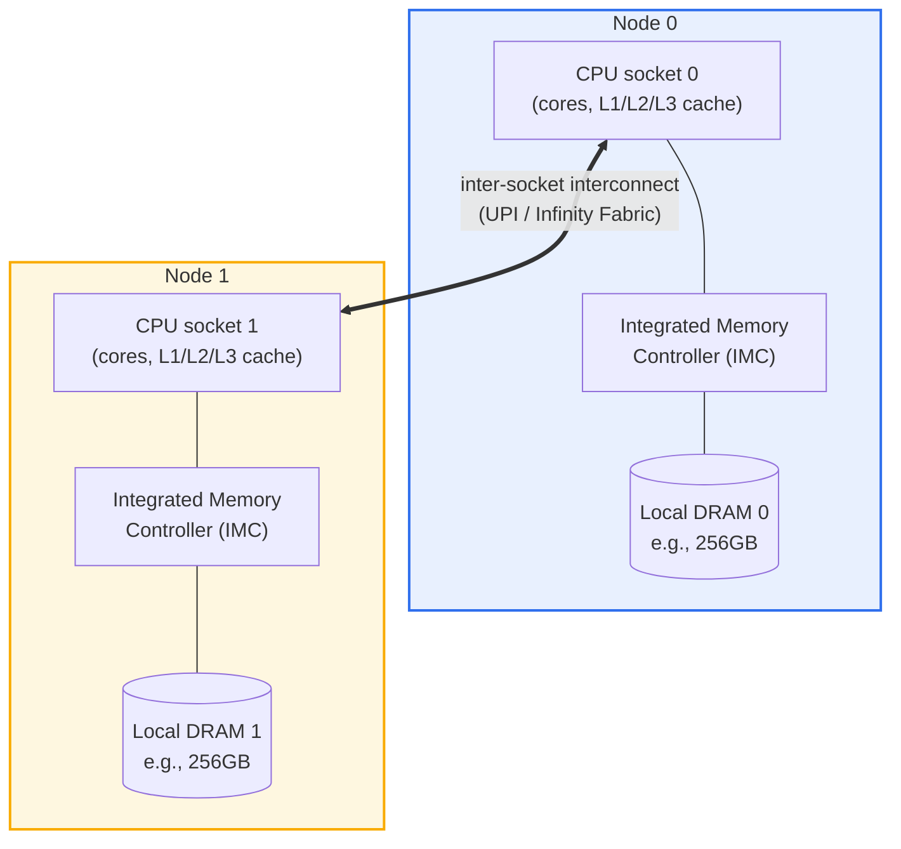

# Non-Uniform Memory Access (NUMA)

## 1. Overview

### A. Definition

> **NUMA (Non-Uniform Memory Access)** is a shared-memory multiprocessing architecture that groups multiple processors (sockets) and memory into several **nodes**, in which each processor accesses its physically nearby **local memory** quickly and the **remote memory** belonging to other nodes relatively slowly, via an **interconnect**.

The core idea of NUMA is to abandon the ideal that "all CPUs access all memory in the same time" and, in exchange, gain system **scalability**. In traditional **UMA (Uniform Memory Access)** or symmetric multiprocessing (SMP), all processors share a single common bus and a single memory pool, so the access latency is identical no matter which CPU reads which address. This makes the programming model simple, but as the number of processors grows, the shared bus becomes a bottleneck, and scaling efficiency drops sharply beyond 4–8 sockets.

NUMA solves this bottleneck by "distributing memory close to the CPUs." Attaching a dedicated memory controller and local DRAM to each socket means most accesses are handled locally, eliminating shared-bus contention. In exchange, however, reading another node's memory must cross one or two hops of an inter-socket link (e.g., Intel UPI, AMD Infinity Fabric), so latency rises and bandwidth falls. In other words, "memory access time varies with the physical location of the data" is the essence of the name itself, and software must recognize this asymmetry and optimize data/thread placement to fully extract performance.

One thing to note is that NUMA in today's commercial servers is mostly **ccNUMA (cache-coherent NUMA)**, in which hardware guarantees cache coherence. Programmers still see a single global address space, and remote memory is accessed transparently through a single pointer. NUMA is not a matter of correctness but of **performance**; misplacement only makes things slow, not wrong—which is the decisive difference from distributed memory (e.g., MPI).

### B. Background and Necessity

As the multicore/multi-socket era opened, processors' compute capability grew in proportion to the number of cores, but the memory subsystem could not keep pace. A single-bus SMP has all cores contending over one memory channel, so as cores grew to 16 or 32, memory bandwidth immediately became the ceiling, intensifying the so-called **Memory Wall** and bus contention. The large in-memory databases, virtualization consolidation, and HPC simulations demanded by data centers had to hold hundreds of GB to several TB of memory and dozens of cores in one node, which a single-bus structure could not accommodate.

NUMA emerged naturally from this need. By integrating the memory controller into the CPU die (IMC, Integrated Memory Controller) and giving each socket independent memory channels, the system's total memory bandwidth was made to scale **linearly** with the number of sockets. For example, a two-socket server where each socket has 8-channel DDR5 can provide over 300 GB/s per node, exceeding 600 GB/s when combined—a figure impossible with a single bus. Today, x86 servers (Intel Xeon, AMD EPYC) and large ARM servers are virtually all NUMA, and NUMA-aware tuning has become a fundamental skill of performance engineering in large cloud instances, relational and in-memory DBMSs, and virtualization hosts.

## 2. Overall Structure and Components

The overall structure of a NUMA system can be understood as taking "node = processor + local memory + memory controller" as the basic unit, with these nodes bound together by a high-speed interconnect. The structural diagram below shows the hardware layout of a typical two-node ccNUMA server.



A **node** is the basic boundary for judging locality in NUMA. One node usually consists of one CPU socket and the memory channels/DRAM directly attached to it, and the operating system manages CPU and memory resources by this node unit. If a core in node 0 reads node 0's DRAM, it is a local access; if it reads node 1's DRAM, it is a remote access. Recent large processors sometimes further expose multiple subnodes—by die or memory-controller group—within a single socket via **SNC (Sub-NUMA Clustering)** or chiplet-based configurations, so it is common to see more NUMA nodes than physical sockets.

The **interconnect** is the channel through which remote accesses and cache-coherence traffic flow between nodes. Intel connects sockets with UPI (Ultra Path Interconnect), having moved from the earlier QPI, and AMD with Infinity Fabric. The bandwidth and hop count of this link govern remote-access performance, and as nodes grow numerous (e.g., 4 or 8 sockets), the distances between nodes become non-uniform (some nodes directly connected, some routed through an intermediate node), requiring the concept of **NUMA distance**. Linux provides a matrix of relative distances between nodes (e.g., local 10, remote 21) via `numactl --hardware`.

The **memory controller (IMC)** is the core that physically establishes each node's locality. As the memory controller was integrated into the CPU die, an asymmetry was created in which a node's own DRAM is accessed directly over short wiring while another node's DRAM goes through the interconnect. The **cache-coherence protocol** (MESI/MESIF/MOESI families) ensures that copies of the same data scattered across the caches of multiple nodes do not contradict one another, maintaining for the programmer the illusion of a single shared memory.

The sequence diagram below shows how the path and latency diverge when a core accesses a particular virtual address, depending on whether the data is on the local node or a remote node. This branching—"a fast direct route if local, a detour through the interconnect if remote"—compresses everything about NUMA performance.

```mermaid
sequenceDiagram
  participant Core as "Node 0 core"
  participant L3 as "L3 cache (node 0)"
  participant MC0 as "IMC (node 0)"
  participant Link as "interconnect (UPI/IF)"
  participant MC1 as "IMC (node 1)"
  Core->>L3: address lookup (cache hit?)
  alt cache hit
    L3-->>Core: return data immediately (a few ns)
  else cache miss - local memory
    L3->>MC0: local DRAM request
    MC0-->>Core: return data (~90ns, local)
  else cache miss - remote memory
    L3->>Link: forward request to remote node
    Link->>MC1: node 1 DRAM request
    MC1-->>Link: deliver data
    Link-->>Core: return data (~150ns, remote)
  end
```

### A. Performance Asymmetry Between Local and Remote Access

The most practical perspective for understanding NUMA is the quantitative difference between local and remote. A local access reaches DRAM directly through the memory controller, whereas a remote access adds latency by traversing the path "request → inter-socket link → the other node's memory controller → DRAM → back through the link → the original node." On a measured basis, remote latency is generally about **1.5–2.2×** that of local, and remote bandwidth drops to about **50–70%** of local. For example, if a local access is 90 ns, a remote one can be 130–180 ns.

The impact of this difference on real applications is by no means small. In a large in-memory DB, when a thread repeatedly accesses the buffer pool of a remote node rather than its own, the latency increase of each individual access accumulates, and cases have been reported where throughput drops by 20–40%. Conversely, placing data and the thread that processes it on the same node has a dual effect: remote traffic disappears, which also reduces contention for interconnect bandwidth.

The point to note is that a remote access is "slow," not "wrong." In ccNUMA, remote data is read correctly; only performance degradation occurs. Therefore, NUMA optimization should be approached not as correctness verification but as a matter of improving locality through profiling.

### B. The OS's NUMA-Aware Policies (Scheduling and Memory Placement)

More than half of NUMA performance rests on the placement policies of the operating system and runtime. The Linux kernel manages physical memory in per-node zones and, when a process requests memory, applies the **first-touch policy** by default. This places a page not at the node "at the time allocation is requested" but at "the node of the thread that first actually writes (touches) that page," so if the thread that will perform the actual computation runs the initialization loop in parallel, data naturally scatters onto each thread's local node.

The scheduler is also NUMA-aware. The CPU scheduler tries to run a thread, as far as possible, on a core of the node where its memory resides (**CPU affinity / NUMA balancing**), and Linux's **AutoNUMA** collects page-access statistics during execution and migrates frequently remotely-accessed pages to the accessing thread's node—or migrates the thread toward the data—to correct locality after the fact. However, such automatic balancing incurs page-movement costs, so for latency-sensitive workloads it is more stable to pin things explicitly with `numactl --cpunodebind --membind`.

Memory-placement strategies offer several options. Representative are the **bind** policy that concentrates memory on a specific node, the **interleave** policy that distributes it round-robin across multiple nodes, and the **preferred** policy that uses local first but spills to remote when short. For instance, HPC streaming kernels, for which bandwidth is decisive, benefit from interleave to sum the memory bandwidth of all nodes, whereas latency-sensitive OLTP benefits from bind to maximize locality. That opposite policies become optimal depending on workload characteristics is both the charm and the difficulty of NUMA tuning.

### C. NUMA Alignment at the Application and Virtualization Layers

Even if the hardware and OS are prepared, the effect vanishes if the application ignores node boundaries. That is why DBMSs, JVMs, and virtualization hypervisors are designed to be NUMA-aware themselves. SQL Server aligns scheduler groups to nodes with **soft-NUMA**, and Oracle and PostgreSQL offer options to interleave large buffer caches across nodes or pin them to a specific node. The JVM, with the `-XX:+UseNUMA` flag, partitions the heap's young generation by node so that each GC thread deals only with its local region, reducing remote access.

In virtualization and container environments, **vNUMA (virtual NUMA)** alignment is important. Exposing the physical host's NUMA topology as-is to the guest VM lets the guest OS perform NUMA optimization again from its own perspective, securing locality doubly. Conversely, if a VM's virtual CPUs and memory are placed across multiple physical nodes (NUMA span), no optimization inside the guest can avoid physical remote access. VMware and KVM perform scheduling to pack a VM's vCPUs and memory within one physical node as far as possible, and Kubernetes likewise aligns CPU, memory, and devices (NIC/GPU) on the same node with the **Topology Manager** to guarantee the performance of latency-sensitive pods.

### D. Cache-Coherence Traffic and False Sharing

Often overlooked in NUMA but greatly influencing performance is the cost of maintaining cache coherence. Because ccNUMA can have copies of the same data in the caches of multiple nodes, when one node modifies that data, coherency traffic flows over the interconnect to invalidate other nodes' copies or hand over the latest version. This traffic can arise independent of remote data access, even in code that appears to touch only local data.

A representative pitfall is **false sharing**. Threads on different nodes logically deal with separate variables, but if those variables happen to lie within the same cache line (usually 64 bytes), one thread's write invalidates the entire line cached by another node, causing unnecessary coherency round-trips to explode. For example, if a per-thread counter array is placed contiguously, even though each thread increments only its own counter, inter-node cache-line ping-ponging can degrade performance several-fold. The remedy is to pad each counter to the cache-line size (cache line padding) so they lie on different lines—a classic technique in NUMA/multicore performance tuning.

Therefore, NUMA optimization includes not only "keeping data local" but also "minimizing writes that are shared and contended across nodes." Identifying which cache lines cross nodes and contend using tools such as `perf c2c` (cache-to-cache), and reducing coherency traffic by sharding or padding data structures per node, is a core practical task.

## 3. Comparison of UMA, NUMA, and Distributed Memory

The difference among the three structures is not simple superiority but a matter of how "programming convenience" and "scalability" are traded off. UMA (SMP) has identical access latency for all accesses, making programming simplest but scalability low; distributed memory (e.g., MPI clusters) scales nearly infinitely but requires explicit message passing between nodes, imposing a heavy development burden. NUMA sits in between, at a point that compromises "the convenience of a single address space" and "socket-level scalability."

| Category | UMA (SMP) | NUMA (ccNUMA) | Distributed memory (MPP) |
|------|----------|--------------|------------------|
| Memory model | Single shared pool | Single address space, physically distributed | Independent memory per node |
| Access latency | Uniform | Local ≠ remote (asymmetric) | Remote is explicit communication |
| Cache coherence | HW-guaranteed | HW-guaranteed (ccNUMA) | None (managed by SW) |
| Scalability | Low (~8 sockets) | Medium (tens of sockets) | Very high (thousands of nodes) |
| Programming difficulty | Low | Medium (placement tuning) | High (MPI, etc.) |
| Representative case | Small multicore | Xeon/EPYC servers | HPC supercomputers |

As the table shows, the point where NUMA decisively differs from UMA is "the asymmetry of access latency," and the point where it differs from distributed memory is "maintaining cache coherence and a single address space." Thanks to these two boundaries, NUMA can run software written for existing SMP without modification (preserving correctness) while extending to large systems when performance tuning is layered on—making it a practical compromise. In practice, if the symptom "the code runs fine but is slow" appears, much of the time it is code written under UMA assumptions abusing remote access on NUMA hardware.

As a concrete example, when an in-memory cache server was run on a 2-socket, 40-core machine with no tuning at all, 40 threads sharing the heap across node boundaries kept throughput at around 60% of target; but when the threads were sharded 20 per node to use only local heaps and pinned with `numactl`, throughput improved by about 1.5×. That this was the result of changing only placement, without altering a single line of code logic, illustrates well the nature of NUMA optimization.

## 4. Deep Dive: CXL and Memory-Hierarchy Expansion, and Recent Trends

The concept of NUMA has recently entered a new phase with the rise of **CXL (Compute Express Link)**. CXL is an open interconnect standard that expands, shares, and pools memory while maintaining cache coherence over the PCIe physical layer, and external memory attached via CXL appears to the CPU as "yet another NUMA node with no cores (a memory-only, CPU-less node)." That is, a tier one step farther than remote access is created, and the OS manages it within the existing NUMA framework. Linux's **tiered memory** and page promotion/demotion mechanisms implement automatic placement—hot data in fast local DRAM, cold data in slow CXL memory—as page migration between NUMA nodes.

This trend expands NUMA from "inter-socket asymmetry" to "asymmetry across the entire memory hierarchy." Whereas the past had two tiers of local vs. remote, software must now recognize and exploit a multi-tier latency hierarchy running from local DRAM (~90 ns) → remote DRAM (~150 ns) → CXL memory (~250–400 ns). Also, **memory pooling**, in which multiple servers share a single memory pool through a CXL switch, is drawing attention as a means to alleviate the data-center problem of memory stranding (memory allocated but unused), so the value of NUMA-optimization techniques is, if anything, growing.

From an AI/data-center perspective as well, NUMA remains decisive. In a training server with multiple GPUs, each GPU is attached to the PCIe/memory of a specific NUMA node, so placing the data-loader threads and pinned-memory buffers on the same node as that GPU reduces both PCIe/NVLink transfer latency and remote DRAM access together. Kubernetes Topology Manager and NVIDIA's GPU-topology-aware placement both automate this principle. However, the detailed performance figures and standard specifics of CXL/tiered memory vary greatly by generation and implementation, so in actual design it is advisable to confirm with vendor documentation and measurement.

## 5. Considerations and Implications

From an information management professional engineer's perspective, NUMA should be understood not as a mere hardware detail but as "a design principle that aligns locality across all system layers," and it carries the following strategic implications.

- **Application strategy — bifurcating policy by workload characteristics**: Latency-sensitive workloads (OLTP, in-memory cache) should maximize locality with bind/affinity, and bandwidth-intensive workloads (HPC streaming, large-scale analytics) should sum total node bandwidth with interleave. Since there is no single right answer, before adoption you must first diagnose the remote-access ratio and bottleneck type through profiling (`numastat`, `perf c2c`, LIKWID, etc.).

- **Trade-off — automatic balancing vs. explicit pinning**: AutoNUMA / NUMA balancing improves locality without development burden but incurs the overhead of page migration and statistics collection. In real-time or financial systems sensitive to latency jitter, turning off automation and choosing manual pinning increases predictability. The balance between convenience and determinism must be judged per workload.

- **Importance of virtualization/cloud alignment**: No matter how well physical NUMA is tuned, if the vNUMA/container topology diverges from physical boundaries, the effect is canceled. Matching VM size to physical nodes (avoiding NUMA span) and aligning CPU, memory, NIC, and GPU on the same node with the Kubernetes Topology Manager are prerequisites for guaranteeing large-instance performance. When selecting large cloud instances, review whether the vCPU-to-memory ratio aligns with node boundaries.

- **Outlook and related technologies — expansion into CXL/tiered memory**: As CXL memory expansion and pooling become widespread, NUMA evolves beyond inter-socket asymmetry into multi-tier memory-hierarchy management spanning DRAM–CXL. Automatic hot/cold-page placement of tiered memory and alleviating resource stranding through memory pooling will be key means of reducing data-center TCO, so NUMA-aware design competence is expected to remain a foundational technology for performance and cost optimization.

- **Governance and operations perspective**: NUMA optimization is not a one-off tuning but must be embedded into the deployment pipeline to persist. To catch performance regressions early, continuously monitor the remote-access ratio as an observability metric, and establish an operational process that reflects topology changes at hardware-generation transitions (SNC, chiplets, increased node counts) in placement policies.

## References

- Linux Kernel Documentation, "What is NUMA?" — https://www.kernel.org/doc/html/latest/mm/numa.html
- Linux `numactl`/`numastat` man pages — https://man7.org/linux/man-pages/man8/numactl.8.html
- Christoph Lameter, "NUMA (Non-Uniform Memory Access): An Overview", ACM Queue — https://queue.acm.org/detail.cfm?id=2513149
- Compute Express Link (CXL) Specification — https://computeexpresslink.org/
- Kubernetes Topology Manager — https://kubernetes.io/docs/tasks/administer-cluster/topology-manager/

---

> **In one line**: NUMA is a ccNUMA architecture that gains scalability by attaching local memory to each processor at the cost of differing local/remote access latency; locality alignment across all layers—OS, application, and virtualization—such as first-touch, affinity, and interleave, governs performance, and the concept is expanding into CXL/tiered memory.
