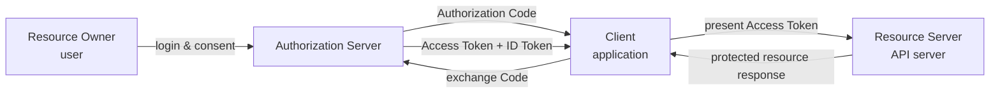
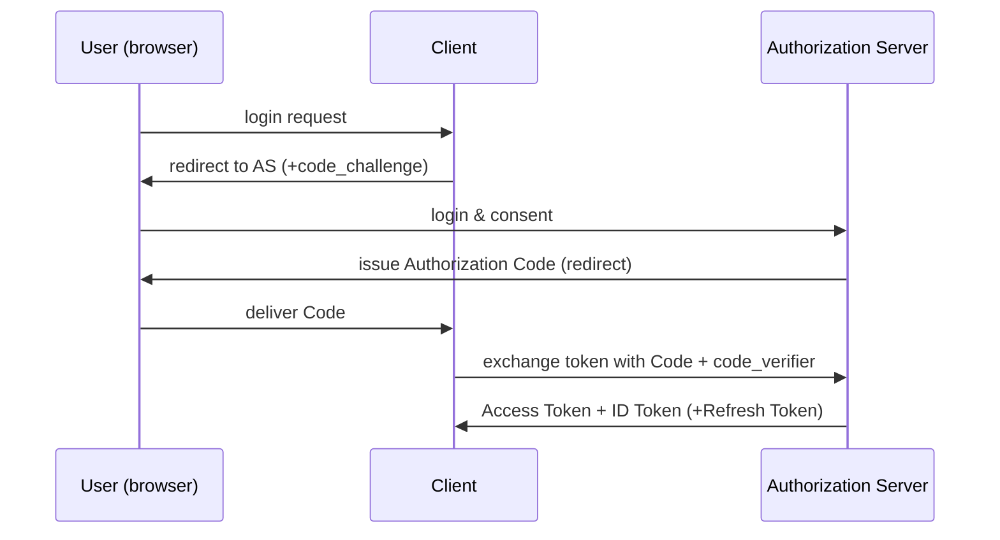

# OAuth 2.0 and OpenID Connect (OIDC)

## 1. Overview

### A. Definition
> **OAuth 2.0** is an authorization framework (RFC 6749) for **delegating limited-scope access permissions** without exposing the resource owner's (user's) password to a third-party application. **OpenID Connect (OIDC)** is an **authentication protocol** that layers a standardized identity-proof layer called the **ID token** on top of OAuth 2.0 to verify "who this user is."

The two standards are often lumped together, but they solve different problems. OAuth 2.0 was designed to answer the **authorization** question of "what can this application do on behalf of the user," and was not originally meant to prove user identity. In fact, early web services used a workaround (pseudo-authentication) of judging login success solely by whether an OAuth access token was issued, and suffered token-reuse and audience-confusion vulnerabilities. To fundamentally solve these problems, the OpenID Foundation standardized OIDC in 2014, clearly separating **who logged in (authentication)** from **what can be accessed (authorization)** and standardizing the former as an ID token in JWT format whose forgery/tampering is verifiable ([Duende Software](https://duendesoftware.com/learn/the-differences-between-oauth-2-0-and-openid-connect-and-why-they-matter)).

### B. Background and Necessity
In the past, integration between web services commonly worked by having the user directly enter their own ID and password into the counterpart service (password sharing, the password anti-pattern). This approach scattered passwords across many services, increasing leakage risk, and made it impossible for the user to delegate only a specific permission or revoke it later. OAuth solves this by having the user log in at a trusted authorization server (e.g., Google, Kakao) and then issuing to the client app only a **scope-limited, revocable token**. With OIDC added on top, **SSO (Single Sign-On)**—logging in to multiple services with one account—and standardized identity federation in microservice, mobile-app, and SPA (Single Page Application) environments became possible. Today, most social logins ("Log in with Google," "Log in with Kakao") and enterprise SSO (Okta, Azure AD, Keycloak, etc.) are implemented with a combination of these two standards.

## 2. Overall Structure and Participating Parties

The OAuth/OIDC ecosystem consists broadly of four parties, and you must accurately understand each party's role and trust boundary to design and audit the authorization flow.

- **Resource Owner**: The user, who is the actual owner of protected resources (photos, profile, email, etc.). This is the party who logs in on the authorization server's screen and consents to "whether to allow this app to access my email," and the clarity of this consent UI becomes the practical line of defense for the entire trust model.
- **Client**: The application that wants to access resources. Depending on whether it can securely store the client secret, it is divided into a **confidential client (server-side app)** and a **public client (mobile/SPA)**, and this distinction becomes the key criterion for the grant-type selection discussed later.
- **Authorization Server**: The center of trust that authenticates the user, obtains consent, and issues tokens. When it supports OIDC, it is also called the **OpenID Provider (OP)**, and it provides a **Discovery** feature that publishes its endpoints and supported algorithms in a standardized way at the `/.well-known/openid-configuration` path.
- **Resource Server**: The server holding the actual protected API/data, which responds only after verifying the validity and scope of the access token presented by the client.

### Token Types and Lifetime Design (Reference)

The tokens handled in the OAuth/OIDC ecosystem differ in nature, and confusing them shakes the entire security design. An **access token** is the "admission ticket" presented to the resource server; its format is not standardized, so it may be an opaque random string or a JWT. An **ID token** must be a JWT and is an identity certificate designed for the client to interpret and verify directly. A **refresh token** is never presented to the resource server; it is a re-issuance token used only to request a new access token from the authorization server.

| Token | Presented to | Format | Typical lifetime |
|---|---|---|---|
| Access Token | Resource server (API) | Opaque string or JWT | 5 minutes–1 hour |
| ID Token | Client (the app itself) | JWT (required) | One-time verification (not reused) |
| Refresh Token | Authorization server | Opaque string recommended | Days–months (with rotation) |

For example, if a commerce platform sets the access-token lifetime to 30 minutes and the refresh-token lifetime to 14 days, the user only needs to re-log in once every two weeks, yet even if the access token is stolen, the attacker's window of abuse is limited to at most 30 minutes. Designing the lifetimes of the two tokens separately in this way is itself a core argument in a professional-engineer answer dealing with "the balance between usability and security."

## 3. OAuth 2.0 Authorization Grant Types

An authorization grant is a scenario-specific specification for "by what method the client obtains tokens," and the choice diverges based on the client's trust level and whether user involvement is required.

### A. Authorization Code Grant (+ PKCE)
The most secure and standard flow, used not only by web server applications but also by mobile/SPA when PKCE (Proof Key for Code Exchange, RFC 7636) is added.

The key to this flow is that **even if the authorization code is exposed through the browser, the actual token exchange occurs via back-channel communication between the client and the authorization server**. Because the code itself is short-lived (tens of seconds to a few minutes) and one-time, its abuse value is low even if stolen. However, a public client cannot securely store the client secret, so to prevent authorization-code interception attacks it adds **PKCE**. PKCE has the client generate a random `code_verifier` and include its hash, `code_challenge`, in the authorization request, so that a token is issued only if the original `code_verifier` is also presented at the actual token-exchange moment. This way, even if an attacker intercepts the redirect URI and steals the code, they cannot exchange it for a token because they do not know the verifier.

### B. Client Credentials Grant
Used for **server-to-server (machine-to-machine)** communication without user involvement. The client requests a token directly from the authorization server using only its own client ID and secret, obtaining access permissions with the application's own identity rather than a user delegation. It is common in batch jobs, API calls between backend microservices, and administrative scripts, and must be used only in confidential clients (servers that can securely store the secret).

### C. Refresh Token Grant
Access tokens have short expiration times (a few minutes to tens of minutes) to reduce the damage from theft. Requiring the user to re-log in each time greatly degrades usability, so a new access token is re-issued without user involvement using the **refresh token** issued together at the initial authorization. Because a refresh token has a longer lifetime than an access token (days to months) and causes greater damage if stolen, the latest security practice is to store it only in secure server-side storage and **replace it with a new refresh token after a single use (rotation)**.

### D. (Discouraged) Implicit Grant and Resource Owner Password Credentials
Early OAuth 2.0 defined the **Implicit Grant**, which returned a token immediately in the URL fragment for SPAs, and **ROPC (Resource Owner Password Credentials)**, in which the client directly received the user's ID and password and passed them to the authorization server. However, the Implicit Grant exposed the token in browser history and referrers and lacked back-channel verification, making it vulnerable to theft, and ROPC had the client directly handle the user's password, reproducing the very "password sharing" problem that OAuth originally sought to eliminate. For these reasons both methods have been effectively deprecated in the latest standards, and **OAuth 2.1**, discussed later, removed both from the specification entirely.

### E. Grant-Type Comparison Summary

The four grants covered above (plus the two deprecated ones) become clear in selection criteria when organized along two axes: "who is involved" and "whether the client can securely store a secret."

| Grant | User involvement | Suitable client | Currently recommended? |
|---|---|---|---|
| Authorization Code (+PKCE) | Required | Both public and confidential clients | Recommended (default) |
| Client Credentials | Not required | Confidential client (M2M) | Recommended |
| Refresh Token | Not required (only once initially) | Both public and confidential clients | Recommended (rotation required) |
| Implicit | Required | Public client | Deprecated (removed in OAuth 2.1) |
| ROPC | Required (direct password entry) | Legacy migration | Deprecation advised |

## 4. OpenID Connect: An Authentication Layer on Top of OAuth

OIDC works by reusing OAuth 2.0's authorization-code flow as-is, including `scope=openid` in the request and adding an **ID token** to the response. In other words, it is not a separate new protocol but a **standard extension (profile)** of OAuth 2.0.

### A. Structure of the ID Token
The ID token is a signed **JWT (JSON Web Token)** carrying standard claims such as `iss` (issuer), `sub` (unique user identifier), `aud` (the client for which the token is intended), `exp` (expiration time), `iat` (issued-at time), and `nonce` (a random number to prevent replay attacks), along with user-attribute claims like `name` and `email`. The client verifies the token's signature with the authorization server's public key, cryptographically confirming that the token is not forged and was issued for itself (`aud`). This signature-verifiability is the fundamental reason it is "safe to judge login status from the ID token," whereas a plain access token (an opaque string or interpretable only by the resource server) cannot support such a safe judgment.

### B. UserInfo Endpoint and Discovery
When the information carried in the ID token is minimal, the client can query additional user attributes at the standardized `/userinfo` endpoint using the access token. Also, an OIDC-supporting server publishes, via the `/.well-known/openid-configuration` document, the addresses of its authorization/token/UserInfo endpoints, supported signature algorithms, and the list of supported scopes as standard JSON, so client libraries can automatically obtain integration information without server-specific configuration.

| Item | OAuth 2.0 | OpenID Connect |
|---|---|---|
| Purpose | Authorization (delegating resource access) | Authentication (identity verification) + authorization |
| Core token | Access Token, Refresh Token | ID Token (JWT) + OAuth tokens |
| User info | Standard undefined | ID-token claims + `/userinfo` |
| Scope | Service-defined freely (`read`, `write`) | Standard scopes (`openid`, `profile`, `email`) |
| Discovery | Undefined | `/.well-known/openid-configuration` |
| Standalone use | Possible (M2M API access) | Not possible (requires OAuth 2.0 base) |

([Duende Software](https://duendesoftware.com/learn/the-differences-between-oauth-2-0-and-openid-connect-and-why-they-matter); [SuperTokens](https://supertokens.com/blog/openid-connect-vs-oauth2))

### C. The Three Flows of OIDC

OIDC inherits OAuth's grants as-is and subdivides them into three flows. The **Authorization Code Flow** is suitable for server-side apps and receives both the ID token and the access token securely over the back channel. The **Implicit Flow** used to return tokens immediately over the front channel for SPAs but is a deprecation target because of the security weaknesses described earlier. The **Hybrid Flow** is a compromise that receives the ID token first over the front channel at the authorization-response stage to immediately display the user's name on screen, while receiving the access token securely via a subsequent back-channel exchange; it is often used in enterprise SSO scenarios that need to reduce screen-transition delay after redirect.

## 5. Comparison and Application Cases

The most familiar case is social login. For example, if a commerce app provides a "Log in with Google" button, after the user authenticates and consents at Google's authorization server, the app receives from Google an ID token (who the user is) and, if needed, an access token (permission to access add-on APIs such as Google Calendar/Drive). Here the app never sees the Google password, and the user can revoke only that app's access individually at any time in their Google account settings. In enterprise environments, the standard pattern is to federate an **IdP (Identity Provider)** such as Okta, Azure AD, or Keycloak via OIDC to implement SSO login to dozens of internal systems with one account, and a clear practical advantage over per-system account management is that a single HR-system offboarding action can simultaneously cut off access to all federated systems. Conversely, for server-to-server batch integration (e.g., an internal payment service calling a settlement service's API every hour), there is no user involvement, so pure OAuth's Client Credentials Grant—not OIDC—is appropriate, and forcibly dragging in a user-identity concept only complicates the design.

## 6. Related Exam Topics and Linkages

This topic frequently appears in the Information Management Professional Engineer exam both as a standalone question and as a sub-argument of other topics. It connects to topics such as "Identification and Authentication," "JWT," "Access Control," and "Zero Trust security model" as the concrete implementation standard for authentication and authorization; and in topics such as "MyData transmission security" and "financial cloud SLA," FAPI is cited as the technical basis for actual regulatory requirements. When composing an answer, developing it along the flow "OAuth/OIDC concepts → grant-selection criteria → latest security hardening (OAuth 2.1, FAPI) → application to zero trust / microservice architecture" naturally incorporates the architecture and governance perspectives that a professional-engineer answer requires, beyond a mere protocol explanation.

## 7. Deep Dive — Recent Trends and Security-Hardening Standards

The OAuth ecosystem has been rapidly evolving since the 2020s toward "making the defaults themselves safer."

- **OAuth 2.1**: An effort to consolidate the various scattered security recommendations (RFCs) since RFC 6749 into a single specification, which **makes PKCE mandatory for all clients (both public and confidential)** and **completely removes from the specification the Implicit Grant and ROPC** that were repeatedly flagged for vulnerabilities. It also mandates exact-match of redirect URIs and requires refresh-token rotation ([OAuth.net](https://oauth.net/2.1/); [WorkOS](https://workos.com/blog/oauth-2-1-vs-oauth-2-0)).
- **FAPI (Financial-grade API)**: A profile the OpenID Foundation layered on top of OAuth/OIDC with additional constraints for high-risk APIs such as those in finance. It requires **mTLS or signed JWT (private_key_jwt)** for client authentication instead of a secret, and binds the access token to the client certificate (sender-constrained token) to prevent reuse even if the token is stolen ([OpenID Foundation FAPI](https://openid.net/specs/openid-financial-api-part-2-1_0.html)). Korea's Open Banking and MyData API security requirements also adopt a similar philosophy (strong client authentication, token binding).
- **DPoP (Demonstrating Proof of Possession)**: An extension that, so an attacker cannot reuse a stolen access token as-is, has the client present with each request a proof value signed with a private key known only to itself; it is drawing attention as an alternative for implementing token binding in environments where mTLS is difficult (SPA, mobile).

## 8. Considerations and Implications (Professional Engineer's Perspective)

- **Architectural design principle**: In microservice/API-gateway environments, centralizing authentication (identity verification) with OIDC and separating inter-service authorization into fine-grained, scope/claim-based policies is a design that secures both maintainability and security. Implementing authentication logic per service inevitably produces vulnerabilities from implementation variance.
- **Trade-off**: Hardening measures such as PKCE, mTLS, and token binding raise security but increase client implementation complexity and infrastructure (certificate management) burden. Applying finance-grade (FAPI) controls uniformly even to areas with relatively low threat models, such as internal M2M communication, becomes over-engineering, so control levels must be tiered according to the sensitivity of the resource.
- **Linkage with Zero Trust**: OAuth/OIDC's principle of "verifying a valid token and scope on every request" precisely aligns with the core premises of the Zero Trust security model (removal of implicit trust, continuous verification). In particular, short access-token lifetimes and fine-grained scopes are practical implementations of the least-privilege principle that minimizes the blast radius when an incident occurs.
- **Outlook — authorization in the AI-agent era**: Recently, as cases of LLM agents autonomously calling multiple APIs on behalf of users increase, delegated-authorization models expressing "to what scope and for how long an agent may act on behalf" (e.g., dynamic client registration, fine-grained Rich Authorization Requests, short-lived per-agent tokens) are emerging as a new extension point of the OAuth ecosystem. From an Information Management Professional Engineer exam perspective, how the existing three-party delegation (user-client-server) model safely accommodates a fourth actor—"an agent, not a person"—will become important in both future exams and practice.
- **Audit/logging perspective**: The history of token issuance/renewal/revocation at the authorization server, whether the consent screen was shown, and the record of scope changes are essential evidence for both privacy-policy compliance and incident response (forensics). Because information-systems audits and ISMS-P assessments also treat "whether it is traceable who delegated what scope and when" as a core checkpoint of the authentication/authorization system, a token-event logging system should be prepared together at the early design stage.
- **Availability / fault isolation**: Because the authorization server effectively becomes the single point of trust for company-wide systems (a structure close to a SPOF), an authorization-server failure leads directly to a company-wide login outage. Availability design—multi-region configuration, maintaining offline token verification with cached public keys—must be considered separately.

## References
- [OAuth 2.1 — oauth.net](https://oauth.net/2.1/)
- [OAuth 2.0 vs OAuth 2.1: What changed, why it matters — WorkOS](https://workos.com/blog/oauth-2-1-vs-oauth-2-0)
- [The differences between OAuth 2.0 and OpenID Connect — Duende Software](https://duendesoftware.com/learn/the-differences-between-oauth-2-0-and-openid-connect-and-why-they-matter)
- [OpenID Connect vs OAuth2 — SuperTokens](https://supertokens.com/blog/openid-connect-vs-oauth2)
- [Financial-grade API Security Profile 1.0 - Part 2: Advanced — OpenID Foundation](https://openid.net/specs/openid-financial-api-part-2-1_0.html)
- [OAuth 2.1: Key Updates and Differences from OAuth 2.0 — FusionAuth](https://fusionauth.io/articles/oauth/differences-between-oauth-2-oauth-2-1)
- [OAuth vs OpenID Connect — GeeksforGeeks](https://www.geeksforgeeks.org/websites-apps/oauth-vs-openid-connect/)

Given this multifaceted evidence, when actually writing a professional-engineer answer you should not stop at the simple statement "OAuth and OIDC are different," but present together the structural and security-hardening trends described above, to properly demonstrate the practitioner and assessor perspectives.

---

> **In one line**: OAuth 2.0 is an authorization framework for delegating scope-limited access permissions without exposing the user's password, and OpenID Connect is an authentication layer on top of it that proves "who logged in" with a signed ID token; the latest hardening standards such as PKCE, FAPI, and OAuth 2.1 continue to evolve in response to token-theft and reuse threats.
