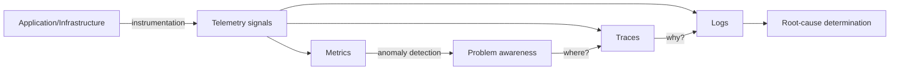
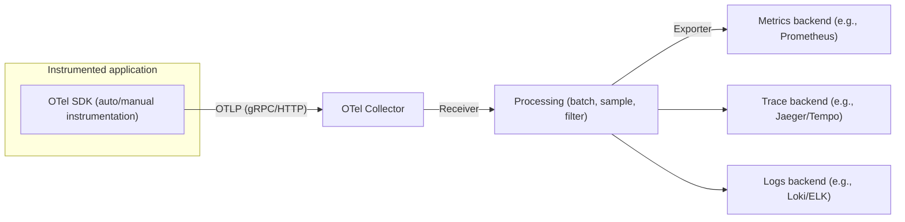

# Observability and OpenTelemetry

## 1. Overview

> **Definition**: Observability is the ability to infer a system's internal state solely from the telemetry (metrics, logs, traces) it emits externally, and to determine the cause even for questions that were not defined in advance.

Traditional monitoring focused on checking "has a failure occurred" via predefined thresholds and dashboards.
However, as microservices, containers, and serverless have spread, a single user request passes through dozens of services, and instances are created and destroyed in a matter of minutes.
In such environments, it is impossible to predict "what will break" in advance and instrument all metrics accordingly, and failures manifest not as "complete outages" but as "slowdowns only on specific users or specific paths."
Observability is distinguished from traditional monitoring in that it aims to let you dig into such **unknown-unknowns** exploratorily after the fact.

Monitoring and observability are not opposing concepts but closer to a containment relationship.
Monitoring is the activity of collecting and alerting on metrics for known failure modes, whereas observability is a **property** of designing a system to emit sufficiently rich telemetry, including those metrics.
That is, "to monitor" is an action and "to be observable" is a quality a system must possess.
Therefore, observability is not a matter of introducing one more operational tool, but a quality attribute that must be secured at the design stage by making code leave meaningful signals.

In an exam answer, do not stop at listing the "three pillars (metrics, logs, traces)"; connect **why the three signals are complementary and how value arises when they are correlated**, and the role of OpenTelemetry in standardizing this without vendor lock-in, to arrive at a design-oriented answer.

### 1.1 Background and Necessity

First, because of the complexity of distributed systems.
In a monolith, you only needed to look at one process's logs, but once decomposed into 100 services, you cannot tell from a single log which segment caused a request's latency.
To trace causal relationships between services, distributed tracing that connects a request end-to-end becomes essential.

Second, because of infrastructure ephemerality.
Kubernetes pods or serverless functions have already vanished by the time you try to connect and investigate after a problem occurs.
Therefore, you must shift to emitting sufficient signals outward while running, instead of after-the-fact connect-and-debug.

Third, from a cost and user-experience perspective.
The mean time to recovery (MTTR) of a failure is mostly spent on "determining the cause (diagnosis after detection)," and if observability is low, this segment lengthens, increasing losses of revenue and trust.
Since observability is directly linked to shortening MTTR, it becomes a precondition for SRE reliability management.

### 1.2 Core Goals and Non-Goals

The core goals are exploratory diagnosis of unknown problems, securing correlation among signals, vendor-neutral instrumentation standardization, and shortening diagnosis time.
Conversely, collecting all data without limit and retaining it forever is not a goal.
Because telemetry itself incurs storage, transmission, and query costs, designing cardinality and sampling to manage the signal-to-noise ratio is in fact a core competency.

## 2. The Three Signals of Observability (Three Pillars)

Observability is often explained by the three signals of metrics, logs, and traces.
However, viewing the three signals separately with different tools creates "silos" and halves their value.
True observability is achieved when you can **move seamlessly** in a single problem situation from metrics (what and how much) → traces (where) → logs (why).

### 2.1 Metrics

Metrics are numbers aggregated over time (request volume, error rate, latency, resource utilization, etc.).
Because they discard individual events and compress them into statistics, storage cost is low and they suit long-term trends and alerting.
For example, "5xx error rate > 1% over 5 minutes" is a form well suited to monitoring with metrics, and methodologies such as RED (Rate, Errors, Duration) or USE (Utilization, Saturation, Errors) systematize which metrics to look at.
However, because metrics lose the context of individual requests during aggregation, they tell you "what went wrong" but do not answer "why."
In particular, as label combinations grow, cardinality explodes and storage/query costs surge, so be careful not to use dimensions with unbounded values, such as user ID, as metric labels.

### 2.2 Logs

Logs are records of individual events that occurred at a specific point in time.
They can carry the richest context and become the final clue for root-cause analysis, but their large volume makes storage and search costly.
Using **structured logs (JSON, etc.)** rather than unstructured text logs enables field-based search and aggregation, greatly improving observability.
The key is to record a trace ID alongside logs to interconnect traces and logs; without this, logs again become silos.

### 2.3 Traces

A trace links the causal and temporal relationships of the units of work (spans) that a single request created as it passed through multiple services.
Each span has a service name, start/end times, status, and parent span, and they form a tree that shows the request's entire journey.
Distributed tracing propagates context across service boundaries (context propagation) via the W3C Trace Context standard's `traceparent` header.
Thanks to this, you can precisely pinpoint **per-segment bottlenecks** such as "the increased p99 latency of the payment API is actually due to a DB lock in the downstream coupon service."

| Signal | Question | Strength | Weakness | Cost |
|------|------|------|------|------|
| Metrics | What, how much | Low cost, long-term trends, alerting | Loss of individual context | Low |
| Logs | Why (detailed context) | Highest detail | High volume, noise | High |
| Traces | Where (segment) | End-to-end causality | Needs instrumentation & propagation | Medium |

## 3. The OpenTelemetry (OTel) Standard and Pipeline

In the past, instrumentation libraries differed per signal and per vendor, so switching observability tools meant re-instrumenting the application code—significant vendor lock-in.
**OpenTelemetry (OTel)**, a project under the CNCF, solves this by standardizing a **single instrumentation API/SDK and transport specification (OTLP)** spanning metrics, logs, and traces.
Developers instrument once with the OTel API, and change where data is sent via configuration (Exporter).
That is, it separates "instrumentation (code)" from "backend (tool)" to secure vendor neutrality.

The **OTel Collector** is the central component of this structure: it receives telemetry from multiple sources (Receiver), processes it (Processor) via batching, sampling, sensitive-info masking, relabeling, etc., and then exports it to multiple backends (Exporter).
Since the application only needs to send to the Collector in one place, backend replacement or multi-destination sending is possible without code changes.
Also, centralizing sampling in the Collector enables **tail-based sampling**—which decides by looking at the whole trace—implementing a policy of "always retain requests that errored."
Instrumentation combines auto-instrumentation (an agent automatically captures HTTP/DB calls) and manual instrumentation (adding custom spans/attributes carrying business meaning), and the latter governs the quality of your answer.

## 4. Comparison and Cases at Adoption — Why Design It This Way

The core conflict in observability design is the trade-off between **completeness and cost**.
Retaining 100% of every request's trace would be ideal, but under large-scale traffic the storage/transmission cost is unbearable.
So you choose a sampling strategy.
Head-based sampling decides adoption probabilistically at the request's start, so overhead is low, but it can miss "rarely occurring error requests."
Tail-based sampling decides after the request completes by looking at the outcome (error, high latency), so it selectively retains traces of high diagnostic value, but it requires buffering until completion and uses more Collector resources.
Therefore, combining the two—such as "1% sampling for normal traffic, 100% retention for errored/slow requests"—is the standard practice.

As a concrete example of the effect, suppose a service experiences sporadic user complaints about payment delays.
On the metrics dashboard, overall p50 latency is normal, so the cause is invisible; but opening the traces that retained errored/high-latency requests at 100% reveals that an external PG (payment gateway) response took over 3 seconds in a sub-span of a specific payment-method path.
Moving to the trace ID of the structured log linked to that span, you can confirm the cause is timeout-retries for a specific card issuer.
Only when this correlation exists—stitching the three signals together by trace ID—can you diagnose the "average is fine but only some are slow" problem, and this is the point where observability diverges from mere monitoring.

## 5. Considerations and Implications (Professional Engineer's Perspective)

First, **observability is a design quality, not an after-the-fact tool adoption.**
You must decide development standards (logging conventions, trace propagation, correlation IDs) at the architecture stage so that code leaves meaningful spans, attributes, and structured logs; offloading securing observability to the operations team leads to failure.

Second, **cost/cardinality governance decides success or failure.**
Indiscriminate labels and full retention can make the observability platform cost more than the service infrastructure itself.
You must manage as policy the differentiation of retention periods per signal (metrics long-term, logs/traces short-term), sampling, and cardinality caps.

Third, **adopting standards mitigates vendor lock-in.**
Instrumenting with open standards such as OpenTelemetry, OTLP, and W3C Trace Context lets you replace or run backends (open-source/commercial/cloud) in parallel without code changes, securing long-term bargaining power and portability.

Fourth, **manage conflicts with security and privacy.**
Telemetry easily mixes in sensitive information such as user identifiers and tokens, so place masking/filtering and access control at the Collector stage to prevent observability data from becoming a new leakage path.

Fifth, **the outlook of linkage to SRE/AIOps.**
Observability data becomes the input for SLI/SLO and error-budget calculation, and further becomes the training data for AIOps that automates anomaly detection and root-cause inference.
Therefore, observability positions itself as foundational infrastructure for incident response in the short term and for autonomous operation (self-healing) in the long term.

## References
- OpenTelemetry official documentation: https://opentelemetry.io/docs/
- W3C Trace Context standard: https://www.w3.org/TR/trace-context/
- CNCF OpenTelemetry project: https://www.cncf.io/projects/opentelemetry/

---
> **In one line**: Observability is a system property that interconnects metrics, logs, and traces by trace ID to determine even unknown failures through after-the-fact exploration; it is secured cost-effectively and without vendor lock-in through OpenTelemetry standard instrumentation and sampling/cardinality governance.
