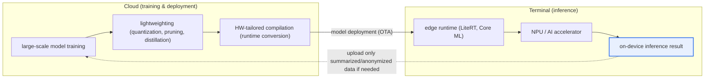
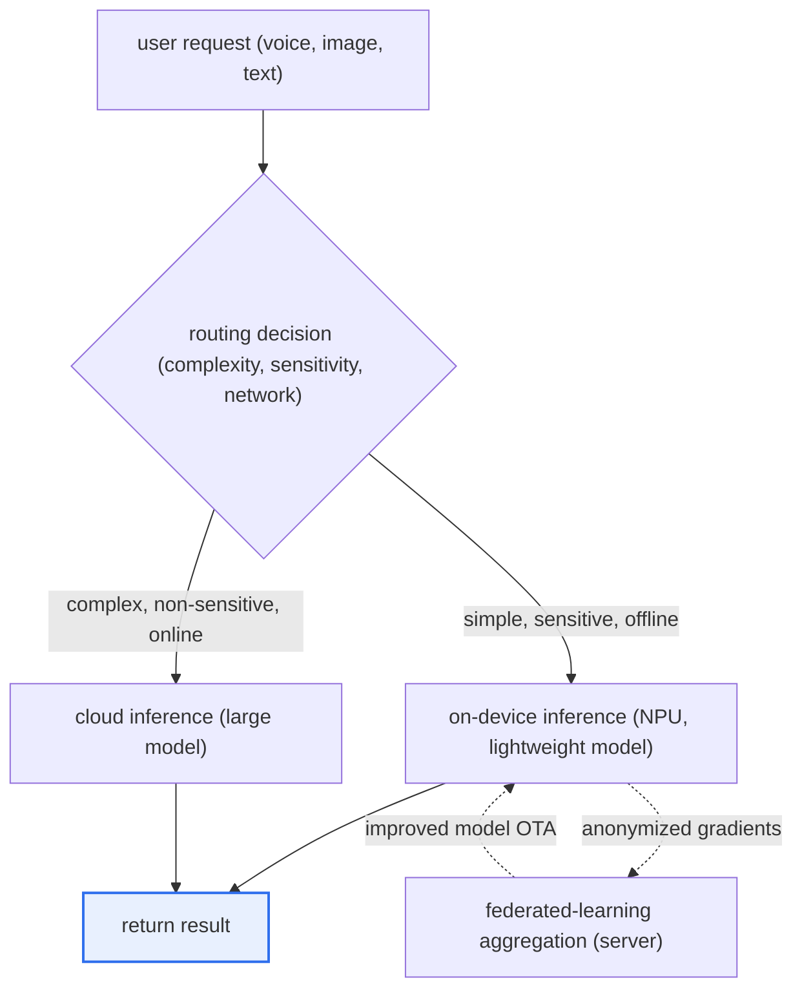

# On-Device AI

## 1. Overview

### A. Definition
> **On-device AI** is a technology that **performs AI inference directly on the terminal (edge device) itself, such as a smartphone or IoT device, rather than on a cloud server**. Without transmitting data externally, it runs the model inside the device to produce results.

The core idea of on-device AI is to '**bring AI to where the data is**.' Until now, most AI services used a **cloud-centric** structure in which the terminal sends data to the cloud, a powerful large model on the server processes it, and returns the result. This structure has the advantage of being able to freely use the data center's GPU resources, but it carries the fundamental limitations that a network is always required, that round-trip latency occurs, and that sensitive personal data such as photos, voice, and location must leave the device. On-device AI resolves these limitations head-on by embedding the AI model itself into the terminal.

As a result, three structural benefits arise. First, because data does not leave the device, **privacy is protected at the source**. Second, because there is no server round-trip, it **responds instantly even without a network (low-latency, offline)**. Third, because inference happens on the terminal, **server infrastructure costs and bandwidth costs are reduced**. Representative cases include a smartphone's face-recognition unlock, real-time call translation, a camera's scene/subject recognition, and a voice assistant's wake-word detection. However, a terminal has extremely limited compute capability, power, and memory compared to a data center, so a heavy large model cannot be loaded as-is. Therefore, **model compression** that compresses models to be small and efficient, and **dedicated semiconductors (NPUs)** that accelerate them at low power, become the core tasks that determine the success or failure of on-device AI.

### B. Key Characteristics
On-device AI has the characteristics of local processing (no data transmission), low-latency/offline operation, personalization (leveraging personal context accumulated on the device), and maximizing efficiency under resource constraints. These characteristics are interlocked—for example, the characteristic of local processing simultaneously enables both privacy and offline operation.

### C. Background and Necessity
The recent rapid rise of on-device AI has four interlocking drivers. First is the **strengthening of privacy regulations**. As the EU's GDPR and Korea's Personal Information Protection Act strictly govern the cross-border/external transfer of personal data, the local-processing approach—which does not send data outside the terminal at all—became an attractive alternative from a compliance perspective. Second is the **demand for real-time responsiveness**. In applications where even tens of milliseconds of delay is fatal, such as autonomous driving, industrial safety, and AR/VR, cloud round-trip latency cannot be tolerated, so terminal processing is practically essential.

Third is the **problem of cloud cost and network dependence**. As the spread of generative AI caused an explosion in inference requests, GPU-server operating costs grew exponentially, and the economic incentive to offload simple/repetitive inference to the terminal grew. Fourth, above all, is the **performance improvement of mobile AI semiconductors (NPUs)**. Apple's Neural Engine, Qualcomm's Hexagon, Samsung's Exynos NPU, and others have, generation after generation, enabled low-power inference on the order of tens of TOPS (trillions of operations per second), and this was the decisive catalyst that elevated on-device AI from "experiment" to "commercial." These four drivers are not independent but mutually reinforcing, and the fact that regulation, application, economics, and hardware all point toward the on-device direction simultaneously underpins this technology's sustainability.

## 2. Overall Structure and Operating Principles

An on-device AI system is broadly bifurcated into **training in the cloud** and **inference on the terminal**. Heavy training is still performed with large-scale data in the data center, but the resulting model is lightweighted and compiled to be deployed to the terminal, and only the actual inference is processed on the terminal—this is the general architecture. The structural diagram below shows the entire flow running through training–lightweighting–deployment–inference.

The point to note in this structure is that **the flow of data is minimized**. Raw data stays on the terminal, and only the model (download) and anonymized summary statistics (optional upload) travel to and from the cloud. In particular, combining it with **Federated Learning**—a technique in which many terminals train locally without sharing raw data, and only the results (gradients) are combined on the server—allows the model to be continuously improved while protecting privacy. In other words, on-device AI should be understood not merely as 'moving inference to the terminal' but as an architectural philosophy of localizing data across the entire cycle of training, deployment, and retraining.

## 3. Core Hardware and Software Technologies

### A. Hardware — NPU and Heterogeneous Computing
The physical foundation of on-device AI is the **NPU (Neural Processing Unit)**. The CPU is strong at general-purpose sequential processing and the GPU at large-scale parallel floating-point computation, but both are burdensome for continuous mobile inference in terms of performance-per-watt (performance/W). An NPU is an accelerator specialized to perform the core operations of neural networks—matrix multiplication and accumulation (MAC)—in bulk at low precision and low power, handling the same inference at several times lower power than a GPU. Apple's Neural Engine, Qualcomm Snapdragon's Hexagon NPU, and Samsung's Exynos NPU are representative, and the latest flagship APs provide performance on the order of tens of TOPS.

In actual terminals, rather than using a single processor, **heterogeneous computing**—dividing work among CPU, GPU, and NPU according to task characteristics—is common. For example, preprocessing is handled by the CPU, image filtering by the GPU, and neural-network inference by the NPU. The runtime performs **hardware delegation**, deciding which hardware each operator of the model is placed on, and this placement optimization greatly influences the actual perceived performance and battery consumption.

### B. Model Lightweighting — Quantization, Pruning, Knowledge Distillation
The most important software technology for running AI on limited terminal resources is **model lightweighting**. There are three representative techniques. First, **quantization** lowers the representational precision of weights and activations. For example, changing 32-bit floating point (FP32) to 8-bit integer (INT8) reduces model size to about one-quarter and runs much faster on an NPU optimized for integer operations. However, because precision is lowered, accuracy loss can occur, so QAT (Quantization-Aware Training), which reflects quantization in the training process, minimizes the loss.

Second, **pruning** removes low-contribution weights, neurons, or channels to make the model sparse. Just as the human brain trims rarely-used synapses, it cuts low-importance connections to reduce computation and memory. Third, **knowledge distillation** trains a small student model to mimic the output distribution of a large, accurate teacher model, so the small model achieves performance close to the large one. In practice, rather than using these three techniques alone, they are combined—**reducing structure with distillation, sparsifying with pruning, and lowering precision with quantization**—to jointly optimize size, latency, and power while maintaining the target accuracy.

### C. Software Frameworks and Runtimes
To actually run a lightweighted model on a terminal, an **edge runtime** matching the terminal OS and chipset is needed. Google long provided **TensorFlow Lite (TFLite)**, but renamed it to **LiteRT** in September 2024. The background of the renaming is that this runtime had grown into a general-purpose on-device runtime that now covers not only TensorFlow but also models made with PyTorch, JAX, and Keras, and it has since developed toward strengthening GPU/NPU acceleration and LLM/diffusion-model support. In the Apple camp there is **Core ML**, as an interoperability standard there is **ONNX Runtime**, and there are chipset-vendor SDKs such as Qualcomm's QNN. These frameworks convert trained models into terminal-specific formats and, through delegates, offload operations to the NPU/GPU.

| Category | Representative technology | Role/Key point |
|---|---|---|
| **Hardware** | NPU (Neural Engine, Hexagon, Exynos NPU), AI accelerator | Low-power, high-efficiency neural inference, heterogeneous computing |
| **Model lightweighting** | Quantization (FP32→INT8), pruning, knowledge distillation | Reduce size/latency/power, minimize accuracy loss |
| **Runtime/framework** | LiteRT (formerly TFLite), Core ML, ONNX Runtime, QNN | Model conversion, HW delegation, inference execution |
| **Training linkage** | Federated Learning | Collaborative training without sharing raw data |

## 4. Comparison with Cloud AI — Reasons and Implications of the Differences

On-device AI and cloud AI should be understood not as a matter of superiority but as a **trade-off derived from the difference in resource location**. Whether the processing location is the server or the terminal determines all other characteristics. The cloud can use virtually unlimited GPU resources and thus run ultra-large models, but data leaves externally and network latency/cost is added. Conversely, the terminal has limited resources so only lightweight models are possible, but because data does not leave, it is overwhelmingly advantageous in privacy, latency, and offline aspects.

| Category | Cloud AI | On-device AI |
|---|---|---|
| **Processing location** | Data center server | Terminal (edge) |
| **Privacy** | External data transmission → leak/regulatory risk | Local processing → protected at source |
| **Latency/connectivity** | Network round-trip latency, connection required | Low latency, offline operation |
| **Compute capability** | Powerful (ultra-large / large models) | Limited (lightweight / small models) |
| **Cost structure** | Server/bandwidth operating cost (variable cost) | Terminal resource consumption (fixed cost) |
| **Model update** | Immediate server-side reflection | Requires OTA deployment, update delay |

The practical implication of this difference is clear. **Conversational generation tasks where accuracy is the top priority and data sensitivity is low** favor the cloud, whereas **continuous-sensing/personalization tasks where privacy and real-time responsiveness are the top priority** favor on-device. That is why real commercial services converge not on either-or but on a **hybrid**. For example, a smartphone voice assistant processes wake-word detection and simple commands instantly on-device, while handing complex Q&A off to the cloud—dividing roles. Here the **orchestration (routing) policy** that decides 'which task to process where' becomes the key design variable governing service quality and cost.

The detailed process diagram below shows by what path a single request is processed in a hybrid environment. The routing decision is usually made by comprehensively considering the request's **complexity, data sensitivity, and network state**, and the more sensitive the data or the more offline the situation, the more the on-device path is chosen.

The key in this flow is that the terminal becomes not merely a 'result consumer' but an **active participant** that returns anonymized training signals to jointly improve the model. That is, on-device inference and federated learning / OTA updates form a single cycle, and the better this loop is designed, the more continuously the model is refined while protecting privacy.

## 5. Deep Dive — On-Device Generative AI (sLLM) and Recent Trends

The biggest topic in on-device AI recently is **internalizing generative AI into the terminal**. Large language models (LLMs) with billions to tens of billions of parameters cannot be loaded onto a terminal as-is, so attempts to run **sLLMs (small LLMs)**—which greatly reduce and lighten the parameters—on the terminal have begun in earnest. Google presented a direction of offline processing for text summarization, smart reply, and more with **Gemini Nano** embedded in Android; Apple presented a hybrid strategy combining terminal processing and Private Cloud with **Apple Intelligence**; and Samsung commercialized on-device interpretation and summarization with **Galaxy AI**. This trend is the meeting point of on-device's strengths—personalization, privacy, offline—with the explosive demand for generative AI.

On the technical side, three advances stand out. First, with the **advancement of low-bit quantization**, techniques that maintain practical accuracy even at 4-bit (INT4) or below are spreading. Second, at the runtime level, **unified NPU acceleration**—handling the NPUs of multiple chipsets through a consistent API—was introduced, letting developers leverage the NPU without per-vendor fragmentation. Third, with the **refinement of hybrid orchestration**, methods that judge a query's complexity, sensitivity, and network state in real time and dynamically distribute between terminal and cloud are developing. However, since sLLMs have clear limitations in hallucination and accuracy compared to large models, carefully setting boundaries on which tasks to entrust to the terminal remains a challenge.

As a concrete application case, consider **real-time interpretation/captioning**. The cloud round-trip approach adds server processing time to communication delay, easily breaking the natural flow of conversation, but on-device speech-recognition/translation models eliminate the network round-trip, greatly reducing perceived latency and offering the advantage of working even in offline environments such as in-flight or overseas roaming. Another case is **real-time scene analysis by a smartphone camera**, where processing that recognizes the subject and lighting at the moment of capture to correct image quality must be done on the terminal to eliminate shutter delay. In such applications where 'latency is usability,' the value of on-device more than offsets the accuracy loss.

## 6. Considerations and Implications

1. **Managing the trade-off between lightweighting and accuracy is decisive.** The smaller the model, the easier it is to run on the terminal, but accuracy declines. Combine quantization, pruning, and distillation, but set target accuracy, latency, and power as quantitative KPIs, and perform systematic optimization that minimizes loss via QAT and the like. Do not forget that the goal is not 'small' but 'small enough while accurate enough.'

2. **Leverage it as a strategic asset for privacy/regulatory response.** The characteristic that data does not leave the terminal is a powerful weapon for GDPR/Personal Information Protection Act compliance. Combined with federated learning and differential privacy, you can implement privacy-preserving AI that 'improves the model without collecting data,' so you should approach it from a privacy-by-design perspective that blocks regulatory risk at the source at the design stage.

3. **The design of hybrid architecture and orchestration decides success or failure.** Since terminal-cloud collaboration is a more realistic solution than pure on-device, you must jointly design a policy that dynamically routes the processing location according to a task's sensitivity, complexity, and latency requirements, along with an OTA deployment / version-management system that updates models safely.

4. **Consider hardware fragmentation and the deployment/operations burden.** Because NPU performance and runtime support differ per terminal, running one model consistently across diverse devices incurs considerable verification/optimization cost. Manage this fragmentation cost by adopting unified acceleration APIs and standard formats (ONNX) and a device-tier-based model-branching strategy, and establish an MLOps system (edge MLOps) that continuously monitors performance, power, and accuracy even after deployment.

5. **Treat energy efficiency and heat/battery constraints as design constraints.** Because a terminal has limited battery and heat-dissipation capability, if continuous inference leads to battery drain and heat, usability degrades sharply. Design inference frequency, model size, and NPU utilization within a power budget, and manage power by triggering inference only when necessary. Recognize that not just performance but performance/watt is the primary metric of on-device design.

6. **Outlook — evolution into an edge-cloud continuum.** On-device AI is not a standalone technology but part of a trend in which the terminal, edge server, and cloud are integrated into one continuous computing resource. Going forward, as sLLM performance improves and NPUs advance, the share of intelligence the terminal handles will keep growing, which is also an important direction from the perspective of sustainable AI that simultaneously achieves personalization, privacy, and energy efficiency.

## References
- Google Developers Blog, "TensorFlow Lite is now LiteRT" — https://developers.googleblog.com/tensorflow-lite-is-now-litert/
- Google Developers Blog, "LiteRT: The Universal Framework for On-Device AI" — https://developers.googleblog.com/litert-the-universal-framework-for-on-device-ai/
- 9to5Google, "Google renames TensorFlow Lite to LiteRT" — https://9to5google.com/2024/09/04/tensorflow-lite-litert/

---

> **In one line**: On-device AI *performs AI inference on the terminal itself* to provide the strengths of privacy (local processing), low latency, and offline operation; NPU-based heterogeneous computing and model lightweighting (quantization, pruning, distillation) are its core, and through federated learning, sLLMs (Gemini Nano, Apple Intelligence, Galaxy AI), and hybrid orchestration it evolves into an edge-cloud continuum.
