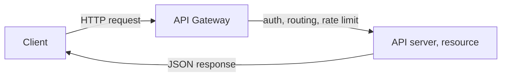

# Open API

## 1. Overview

### A. Definition
> A **standard interface made public** so that external developers and services can access and use it; by opening up the data and functions an organization holds, it promotes service integration and expansion and a **(platform) ecosystem**.

### B. Background and Necessity
Past systems were closed, so exchanging data with the outside required developing a separate integration each time. However, in the digital economy, value grows when **one service combines (mashes up) with multiple services**—like layering delivery or real-estate information on top of a map. An Open API turns this combination into a "standardized contract," letting anyone call the functions according to a defined specification. In particular, the financial sector's **Open Banking and MyData** compelled API opening by law and institution, making the Open API a representative case of becoming industrial infrastructure.

### C. Characteristics

The characteristics of an Open API are at once its value and its management burden. While openness, standardization, and reusability grow the ecosystem, because anyone can call it, **authentication, billing, and traffic control** must always accompany it.

| Characteristic | Content |
|---|---|
| Openness | Exposes functions/data to authenticated external parties |
| Standardization | Adheres to standards such as HTTP, REST, OpenAPI (Swagger) |
| Reusability | Expands mashup/platform ecosystems |
| Management needs | Authentication, billing, versioning, traffic control (API gateway) |

## 2. Comparison of SOAP and REST Components

The two ways to implement an Open API are SOAP and REST. The fundamental difference between them is that SOAP is a **strict XML protocol** while REST is an **architectural style that uses HTTP directly**. SOAP has strong standards and, with WS-Security and transactions, fits places requiring high reliability such as inter-bank transactions, but it is heavyweight. REST represents resources as URIs and handles them with HTTP methods (GET, POST, etc.), so it is lightweight and easy to cache and scale, becoming the de facto standard for web, mobile, and public APIs. For this reason, most Open APIs today are provided as REST (or its alternative, GraphQL).

| Category | SOAP | REST |
|---|---|---|
| Concept | XML-based protocol | HTTP-based architectural style |
| Components | Envelope/Header/Body, WSDL, UDDI | Resource (URI), HTTP methods, representation (JSON), stateless |
| Message | XML | Mainly JSON |
| Characteristics | Strong standards, transactions, WS-Security | Lightweight, scalable, cacheable, stateless |
| Suited for | Enterprise, high-reliability | Web, mobile, public API |

## 3. Vulnerabilities and Countermeasures (OWASP API Top 10)

Because an Open API is exposed externally, it faces API-specific threats different from those of web applications. The most common and critical is **BOLA (Broken Object Level Authorization)**, a flaw where authentication passes but the "permission to access another's data" is not verified, so simply changing the ID in the URL retrieves another person's information. For example, changing `/orders/1001` to `/orders/1002` to view someone else's order. Therefore, the server must **verify the ownership/permission of the object in question** on each request.

| Vulnerability | Principle | Countermeasure |
|---|---|---|
| Broken authentication/authorization (BOLA) | Object ownership not verified | OAuth 2.0 / JWT + object-level permission verification |
| Excessive data exposure | Unnecessary fields included in response | Minimize response fields, schema validation |
| Resource exhaustion (DoS) | Unlimited calls, bulk retrieval | Rate limiting, quotas, pagination |
| Injection | Unvalidated input executed as a query | Input validation, parameter binding |
| Improper asset management | Neglected/old-version APIs exposed | API inventory, version management, block deprecated APIs |

## 4. API Management (Lifecycle)

An Open API does not end once published; because external consumers depend on it, it must be **carefully managed through versioning and deprecation**. Abruptly changing an API breaks all services that used it. So, at the design stage you **define the contract first with an OpenAPI specification (contract-first)**, publish and operate it via a gateway and portal, and when deprecating, provide ample grace and migration guidance.

| Stage | Activity |
|---|---|
| Design | OpenAPI specification (contract-first), standardization |
| Publish | Register on API gateway / developer portal |
| Operate | Authentication, billing, monitoring, traffic control |
| Deprecate | Version deprecation, migration guidance |

## 5. Considerations and Implications
- **Gateway-centric control**: Instead of implementing authentication, traffic limiting, versioning, and logging per individual API, unify them in an **API gateway** to apply security and operations consistently.
- **Contract First**: Fixing the OpenAPI specification first lets you auto-generate documentation, mock servers, and client code, raising development productivity and consistency.
- **Security hardening and outlook**: Protect API segments with **Zero Trust**—which does not trust even the internal network—and **mTLS**; the Open API continues to expand as foundational infrastructure for Open Banking, MyData, and public-data opening.

---

> **In one line**: An Open API is a standard (REST/SOAP)-based public interface that expands mashup/platform ecosystems; it counters OWASP API vulnerabilities (especially BOLA) with OAuth, object-level permission verification, gateways, and rate limiting, and is operated with contract-first and lifecycle management as the foundation of Open Banking and MyData.
