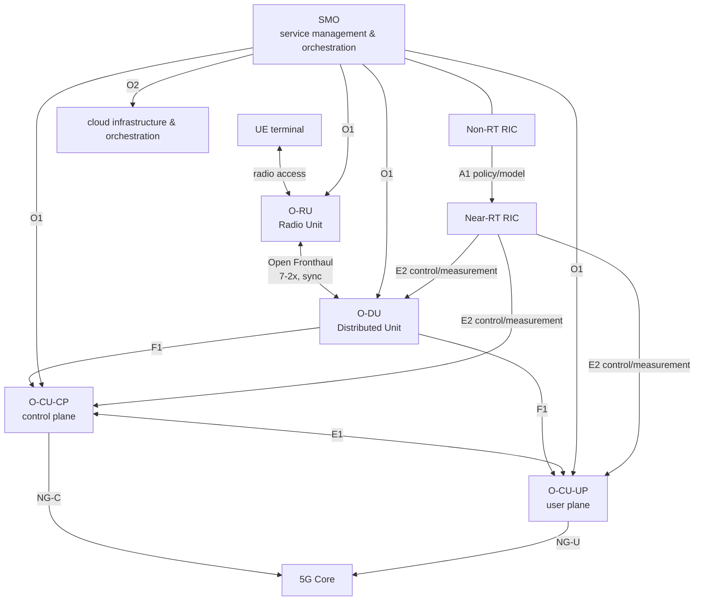
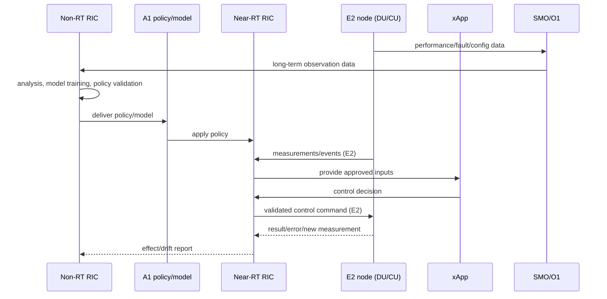

# Open RAN Architecture and RIC-Based Intelligence

## 1. Overview

> **Definition**: Open RAN (Open Radio Access Network) is a RAN architecture that separates the functions of the radio access network into RU, DU, CU, etc., and applies open standard interfaces, virtualization, and intelligent control to pursue multi-vendor interoperability and automation.

The radio access network (RAN) of mobile communications is a core area that processes radio signals between the terminal and the core network and controls cell resources, mobility, and quality. In existing base stations, the radio unit, baseband processing, and control software were often tightly coupled to a specific vendor's equipment and interfaces. Using one vendor's equipment for a long period can make integration and operation simple, but it narrows the range of choice for equipment replacement and functional innovation and can increase vendor dependence and opacity in the cost structure.

Open RAN does not solve this problem simply by "making base stations open source." It is a change in industrial architecture that standardizes the split points and interfaces of RAN functions, increases the combinability of hardware and software, and automates centralized/distributed control with software. Therefore, even if interfaces are open, actual openness is limited unless conformance testing, performance optimization, operational responsibility, and security are secured.

The core composition is O-RU and O-DU connected via O-RAN's open fronthaul, O-CU, and the SMO (Service Management and Orchestration) that manages and orchestrates them. O-CU can be further explained as splitting into O-CU-CP handling the control plane and O-CU-UP handling the user plane. Intelligence is implemented in a way where the Non-RT RIC and Near-RT RIC divide policy and real-time control between them.

When designing Open RAN, four goals must be viewed together. First, interoperability between vendors. Second, the flexibility of leveraging general-purpose servers and cloud technology. Third, automation and optimization through the RIC and applications. Fourth, security, performance, and operability premised on open interfaces and multi-vendor configurations. Achieving only one while sacrificing the rest makes it hard to become a sustainable structure in a commercial network.

This answer organizes, in essay form, the background of Open RAN's emergence, functional decomposition and interfaces, RIC intelligence, deployment procedures, comparison with existing RAN and vRAN, security and performance considerations, and application strategy from a professional-engineer perspective.

## 2. Background of Emergence and Basic Principles

### A. Structural Limitations of Traditional RAN

Traditional RAN commonly had a structure in which the radio processing unit, baseband unit, and control software were supplied as one product family. This structure has the advantage that one vendor integrates responsibility for hardware, software, testing, and fault handling. On the other hand, mixing another vendor's equipment into the same radio network requires separately matching proprietary interfaces and interoperability conditions, increasing replacement cost and verification burden.

Also, even when traffic and service demands vary by time and region, it is difficult to flexibly reallocate the capacity of dedicated equipment. Capacity may be insufficient in a downtown area at a certain time slot while idle resources remain in another region. Leveraging software-based functions and virtualized resources can make resource placement and functional updates flexible, but the latency, synchronization, and throughput constraints of the radio physical layer must also be satisfied.

After 5G, beyond simple voice/data connections, diverse demands arose such as network slicing, ultra-low-latency services, industrial private networks, and massive IoT. The RAN must go beyond static base-station configuration and adjust resources based on policies and observed data. As this change combined with open interfaces, cloud-native operation, and AI/ML-based optimization, the necessity of Open RAN grew.

### B. Core Principles of Open RAN

The first is **disaggregation**. Logically and physically separating the RU that transmits/receives radio signals, the DU that performs distributed baseband processing functions, and the CU that performs upper-layer processing and core-network linkage allows the deployment location and vendor configuration to be chosen. However, because the data volume, latency, synchronization, and transport-network requirements differ at each split point, dividing functions does not always mean cost reduction.

The second is the **open interface**. An open interface clarifies the messages, procedures, and performance/security requirements of interactions between functions so that different implementations can connect. Even if interface documents are public, integration problems remain if the options, profiles, and test methods of implementations differ, so conformance/interoperability testing and operational visibility are also needed.

The third is **virtualization and cloudification**. Running DU/CU functions on general-purpose servers, accelerators, and containers or virtual machines widens the range of choice in hardware procurement and function deployment. However, unlike ordinary IT workloads, radio processing demands strict timing and throughput, so CPU pinning, NUMA placement, accelerators, real-time kernels, and high-precision synchronization design must be considered.

The fourth is **intelligence**. Using the performance, fault, and load data collected from the RAN, policies are established, and applications assist control such as cell selection, load balancing, and energy saving. The more AI enters the control loop, the more important data quality, model validation, policy conflicts, and safe defaults and rollback on failure become.

## 3. Open RAN Functional Structure and Interfaces

### A. Overall Composition

O-RU processes digital radio signals at a location close to the radio frequency and antenna. Placing it near the antenna can reduce the fronthaul transmission distance, but the power, temperature, and maintenance conditions of the field equipment become important. The functions and performance of O-RU must fit the open-fronthaul conditions with the DU, and latency and synchronization deviations must be verified together in interoperability testing.

O-DU processes the time-critical lower-layer functions of the RAN protocol stack at a distributed location. Because O-DU is close to the cell load and radio resources, it is latency-sensitive, and even when implemented on general-purpose servers, real-time processing and acceleration must be guaranteed. Rather than unconditionally consolidating into the central cloud, the deployment location is decided based on transport-network latency and the blast radius of failures.

O-CU allows upper-layer functions to be placed in a central or regional cloud. It can be split so the control plane handles connection/mobility control and the user plane handles user-data forwarding. This split helps traffic-path optimization and resource scaling, but state consistency within the CU and between CU-DU and fault failover must be included in the operational design.

SMO is a management layer that coordinates the deployment, configuration, monitoring, and lifecycle of RAN resources and cloud resources. Beyond placing network functions, it must consistently manage inventory, faults, performance, software versions, policies, and certificates. If the SMO remains a mere collection of per-vendor tools, the operational complexity of the open structure can actually grow.

### B. Roles of Major Interfaces

Open Fronthaul handles radio data/control/synchronization transmission between O-RU and O-DU. Because the data volume between the separated devices is large and timing constraints are strong, this interface requires transport-network bandwidth, latency, jitter, and precise time synchronization. In the field, you must test not only equipment compatibility but also peak traffic and protection switchover on failure.

The F1 interface provides the connection between DU and CU, enabling the distributed/centralized function split. E1 supports the control relationship between CU-CP and CU-UP. Dividing layers this way makes functional scaling and deployment optimization easier, but as interfaces increase, the importance of fault-cause analysis and version-compatibility management grows.

O1 is an interface for exchanging management/operation/maintenance information, used for configuration, performance, fault, and software management. O2 is the point of linkage between the SMO and the cloud infrastructure/orchestration layer. If the automation level of O1/O2 is low, the operator must maintain separate operation screens and procedures for each vendor's equipment.

A1 conveys policies, intelligence-support information, and model-related information between the Non-RT RIC and Near-RT RIC. E2 connects measurement and control between the Near-RT RIC and the CU/DU, which are E2 nodes. The O-RAN Alliance defines these functions and interfaces in technical documents, and in actual deployment the version of the relevant documents and the supported profiles must be specified.

| Category | Connected parties | Main purpose | Key at design |
|---|---|---|---|
| Open Fronthaul | O-RU–O-DU | Radio data/control/sync | Bandwidth, latency, jitter, time sync |
| F1 | O-DU–O-CU | Distributed/central function connection | State management, version compatibility, switchover |
| E1 | O-CU-CP–O-CU-UP | CU control/user-plane linkage | Session state, fault failover |
| O1 | SMO–RAN nodes | Configuration/fault/performance/software management | Standard models, automation, evidence |
| O2 | SMO–cloud infrastructure | Virtual-resource orchestration | Resources, placement, lifecycle |
| A1 | Non-RT RIC–Near-RT RIC | Policy/model/intent delivery | Policy conflicts, permissions, verification |
| E2 | Near-RT RIC–E2 nodes | Measurement/control/optimization | Latency, safety, application isolation |

The interfaces in the table are not in a substitution relationship but handle different abstractions and time ranges. For example, an O1 configuration change is handled in the management lifecycle, whereas E2 control reflects operational state such as cell load and radio resources on a short cycle. If the same parameter can be changed at multiple points, the priority of authority and conflict-resolution rules must be defined.

## 4. RIC-Based Intelligence and Operational Procedures

### A. Non-RT RIC and Near-RT RIC

The Non-RT RIC performs relatively long-cycle control within the SMO, such as policy, analytics, and model training. It can analyze long-term performance trends, energy usage, subscriber mobility patterns, and fault history to create policies or models. A policy created here must express the goals and constraints of field control, and must not merely be given the objective of "maximize."

The Near-RT RIC receives measurement information from E2 nodes and performs relatively short-cycle control. Functions requiring real-time responsiveness—such as load balancing, dual-connectivity optimization, mobility assistance, and interference mitigation—can be implemented as xApp-form applications. If multiple xApps control the same resource, their objectives can conflict, so execution priority, policy scope, and approved control variables must be managed.

In this structure, the AI model is not an all-powerful module that directly controls the network. The delay, missingness, and bias of model inputs must be monitored, and only after the policy engine checks whether the output is within the allowed range should it be converted into a control command. When the model is uncertain or the data distribution shifts, it is desirable to switch to a rule-based safe default policy, and to require human approval for high-impact commands.

### B. Step-by-Step Procedure of Intelligent Control

The first step is defining objectives and constraints. Setting only the goal of "minimize energy usage" can undermine service quality or the priority of emergency communication. Therefore, quantify objectives/constraints together, such as coverage, throughput, latency, per-slice SLA, emergency services, and power.

The second is data collection and quality verification. Verify the time alignment, missingness, outliers, and label consistency of measurements per cell, equipment, and subscriber group. Failing to manage the source and retention period of measurement data and whether it contains personal information can let intelligence increase security/privacy risk.

The third is offline evaluation and limited online verification. After performing reproducibility evaluation using past data and simulation, apply the policy to only some cells/time slots and compare against a control group. Even if the effect looks good on average, it can be unfavorable to a specific region, terminal, or service group, so verify per-segment safety and fairness.

The fourth is deployment/monitoring/withdrawal. Register the model and policy versions in a registry and record the approver, training data, evaluation results, and application scope. During operation, monitor not only the target metrics but also the control-command failure rate, rollback count, exception occurrences, and data drift, and automatically revert to a previous version or default policy if thresholds are exceeded.

| Stage | Main activity | Control artifact |
|---|---|---|
| Objective definition | Set goals/constraints/impact scope | Intent spec, KPI/SLO, risk tolerance |
| Data preparation | Collection/consistency/de-identification/quality check | Data lineage, quality report |
| Evaluation | Simulation/control group/exception testing | Evaluation results, approval records |
| Limited deployment | Canary cells / gradual expansion | Deployment plan, rollback conditions |
| Operation | Observe effect/drift/faults | Dashboard, audit logs |
| Improvement/withdrawal | Retraining/policy adjustment/emergency switchover | Change records, post-mortem review |

### C. SMO and Automated Lifecycle Management

SMO automation does not end at rapidly deploying equipment but must connect the entire lifecycle of intent, configuration, observation, change, and decommissioning. For example, when deploying new DU software, verify compatible RU/accelerator/kernel versions, and admit traffic only after passing fronthaul synchronization status and performance criteria.

Configuration management must show the difference between the desired state and the actual state. If the actual state differs from the declaration, it can be auto-corrected, but unconditionally overwriting risks reverting a field fault or emergency measure. Record the cause and approval of the change, its application scope, and the rollback method, and control emergency changes with post-mortem review.

Operators must be able to see the dependencies of cells, RU, DU, CU, RIC applications, and cloud resources in a service catalog. When a fault occurs, one must quickly isolate whether it is a specific vendor's equipment problem, the fronthaul transport network, time synchronization, or a RIC policy. This observability becomes the basis for judging SLA responsibility in a multi-vendor environment.

## 5. Deployment Strategy and Performance Design

### A. Phased Deployment

In the first phase, define the business goals and service scope. Rather than opening the entire nationwide network at once, choose an area with limited blast radius—such as a new private network, a specific city, an enterprise-dedicated network, or experimental cells—to verify interoperability and operational procedures. Include the interconnection points with the existing network, the fallback path on failure, and frequency/regulatory conditions in the initial design.

The second is multi-vendor testing. Verify combinations of RU/DU/CU/SMO/RIC across functional testing, performance testing, fault testing, and security testing. Do not stop at confirming that equipment connects; test cell-boundary handover, peak load, packet loss, time-synchronization loss, software upgrades, and vendor swaps.

The third is a limited commercial pilot. Do not look only at 24-hour average performance; observe commute peaks, event traffic, environmental conditions such as rain and high heat, and quality by specific terminal group and service. The pilot's success criteria must include not simple throughput increase but fault-recovery time, operator handling time, automation failure rate, and total cost.

The fourth is expansion and standardization. Standardize verified reference configurations, vendor qualification criteria, version-compatibility tables, operational runbooks, and security baselines. Build automatic conformance testing and deployment pipelines so that new combinations are not integrated ad hoc each time when expanding regions/services.

### B. Performance, Synchronization, and Accelerator Considerations

Open RAN performance is not guaranteed merely by the fact that interfaces are open. Fronthaul bandwidth and latency, DU throughput, number of users, number of antennas, scheduler implementation, encryption overhead, and accelerator use together produce the result. Even the same equipment yields different CPU utilization and latency distributions depending on the profile and traffic pattern, so look at both averages and tail latency.

Radio function separation requires time synchronization. Distinguish frequency synchronization from phase/time synchronization, and design sources such as GNSS/PTP/SyncE and holdover behavior on failure. The policy of whether to unconditionally halt service or maintain it with degraded performance when synchronization quality deteriorates must also be decided in advance.

Using general-purpose servers can raise resource efficiency, but contention for CPU and memory can shake radio-processing latency. Evaluate combinations of CPU-core isolation, NUMA-aware placement, DPDK-family packet processing, FPGA/GPU/dedicated accelerators, and real-time scheduling per workload. Becoming dependent on a specific accelerator requires re-examining the benefits and cost structure of openness.

## 6. Comparison of Existing RAN, vRAN, and Open RAN

Traditional RAN, as an integrated product, has relatively simple test and responsibility boundaries, but the flexibility of vendor choice and function replacement can be low. vRAN is an approach that virtualizes/softwarizes RAN functions to run on a general-purpose computing base, and Open RAN can be understood as adding to this the perspectives of function separation, open interfaces, multi-vendor interoperability, and RIC intelligence. In actual products and business models, the scopes of the three terms can overlap, so confirm the applied interfaces and operational scope rather than the terminology.

| Category | Traditional integrated RAN | vRAN | Open RAN |
|---|---|---|---|
| Function coupling | Tightly coupled to vendor equipment | Software-centric | Function separation, open interfaces |
| Hardware | High share of dedicated equipment | Uses general-purpose servers | Combination of general-purpose/accelerator/dedicated |
| Vendor configuration | Single-vendor-centric | Varies by implementation | Aims at multi-vendor interoperability |
| Intelligence | Per-equipment management/optimization | Centralized management possible | RIC/app/policy-based automation |
| Advantages | Integrated responsibility, simple verification | Resource flexibility, software deployment | Choice, innovation, automation |
| Main risks | Lock-in, replacement cost | Performance, virtualization overhead | Integration/operation/security complexity |

You should not evaluate the difference simply by more or less openness. A single-vendor structure can have clear fault-cause and responsibility boundaries, whereas Open RAN increases vendor choice but has a single fault span multiple layers and vendors. Therefore, the adoption decision must be compared via TCO including not just equipment price but integration testing, operations staff, the observation platform, and the lifecycle and switching cost of components/software.

Also, Open RAN is not equally suitable for all regions and services. It can be highly effective in areas with large traffic variation and high value in automation/vendor choice, but in environments with limited transport networks or small real-time-performance margins, the split points and deployment locations must be chosen carefully. A hybrid strategy of gradually interconnecting with the existing RAN is also a reasonable alternative.

## 7. Case: Applying Open RAN to a Manufacturing Company's Private 5G Network

Suppose a manufacturing company builds a private 5G network for in-factory AGVs, video inspection, and worker terminals. AGVs are sensitive to mobility and latency, video inspection demands high uplink throughput, and worker terminals value coverage and authentication convenience. Evaluating the three services with a single KPI can let an improvement in one service undermine the quality of another.

First, define per-service SLAs and priorities. Assign AGVs a latency ceiling, switchover time, and availability; video inspection uplink throughput, packet loss, and storage linkage; and worker terminals authentication success rate, coverage, and recovery time. Reflect these policies into RIC applications and SMO configuration templates, but ensure safety-related control is not changed by the AI's autonomous decision alone.

Place the RU near the production line and the DU at the factory edge to reduce fronthaul and radio-control latency. Divide the roles of the CU and SMO between the in-factory edge cluster and the central operations center. Separate the dependency between local control and central management so that safe operation and minimum communication are maintained even if the factory network is disconnected.

The Near-RT RIC applies handover-assistance policies based on cell load and AGV movement paths, and the Non-RT RIC analyzes time-slot production plans, fault history, and power data to create long-term resource policies. Before applying a policy, run a canary test on a specific production line, and automatically revert to the previous policy if AGV stoppage, packet loss, or handover failure exceeds thresholds.

Operational performance is not judged by throughput alone. Measure together per-service 99th-percentile latency, handover failure rate, fault detection/recovery time, energy usage, change failure rate, multi-vendor integration work time, and security-patch compliance rate. Only this way can you confirm whether Open RAN adoption actually raised productivity and resilience.

## 8. Security, Reliability, and Operational Considerations

Open RAN can widen the attack surface as interfaces and software components increase. Include O-RU, O-DU, O-CU, SMO, RIC, xApps, cloud infrastructure, and the vendor's development/deployment environments in the asset list and threat model. In particular, if the management interface or the RIC control path is compromised, beyond simple information leakage, radio resources and service quality can be manipulated.

First, apply mutual authentication and communication protection. Issue identities per equipment/platform/application, and automate certificate lifecycle and revocation/rotation procedures. Do not premise flat network trust; apply least privilege to interfaces, commands, and data.

Second, control the supply chain of xApps and rApps. Include code signing, SBOM, vulnerability scanning, image provenance, execution permissions, API access scope, and update verification in the deployment gate. Separate the measurement data an application can read from the control commands it can execute, and route dangerous commands through the policy engine and an approval procedure.

Third, verify the integrity of software and configuration. Manage the boot chain, image signing, runtime integrity, change history, and vulnerability patching and rollback. In a multi-vendor environment, each vendor's security advisories arrive in different formats and at different times, so specify common severity, action deadlines, and verification criteria in the contract.

Fourth, design fault isolation and recovery. Basic RAN functions must operate safely even if the RIC halts, and already-approved configurations must be maintained even if the SMO is unavailable. Do not depend on a single cluster, single time source, or single management network, and define per-control-loop timeouts and default behaviors.

| Area | Representative risk | Response direction |
|---|---|---|
| Interface | Forgery/tampering, replay, denial of service | Mutual authentication, encryption, replay prevention, rate limiting |
| RIC/xApp | Malicious policy, excessive permissions, model error | Least privilege, policy validation, sandbox, rollback |
| Cloud | Virtual-resource hijacking, isolation failure | Workload isolation, image verification, runtime observation |
| Supply chain | Vulnerable component, update forgery | SBOM, signing, vulnerability SLA, provenance verification |
| Operations | Multi-vendor responsibility gap | Joint runbook, evidence, SLA, escalation |
| Availability | Sync/transport-network/SMO failure | Local autonomy, redundancy, holdover, recovery drills |

Security controls must not remain only in a separate audit document. Embed controls into operational flows such as normal deployment, policy approval, fault response, and vendor changes, and correlate logs to trace actual control commands and their results. The professional engineer must explain the trade-offs among security, performance, and availability and the residual risks in metrics that management can understand.

## 9. Deep Dive: Issues in Open RAN Standardization and Industrial Application

The O-RAN Alliance develops technical documents aiming at an open, intelligent, virtualized, and interoperable RAN, addressing functions, interfaces, and processes across multiple working groups. Because standard documents are continuously updated, the feature-support status of a specific version and the interoperability-test scope must be specified in proposals and contracts. The expression "O-RAN compliant" alone should not be interpreted as guaranteeing compatibility of all interfaces and profiles.

A core issue in industrial application is performance and integration cost. You must verify whether the optimizations dedicated equipment provided come out identically in a general-purpose-server, multi-vendor combination, which vendor analyzes and resolves faults, and who guarantees the compatibility of software upgrades. To quantify the expected benefits of openness, compare metrics such as vendor-swap duration, feature-release cycle, operations automation rate, and mean time to fault recovery against a baseline.

Another issue is the responsibility for intelligent control. Even if an AI-based policy improves performance, it can be hard to explain why the model adjusted a specific cell, or it can issue a dangerous command in a rare situation. Therefore, include model cards and change history, simulation/canary testing, approval/withdrawal conditions, and human-intervention paths in operational governance.

In the future, Open RAN may combine with private 5G, edge computing, network APIs, energy optimization, and non-terrestrial networks. However, the more function combinations increase, the more the complexity of data, policy, and trust boundaries also increases. The professional engineer must, instead of chasing technology fads, set the application scope based on business objectives, service quality, supply chain and regulation, and safe failure modes.

## 10. Considerations and Implications

### A. Design Openness and Integration Responsibility Together

Opening interfaces increases vendor choice, but it does not eliminate integration responsibility. Specify in contracts, RACI, and SLAs the responsibilities of the RAN system integrator, equipment vendors, cloud operator, and transport-network operator and the scope of joint testing. Practice escalation so that when a fault occurs, the first notifier and the final resolution owner are not different.

### B. Verify Performance to Worst-Case Conditions, Not Just Averages

Average throughput or average latency alone cannot describe radio-network quality. Set a performance budget including peak load, 99th-percentile latency, synchronization loss, packet loss, mobility, fault switchover, and software-upgrade conditions. Evaluate via TCO whether the flexibility gained from function separation exceeds the fronthaul-expansion cost and processing overhead.

### C. Place Safe Defaults in RIC Automation

AI/policy-based automation reduces operators' repetitive work but can rapidly spread erroneous control. Limit the control scope, change rate, number of applied cells, and per-service impact limits, and automatically withdraw when data drift, effect degradation, or anomalous commands are detected. The automation rate itself is not the achievement; the proportion of safely automated work must be the achievement.

### D. Manage Multi-Vendor Security and the Supply Chain Across the Full Lifecycle

Open RAN's components widen to hardware, software, cloud, apps, open source, and operational tools. Include SBOM, signing, vulnerability disclosure, patch/end-of-support, re-subcontracting, data access, and emergency updates in procurement conditions and operational criteria. For a vendor swap to be possible, a handover clause that returns data, configuration, and logs in a standard format is also needed.

### E. Guarantee Coexistence and Withdrawal Paths with the Existing Network

Do not switch the entire commercial network at once; verify in stages in new areas and limited cells. Prepare a path to revert to the existing network or local default functions on an Open RAN failure, configuration backups, frequency/authentication continuity, and operator training. If the possibility of reversal is not in the design, even an open structure can turn into a new form of lock-in.

### F. Measure Business Value Together with Regulatory and Safety Goals

The number of vendors or the count of open interfaces is not the final achievement. Compare against a baseline the changes in per-service quality, coverage, cost, energy, automation, recoverability, security incidents, regulatory compliance, and vendor-swap time. In environments with safety impact—such as manufacturing, healthcare, and transportation—safe failure and verifiable responsibility can take priority over performance improvement.

## References

- O-RAN Alliance, "O-RAN Specifications" — https://www.o-ran.org/specifications
- O-RAN Alliance, "60 New or Updated O-RAN Technical Documents Released since March 2025" — https://www.o-ran.org/blog/60-new-or-updated-o-ran-technical-documents-released-since-march-2025
- NTT DOCOMO, "Initiatives toward Intelligent RAN" — https://ssw.web.docomo.ne.jp/orex/en/technical/vol30_1_005en/
- O-RAN Alliance, "O-RAN Software Community" — https://www.o-ran.org/o-ran-software-community
- 3GPP, "3GPP Specifications" — https://www.3gpp.org/dynareport/SpecList.htm

---

> **In one line**: Open RAN is an architecture that combines RU/DU/CU separation, open interfaces, virtualization, and RIC intelligence to increase RAN vendor choice and automation; for real success, interoperability testing, time synchronization, performance, security, and multi-vendor operational responsibility must all be designed together.
