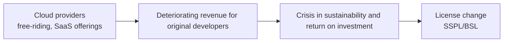

# Changes in Open Source License Policy (Open → Restrictive)

## 1. Overview

### A. Definition of the Phenomenon
> The recent trend in which major open source projects such as MongoDB, Elastic, HashiCorp, and Redis are **switching from open licenses (MIT, BSD, Apache 2.0) that permit free commercial use and redistribution to licenses (SSPL, BSL, Elastic License) that keep the source public but restrict service-based offerings and competitive use**.

The essence of this phenomenon is that two values long treated as one — "**source code disclosure**" and "**permission for free commercial use**" — are being separated. The new licenses continue to disclose the source (Source Available) but restrict only the act of selling it as-is as a managed service in competition with the original developer. For this reason, the OSI (Open Source Initiative) does not recognize them as genuine open source.

### B. Comparison of License Types
| Category | Open | Restrictive (Source-Available with Limits) |
|---|---|---|
| **Examples** | MIT, BSD, Apache 2.0 | SSPL, BSL, Elastic License |
| **Characteristics** | Free commercial use, modification, redistribution | Source is public; SaaS offering and competitive use restricted |
| **OSI approval** | Approved (open source) | Not approved (Source Available) |
| **Transition cases** | — | Elasticsearch, MongoDB, Terraform, Redis |

The fundamental difference between the two types is "**whether you can prevent others from running the same business as you using this software**." Open licenses impose no such restriction, allowing cloud providers to offer the software as a service as-is, whereas SSPL requires disclosure of the source for the entire service stack in order to offer it as a managed service, effectively blocking commercial resale.

## 2. Background of the Policy Change

The root cause of the change is **the imbalance in value distribution in the cloud era**. When open licenses were created, it was common for users to install and operate software themselves, so there was little direct revenue conflict between the original developer and users. However, as hyperscalers began easily offering open source as managed services (e.g., Amazon Elasticsearch Service), a structure emerged in which **the original company does the development while the cloud provider takes the revenue**. Since a project cannot be sustained if the developer cannot secure funding for ongoing development, the license change became a choice for survival.

| Background | Description | Why It Became a Problem |
|---|---|---|
| **Cloud free-riding** | Hyperscalers offer OSS as managed services and monopolize revenue | Capturing revenue without contributing to development |
| **Monetization/sustainability** | Need to secure funding for continued development | Without funding, the project cannot be maintained |
| **Competitive defense** | Restrict commercial resale as an identical service | Protect the original developer's business model |

## 3. Impact on the Software Industry

License changes immediately triggered community backlash and **forks**. For users and companies that had adopted the software trusting it to be open, the sudden change in terms was perceived as a betrayal, and alternative projects branching from the last open version quickly formed around neutral foundations.

| Impact | Description | Representative Cases |
|---|---|---|
| **Community backlash/forks** | Branching from the last open version; foundations maintain neutrality | OpenSearch (ES), Valkey (Redis), OpenTofu (Terraform) |
| **Enterprise usage risk** | Burden of reviewing license terms; vendor lock-in and rising costs | Reassessment by SaaS-providing companies |
| **Debate over open source credibility** | Conflict between the 'open source' definition (OSI) and commercial models | Source Available debate |
| **Foundation transfer/alternatives** | Transfer to neutral foundations; rise of alternative projects | Transfer under the Linux Foundation |

For example, when Elasticsearch switched to SSPL, AWS forked the last Apache 2.0 version to create **OpenSearch**, and immediately after Redis's license change, **Valkey** was launched under the leadership of the Linux Foundation. This illustrates open source's distinctive self-correcting mechanism: "an open ecosystem defects to open alternatives when conditions worsen."

## 4. Enterprise Response Measures

Adopting companies must proactively manage license changes before they spill over into **architecture, procurement, and legal risks**. If a company does not even know which OSS it uses under which terms, response itself is impossible, so securing visibility is the starting point.

| Response | Description | Purpose |
|---|---|---|
| **License inventory** | Identify OSS in use and license terms (SCA, SBOM) | Visualize the scope of exposure |
| **Risk assessment** | Review likelihood of change and whether own SaaS offering is affected | Determine actual impact |
| **Securing alternatives** | Review forks, alternatives, commercial contracts | Diversify lock-in and discontinuation risk |

The reason **SBOM (Software Bill of Materials)** is key here is that managing the list of software components and their licenses in a standard format makes it possible to immediately identify and respond to affected systems when a license changes.

## 5. Considerations and Implications
- **Balance between openness and sustainability**: Pure openness without development funding is unsustainable, while excessive restriction drives community defection. Finding the balance between the two is the core challenge of open source business, and compromise models such as "**open core (core is open, add-ons are commercial)**" and BSL, which converts to an open license after a period of time, have been spreading recently.
- **Strategic judgment by adopting companies**: Before becoming deeply dependent on a particular OSS, it is safer to reflect license change risk in architecture and procurement decisions in advance and keep substitution options open.
- **Continuous monitoring**: Constantly observe OSI approval status, the activity of fork ecosystems, and license trends of major projects to respond early to signals of change.
- **Implication**: This change is part of open source's maturation from an ideology into a question of sustainable business models, and companies must manage OSS not as 'free' but as a 'conditional asset.'

---

> **In one line**: *Deteriorating profitability caused by cloud providers' free-riding* triggered the *switch from open to restrictive SSPL/BSL licenses* by MongoDB, Elastic, Redis, and others, which gave rise to forks such as OpenSearch and Valkey and a debate over the 'definition of open source'; companies must respond with SBOM, risk assessment, and securing alternatives, while managing the balance between openness and sustainability.
