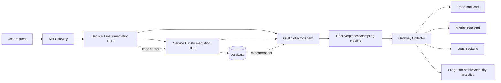
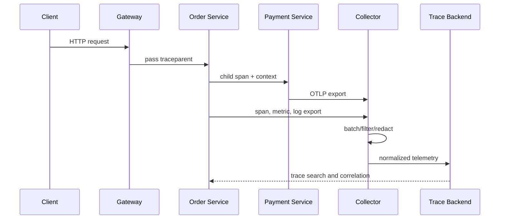

# Distributed Tracing and Unified Observability with OpenTelemetry

## 1. Overview

> **Definition**: OpenTelemetry (OTel) is a vendor-neutral, open source observability framework for instrumenting, generating, collecting, transforming, and transmitting telemetry such as traces, metrics, and logs from applications and infrastructure.

In microservices and cloud-native systems, a single user request passes sequentially or in parallel through an API gateway, multiple services, message brokers, caches, and databases.
With the traditional approach of looking only at a single service's logs, it is hard to quickly explain where the overall request was delayed, which call caused a failure, or which customers and regions were affected by the same incident.
In particular, when services move between containers and auto-scaling groups, it becomes difficult to reconstruct the full path of a request using only host names and process IDs.

Observability is not simply the task of installing monitoring tools.
It is a design capability that makes it possible to infer a system's state and root causes from externally observed outputs and internal signals.
OpenTelemetry reduces the coupling between instrumentation code and a specific backend, enabling a common data model, API, and transport across many languages and runtimes.
As a result, operations organizations can switch storage, search, and visualization backends, or fan data out to multiple backends, without rewriting instrumentation.

The core of OpenTelemetry lies not merely in collecting signals separately, but in linking them through a common context.
Traces show the causal path of a single request, metrics show service-level trends and thresholds, and logs retain the detailed facts of individual events.
By linking the three signals through trace ID, span ID, resource, and semantic attributes, analysis can be narrowed from "the error rate went up" to "latency occurred in a specific database call of a specific API, and the timeout cause was recorded in that span's log."

This document organizes OpenTelemetry's components, signal model, context propagation, Collector pipeline, and design and operational considerations from the perspective of a professional engineer's essay answer.
The goal is not to memorize product-specific usage, but to present a thinking process for translating observability requirements into signals, collection paths, storage policies, and security controls.

## 2. Background and Design Goals

### 2.1 Limitations of Conventional Monitoring

Host-centric monitoring shows infrastructure state such as CPU, memory, disk, and network well.
However, even when infrastructure resources are healthy, requests from only a specific tenant may fail, or a single database query may produce p99 latency.
If application logs are stored separately, a person must align event times, hosts, and request IDs, which lengthens analysis time.

Distributed tracing groups a request into a single trace and represents each processing step as a span.
Each span can contain start and end times, an operation name, a parent relationship, attributes, events, and status.
Using this structure, bottlenecks in inter-service calls, waits in parallel execution, retries, and external dependency latency can be seen in the call graph.
However, fully tracing every request increases storage volume and processing costs, so a sampling policy must always accompany it.

### 2.2 Problems OpenTelemetry Solves

First, it standardizes the instrumentation API and the collection and transmission path.
Applications can create telemetry through a common API and SDK, and let the Collector handle receiving, processing, and exporting.
Even if the backend changes, a specific vendor's storage API is not deeply embedded in application code, reducing replacement costs and lock-in risk.

Second, it enables correlation across signals.
If trace IDs and span IDs are included in logs, one can navigate from a log search to the related trace.
Using exemplars that link traces to anomalous points in metrics, resource attributes, and common semantic conventions, root cause investigation at the service, deployment, and region level can be performed consistently.

Third, it centralizes collection points to apply operational policies.
The Collector can perform batching, retries, memory limiting, filtering, attribute transformation, sampling, and export to multiple destinations.
Managing the deletion of sensitive attributes and routing according to data retention periods as central policies reduces the risk of each service handling them differently.

### 2.3 Goals and Non-Goals

The goal of OpenTelemetry is not to automatically diagnose every failure.
The key is to secure consistent signals with sufficient context so that operators spend less time forming and verifying hypotheses.
Therefore, success criteria for instrumentation should be defined not by the number of dashboards but by the balance among detection time, root cause analysis time, recovery time, data quality, and cost.

Conversely, OpenTelemetry is not itself a log store, a time-series database, or a trace UI.
The Collector and SDK are responsible for creating and delivering data, while actual storage, search, visualization, and long-term retention are the responsibility of the chosen backend and operational policies.
Failing to understand this distinction leads to the mistaken conclusion that "observability is complete because we adopted the standard."

## 3. Overall Architecture and Core Components



The application layer contains the API, SDK, automatic instrumentation libraries, and manual instrumentation code.
Automatic instrumentation quickly creates spans for common paths such as HTTP servers, clients, databases, and messaging libraries.
Manual instrumentation expresses points whose meaning cannot be captured by automatic instrumentation alone, such as business rules, payment authorization, inventory reservation, and model inference.
When mixing the two approaches, duplicate spans, naming inconsistencies, and recording of sensitive information must be reviewed.

The OpenTelemetry API is the abstract interface used by instrumentation code.
A library that depends only on the API can perform its application functions even without an SDK, and actual collection can be activated when the runtime environment attaches an SDK.
The SDK provides execution policies such as samplers, processors, exporters, and resource detection.
This separation is an important design principle that divides responsibilities between library authors and application operators.

The Collector consists of receivers, processors, exporters, and pipelines.
Receivers accept input formats such as OTLP, Prometheus, and Jaeger, and processors perform batching, filtering, attribute transformation, memory protection, and so on.
Exporters deliver data in OTLP or a specific backend format.
Rather than having a single Collector bear all responsibilities, agents and gateways can be separated to design failure domains and scaling units.

| Component | Main Responsibility | Questions to Check in Design |
|---|---|---|
| API | Standard interface for instrumentation calls | Is the library free of direct coupling to a vendor SDK? |
| SDK | Executes sampling, processing, exporting | Are memory and CPU budgets and flush on shutdown guaranteed? |
| Automatic instrumentation | Rapid instrumentation of common frameworks | Are duplicate spans and version compatibility managed? |
| Manual instrumentation | Expresses business meaning and key events | Which business attributes are defined as low-cardinality? |
| Collector | Collection, transformation, routing, protection | Do backpressure and retries work when the collection path fails? |
| Backend | Storage, search, visualization, alerting | Are retention, query performance, cost, and access rights appropriate? |

The components in the table are not a list of independent products but form a single data flow.
For example, even if the Collector receives spans generated by the SDK, if resource attributes are missing, it is hard to tell which service the data belongs to.
Conversely, even with rich data, the absence of sampling and retention policies increases storage costs and search latency.
A professional engineer must connect in the answer the reasons for choosing each component and even the fallback paths in case of failure.

## 4. Signal Model and Context Propagation

### 4.1 Traces and Spans

A trace is the set of spans that make up a single logical request or business flow.
A span represents an operation within a service or an external call, and forms a call tree through its relationship with its parent span.
In distributed environments, links may be needed to represent not only simple trees but also asynchronous messages, batches, and fan-in/fan-out.

Since span names are the basis for search and aggregation, strings whose values keep changing, such as full URLs or user input, should not be inserted as-is.
Use templated names like `GET /orders/{orderId}`, and manage actual identifiers as limited attributes or masked fields in logs.
Error spans should record status, exception events, error type, and external dependency information, but never secrets such as card numbers or tokens.

### 4.2 Metrics and Logs

Metrics are aggregations of numeric values over time.
Metrics such as request count, error count, latency histograms, active connections, and queue length form the basis for SLIs and alerts.
Instrument types such as counters, gauges, histograms, and summaries should be chosen to fit business meaning, and metric names and units with the same meaning should be set as organizational standards.

Logs record events at specific points in time.
Structured logs are recorded in JSON or with common fields to ease parsing and search, and include trace IDs and span IDs so the related spans can be found.
Putting every request body into logs may look like observability, but it increases privacy and cost risks, so only the minimum fields needed for root cause analysis of events should be retained.

### 4.3 Resources and Semantic Conventions

A resource represents the identity of the service, host, container, or cloud resource that generated the telemetry.
Attributes such as `service.name`, deployment environment, version, region, and cluster must be populated consistently so that data from different instances can be aggregated as the same service.
If the service name changes with each deployment, the error-rate trend of the same service is broken; conversely, putting too many identifiers into the service name fragments aggregation.

Semantic conventions unify the names and meanings of attributes for common operations such as HTTP, databases, and messaging.
If each team uses `url`, `request_url`, and `httpUrl` differently, it becomes hard to combine data from multiple services.
While following standard conventions, compatibility with existing logs, attribute stability, and privacy minimization should also be reviewed.

### 4.4 Context Propagation

In distributed tracing, service A must pass the trace context to service B for a single trace to continue.
HTTP request headers, message metadata, and handoff objects for asynchronous work become the propagation medium.
If propagation breaks, each service's spans are still created but appear as separate traces, so testing is needed at every framework, proxy, and message broker boundary.

When using W3C Trace Context headers, do not make authorization decisions by trusting external input.
A trace ID is an identifier for correlation, not an authentication or authorization token, and values placed in baggage can propagate downstream, so baggage must not carry secrets.
Baggage and trace information coming from outside the trust boundary should be protected by allowlists, size limits, and deletion policies.



In the sequence above, context propagation of the business request and transmission of telemetry are separate flows.
Spans created during request processing are sent to the Collector via the SDK's processor and exporter, and the Collector batches the data and sends it to the backend.
Therefore, one cannot conclude that telemetry transmission succeeded just because the business request succeeded.
Flush on shutdown, retries on transmission failure, and buffering and drop policies during Collector outages must be defined as operational requirements.

## 5. OTLP and Collector Pipeline Design

OTLP is the protocol for delivering OpenTelemetry telemetry between intermediate nodes and backends.
It supports gRPC and HTTP transports and specifies payloads and request/response methods for traces, metrics, and logs.
Rather than choosing the protocol first, organizations should first determine the network path, authentication, TLS, maximum message size, retries, compression, and the tolerable amount of data loss during failures.

Agent-type Collectors are placed close to the application or node, providing short paths and local buffers.
Gateway-type Collectors centrally sample, clean, and route data from multiple agents, and centrally manage backend credentials and external connections.
When using both tiers, queues and memory limits should be set so that agents do not retry indefinitely and put pressure on application resources.

Pipelines can be separated by signal.
For traces, tail sampling and error-first retention are important; for metrics, time-series aggregation and cardinality management; and for logs, privacy masking and retention periods.
Applying the same processors to all signals may mean that masking needed for logs is inappropriate for metrics, or that trace sampling causes audit logs to be dropped.

```yaml
receivers:
  otlp:
    protocols:
      grpc: {}
      http: {}
processors:
  memory_limiter:
    limit_mib: 512
  batch:
    timeout: 5s
  attributes/redact:
    actions:
      - key: user.email
        action: delete
exporters:
  otlp/backend:
    endpoint: telemetry-backend.example.internal:4317
service:
  pipelines:
    traces:
      receivers: [otlp]
      processors: [memory_limiter, attributes/redact, batch]
      exporters: [otlp/backend]
```

The example above is a minimal configuration to illustrate concepts, not a configuration to copy as-is into production.
In real environments, TLS certificates and credentials, exporter queues, retry intervals, health checks, self-metrics, and network policies must be added.
Also, do not assume that an attribute deletion processor alone removes all sensitive information; defenses are also needed at the application instrumentation stage and in backend access rights.

The Collector itself is also a subject of observation.
Receive successes and failures, throughput, queue length, memory usage, exporter retries, dropped data, and processing latency should be monitored as metrics.
If the Collector is saturated while you are only watching the application, you may misinterpret the disappearance of instrumentation data as the cause of the incident, or fail to detect it at all.
For audit and security events where data loss is unacceptable, a separate transmission path and persistent queue should be considered.

## 6. Sampling, Cardinality, and Cost Control

Storing every trace is highly convenient for analysis, but for high-traffic services storage and transmission costs increase sharply.
Head sampling decides whether to retain at the start of a request, quickly reducing cost, but it is hard to know in advance that an error will occur later.
Tail sampling decides after a portion of the trace has been gathered, based on errors, latency, or specific policies, which is good for retaining important traces but requires Collector memory and waiting time.

In practice, a hybrid policy is used that samples normal requests at a low rate while preferentially retaining traces with errors, high latency, or new versions.
If sampling decisions differ across services, only some spans of the same trace may remain and the call path may break, so the meaning of distributed propagation and sampling flags must be verified.
Transactions subject to regulation or audit should retain original events separately from general observability sampling.

Cardinality refers to how many distinct values an attribute has.
`service.name`, `http.method`, and `region` have relatively low cardinality, but unbounded user IDs, order IDs, and URL query strings have very high cardinality.
Putting high-cardinality attributes into metric labels can cause the number of time series and memory to explode and increase search costs.
Identifiers needed for business analysis should be sent as logs or limited attributes on trace spans, and metrics should be designed with aggregatable dimensions.

A simple cost estimate starts with events per second, average bytes per event, sampling rate, number of replicas, and retention period.
For example, transmitting 2,000 spans per second at an average of 2KB yields a raw transmission volume of about 4MB per second, and compression, batching, attribute growth, replication, and indexing costs must be considered further.
Do not size capacity based on averages alone; separately estimate worst-case conditions such as right after deployment, incident surges, traffic peaks, and retry storms.

## 7. Comparison with Other Observability Approaches

Discarding all existing tools and replacing them with OpenTelemetry is not always best.
While keeping Prometheus, log collectors, and APM already in operation, the OpenTelemetry Collector can be used as a bridge, and instrumentation can be expanded incrementally service by service.
What matters is not the product name but whether the data model and operational responsibilities are consistent.

| Comparison Target | Strengths | Limitations | Relationship with OpenTelemetry |
|---|---|---|---|
| Host monitoring | Strong for infrastructure resources and node status | Weak at understanding business flows and call causes | Combined with resource metrics |
| Traditional log collection | Strong for event details and audit records | Call relationships and standard fields may be inconsistent | Linked via Logs API, bridges, correlation IDs |
| Single-vendor APM | Fast initial views and integrated features | Possible cost, format, and agent lock-in | OTel exporter or parallel collection |
| Prometheus-centric metrics | Strong time-series aggregation and ecosystem | Causal relationships with traces/logs are separate | Linked via OTLP and exemplars |
| Manual log correlation | Immediately applicable to specific systems | Human dependency, omissions, operational load | Complemented by automatic, standard instrumentation |

OpenTelemetry is not a universal tool that replaces all the features of a single backend.
If a specific APM's profiling or session analysis is needed, that feature can be used in parallel, and if existing metric rules are stable, the risk of change must be calculated.
However, placing the standard API and OTLP at the boundary separates instrumentation from storage and visualization, expanding long-term options.

## 8. Design Procedure and Quality Verification

First, define the incident response questions.
Set actual questions such as "Why is user payment slow?", "In which region did errors increase?", and "Which dependency failed after deployment?", and design backward the signals and attributes needed to answer them.
If tools are installed first, unused data tends to accumulate.

Second, draw the service map and trust boundaries.
Mark synchronous calls, messages, batches, external SaaS, databases, and user/administrator boundaries, and decide where context is created, propagated, and removed.
Baggage, headers, and log attributes crossing external boundaries should have allowlists and size limits.

Third, create instrumentation standards.
Document service naming rules, span name templates, error classification, resource attributes, log fields, metric units, and a list of prohibited personal information.
Standards should not be rules unilaterally set by a central team, but a contract jointly reviewed by development, operations, security, and privacy stakeholders.

Fourth, test the capacity of the Collector and backend.
Inject not only normal load but also traffic spikes, backend outages, network latency, exporter retries, and Collector restarts.
Verify that core business is not disrupted during failures, and that the allowed data loss rate and post-recovery retransmission time meet the criteria.

Fifth, define SLOs for observability itself.
For example, measure that 99% of core requests generate a trace ID, 95% of Collector exports complete within a defined time, and security events remain in a separate retention path.
Services without instrumentation data may appear healthy, so data gaps and instrumentation failures should be included as alert conditions.

## 9. Case: Payment Latency Analysis on an Order Platform

Assume that on an order platform, the payment success rate is normal but customers' order completion time has increased.
Infrastructure CPU is below 50% and there are not many application error logs, so it is hard to find the cause from host dashboards alone.

Querying OpenTelemetry traces shows that the API Gateway span is normal, but the order service's inventory check span has risen to p95 800ms, and some traces show database lock waits.
Structured logs in the same trace contain an event indicating that the query plan changed after a deployment that modified a particular index, and metrics show increased connection wait time for the inventory DB.
Because the three signals are linked by the same resource and trace context, the problem can be narrowed from "the payment service is slow" to "a specific path in the inventory DB is delaying a preceding step of the entire order."

The operations team rolls back the deployment and checks reproducibility using a sampling policy that preferentially retains error traces and high-latency traces.
At the same time, it separates the spans for the inventory lookup and the payment call to verify which step accounts for the user timeout.
Afterward, query plan verification is added to the deployment pipeline, and latency metrics and trace exemplars by service, version, and region are added to dashboards.

What matters in this case is not a particular tool's screen but the quality of correlation.
If there is only a trace ID without the service version or database system attributes, it is hard to narrow down the cause candidates.
If there are too many attributes or user input is included as-is, cost and security problems arise.
Therefore, observability design is not "recording a lot" but reliably recording the minimum context needed for analysis questions.

## 10. Advanced: Cloud-Native and Generative AI Observability

In cloud environments, service instances are frequently created and deleted, so the lifecycle of resource attributes and service versions must be recorded accurately.
Combine attributes provided by deployment systems, orchestrators, and cloud resource detectors, and set priorities when fields with the same meaning conflict.
In multi-region environments, the location of Collectors and backends should be designed considering inter-region propagation latency and data sovereignty.

Even if a service mesh already generates communication metrics and traces, application business spans are not automatically created.
Proxy instrumentation is strong for network paths and response codes, but does not know business meanings such as "inventory reservation" and "coupon validation."
Duplication among proxy, SDK, and manual instrumentation should be reduced, and the responsibilities of each layer documented.

In generative AI applications, model calls, retrieval and augmentation steps, tool calls, token usage, and safety filter results can all be part of a single request flow.
Expressing this information as trace span events and limited attributes allows latency and failures to be compared step by step.
However, user prompts, model responses, and document contents may contain personal, confidential, or copyrighted information, so the original text should not be unconditionally retained in telemetry.
Separate aggregate information needed for operations, such as token counts and model names, from the policy for storing original text, and set different access rights and retention periods.

The current official OpenTelemetry specification is evolving in a direction that jointly covers traces, metrics, logs, context, resource, semantic conventions, and OTLP.
The existence of these standards does not mean that SDKs in all languages have the same feature maturity, so during adoption, the status of per-language APIs, SDKs, and automatic instrumentation, as well as the features required for operations, must be checked.
It is safe to configuration-manage standard versions and implementation versions, and not to depend directly on experimental features in core audit and payment paths.

## 11. Considerations and Implications

### 11.1 Balancing Accuracy and Cost

More observability data is not necessarily better; it must be accurate enough to answer the questions.
Determine sampling rate, number of attributes, log bodies, and retention period together with a cost model, and assign different priorities to incident, deployment, and audit data.
Avoid the extremes of discarding error traces to save costs or, conversely, retaining all normal requests indefinitely.

### 11.2 Data Quality and Instrumentation Governance

If service naming and attribute rules break down, the reliability of dashboards and alerts drops.
Include schema changes in code review and version control, and automatically check for standard violations, omissions, and high cardinality.
Include minimum trace, metric, and log quality in the operational acceptance criteria for new services so that instrumentation is not left as an afterthought.

### 11.3 Privacy and Security

Traces, logs, and baggage can propagate across multiple systems along the request path, so they have a broader scope of impact than ordinary logs.
Design pre-collection masking, allowlists, encrypted transport, backend access rights, and retention/deletion policies, and never insert secrets even as test data.
Since the observability system itself gathers sensitive operational and customer information, multi-factor authentication for administrator accounts and audit logs are also necessary.

### 11.4 Fault Isolation and Backpressure

To prevent Collector or backend failures from exhausting the threads and memory of business requests, use asynchronous transmission, bounded queues, memory limiters, timeouts, and retry caps.
Telemetry drops must not be hidden; self-metrics and alerts must show which signals were lost and at what rate.
Audit and security events should not be subject to the same loss policy as ordinary debug logs.

### 11.5 Organizational Operations and Cost Accountability

Observability is not infrastructure belonging only to the platform team but an operational contract in which each service team is responsible for quality.
An effective structure is one in which the platform team provides the SDK, Collector, and standard dashboards, while service teams are responsible for business spans, error classification, sensitive information review, and SLOs.
Allocating backend costs by service, environment, and signal makes it easier to reduce unnecessary high cardinality and excessive retention.

### 11.6 Application Strategy from a Professional Engineer's Perspective

A professional engineer should present OpenTelemetry adoption not as a product replacement project but as an initiative to standardize observability architecture and improve operational capability.
Connect current-state assessment, target signal model, context propagation boundaries, Collector topology, security controls, cost estimation, phased transition, and success metrics as design deliverables.
Include coexistence and migration strategies with existing tools, and verify through backend replacement tests whether vendor neutrality actually translates into real options.
Ultimately, good observability is not magic that predicts failures, but an engineering foundation that explains system state with trustworthy evidence and enables rapid decision-making.

## References

- OpenTelemetry Documentation, “Documentation”: https://opentelemetry.io/docs/
- OpenTelemetry Specification, “OpenTelemetry Specification”: https://opentelemetry.io/docs/specs/otel/
- OpenTelemetry Specification, “Overview”: https://opentelemetry.io/docs/specs/otel/overview/
- OpenTelemetry Specification, “OTLP Specification”: https://opentelemetry.io/docs/specs/otlp/
- OpenTelemetry Specification, “General semantic conventions”: https://opentelemetry.io/docs/specs/semconv/general/
- OpenTelemetry Documentation, “OpenTelemetry Logs”: https://opentelemetry.io/docs/concepts/signals/logs/
- W3C, “Trace Context”: https://www.w3.org/TR/trace-context/

---

> **In one line**: OpenTelemetry is an observability foundation that links traces, metrics, and logs through a standard API, SDK, Collector, OTLP, and common context to speed up root cause analysis in distributed systems, but it is complete only when sampling, security, cost, and operational governance are designed alongside it.
