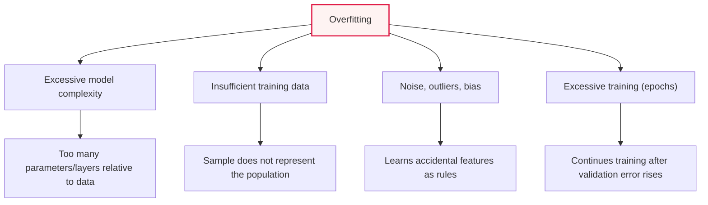
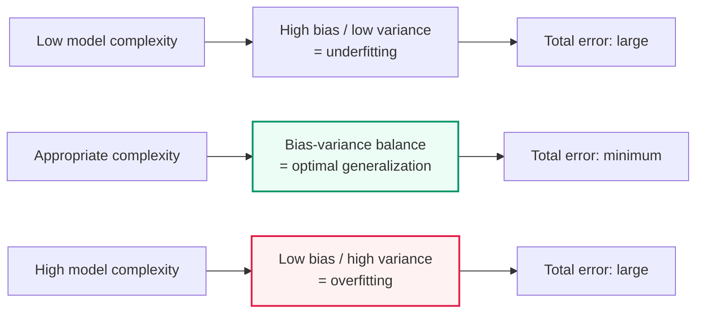

# Causes of Overfitting and Solutions

## 1. Overview

### A. Definition
> **Overfitting** is a phenomenon in which a machine learning model **fits the training data too closely, degrading its predictive performance on new data (test data and real production data)**. It refers to a state in which the model has learned not only the general rules (signal) contained in the data but also the noise and idiosyncrasies that exist only in a particular sample.

The essence of overfitting is '**the difference between memorizing and understanding**.' The true goal of training is to learn the general rules contained in data so as to predict well even on data never seen before — that is, **generalization**. But when a model is too complex or trained excessively, it memorizes the training data wholesale instead of understanding the rules. It is like the difference between a student who understands the principles behind exam questions and one who has only memorized the answers. The student who memorized answers solves previously seen problems (training data) perfectly but collapses on problems where only the numbers have changed (new data). An overfitted model likewise shows very high accuracy on training data but its performance plummets on real data.

On the opposite side is **Underfitting**. This is a state in which the model is too simple or insufficiently trained to learn even the patterns in the data. An underfitted model performs poorly on both training data and new data. Ultimately, machine learning modeling is a process of finding the **appropriate complexity (sweet spot)** between underfitting and overfitting, and a good model lies at the point where both training and validation performance are high and the gap between them is small. The theory that explains this 'balance point' quantitatively is the **bias-variance trade-off**, covered later.

### B. Why It Matters — Practical Need
Overfitting matters because high accuracy in the training phase does not at all guarantee actual service performance. For example, it is common for an image classification model that achieved 99% accuracy on training data to drop into the 70% range in the real production environment. This results from the model mistaking accidental features of the training samples, such as lighting and background, for 'rules.' In particular, deep learning models and Large Language Models (LLMs), with millions to billions of parameters, have enough expressive power to effectively memorize their training data, so controlling overfitting determines the success or failure of model quality.

Moreover, overfitting is more dangerous when combined with **data leakage** or **errors in evaluation methods**. If validation or test data leaks into training, overfitting goes undetected and 'falsely high performance' is trusted, which leads to large-scale failures after production deployment. Therefore, overfitting is not merely an algorithmic issue but something to be managed across the entire process of data splitting, evaluation design, and MLOps.

### C. Contrasting Symptoms of Overfitting and Underfitting
To quickly distinguish the two phenomena in practice, look at the combination of training and validation performance. Underfitting shows low performance on both, while overfitting shows high training performance but low validation performance. This simple marker is the starting point of diagnosis, and accurate discrimination is important because it leads the remedy (whether to increase or decrease complexity) in exactly opposite directions.

| Category | Underfitting | Overfitting |
|---|---|---|
| **Training performance** | Low | High |
| **Validation performance** | Low | Low |
| **Bias/variance** | High bias | High variance |
| **Cause** | Model too simple, insufficient training | Model too complex, insufficient data, overtraining |
| **Remedy direction** | Complexity↑, training↑, add features | Complexity↓, data↑, regularization |

## 2. Causes of Overfitting

Overfitting does not stem from a single cause but from an imbalance between 'model complexity' and 'data quality and quantity.' The structural diagram below shows how four main causes converge into overfitting.

**First, excessive model complexity** is the most fundamental cause. If the number of parameters or layers in a model is excessive relative to the amount of information contained in the data, the surplus expressive power is used to learn noise. If the degree of a polynomial regression is raised indefinitely, a wiggly curve passing through every training point is created, but that curve makes terrible predictions for new points. The more expressive the model, as in deep learning, the greater this risk.

**Second, insufficient and unrepresentative training data.** With little data, the basis for 'general rules' the model can learn is weak, making it easy to mistake accidentally observed patterns for rules. If there is sampling bias in which the sample does not represent the population, the model learns a biased worldview as-is and collapses on real data. For example, a diagnostic model trained only on data from a specific hospital suffers a sharp drop in performance on the equipment and patient populations of other hospitals.

**Third, noise, outliers, and label errors.** If training data contains measurement errors, outliers, or incorrect labels, a highly expressive model faithfully learns even these errors. Noise is inherently a non-reproducible random component, so the more it is learned, the worse performance on new data becomes. **Fourth, excessive training (too many epochs).** As training is repeated, training error keeps decreasing, but from some point validation error actually starts to increase. Continuing training past this turning point causes the model to specialize in the training data and overfit.

## 3. Solutions to Overfitting

### A. Data-Side Measures
The most fundamental and effective solution is '**securing more and more diverse data**.' With sufficient data, there is less room for the model to mistake noise for rules, and the basis for learning genuine general rules becomes stronger. However, in practice, data acquisition is constrained by cost, time, and regulation (privacy), so **Data Augmentation** becomes a realistic alternative. The diversity of training samples is increased artificially through rotation, flipping, cropping, and color transformations for images; synonym substitution and back-translation for text; and noise addition and speed changes for audio.

Data quality management is also important. Clean outliers and label errors, correct class imbalance (over/under-sampling, SMOTE), and improve collection design so that samples represent the population evenly. Recently, **synthetic data** and generative-model-based augmentation are also used, but caution is required because distorting the original distribution can actually harm performance.

### B. Model- and Training-Side Measures
On the model side, **Regularization**, which restrains complexity, is key. **L2 regularization (weight decay)** penalizes the sum of squared weights to keep weights generally small, smoothing the model, while **L1 regularization (Lasso)** penalizes the absolute values of weights, driving the weights of unnecessary features to 0 and producing an automatic feature selection effect. If the penalty strength (λ) is too large, underfitting results; if too small, overfitting; so λ itself is a tuning target.

In deep learning, **Dropout** is widely used. During training, a portion of neurons in each layer is randomly deactivated with some probability (e.g., 0.5), preventing excessive dependence on specific neuron combinations and producing an ensemble effect across many subnetworks. **Early Stopping** halts training at the point where validation error no longer improves and starts to rise, directly blocking overfitting due to excessive training. In addition, Batch Normalization, **model simplification** that reduces layers and parameters, and **Transfer Learning** that leverages pre-trained models greatly reduce overfitting when data is scarce.

### C. Validation- and Evaluation-Side Measures
Overfitting can only be addressed once it is 'diagnosed,' so a reliable validation system is essential. **Cross-Validation**, especially k-fold cross-validation, splits data into k parts and uses them alternately for validation, estimating 'generalized performance' rather than a fit that happens to be good for a particular split. Among **Ensemble** techniques, Bagging and Random Forests average the predictions of multiple models to reduce variance and mitigate overfitting. When splitting data, strictly separating training, validation, and test sets and performing hyperparameter tuning only on the validation set to prevent test set contamination are also principles for evaluating overfitting honestly.

| Measure | Category | Core Principle |
|---|---|---|
| **Data augmentation/acquisition** | Data | Sample diversity↑ → suppresses noise learning |
| **Regularization (L1/L2)** | Model | Restrains complexity via weight penalty |
| **Dropout** | Model (deep learning) | Random neuron removal, ensemble effect |
| **Early stopping** | Training | Stops training when validation error rises |
| **Cross-validation** | Evaluation | Reliably estimates generalization performance |
| **Model simplification** | Model | Reduces parameters, layers, features |
| **Ensemble (bagging)** | Model | Reduces variance by averaging multiple models |
| **Transfer learning** | Model | Compensates for small data with pre-trained knowledge |

## 4. Bias-Variance Trade-off (Deeper Principle)

The theory that runs through both overfitting and underfitting is the **Bias-Variance Trade-off**. A model's expected prediction error decomposes broadly into **Bias² + Variance + irreducible error**. Bias is the systematic error arising from missing the true relationship due to the model's simplifying assumptions, while variance is the model's sensitivity, swinging widely when the training data changes only slightly.

As the diagram above shows, increasing model complexity reduces bias but increases variance. **Overfitting is a state of high variance** (overly sensitive to changes in training data), and **underfitting is a state of high bias** (fails to learn patterns). Since total error is the sum of the two components, it is minimized at the point where the gain from reduced bias and the loss from increased variance are balanced. Reinterpreting the solutions above from this perspective makes them clear. Regularization, dropout, early stopping, and ensembles are all prescriptions that 'reduce variance,' while data augmentation reduces variance while sacrificing less bias.

However, there are recent observations that this traditional trade-off does not always hold. In very large deep learning models, a **Double Descent** phenomenon has been reported in which validation error decreases again even after the number of parameters exceeds the number of data points. This makes it difficult to define overfitting as 'solely a function of complexity' and suggests that the understanding of overfitting is still evolving in the era of large-scale models. In practice, it is safer to judge based on validation set performance rather than on assertions.

## 5. Advanced: Practical Cases and Diagnosis/Response Strategies

In real projects, the standard way to diagnose overfitting is with a **learning curve**. When training error and validation error are plotted together against epochs, if training error keeps decreasing while validation error starts rising at some point and the gap between them (generalization gap) widens, it is a clear signal of overfitting. For example, if training accuracy is 98% and validation accuracy is 75%, the 23-percentage-point gap itself is evidence of overfitting; in that case, set the early stopping point at the turning point or strengthen regularization.

A representative practical case is **medical imaging diagnostic models**. Several studies have reported cases in which a pneumonia detection model trained only on a small amount of data from a specific hospital actually learned incidental features such as the watermark and imaging angle of that hospital's X-ray equipment rather than lung lesions, and its performance plummeted at other hospitals. This is a typical overfitting combining 'lack of data representativeness + noise learning,' addressed by acquiring multi-institutional data and domain generalization techniques. As another case, **financial credit scoring and stock prediction models**, if overfitted to market patterns of a specific past period, fail when the market regime changes, so walk-forward validation that accounts for time-series characteristics and regularization are essential.

Overfitting management is also key in **large language models and recommender systems**. LLMs are known to partially memorize training data and output content from the training corpus verbatim, which also leads to privacy and copyright risks. This is addressed by data deduplication, dropout and weight decay, early stopping, and securing an amount of data proportionate to expressive power through massive datasets. In recommender systems, the problem of overfitting to a few popular items and losing diversity is mitigated through regularization and ensembles.

## 6. Considerations and Implications (Professional Engineer's Perspective)

1. **Overfitting countermeasures should be approached as a combination strategy, not a single technique.** The standard approach is to combine data acquisition (fundamental), regularization and dropout (model), early stopping (training), and cross-validation (evaluation) as appropriate to the situation. A layered prescription is needed: transfer learning and augmentation when data is scarce, dropout and batch normalization for deep learning, and cross-validation to verify generalization before production deployment.

2. **Data acquisition and quality are the fundamental solution; algorithmic prescriptions are auxiliary.** Since securing sufficient representative data is the surest way to prevent overfitting, investment in data collection, cleansing, and labeling pipelines should take priority. Simply raising regularization strength can lead into the opposite trap of underfitting, so the trade-off must be managed quantitatively.

3. **Evaluation design and prevention of data leakage are prerequisites for diagnosis.** Unless training, validation, and test sets are strictly separated and hyperparameter tuning is performed only on the validation set, overfitting goes undetected and false performance is trusted. From an MLOps perspective, data splitting, leakage checks, and validation automation must be embedded in the pipeline.

4. **Continuous management that accounts even for data drift in the operational stage is necessary.** Even if a model generalizes well at deployment time, if the input distribution changes over time (concept/data drift), it effectively becomes overfitted. Therefore, continuously managing generalization performance through in-production performance monitoring, periodic retraining, and A/B testing is the complete response from a professional engineer's perspective.

5. **In the era of large-scale models, the understanding of overfitting itself needs to be revisited.** Recent observations such as double descent show that the simple schema 'complexity = overfitting' is not always correct. Rather than committing to a particular theory, practical judgment is required to tune regularization strength, model size, and data volume based on empirical evidence such as validation set performance and learning curves.

## References
- Google Developers, "Machine Learning Crash Course — Overfitting": https://developers.google.com/machine-learning/crash-course/overfitting/overfitting
- scikit-learn, "Underfitting vs. Overfitting": https://scikit-learn.org/stable/auto_examples/model_selection/plot_underfitting_overfitting.html
- Belkin et al., "Reconciling modern machine-learning practice and the bias-variance trade-off (Double Descent)": https://www.pnas.org/doi/10.1073/pnas.1903070116

---

> **In one line**: Overfitting is a phenomenon in which *a model memorizes even the noise and idiosyncrasies of its training data, so its performance on new data plummets (high variance)*; it is caused by excessive model complexity, insufficient data, noise, and overtraining, and generalization performance is secured by combining data augmentation, regularization (L1/L2), dropout, early stopping, cross-validation, and ensembles and finding the bias-variance balance point.
