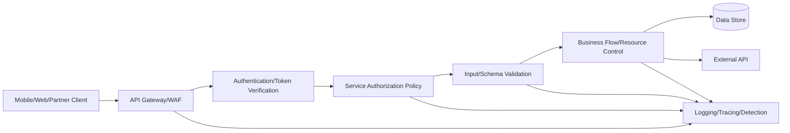
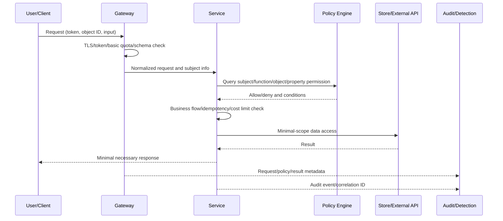

# API Security Design and Operations Based on the OWASP API Security Top 10 (2023)

## 1. Overview

> **Definition**: API security is the activity of consistently applying authentication, authorization, input validation, resource control, logging, and provider trust at the call boundaries between applications, so as to protect the confidentiality, integrity, and availability of data and business functions.

APIs directly expose far more functions and data than web screens do. Because mobile apps, partner portals, internal microservices, and batch jobs all call the same API, a single endpoint becomes a common attack surface across multiple channels. Hiding a button on the screen cannot prevent an API call; on every request, the server side must re-evaluate the subject, the target object, the function being executed, and the data attributes.

The OWASP API Security Top 10 is a risk-awareness baseline that organizes the failure patterns characteristic of APIs. This note is centered on the [official OWASP API Security Top 10 2023 list](https://owasp.org/API-Security/editions/2023/en/0x11-t10/). The 2023 edition is the second edition following the first in 2019, and it covers not only simple authentication vulnerabilities but also business-flow abuse and third-party API trust issues.

The core of API risk lies in four boundaries collapsing at once. The first is the authentication boundary that verifies the caller; the second is the authorization boundary that determines what the caller may do. The third is the resource boundary that decides how much cost and resource may be consumed, and the fourth is the operational boundary that manages which versions, hosts, and external providers are connected.

API security is therefore not a project of installing a single API gateway. It is a lifecycle-management problem that connects threat modeling at the design stage, policy enforcement in the service code, contract checks in CI/CD, detection and response at runtime, and asset cleanup at the decommissioning stage.

In an engineering-professional exam answer, rather than merely listing the risks, it is important to separate authorization at the level of "object, property, and function," to distinguish legitimate calls from automated business abuse, and to explain how authentication, authorization, throttling, and observability are bound together into a single control framework.

## 2. API Security Threat Model and Overall Structure

An API request generally passes in order through the client, the API gateway, the service, the data store, and external APIs. Each layer has different security responsibilities. The gateway improves the consistency of common policies, but because it cannot know all per-object permissions or business rules, it cannot replace the internal verification within the service.

Authentication verifies "who you are," but authorization judges "whether this subject may perform this function on this property of this object." If the two questions are merged into a single check of whether a token exists, it becomes easy to miss horizontal privilege escalation and vertical privilege escalation.

Input validation is not limited to filtering out malicious strings. Page size, sort fields, filter depth, upload size, URL destinations, enumeration values, and numeric ranges must all be validated. When the validation rules differ between the OpenAPI contract and the service implementation, an attacker finds the looser path.

Resource control is not sufficient when it counts only the number of network requests. If a single call triggers a database join, a large file conversion, an SMS send, a payment approval, or an external AI call, limits per cost unit are required. API security is not the exclusive domain of the security team but a shared responsibility of service owners and the platform team.

The following table summarizes the responsibilities per layer. The entries show where controls are located, while the actual rationale and exception handling must be left to the prose design of each service.

| Layer | Primary Responsibility | Representative Failure |
|---|---|---|
| Assets/Contract | Identifying hosts, versions, endpoints, schemas | Forgotten debug APIs and exposed old versions |
| Authentication | Issuing, verifying, and revoking tokens/sessions/keys | Forgery, reuse, insufficient expiration |
| Authorization | Judging object/property/function/business rules | Querying another user's object, calling admin APIs |
| Input/Output | Controlling schema, type, range, sensitive fields | Excessive responses, mass assignment |
| Resource/Business | Controlling rate, concurrency, cost, sensitive flows | DoS, inventory hoarding, coupon abuse |
| Integration/Operations | Verifying external APIs, configuration, logging, response | SSRF, trusting third-party data, no traceability |

## 3. Explanation by OWASP API Security Top 10 Risk

### 3.1 API1:2023 Broken Object Level Authorization

Object-level authorization (BOLA) is the problem of reading or modifying another user's resource by changing an object identifier included in the request path or body. If `9` in `/users/100/orders/9` is queried without checking whether it is the current user's order, confidentiality collapses even though login and authentication are valid.

The cause of the vulnerability is data-access code that trusts the identifier. Developers tend to mistake the presence of a numeric ID in the URL as "a state in which permission has already been verified." However, the identifier is merely routing information, not proof of authorization. Every path that queries, modifies, or deletes an object must check the subject, tenant, object ownership, and sharing state together.

In practice, this is not solved merely by switching global IDs to UUIDs. A UUID only makes guessing harder; the same problem remains if it is leaked or observed in a response. The service layer must call `authorize(subject, action, resource)`, and the tenant condition must also be included in the database query to construct defense in depth.

For example, when student A of an education platform calls their own grade API, changing it to `studentId=B` must return no result. The safest form is not to use the request's studentId as the basis for the authorization decision, but to query using the user and tenant scope obtained from the authenticated subject.

### 3.2 API2:2023 Broken Authentication

Authentication vulnerabilities encompass not only token theft but also a state in which the policies for issuing, expiring, rotating, and revoking tokens are lax. If a password-reset token lives too long, if the refresh token is not bound to a device and session, or if there is no limit on authentication failures, an attacker can take over an account through legitimate APIs.

Access tokens should be operated with a short lifetime, and refresh tokens should have reuse detection and rotation policies applied. The signing algorithm should be fixed with an allowlist, and the issuer, audience, nonce, issued-at time, and expiration time should be verified. An implementation that merely checks whether a JWT's signature is correct can create confusion by accepting a token issued by another service.

An API key does not equally guarantee user authentication and application identification. For a service that must track which end user holds a partner key, separate user authentication and actor attribution are needed. Keys must not be left in source code or URLs but injected from a vault, and it must be possible to revoke them immediately upon exposure.

High-risk operations such as login, password change, and payment approval should require re-authentication or step-up authentication. Authentication success and failure rates, changes in region or device, and refresh-token reuse must all be observed together; unconditional IP blocking can increase false positives for mobile users and NAT environments.

### 3.3 API3:2023 Broken Object Property Level Authorization

Property-level authorization is the perspective that, even when there is access permission to the object itself, the read and write permissions for each field within the object may differ. The 2023 edition groups the past problems of excessive data exposure and mass assignment into their common cause: property permission defects.

If a response object is serialized exactly as the database model, internal notes, costs, credentials, and admin flags may be exposed together. Conversely, if the JSON sent by the client is merged into the object as is, protected fields such as `role`, `approved`, and `price` can be modified. Input DTOs and output DTOs must be separated, and a per-field allowlist must be specified.

For example, a regular seller may modify a product's `name` and `description`, but must not be able to modify `sellerId`, `settlementRate`, or `approved`. Hiding the corresponding input box on the screen and verifying property permissions on the server are entirely different controls.

Masking is display control, while authorization is an access decision. Rather than returning the last digits of a resident registration number with masking, it is better simply not to query that field for a subject who does not need it for their work, which reduces its spread into logs, caches, and analytics pipelines.

### 3.4 API4:2023 Unrestricted Resource Consumption

Unrestricted resource consumption means the exhaustion of all finite resources triggered by a single request, not just request frequency. Not only CPU and memory but also database connections, storage space, email/SMS send volume, payment fees, and external AI call costs must be regarded as resources.

Applying only a fixed number of requests per second treats a cheap query and an expensive report-generation API identically. Per-endpoint weights, per-user/tenant budgets, concurrent execution counts, and limits on request body size and processing time must be designed. When a limit is exceeded, a 429 and retry guidance should be provided consistently, while avoiding responses that induce infinite retries.

The upper bounds on page size and on sort/filter conditions should be enforced on the server. Rather than processing large exports via a synchronous API, registering them in a job queue and then providing progress and a download expiration time can reduce cascading failures of request threads and web timeouts.

As a real example, if an image-conversion API allows unlimited original file sizes, an attacker can repeatedly submit large files with legitimate authentication and simultaneously consume CPU and storage. File size, pixel count, size after decompression, and a per-user daily limit must all be managed together.

### 3.5 API5:2023 Broken Function Level Authorization

Function-level authorization (BFLA) is the problem of the boundary between functions for regular users and functions for administrators collapsing. Even if the URL contains the word admin, as in `/admin/export` or `/users/{id}/suspend`, a hidden menu becomes an attack surface if the server does not check roles and policies.

Role-based access control (RBAC) is good for starting quickly, but exceptions explode as the number of roles grows. By introducing attribute-based access control (ABAC) or policy-based access control (PBAC), one can jointly judge the subject's role, organization, resource state, and request context. The important point is not the model name but whether a policy check is actually connected to every sensitive function.

Permission must not be inferred from the HTTP method alone. A `GET` may also be a function for mass extraction of personal data, and a `POST` may be a simple search. It is desirable to map the API specification's operationId to the actual policy ID and automate permission testing at the function level.

In a microservices environment, the gateway's role check and the service's internal business-permission check may differ. The gateway handles common authentication and coarse policy, while the final service, as the subject that knows the resource and business state, must make fine-grained decisions.

### 3.6 API6:2023 Unrestricted Access to Sensitive Business Flows

Unrestricted access to sensitive business flows occurs even without traditional coding errors. When a user distorts business outcomes by automating normal functions such as purchasing products, reserving seats, posting comments, or issuing coupons, the API operates technically correctly but business security fails.

This risk differs from API4 in that it requires modeling "business meaning" rather than "request count." If the same account creates new accounts and exhausts coupons from multiple IPs within a short time, or repeatedly secures inventory and cancels payments, business rules and risk signals must be evaluated together.

The countermeasure does not end with a single CAPTCHA. One combines rate limiting that links user, device, payment method, address, inventory, and time window, duplicate-request prevention, reservation expiration, step-up verification, anomaly detection, and manual review. Legitimate automation partners are granted separate quotas and contract-based allowances.

For example, a concert-ticket API, even with valid login and permissions, harms other customers' opportunities if a single account repeatedly holds and cancels seats within a short time. A time limit on seat locks, an upper bound on concurrent reservations for the same payment method, idempotency keys, and a bot risk score must be applied together.

### 3.7 API7:2023 Server Side Request Forgery

SSRF is an attack that abuses a function where the server fetches a user-provided URL, making it send requests to the internal network, metadata services, or administrative ports. The URL being well-formed is different from the destination being safe.

An allowlist-based external-domain policy should take priority, and it must not be possible to bypass the check with DNS rebinding or redirects. Private IPs, loopback, link-local addresses, and reserved address ranges must all be blocked at both the resolution result and the connection stage, and the HTTP client's redirects and protocols must be restricted.

Network segmentation is not a substitute for application verification. If the application is structured to be able to access the internal credential service, a single SSRF can expand the damage, so the metadata endpoint must be protected with a separate policy and a least-privilege network must be configured.

Image-preview or webhook-verification features are representative examples. One must analyze the data flow: whether the request URL is merely stored or actually fetched by the server, whether redirection is followed, and whether the response body is returned to an external user.

### 3.8 API8:2023 Security Misconfiguration

Security misconfiguration appears in many forms, such as default accounts, excessive CORS, debug responses, detailed stack traces, test endpoints in the production environment, and unverified HTTP methods. One must inspect the API together with the proxy, container, and cloud settings surrounding it.

Per-environment configuration should be separated from code, but the separation itself must not mean the absence of control. One establishes safe defaults, validation of required environment variables, a configuration schema, change approval, secret detection, and pre-deployment policy testing. One regularly checks that development documents and sample accounts are not left alive in production.

CORS is a browser's cross-origin access control, not authentication/authorization for the API itself. A configuration that opens allowed origins with a wildcard and allows credentials can create unintended browser calls. To protect even non-browser clients, tokens and server-side permission checks are absolutely necessary.

Error responses provide information developers need for debugging, but if the production response includes the internal hostname, SQL, tokens, or the stack, it becomes reconnaissance material for an attacker. To the outside, one returns a correlation ID and a generalized error, while leaving the details in access-controlled logs.

### 3.9 API9:2023 Improper Inventory Management

Improper inventory management is a state of not knowing where APIs are and which versions are deployed. Not only production hosts but also test/staging/partner-only hosts, GraphQL schemas, asynchronous callbacks, and serverless functions must be included in the inventory.

An API inventory is not maintained by document files alone. By cross-referencing gateway logs, DNS and certificates, the service registry, the OpenAPI repository, code routes, and the cloud deployment list, one discovers the actual exposed surface. Each asset is assigned an owner, data classification, version, authentication method, and planned decommissioning date.

When it is difficult to immediately remove an old-version API, one publishes an end-of-life schedule and gradually applies blocking of new users, feature reduction, deprecation notices in response headers, and call-volume monitoring. Simply changing `/v1` to `/v2` merely transfers the risk if the old version's vulnerable policy remains.

For example, if a development host `api-dev.example` is connected to the production database, the fact that it is not in the official documentation is not protection. External attack-surface verification and internal asset reconciliation must be performed regularly, and any discovered unregistered API must be incorporated into the owning team's lifecycle.

### 3.10 API10:2023 Unsafe Consumption of APIs

Unsafe consumption of APIs begins when an internal developer trusts a third-party API's response more than user input. Even though the external response may contain malicious values, excessive size, wrong types, delays, or errors, using it as is for storage, rendering, or command generation makes it a supply-chain attack surface.

External APIs should be modeled as a separate trust boundary. One applies TLS and certificate verification, timeouts, retry limits, circuit breaking, response schema validation, size limits, allowed content types, and output encoding. When composing SQL, HTML, shell commands, or prompts with third-party values, the same validation rules as for internal input must be applied.

One operates contract testing and monitoring of provider changes. So that the consumer fails safely even when response fields are added or their meanings change, one ignores unknown fields and handles missing required fields conservatively. One separates credentials per provider and isolates so that one provider's failure does not spread into a total service failure.

Suppose there is a service that combines weather, address, payment, and AI APIs. Inserting the address API's response into HTML without validation can become a stored XSS, and executing the AI API's result directly as a business command becomes a path for indirect prompt injection. The principle "a third-party response is also untrusted input" is the key.

## 4. Comparison Among Risks and Integrated Controls

API1 and API5 are both permission defects, but their objects of judgment differ. API1 is the problem of missing a specific object's ownership/tenant scope, while API5 is the problem of missing the permission to execute a specific function itself. One user reading another user's order is the archetype of API1, while a regular user calling an admin bulk-delete function is the archetype of API5.

API3 is the case where the object is allowed but exposure/modification at the field level is not controlled. Therefore, the three axes of object, function, and property must be separated in test cases. If the three axes are expressed with the single condition "accessible because logged in," it becomes hard to locate the defect.

API4 and API6 must also be distinguished. API4 centers on the exhaustion of resources and cost, while API6 centers on normal functions distorting business outcomes. Unlimited calls to an SMS-sending API is API4, while one person repeatedly hoarding event seats is API6. The two risks can occur together, so one connects technical quotas with business policies.

API9 and API8 have different operational-control perspectives. API9 is the problem of not knowing about existing assets, while API8 is the problem of known assets being insecurely configured. Without an inventory, the targets for configuration inspection are not even defined, so asset discovery is performed first, and then standard configuration and exception approval are managed.

| Comparison Axis | Object Authorization | Function Authorization | Resource Control | Business Flow Control |
|---|---|---|---|---|
| Question | Can I view this object? | Can I execute this function? | How much can I consume? | Does this action distort the business? |
| Primary Subject | User/tenant/owner | Role/policy/admin | User/key/IP/tenant | Account/device/payment method/behavior history |
| Failure Result | Information exposure/tampering | Privilege escalation/abuse of admin functions | DoS/cost explosion | Damage to inventory/coupons/reputation |
| Key Verification | Ownership at object query | Per-operation policy | Weighted quota/concurrency | Rate/duplicate/risk-based policy |

An integrated design uses the following defense-in-depth flow.

As in the diagram, the gateway check handles fast common blocking, while the service uses the business context. Even if the policy engine is centralized, misconfiguring the policy inputs repeats a wrong decision centrally, so per-service policy testing and approval procedures are needed.

## 5. Implementation, Verification, and Operations Procedure

The first step is to identify assets and data flows. In the API list, one records host, version, authentication method, sensitive data, owner, and external dependencies, and defines the actors and objects of each endpoint. The gap between documentation and actual traffic is registered as a separate risk.

The second step is to write a threat model. One makes abuse scenarios out of object-ID tampering, role changes, mass page requests, URL redirects, old-version calls, and third-party response pollution. For personal-data, payment, and admin functions, one jointly evaluates the scale of damage and detectability.

The third step is to codify contracts and policies. One version-controls OpenAPI schemas, JSON Schema, policy files, sensitive-field classification, and quota definitions. A reviewer must be able to understand the allowed subjects and deny conditions from the documents alone, and undefined defaults are set toward deny.

The fourth step is automated verification. One checks in CI the expiration/issuer/audience of authentication tokens, cross-access to object IDs, per-role function calls, property mass assignment, limit exceedance, SSRF address blocking, and old-version exposure. Tests distinguish 401 from 403 so as not to confuse authentication failure with authorization failure.

The fifth step is operational observability. One records, in structured form, the request ID, subject/tenant/API version/operationId/policy decision/response code/latency/resource cost, while masking tokens and sensitive bodies. One sets alerts on abnormal object-ID patterns, surges in 403, old-version calls, quota exceedance, and changes in the external API schema.

The sixth step is incident response and decommissioning. One rotates tokens/keys, progressively restricts attacking accounts/devices/networks, and computes the affected objects and tenants. When decommissioning an API version, one manages customer notice, caller migration, the blocking point, audit-log retention, and rollback plans in an operations runbook.

## 6. Case: A Multi-tenant Commerce API

Assume a commerce system provides product-lookup, cart, order, coupon, payment, and shipment-tracking APIs. If order lookup verifies only `orderId`, API1 occurs; if it accepts the `isAdmin` property from the input JSON, API3 occurs. If a regular user can call `/admin/refund`, it becomes API5.

Coupon issuance is a representative flow of API6. Even if a user legitimately holds the issuance permission, the issuance count per account/device/payment method, the campaign inventory, and the time window must all be judged together. To process a request only once even if resent, one uses idempotency keys and server-side state transitions.

A preview feature where the server fetches a product image URL can trigger API7. One queries only allowed image domains, blocks internal addresses and redirection, and processes it in a separate network sandbox. The size and format of the image response are also validated to prevent resource exhaustion.

Inserting a carrier API's response into the screen as is becomes an API10 problem. One converts the carrier's response into an internal DTO and stores only allowed fields, and isolates failures, delays, and schema changes. By separating the keys and quotas of the payment/shipping/coupon providers, one prevents an incident at one vendor from expanding to the entire account.

As the case shows, the risks are not independent checklists. Because order-lookup authorization, coupon business rules, image URL verification, and carrier response verification are bound into a single transaction flow, the domain owner, beyond per-API owners, must be responsible for end-to-end control.

## 7. In Depth: An API Security Program and Exam Linkage

The OWASP list is both a classification table showing vulnerability-diagnosis results and a list of questions usable for design review. However, the phrase "compliant with the Top 10" alone cannot guarantee safety. The official list is a risk-awareness baseline, and an organization must add control levels tailored to its assets, threats, regulations, and business impact.

In the latest API environment, not only REST endpoints but also GraphQL, gRPC, event callbacks, webhooks, and AI model calls are interpreted with the same principles. GraphQL needs field-selection and query-depth limits, and gRPC requires inspection of service/method/message-field permissions. Webhooks manage sender authentication, replay prevention, signature verification, ordering, and idempotency.

API security maturity can be evaluated as a cycle of discovery, prevention, detection, response, and learning. If the inventory at the discovery stage is poor, the coverage of prevention policies is unknown, and without detection logs, a permission bypass is not reproduced even after an incident. Test cases obtained from incidents must be incorporated into contract and regression tests for the program to improve.

From the exam-linkage perspective of an engineering-professional answer, this can be connected to Zero Trust, microservices, DevSecOps, privacy protection, and cloud-native security. Viewing the API as the boundary of trust between services and presenting "always verify," least privilege, policy automation, observability, and supply-chain risk together makes the design perspective clearer than explaining a single vulnerability.

An expected answer can construct a logical flow in the order of (1) the background of API proliferation and threats, (2) the distinction of object/function/property authorization, (3) the core Top 10 risks and responses, (4) the gateway-service-data layered structure, (5) a commerce or finance case, and (6) operational metrics and considerations. Rather than simply writing each of the 10 items in a single line, one must explain why the risk arises and the limits of the control.

## 8. Considerations and Implications

### 8.1 Balance Between Security and User Experience

If strong re-authentication and CAPTCHA are applied to every request, security rises but normal usability declines. With risk-based authentication, one processes low-risk flows smoothly and places additional verification on high-damage flows such as payment, permission change, and mass download. Blocking criteria should be evaluated together with the actual false-positive rate and damage cost rather than using fixed values.

### 8.2 Central Control vs. Service Autonomy

Pushing all policies into the API gateway improves consistency but produces policies that do not know object ownership and business state. A distributed responsibility model is realistic, in which the platform provides common authentication/transport/basic quota, and the service owns object/field/business rules. The policy format and audit events are standardized so that autonomy does not lead to a break in control.

### 8.3 Data Minimization and Auditability

The more logs one keeps for detection, the more personal data and secrets can spread. Instead of raw bodies, one records hashes, identifiers, and classification results, and restricts log access and retention periods to match the purpose. Conversely, if one masks so heavily that subject, object, and policy decisions cannot be linked, computing the incident scope becomes impossible, so a recoverable correlation design is needed.

### 8.4 Trade-off Between Performance and Security Controls

Adding authorization-policy queries and external risk analysis as synchronous calls increases latency and failure points. One combines a short-TTL policy cache, local verification, asynchronous detection, and circuit breaking, while placing a cache-invalidation strategy suited to permission revocation and data sensitivity. So that a security control does not become a bypassable optimization, one establishes a default-deny-on-failure principle.

### 8.5 Multi-tenancy and Data Boundaries

If the tenant ID is received solely from client input, object authorization can repeatedly break. One designs the token's tenant scope, cross-organization sharing contracts, the database's row-level conditions, and cache keys together. Operators must periodically run canary tests that detect cross-tenant queries.

### 8.6 Supply Chain and External API Dependencies

One treats even a normal response from an external API as untrusted input, and equips it with contracts, security inspection, failure isolation, key rotation, and an end-of-life plan. Functions dependent on external services must prepare alternative paths and manual-processing procedures so that availability degradation does not turn into a security bypass.

### 8.7 Performance Measurement and Continuous Improvement

The performance of API security is not evaluated by the number of vulnerabilities alone. One manages, as metrics, the time to discover an unregistered API, the decommissioning rate of old versions, the pass rate of object-authorization tests, the miss rate of policy-decision logs, the key-rotation time, the detection time for patterns above 403, and the incident recovery time. So that metrics do not become a device that punishes the development team's velocity, one measures risk reduction and learning together.

## References

- OWASP, "OWASP Top 10 API Security Risks – 2023": https://owasp.org/API-Security/editions/2023/en/0x11-t10/
- OWASP, "Introduction - OWASP API Security Top 10": https://owasp.org/API-Security/editions/2023/en/0x03-introduction/
- OWASP API Security Project: https://owasp.org/www-project-api-security/

---

> **In one line**: API security is not about strengthening authentication alone but a defense-in-depth design that connects object/property/function authorization, resource/business-flow control, asset inventory, and external API verification across the entire lifecycle.
