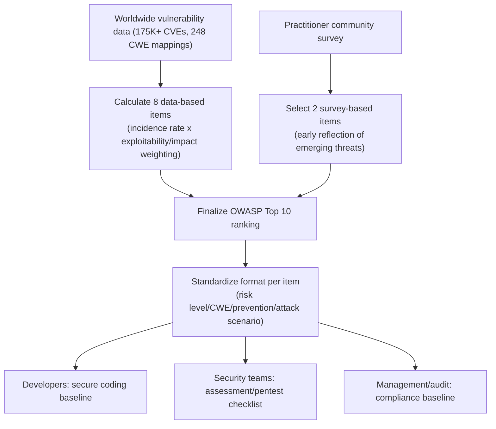
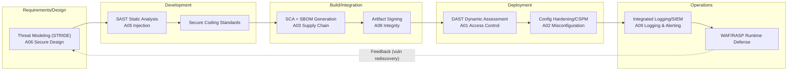

# OWASP Top 10 (Web Application Security Risks)

## 1. Overview

> The **OWASP Top 10** is a list of the top 10 most frequent and dangerous security risks in web applications, selected and published by OWASP (Open Worldwide Application Security Project), a nonprofit open community, based on real-world vulnerability data from applications worldwide and expert surveys. It is also a de facto standard awareness document for the industry.

Web applications are a frontline attack surface constantly exposed to the internet. Unlike internal systems that can be hidden behind a firewall, the web must serve an unspecified number of users over the open HTTP(S) protocol, so if any one of authentication, authorization, or input validation collapses, it leads directly to data leakage, privilege takeover, or service paralysis. The problem is that most of these defects arise not from the absence of new technology but from the **repeated omission of already well-known basic controls**. The OWASP Top 10 distills precisely these "most commonly repeated failures" from data, presenting the points that developers, security personnel, and executives should prioritize.

There are three needs behind its emergence. First, the need for a **common vocabulary**. If developers, security teams, auditors, and commissioning organizations discuss vulnerabilities with different terminology, communication costs explode. The Top 10 provides a standard classification such as "A01 Broken Access Control," unifying communication among stakeholders. Second, the need for **prioritization**. Because security budget and staff are finite, defending first against risks with high occurrence frequency, exploitability, and impact yields a greater return on investment. Third, **compliance linkage**. Many regulations and certifications such as PCI-DSS, electronic financial supervision regulations, and the Personal Information & Information Security Management System (ISMS-P) effectively require or reference response to the OWASP Top 10, so it has become, beyond a mere technical guide, a baseline for regulatory response.

The OWASP Top 10 is revised on roughly a 4-year cycle (2013→2017→2021→2025), and the latest edition, the **2025 revision, was unveiled at the Global AppSec conference in November 2025 and finalized in January 2026**. The 2025 edition was selected by combining more than 175,000 CVEs, mappings to 248 CWEs (Common Weakness Enumeration), and a practitioner survey, so its data-driven nature was further strengthened.

The core characteristics of the OWASP Top 10 can be summarized as follows.

- **Risk-centered classification**: It deals not with individual vulnerabilities but with higher-level risk categories bundling multiple CWEs, suitable for establishing defense priorities.
- **Dual selection of data + survey**: It combines measured vulnerability statistics (lagging) and expert surveys (leading) to reflect both past data and emerging threats.
- **Developer-oriented practicality**: For each item it provides prevention methods and attack scenarios in a standard format, so it is used for immediate response.
- **De facto standard/compliance baseline**: It has established itself as a reference referred to by many regulations and certifications such as PCI-DSS, financial supervision regulations, and ISMS-P.
- **Periodic evolution**: Revised on roughly a 4-year cycle, it continuously tracks changes in the threat environment.

## 2. Selection Methodology and Document Structure

The OWASP Top 10 is grounded in methodology, not intuition. The ranking of items is largely determined by two axes. **8 items are calculated from measured data (CVE/CWE statistics)**, and **2 items are selected by a Community Survey**. Data-based items weight-compute the "Incidence Rate" and "Exploitability/Impact," while the survey-based items are a mechanism to reflect early the latest threats that are not yet sufficiently captured by CVEs but whose danger practitioners feel. Thanks to this dual structure, the Top 10 can hold both the lagging nature of past data and the leading nature of future threats.

Each risk item is described in a consistent format of risk level (factor/impact), representative CWE, description, How to Prevent, Example Attack Scenarios, and references. This standard format helps developers immediately grasp "what the problem is, why it is dangerous, and how to block it." The diagram below shows the overall structure of the selection pipeline and its outputs.

A point that must be clearly distinguished here is the fact that what the Top 10 lists are not individual "Vulnerabilities" but higher-level "Risk Categories" bundling multiple CWEs. For example, dozens of detailed CWEs are mapped even to the single A01 Broken Access Control. Therefore, the Top 10 is not a complete checklist but an **awareness document**, and from an engineering-professional perspective, one must keep in mind that actual verification should be accompanied by detailed standards such as the OWASP ASVS discussed later.

## 3. OWASP Top 10:2025 Detail by Item

The top 10 risks of the 2025 revision are as follows, and the principle and response direction of each item are explained in order.

| Rank | Risk Category | Core Cause | Representative Defense |
|------|-----------|-----------|-----------|
| A01 | Broken Access Control (absorbing SSRF) | Missing/bypassed authorization checks | Server-side authorization enforcement, Deny by default |
| A02 | Security Misconfiguration | Defaults/unnecessary features/error exposure | Hardening, minimal functionality |
| A03 | Software Supply Chain Failures (new) | Vulnerable/tampered dependencies | SBOM, SCA, signature verification |
| A04 | Cryptographic Failures | Plaintext/weak algorithms | Strong crypto/transport & storage encryption |
| A05 | Injection | Combining untrusted input into commands | Parameter binding/validation |
| A06 | Insecure Design | Absence of threat modeling at design stage | Threat Modeling, PbD |
| A07 | Authentication Failures | Weak authentication/session management | MFA, session protection |
| A08 | Software or Data Integrity Failures | Unverified updates/deserialization | Signing/integrity verification |
| A09 | Logging & Alerting Failures | Delayed detection/response | Integrated logging, real-time alerting |
| A10 | Mishandling of Exceptional Conditions (new) | Defective exception/error logic | Fail-safe |

**A01 Broken Access Control** is, following the 2021 edition, the undisputed number one in the 2025 edition as well. A representative defect is that authentication has passed but authorization is lax, so a regular user accesses another person's data or admin functions merely by changing the URL/identifier (ID). For example, an IDOR (Insecure Direct Object Reference) where changing `/account?id=1001` to `id=1002` queries someone else's account is the archetype. In the 2025 edition, SSRF (Server-Side Request Forgery), previously a separate item, was integrated into this category, based on the judgment that the server accessing internal resources via a user-specified URL without verification is also essentially "access crossing a permission boundary." The core of defense is not to trust client-side controls but to **authorize every request on the server side based on session/role, with deny by default**.

**A02 Security Misconfiguration** rose sharply from 5th in the 2021 edition to 2nd. As the proliferation of cloud/containers/IaC caused configuration elements to explode, mistakes such as leaving default accounts, opening unnecessary ports/services, exposing detailed error messages, and public cloud storage bucket settings surged. In fact, a substantial number of large cloud data-leak incidents originate not from vulnerabilities but from configuration errors such as "a misconfigured, publicly open S3 bucket." The response is to standardize a secure baseline (hardening baseline) and continuously inspect with IaC scanning and CSPM (Cloud Security Posture Management).

**A03 Software Supply Chain Failures** is the new top item of the 2025 edition, expanding the 2021 edition's "Vulnerable and Outdated Components" to the entire supply chain. Today, 70–90% of application code is open source/third-party dependencies, and if one popular library is contaminated, tens of thousands of systems that use it are infected simultaneously. Cases such as the SolarWinds incident, malicious package injection into npm/PyPI, and Log4Shell (Log4j) demonstrated the ripple power of supply-chain threats. The response is creating an SBOM (Software Bill of Materials), mapping known vulnerabilities (CVEs) with SCA (Software Composition Analysis), signature/hash-based artifact integrity verification, and applying a supply-chain integrity framework such as SLSA.

**A04 Cryptographic Failures** is the defect of storing/transmitting sensitive information in plaintext, or using weak algorithms (MD5, SHA-1, DES), short keys, or hardcoded keys. The defense is TLS 1.2/1.3 for the transport segment, AES-256 for stored data, adaptive hashes such as bcrypt/Argon2 for passwords, and separate key management with KMS/HSM. **A05 Injection** encompasses SQL/OS command/LDAP/XSS and occurs when untrusted input is combined directly into an interpreter's command/query. Parameter binding (Prepared Statement), ORM, input allowlist validation, and output encoding are the standard responses.

**A06 Insecure Design** is a defect of the design itself rather than an implementation bug, the case where "the code operates exactly as designed, but that design is dangerous." For example, if the password-reset logic includes a flow that allows account enumeration, the risk remains no matter how perfectly the coding is done. This is fundamentally removed only by **applying Threat Modeling and Privacy/Security by Design from the design stage**. **A07 Authentication Failures** includes weak password policies, neglect of credential stuffing, and poor session-token management, and is countered by MFA, account lockout, and safe session expiration.

**A08 Software or Data Integrity Failures** is the problem of trusting updates/plugins without signing/verification, or of arbitrary objects being executed through insecure deserialization. **A09 Logging & Alerting Failures** is not the attack itself but the "absence of detection/response," causing the mean time to detect (MTTD) to stretch to months because there are no logs even when a breach occurs or no alert sounds. The 2025 edition changed the name to include "Alerting" to emphasize the importance of real-time response. Finally, the new item **A10 Mishandling of Exceptional Conditions** is a risk arising from poorly designed logic for error/exceptional conditions, encompassing cases where an authorization check is skipped when an exception occurs (fail-open), sensitive information is exposed in error messages, or state inconsistency results. This is defended by robust error handling and the **fail-safe/fail-closed principle**.

## 4. Comparison of 2021 → 2025 Changes and Their Implications

Comparing the 2021 and 2025 editions clearly reads the shift in the center of gravity of web security. It is not merely a change in ranking; it shows that the industry's perception of "what is dangerous" has **expanded from inside the application code to the supply chain, configuration, and operations as a whole**.

| Category | 2021 Edition | 2025 Edition | Meaning of the Change |
|------|--------|--------|-------------|
| 1st | A01 Access Control | A01 Access Control | Still the greatest threat, scope expanded by absorbing SSRF |
| New/Rise | A05 Security Misconfiguration | Rose to A02 | Reflects configuration risk of cloud/IaC proliferation |
| New | (None) | A03 Supply Chain Failures | Surge in open-source dependency/supply-chain attacks |
| New | (None) | A10 Mishandling of Exceptional Conditions | Reflects emerging attacks actually observed in operations |
| Integration | A10 SSRF (independent) | Integrated into A01 | Reclassification of the essence of permission-boundary violation |
| Rename | A09 Logging & Monitoring Failures | A09 Logging & Alerting Failures | Emphasis on real-time detection/response |

The practical implications of this change are clear. First, **the boundary of security responsibility is no longer the developer's alone.** As the supply chain (A03) and configuration (A02) rose to the top, one must defend integrally not just through code review but through the CI/CD pipeline, infrastructure configuration, and dependency management. This becomes the basis for accelerating the shift to DevSecOps. Second, **defects at the design and operations stages came to the fore.** A06 Insecure Design and A10 Mishandling of Exceptional Conditions are both "pre-implementation" and "post-implementation" problems, hard to catch with a vulnerability scanner and prevented only by threat modeling, architecture review, and robustness design. Third, as in the SSRF integration case, **reclassification of risk simplifies the defense strategy** — rather than treating SSRF separately, bundling it into the single principle of "permission-boundary control" broadens coverage.

As a concrete example, the 2021 Log4Shell (Log4j, CVE-2021-44228) vulnerability was a representative supply-chain incident in which a defect in a single logging library put hundreds of millions of systems worldwide at risk of remote code execution (RCE), directly forming the background for A03 becoming a new top item. Also, statistics that many cloud leak incidents originated not from code vulnerabilities but from publicly configured storage buckets (A02) support the rise of misconfiguration.

Meanwhile, one must also be careful in interpreting the ranking, which is a weighting of "occurrence frequency" and "impact." Some risks have low occurrence frequency but are fatal once they erupt (e.g., supply-chain contamination from an integrity failure), while others have high frequency but limited individual impact. Therefore, a low rank does not necessarily mean a low defense priority, and it is practically valid to re-weight the Top 10 according to an organization's business characteristics, data sensitivity, and regulatory environment. For example, in domains with high data sensitivity such as finance and healthcare, one places relatively greater weight on A04 Cryptographic Failures and A01 Access Control.

## 5. Practical Response Procedure — SSDLC/DevSecOps Integration

If the OWASP Top 10 is used as a post-hoc inspection checklist, its effect is halved. Its true value is exercised when it is used as a baseline to **embed security across all stages of the software development lifecycle (SDLC) (Shift-Left)**. That is, one maps items to each point of the pipeline: defending A06 with threat modeling at the requirements/design stage, A05 with secure coding and SAST at the development stage, A03 with SCA/SBOM at the build stage, and A02/A09 with DAST/configuration inspection/integrated logging at the deployment/operations stage. Below shows this integration from an architectural perspective.

The core of this pipeline is to enforce that **automated security verification at each stage's Gate must be passed before proceeding to the next stage**. For example, if an SCA scan finds a known vulnerability (CVE) of High severity or above, the build is failed, fundamentally blocking a vulnerable dependency from reaching production. The WAF/RASP at the operations stage functions as a compensating control for residual risk not yet removed, and new attack patterns detected here are fed back into threat modeling to continuously improve defense. In actual financial-sector cases, after introducing such gate automation, the pre-deployment vulnerability detection rate improved significantly, and defects previously found at the operations stage were pulled forward to early development, with a large reduction in remediation cost being reported.

Here it is worth noting the role distinction between WAF (Web Application Firewall) and RASP (Runtime Application Self-Protection). A WAF is an external line of defense that blocks known attack patterns (signatures) at the application front end (network boundary); it can quickly apply rules without deployment to provide virtual patching for new vulnerabilities, but has the limitation of not knowing the application's internal context. In contrast, RASP is inserted inside the application runtime and judges by looking at the actual execution flow and data context, so it has few false positives and is precise, but comes at the cost of performance overhead and language/framework dependency. The two controls are not exclusive, and **defense in depth that layers boundary defense (WAF) and internal defense (RASP)** is recommended. However, one must clearly recognize that these runtime controls are ultimately supplements for residual risk missed by SDLC embedding, and do not replace fundamental defect removal.

## 6. In Depth — The OWASP Ecosystem and Latest Trends

The OWASP Top 10 "Web" list is only part of the vast OWASP project ecosystem, and in an engineering-professional answer, discussing it in connection with extended standards is a high-scoring point. Representatively, the **OWASP API Security Top 10** is a separately managed list as APIs became a core attack surface with the proliferation of MSA/mobile backends, dealing with API-specific risks such as object-level authorization (BOLA), function-level authorization, and unrestricted resource consumption. Also, the **OWASP Top 10 for LLM Applications** is an emerging threat of the generative AI era, defining prompt injection, insecure output handling, training data poisoning, model denial of service, and sensitive-information disclosure. This suggests that integrated response will be needed as web/API/AI applications converge going forward.

Extended standards on the verification/maturity side are also important. The **OWASP ASVS (Application Security Verification Standard)** provides actually verifiable detailed requirements (levels 1–3) beyond the awareness level of the Top 10, so it becomes the basis for defining and assessing security requirements. The **OWASP SAMM (Software Assurance Maturity Model)** is a framework that measures and improves an organization's security-capability maturity, helping Top 10 response settle as an organizational capability rather than a one-time event. The developer-practice vulnerable applications **WebGoat/Juice Shop** and **OWASP Proactive Controls**, which proactively present risk controls, are also used together.

Three latest trends draw attention. First, as confirmed in the 2025 revision, **the center of risk is shifting from code to the supply chain and operations**, and SBOM/SLSA/signature verification are becoming mandatory. Second, **AI acts as a double-edged sword** — the attacking side automates vulnerability discovery and exploit generation with LLMs, while the defending side responds with AI-based code review and anomaly detection. Third, as regulations/certifications (electronic finance, the Personal Information Protection Act, ISMS-P, the trend toward mandating supply-chain security) effectively adopt the OWASP standard as a reference, Top 10 response is being elevated beyond a technical task to a **governance/compliance task**.

## 7. Considerations and Implications (Engineering-Professional Perspective)

- **A parallel strategy of awareness document and verification standard**: The OWASP Top 10 is an awareness-raising material that tells the "most common risks," not a complete set of security requirements. Therefore, in building/auditing an actual system, one sets priorities with the Top 10 but must fill coverage gaps by combining detailed verification standards such as ASVS and CWE Top 25. Declaring "security complete" with the Top 10 alone is a dangerous misunderstanding.

- **Shift-Left and cost trade-off**: The earlier a defect is caught at the design stage, the exponentially lower the remediation cost (the remediation cost at the operations stage is dozens of times that at the design stage). Pulling threat modeling/SAST/SCA forward into the pipeline is the standard, but early on there is a trade-off of reduced development velocity and the burden of handling false positives. One must minimize this friction by adjusting gate thresholds based on risk level and raising automation precision.

- **Enterprise-wide spread of supply-chain security**: The rise of A03 means security responsibility expands beyond the development team to procurement, legal (licensing), and operations. Governance is required that manages the SBOM as an organizational asset and institutionalizes vendor risk assessment and artifact integrity verification as standard processes. This can be seen as extending the Zero Trust principle ("never trust without verification") to the supply chain.

- **Sustainability of defense and cultural settlement**: As the 4-year revision cycle shows, threats continue to evolve, so Top 10 response at a specific point in time is only a snapshot. One must continuously measure organizational maturity with SAMM and, through DevSecOps culture and a Security Champion system, have developers internalize security as an everyday capability. The settlement of people and processes, rather than tool adoption, ultimately determines success or failure.

- **Extended response in the AI-convergence era**: As web/API/LLM applications converge going forward, a threat model that integrally considers the OWASP Top 10 (Web)/API Top 10/LLM Top 10 will be needed. Especially when combining generative AI into a service, prompt injection and data-leakage risks must be designed in connection with the existing injection/access-control perspectives.

## 8. References

- OWASP Top 10:2025, OWASP Foundation — https://owasp.org/Top10/
- OWASP Top Ten Project (project home) — https://owasp.github.io/www-project-top-ten/
- OWASP Top 10 2025: Key Changes, Orca Security — https://orca.security/resources/blog/owasp-top-10-2025-key-changes/
- OWASP Top 10 2025: What's New, Semgrep — https://semgrep.dev/blog/2026/owasp-top-10-2025-whats-new/

---

> **In one line**: The OWASP Top 10 is a web-application top-10 security-risk awareness standard selected from real vulnerability data and surveys; the 2025 revision keeps Access Control (A01) at the peak while newly reflecting Supply Chain Failures (A03) and Mishandling of Exceptional Conditions (A10), showing that the center of gravity of risk has shifted from code to the supply chain, configuration, and operations — it becomes effective only when embedded Shift-Left across all SDLC stages and used in parallel with extended standards such as ASVS and SAMM.
