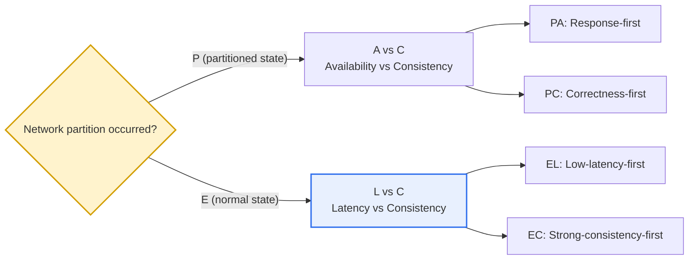
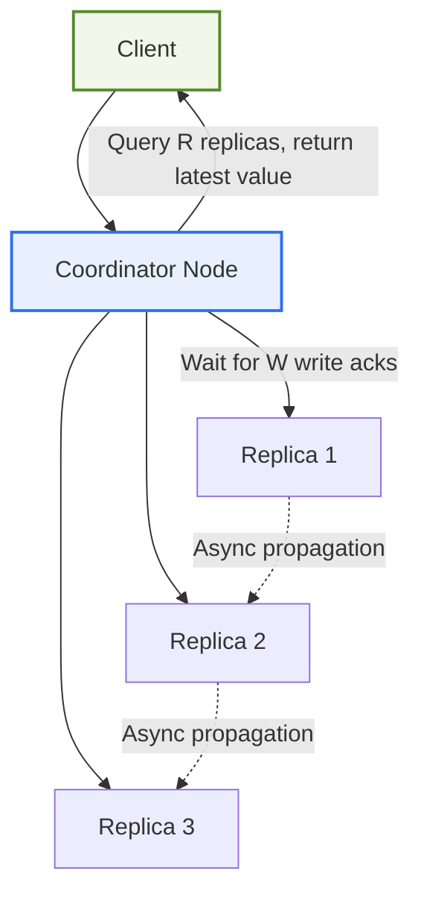

# Limits of the CAP Theorem and the PACELC Theorem

## 1. Overview

### A. The CAP Theorem and Its Limits
> The **CAP theorem** is the theorem that a distributed system cannot simultaneously satisfy all three of **Consistency, Availability, and Partition tolerance**, and that when a network partition occurs, at most two can be guaranteed. It was proposed by Eric Brewer in 2000 and formally proved by Gilbert and Lynch in 2002.

The core insight of the CAP theorem is that '**when the network is severed (partition), one must give up either consistency or availability**.' Here, one must precisely pin down the meaning of each property to avoid misunderstanding. Consistency (C) means that all nodes see the same latest data at the same point in time (strictly, linearizability); Availability (A) means that a normal node must respond to every request; and Partition tolerance (P) means that the system keeps operating even if messages between nodes are arbitrarily delayed or lost. A common misconception here is the phrasing "choose two of the three," which is a half-baked understanding.

In a distributed system, a partition (P) in which communication between nodes is severed can occur at any time due to wide-area network failures, data-center outages, switch errors, and so on, so it is in effect **not a choice but a premise to be endured**. Unless the network can be perfectly trusted, a real-world distributed system cannot give up P. Then the actual choice narrows not to CA but to a dichotomy between **C and A at the moment a partition occurs**. When a partition arises, to preserve latest-data consistency (C) one must block responses from a node that cannot confirm synchronization with other nodes, thereby losing availability; and to respond unconditionally (A) one may return stale, unsynchronized data, thereby losing consistency.

However, CAP has a **decisive limitation**. It is that it deals only with '**when a partition has occurred**.' In reality, in large-scale distributed systems, network partitions are relatively rare events, and the system spends most of its time in a 'normal state' with no partition. Then, when normal, what does the system choose between consistency and response speed? CAP gives no answer to this. That is, CAP cannot explain the design trade-off of the normal state, which occupies more than 99% of a system's lifetime. What filled this gap is PACELC.

### B. The Background of PACELC's Emergence
To supplement CAP's limitation of explaining only the exceptional situation of a partition, in 2010 Daniel Abadi of Yale University proposed PACELC, which **also includes the trade-off of the normal state**. His problem awareness was clear. "When actually choosing a distributed database, the real question a developer faces is not 'what to give up when a partition occurs' but 'how slow is acceptable and how accurate must it be in normal times.'" For example, a system that places replicas across multiple data centers creates latency from replica synchronization itself even without a partition. This everyday latency-consistency balance is outside CAP's framework, so Abadi established a broader framework that includes CAP as a subset.

## 2. Structure of the PACELC Theorem

> **PACELC**: The theorem that if a partition (**P**) occurs, one must choose between availability (**A**) and consistency (**C**), and if not (**E**lse), between latency (**L**) and consistency (**C**). It is read literally as "if **P** then **A** or **C**, **E**lse **L** or **C**."

Underlying this normal/partition branching is a 'replication' structure. Whether it is the L-C choice of the normal state or the A-C choice of the partitioned state, it is ultimately decided by how writes are acknowledged across multiple replicas and from which replica reads are processed. Below shows the structure in which the client, coordinator, and replicas interact in Quorum-based replication; how the R and W values are set in this arrangement determines the position on the EL/EC spectrum.

In this structure, if one sets `W` (the number of write acknowledgments) and `R` (the number of reads to query) large to satisfy `R + W > N`, one always reads the latest value and approaches strong consistency (EC), but the coordinator must wait for responses from more replicas, so latency increases. Conversely, lowering them to `W=1, R=1` confirms only the single nearest replica, minimizing latency (EL) but creating the risk of reading a stale value from another replica to which the write has not yet propagated. As such, PACELC coordinates shift on a single architecture merely through parameters, and this is the reality of the modern distributed DB's 'tunable consistency.'

### A. Partitioned State (PA/PC) — The Region Overlapping with CAP
The front half of PACELC (P → A or C) is in effect identical to CAP. In a situation where the network is partitioned and node groups cannot communicate with each other, the system must decide whether each group independently accepts and processes requests (PA), or whether the side that cannot obtain confirmation from the majority group refuses to respond (PC). For example, data where a wrong value is fatal, such as a bank account balance, should choose PC so that a minority of partitioned nodes refuse writes; and data where a brief discrepancy is harmless, such as a shopping cart or a 'like' count, is better off choosing PA to respond first and merge later (conflict resolution).

The implication of this choice in practice lies in clarifying the 'definition of availability.' Even a system that chooses PA does not give up consistency indefinitely; after the partition is resolved, it converges the data with techniques such as vector clocks, last-write-wins (LWW), or CRDTs. That is, it is availability premised on 'Eventual Consistency.' Conversely, a PC system, even if it fails some requests during a partition, always guarantees that the successful responses are accurate.

### B. Normal State (EL/EC) — PACELC's Unique Contribution
PACELC's true core contribution lies in revealing the back half, that is, the trade-off of the **normal state (Else)**. Even without a partition, to keep data strongly consistent across multiple replicas, a write request can respond only after confirming that it has been reflected to all (or a quorum of) replicas, so the response becomes slow (Latency↑). For geographically distant data centers, due to the physical limit of the speed of light, the round-trip time (RTT) reaches tens to hundreds of ms, so this cost is by no means small.

Conversely, to reduce latency, one loosens replication synchronization, reading and responding from only the single nearest replica (asynchronous replication) or accepting a write without majority confirmation. In this case the response is fast, but a value just written to another node may not yet have propagated, so one may read a stale value, conceding consistency. In the end, the system is **constantly choosing between latency and consistency** even in normal times, without the exception of a partition. In the Quorum scheme, this balance is adjusted by whether one satisfies the `R + W > N` condition (the sum of the read/write quorums is greater than the number of replicas); satisfying it approaches strong consistency (EC), and lowering R and W moves toward low latency (EL).

| Type | On Partition (PA/PC) | In Normal (EL/EC) | Representative Examples | Representative Uses |
|---|---|---|---|---|
| **PA/EL** | Availability-first | Low-latency-first | Cassandra, DynamoDB, Riak | Cart, session, log, recommendation |
| **PC/EC** | Consistency-first | Strong-consistency-first | Traditional RDBMS, VoltDB, HBase | Financial ledger, inventory, reservations |
| **PA/EC** | Availability-first | Consistency-first | MongoDB (depending on config) | Balance adjusted by tuning |
| **PC/EL** | Consistency-first | Low-latency-first | PNUTS (Yahoo), some configs | Region-proximity reads + remote strong-consistency writes |

A point to note here is that the above classification is not an absolute label but represents the **default setting**. For example, Cassandra is PA/EL by default, but raising the read/write consistency level to `QUORUM` tunes it close to EC. MongoDB, too, moves along the spectrum from EC to EL depending on `writeConcern` and `readConcern` settings. That is, modern distributed DBs provide not a single fixed point but a range on the 'Tunable Consistency' axis, and PACELC serves as a coordinate system for understanding that axis.

## 3. Comparison of CAP and PACELC

The difference between the two theorems is not simply that 'PACELC explains more,' but lies in **how far each captures the decision points a designer actually faces**. CAP emphasizes the extreme choice in the rare crisis situation of a partition, but that emphasis rather amplified misunderstanding. Many developers say "our DB is CA," but as long as P cannot be given up, CA is a combination that does not hold in a distributed environment, and what they actually meant was usually "it maintains strong consistency in normal times (EC)." PACELC clears up this confusion by explicitly stating this axis of the normal state.

| Category | CAP | PACELC |
|---|---|---|
| **Situation Covered** | Only on partition | On partition + in normal |
| **Trade-off** | C vs A | (P)A vs C + (E)L vs C |
| **Normal-state Explanation** | Impossible | Possible (L vs C) |
| **Proposal Time/Proposer** | 2000, E. Brewer | 2010, D. Abadi |
| **Practicality** | Limited (crisis-centered) | Explains the entire lifecycle |

There are two practical implications from the comparison. First, choosing a DB by CAP alone gets excessively absorbed in the rare scenario of "what to give up on partition," missing the latency-consistency balance that actually determines the daily user experience. Second, from PACELC's view, it is revealed that even within the same 'AP family,' the normal-time consistency policy (whether EL or EC) differs, greatly splitting the actual perceived performance and accuracy. For example, Cassandra (PA/EL) and a theoretical PA/EC system behave the same on partition but differ in read freshness in normal times.

### A. The Difference Seen Through a Concrete Scenario
Drawing one actual situation makes the difference between the two theorems clear. Suppose there is a global commerce service with replicas in two regions, Seoul and Virginia. The network is mostly normal, but the inter-region round-trip latency reaches about 180 ms. From CAP's perspective, one can only ask "if the two regions are severed (partition), which side will be stopped." But the problem faced at every moment in actual operation is "will we confirm a Seoul user's order all the way to the Virginia replica and then respond (EC, +180 ms), or confirm only the Seoul replica and respond immediately (EL)?" This everyday question is precisely PACELC's Else axis, which CAP cannot answer.

Here the nature of the data governs the choice. For data where double-selling is fatal, such as inventory deduction, one chooses EC and accepts the latency; for data where a brief discrepancy is harmless, such as product view counts or recently viewed products, one chooses EL to preserve responsiveness. In the end, even within a single service, setting different PACELC coordinates per transaction type is the realistic design.

## 4. In Depth — Design Application Cases and Latest Trends

### A. Industry Application Cases
**Amazon DynamoDB** is a representative of the PA/EL family; originally starting from requirements like a shopping cart where "an add must never appear to fail," it prioritized availability and low latency. However, since 2018 it has added a strong-consistency read option (`ConsistentRead`) and transactions (TransactWriteItems), evolving so that one can choose EL or EC per data nature within a single system. This is a case showing that PACELC types are not fixed but are combined to match requirements.

**Google Spanner** is in an interesting position. With precise time synchronization called TrueTime (based on atomic clocks and GPS), it provides external consistency even in a geographically distributed state, aiming for PC/EC. However, strong-consistency writes incur commit-wait latency, so it shows the very essence of EC that "one accepts latency for consistency." That is, even Spanner is not free from the physical laws and PACELC trade-offs, and it is more accurate to understand that it achieved an engineering feat that minimizes that cost.

### B. Latest Trends
The recent trend in distributed databases is toward **subdividing the 'choice of consistency per situation and data.'** NewSQL (CockroachDB, YugabyteDB, etc.) tries to provide distributed scalability and strong-consistency transactions together, which can be seen as a compromise that defaults to PC/EC while reducing latency with region-proximity placement. Also, intermediate models between strong consistency and eventual consistency, such as 'Causal Consistency,' are drawing attention, which is an attempt to extend PACELC's L-C axis into a continuous spectrum rather than a dichotomy. However, the maturity and adoption breadth of such recent compromise models vary greatly by product/version, so when adopting them it is safe to confirm the guarantee level with the product's official documentation.

### C. Common Misconceptions and Cautions
A misconception often seen in the field is the phrase "our system is CA." As seen earlier, in a distributed environment where P cannot be given up, the CA combination does not hold, and a system claiming so is usually either a single node (not distributed) or actually means 'strong consistency in normal times (EC).' Another misconception is regarding the PACELC label as an immutable property of a product. In reality, most distributed DBs move across the EL~EC range by configuration, so rather than "this DB is EL," it is more accurate to describe it as "this DB is EL by default and is adjustable up to EC via quorum settings."

Therefore, in an architecture review, rather than accepting a product label as is, one must confirm the actual read/write consistency settings to be applied and verify whether that combination simultaneously satisfies each data's accuracy requirement and the latency SLA.

## 5. Considerations and Implications (Engineering-Professional Perspective)

1. **The everyday latency-consistency choice is substantively more important.** Partitions are rare, but the system operates in the normal state for most of its lifetime, so PACELC's Else (L vs C) choice governs the actual user experience (response speed, data freshness). In a design review, one must explicitly decide not only "response to partition" but also "the normal-time consistency policy."
2. **Apply different policies per data nature.** As with choosing EC (strong consistency) where accuracy is decisive, such as financial ledgers, inventory, and reservations, and EL (low-latency, eventual consistency) where speed and availability matter, such as SNS feeds, recommendations, and view counts, one designs a differentiated per-data policy (polyglot persistence) even within a single service.
3. **It is a compass for NoSQL/NewSQL choices.** When choosing a distributed DB such as Cassandra (PA/EL), Spanner (PC/EC), or DynamoDB (PA/EL + tuning), one clearly understands the trade-offs with the PACELC classification and adjusts per situation with tunable-consistency options (R/W quorum, writeConcern, etc.). [[nosql]]
4. **Design on the premise that consistency is a spectrum, not a dichotomy.** Between strong consistency and eventual consistency there are various intermediate models such as causal, read-your-writes, and monotonic reads, so one chooses the minimal consistency level that exactly fits the requirement to avoid unnecessary latency cost.
5. **Connect trade-offs with SLA and cost.** Strong consistency increases latency and infrastructure cost (quorum replication, wide-area RTT), so one must weigh the response-time SLA, business risk level, and operating cost together to find a balance point that prevents both waste from over-consistency and incidents from under-consistency.
6. **Verify with actual settings, not the product label.** Even the same product moves across EL~EC depending on quorum/writeConcern settings, so when reviewing adoption, rather than trusting a catalog classification as is, it is safe to confirm with a benchmark the actual consistency parameters to be applied and the guarantee level of that combination.

## References
- Daniel Abadi, "Consistency Tradeoffs in Modern Distributed Database System Design", IEEE Computer, 2012: https://www.cs.umd.edu/~abadi/papers/abadi-pacelc.pdf
- Gilbert & Lynch, "Brewer's Conjecture and the Feasibility of Consistent, Available, Partition-Tolerant Web Services", 2002: https://groups.csail.mit.edu/tds/papers/Gilbert/Brewer2.pdf
- Wikipedia, PACELC theorem: https://en.wikipedia.org/wiki/PACELC_theorem

---

> **In one line**: CAP has the limitation of explaining only *a choice between C and A on partition*, while PACELC adds to this the *latency (L) vs consistency (C)* trade-off in normal times, providing a practical coordinate system that guides distributed-system design choices suited to the nature of the data across both partitioned and normal states.
