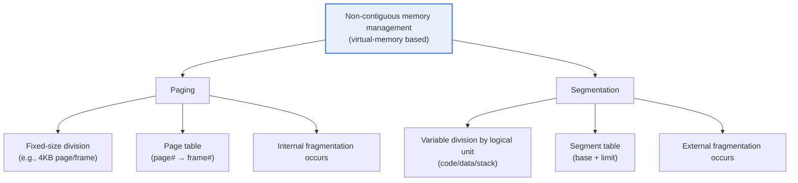
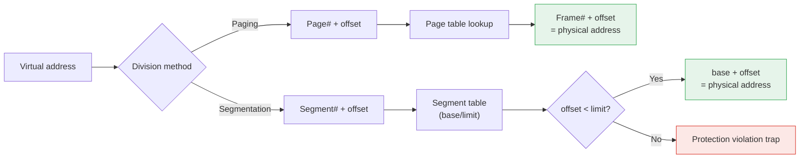

# Operating System Memory Management: Paging and Segmentation

## 1. Overview

### A. Definitions
> **Paging** is a non-contiguous memory management technique that divides physical memory into equally sized **page frames** and a process's logical address space into equally sized **pages**, and places pages scattered across physical memory on a per-page basis. **Segmentation** is a technique that divides a program into variable-sized segments of **logical units** such as code, data, and stack, and manages them.

Both techniques are non-contiguous allocation methods that implement **Virtual Memory**, sharing the commonality of placing a program scattered throughout physical memory and, via address translation, making it appear contiguous to the process. The MMU (Memory Management Unit) translates the **logical (virtual) address** used by a process into a **physical address** at execution time; thanks to this, the program does not need to know the actual location in physical memory and can use an address space larger than the actual memory.

However, they differ fundamentally in '**what they divide by**.' Paging cuts **mechanically at a fixed size (e.g., 4KB)** regardless of the program's meaning, while segmentation cuts by the program's **logical semantic units** (functions, arrays, stacks, etc.). This one difference splits all the characteristics of fragmentation, protection, and sharing. Paging has uniform chunk sizes, so free-space management is simple, but it ignores logical boundaries, making protection and sharing awkward; segmentation is logically natural and makes protection and sharing easy, but its sizes vary, so free-space management is complex.

### B. Background of Emergence and Necessity
The early **contiguous allocation** method had to load an entire process into a 'single contiguous region' of physical memory. This method had two clear limitations. First, as processes were repeatedly loaded and unloaded, small free spaces scattered throughout memory worsened fragmentation, creating situations where a large process could not be loaded even though the total was sufficient. Second, a program larger than physical memory could not be executed at all.

Paging and segmentation solve this problem by finely dividing a process and placing it scattered across physical memory. Because an entire process no longer needs to be loaded contiguously, memory can be used densely, and with **demand paging** — which loads only the chunk needed at the moment into memory and keeps the rest on disk (swap area) — one realizes an address space larger than physical memory. This is the foundation on which all general-purpose operating systems today came to have virtual memory.

## 2. Concepts and Address Translation Structure

After first surveying the overall structure of the two techniques, we examine the address-translation procedure of each.

**Address translation in paging.** Paging interprets a virtual address as two parts: a '**page number + offset within the page**.' The MMU finds the corresponding **frame number** by the page number in the per-process **page table** and combines the offset with it to complete the physical address. Because the page and frame sizes are equal, the offset is used as is, and if the size is a power of 2 (e.g., 4KB=2^12), the low bits of the address become the offset and the high bits become the page number, so translation is handled by simple bit splitting. This regularity is the key that lets paging be implemented quickly in hardware.

**Address translation in segmentation.** Segmentation interprets a virtual address as a '**segment number + offset within the segment**.' The MMU obtains that segment's **start address (base)** and **limit** by the segment number in the **segment table**. If the offset is less than the limit, it computes the physical address as 'base + offset'; if it is at or above the limit, it is access beyond the segment boundary, so it raises a **trap (exception)** to prevent intrusion into another process's memory. That is, segmentation has the characteristic that **protection and sharing occur naturally**, since it places base, limit, and permissions (read/write/execute) per logical unit.

| Category | Paging | Segmentation |
|---|---|---|
| **Division Basis** | Fixed size (physical) | Logical unit (variable size) |
| **Virtual Address Composition** | Page number + offset | Segment number + offset |
| **Mapping Table** | Page table | Segment table (base/limit) |
| **Fragmentation** | **Internal fragmentation** | **External fragmentation** |
| **Protection/Sharing** | Per page (limited/unnatural boundary) | Natural by logical unit |
| **Perspective** | Physical-management perspective | User/logical perspective |
| **Address Translation** | Simple (bit splitting) | Involves boundary check |

## 3. The Fragmentation Problem: Internal vs. External

It is critically important that the decisive weakness of the two techniques is a different kind of fragmentation. Fragmentation means 'memory that is usable but is actually wasted without being used,' and which side it occurs on split the fate of the techniques.

**Paging produces internal fragmentation.** Because the page size is fixed, if a process's size is not an integer multiple of the page size, the **last page** is usually not full. This leftover space is allocated to that page, so it is wasted, unusable by other processes. The waste is at most 'page size − 1' per process, and on average about half the page size. For example, with a 4KB page, if a process is 10KB, 3 pages (12KB) are allocated and about 2KB is discarded as internal fragmentation. If one reduces the page size to reduce this waste, a conflict arises in that the page table grows.

**Segmentation produces external fragmentation.** Because segment sizes vary, repeated allocation and deallocation scatter large and small free-space fragments throughout memory. A situation arises where, **even though the total of those fragments is sufficient, there is no contiguous large space**, so a large segment cannot be loaded. To mitigate this, **compaction** — which gathers the scattered free spaces to one side — is needed, but this is costly because it moves running processes, so it is hard to perform frequently. This very management difficulty of external fragmentation is the fundamental reason pure segmentation was pushed out of the mainstream.

In summary, internal fragmentation is 'unusable space within an allocated chunk,' and external fragmentation is 'unusable space scattered between chunks.' Paging makes chunk sizes uniform to eliminate external fragmentation at the source while accepting a small amount of internal fragmentation, whereas segmentation makes the opposite choice, gaining logical naturalness while bearing external fragmentation.

| Category | Internal Fragmentation | External Fragmentation |
|---|---|---|
| **Occurring Technique** | Paging (fixed size) | Segmentation/contiguous allocation (variable size) |
| **Cause** | Last page not full | Free space scattered into small fragments |
| **Waste Location** | Inside the allocated page | Between allocated blocks |
| **Upper Bound of Size** | At most 'page size − 1' per process | Increases as it accumulates (non-deterministic) |
| **Mitigation** | Adjust page size | Compaction, switch to paged scheme |

## 4. Paged Segmentation (Combined Technique) and Actual Application

To take only the advantages of both techniques, modern architectures use paged segmentation, which **divides a segment again into pages**. One divides a program into segments, which are logical units, to gain the **advantages of protection and sharing**, while dividing each segment again into fixed-size pages and placing them scattered across physical memory to **eliminate external fragmentation**. It is a compromise that combines segmentation's logical advantages with paging's physical management convenience. Here, address translation proceeds in the order 'segment table → (that segment's) page table → frame,' passing through tables twice.

**Actual case — x86 architecture.** The early x86 (80386) was a representative case that hierarchically combined segmentation and paging. However, practical operating systems (Linux/Windows) have effectively neutralized segmentation (flat memory model) by setting the segment base to 0 and the limit to the maximum, operating with **paging at the center**. And in 64-bit (x86-64), most of segmentation's base/limit checking functions were abolished, clearly showing that today's general-purpose OS memory management is **overwhelmingly dominated by multi-level paging**. This demonstrates that 'management simplicity and elimination of external fragmentation (paging)' held greater value in practice than 'logical elegance (segmentation).'

**Actual case — large address spaces and multi-level page tables.** In a 64-bit address space, a single page table becomes unrealistically large. So Linux hierarchizes it into 4–5-level page tables, creating only the lower tables of the address regions actually used when needed, thereby saving table memory. This is the practical way paging scales to large systems.

**Demand Paging and page replacement.** The actual mechanism by which paging realizes an address space larger than physical memory is demand paging. Rather than loading all of a process's pages into memory from the start, **it loads a page from disk only at the moment it is actually accessed (a page fault)**. Thanks to this, a process behaves as if its entire address space is in memory while in reality only the active pages (working set) occupy physical memory.

When a new page is needed while physical memory is full, a **page replacement algorithm** intervenes to decide which page to evict. There are LRU (evict the page least recently referenced), Clock (an LRU approximation), Optimal (OPT), and so on, and the key to performance is avoiding **thrashing**, where replacement is so frequent that the process cannot do work and only repeats page I/O. That segmentation, being a variable-size unit, makes such uniform replacement and loading difficult is one of the reasons paging became the standard for virtual memory.

## 5. In Depth: TLB and Performance, Expected Exam Directions

**Acceleration via the TLB (Translation Lookaside Buffer).** Paging's fundamental overhead is that it must 'access the page table (memory) for address translation,' and in multi-level tables this access is repeated as many times as the number of levels. That is, it reads memory several times just to read data once. To mitigate this, a **TLB — a very-high-speed associative memory that caches recent translation results (page→frame) — is placed inside the MMU**. On a TLB hit, the physical address is obtained immediately without memory access; only on a miss is the page table searched. The TLB hit rate is usually very high, above 99%, so paging's translation cost is in effect mostly hidden. A **Huge Page (e.g., 2MB/1GB)** lets one TLB entry cover a wider region, raising the TLB hit rate and improving the performance of memory-intensive workloads such as databases and virtualization.

**Latest trends.** In virtualization environments, **Nested/Extended Page Tables**, which accelerate guest-host double address translation in hardware, have become standard, and on the security side, per-page permissions (execution prevention via the NX bit) and ASLR (Address Space Layout Randomization) are implemented on top of the paging structure. That is, paging is expanding into a foundational mechanism spanning performance, virtualization, and security, beyond mere memory saving.

**Expected exam directions.** In the engineering-professional exam, forms frequently required are: (1) explaining the concepts and address translation of paging and segmentation with diagrams, (2) contrasting the difference and causes of internal and external fragmentation, (3) discussing how paged segmentation combines the two techniques, and (4) describing the roles of TLB, multi-level page tables, and demand paging from a performance perspective. An answer that develops in the order **'definition → address translation structure → fragmentation comparison → combination/practice → performance (TLB) and implications'** attains completeness.

## 6. Considerations and Implications

From an engineering-professional perspective, one must comprehensively consider the following when designing and evaluating memory management techniques.

1. **Paging-based approaches became mainstream because of the severity of external fragmentation.** Pure segmentation is logically elegant and advantageous for protection and sharing, but the cost of managing external fragmentation (compaction) is high, so modern systems adopt paging or paged segmentation. In design, one must clearly recognize the trade-off between 'logical naturalness' and 'fragmentation management cost.'

2. **The trade-off of page-size selection.** A smaller page reduces internal fragmentation but enlarges the page table and lowers TLB efficiency. A larger page is the opposite. Depending on workload characteristics (random access vs. sequential large-scale access), using base pages and huge pages in parallel is the practical solution.

3. **Address-translation overhead and TLB dependency.** The translation cost of multi-level paging depends on the TLB hit rate, so access patterns with frequent TLB misses (large-scale random access) suffer large performance degradation. One must mitigate this with huge pages and TLB-friendly data-structure design, and in performance tuning, observe TLB misses as a key metric.

4. **Paging as a protection/security foundation.** Per-page permissions (read/write/execute), the NX bit, ASLR, and inter-process address-space isolation are all implemented on top of the paging structure. Memory management is not merely an efficiency issue but a foundation of system security and stability, so the design of this layer is more important the greater the demand for trusted execution and isolation.

5. **Extension to virtualization/cloud.** Nested paging, memory overcommit, page sharing (KSM), and so on are directly tied to the cloud's resource density. To simultaneously achieve performance isolation and memory efficiency in a multi-tenant environment, one must understand the characteristics of the paging layer and tune the hypervisor settings.

## References
- A. Silberschatz, "Operating System Concepts", Memory Management overview: https://www.os-book.com/
- Linux Kernel Documentation, "Page Tables": https://docs.kernel.org/mm/page_tables.html
- Intel 64 and IA-32 Architectures Software Developer Manuals (Paging): https://www.intel.com/content/www/us/en/developer/articles/technical/intel-sdm.html

---

> **In one line**: Paging has *internal fragmentation from dividing at a fixed size*, while segmentation has *external fragmentation from dividing into variable-sized logical units*; modern OSes combine the advantages of both with paged segmentation, which re-divides segments into pages, and with multi-level paging, accelerate address translation with the TLB, and this layer becomes a common foundation for performance, virtualization, and security.
