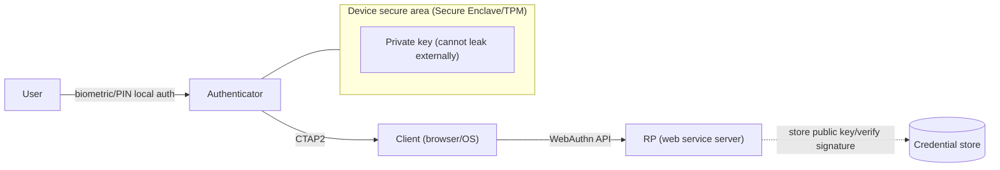
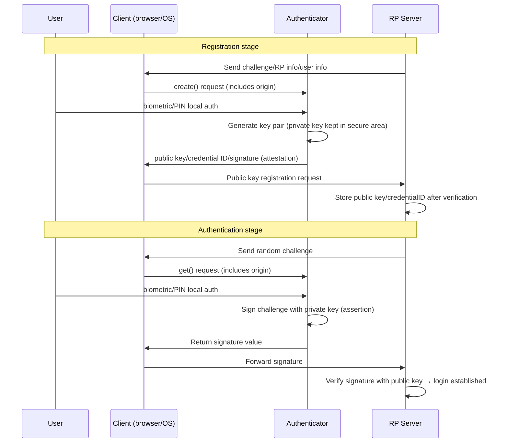

# Passkey and FIDO2/WebAuthn

## 1. Overview

### A. Definition

> A **Passkey** is a **passwordless** authentication credential that, based on the FIDO2 standard (WebAuthn + CTAP), logs into a service using a **public-private key pair** stored on the user's device. The private key never leaves the device's secure area (Secure Enclave, TPM, etc.), only the public key is registered with the service, and authentication is performed by **signing a challenge** with the private key through device unlock (local authentication) such as biometrics or a PIN.

A passkey is not the name of a particular product but a consumer-friendly name for a **credential created with a FIDO2 authenticator** standardized by the FIDO Alliance and W3C. Whereas a traditional password is a method of "the user sharing with the server a secret string that the user knows," a passkey is a method of "the device generating a signature value with its private key and the server verifying it with the public key," so the essential difference is that a shared secret does not exist on the network or the server.

### B. Background of Emergence and Necessity

In authentication-incident statistics, the majority of breaches still originate from passwords. Because of the memory burden, users reuse the same password across multiple services, which becomes the soil for **Credential Stuffing**, where a leak at one place spreads to other services. Also, passwords are fundamentally vulnerable to **Phishing**. If a fake site tricks a user into entering their password, from the server's perspective it cannot be distinguished from a normal login. Even adding OTP/SMS second-factor authentication, **AiTM (Adversary-in-the-Middle) phishing**, which relays codes intercepted in real time, and **MFA fatigue attacks**, which wear the user down, bypass it.

These limits arise from the structural property that a password is a "shared secret." Because the user, the server, and (sometimes) an intermediary must know the same value, that value can be stolen at any time during transmission, storage, and re-entry. Even if the server stores the password as a hash, it becomes a target for offline cracking upon leakage, and mass-leak incidents recur. A passkey is an attempt to fundamentally remove this family of problems by **eliminating the shared secret itself**. Because the private key is never transmitted, there is nothing to steal via a server leak, and because the authentication value is **bound** to a specific domain, a signature is not even created for a fake site.

Policy-wise as well, the US NIST SP 800-63B presents a phishing-resistant authenticator as a requirement for the highest assurance level (AAL3), and major big tech (Apple, Google, Microsoft) built passkeys into their OSes, browsers, and accounts by default over 2022–2024. As a result, passkeys have entered the stage of establishing themselves as a standard login method for mass services, beyond an experimental technology.

## 2. Overall Structure and Components

FIDO2 is largely composed of the sum of two specifications. One is **WebAuthn (W3C standard)**, a JavaScript API between the web application and the browser, and the other is **CTAP2 (Client to Authenticator Protocol)**, a communication protocol between the browser/OS (platform) and an external authenticator (security key/phone). With these two interlocking, a web service can request public-key-based authentication in the same way regardless of the physical form of the authenticator.

Explaining the components from a principle perspective: the **RP (Relying Party)** is the web service that demands login; it stores the user's public key and credential identifier at registration and verifies the signature at login. The **client** is the browser and OS; it receives WebAuthn API calls and communicates with the authenticator via CTAP2, playing the role of the **key mediator of phishing resistance** that accurately conveys the requested domain (origin) information to the authenticator. The **authenticator** is the entity that generates and stores the private key and performs signing, divided into a **platform authenticator** built into the device (a phone's fingerprint/face, a PC's Windows Hello, etc.) and a **roaming (external) authenticator** connected via USB/NFC (a security key such as a YubiKey).

The decisive mechanism by which a passkey's security holds is that the private key never leaves the **hardware secure area**. The signing operation is performed inside the secure area and only the result value comes out, and to initiate this operation the user's local authentication (biometrics/PIN) must precede it. Therefore, even if the device is physically stolen, a signature cannot be created without unlocking, so the two factors of "possession (device)" and "biometric/knowledge (unlock)" are naturally combined.

## 3. Authentication Procedure — Registration and Authentication

A passkey's operation must be understood in two stages: **Registration/Attestation** and **Authentication/Assertion**. Registration is the process of first planting the public key in the service, and authentication is the process of proving identity thereafter at every login by signing, with the private key, the challenge issued by the server.

At the registration stage, the server sends a random **challenge**, its own domain information (RP ID), and user identification information to the client. The client calls `navigator.credentials.create()`, passing along the actually accessed origin at this time. After confirming the user's local authentication, the authenticator **generates a key pair** dedicated to that service, keeps the private key in the secure area, and returns the public key, credential ID, and (optionally) authenticator attestation. The server verifies this and binds the public key to the user account.

At the authentication stage, the server issues a new challenge each time, and this **randomness** is the key to preventing a **replay attack**. A previously captured signature is invalid for a different challenge. The authenticator signs a bundle of "challenge + origin info + signature counter" with the private key, and the server verifies this with the stored public key. Here, **origin binding** creates phishing resistance. A passkey registered by the user at `bank.com` is bound to the RP ID `bank.com`, so at a fake domain such as `bank-login.com`, which looks identical, the browser conveys a different origin, so the authenticator does not create a valid signature in the first place. Even if the user is fooled, the protocol is not fooled.

Meanwhile, many authenticators also provide a **signature counter** that increases each time a signature is made. If the server finds a counter smaller than or equal to the previous value, it can suspect cloning of the authenticator, so this is used as a clone-detection means for hardware authenticators.

## 4. Types — Synced Passkey and Device-bound Passkey

Passkeys are divided into two types by the **mobility** of the private key, and this distinction determines the trade-off between security assurance level and usability.

A **Synced Passkey** is a form in which the private key is **encrypted and replicated/synced** across multiple devices through a cloud account such as Apple iCloud Keychain or Google Password Manager. Even if the user buys a new phone, the passkey follows once they recover only the login account, so they gain the great convenience that device loss does not immediately lead to account loss. In exchange, because the private key moves within the cloud ecosystem, the trust boundary of security extends from individual hardware to the **cloud account and its recovery procedure**. That is, the security of the cloud account itself becomes the last line of defense.

A **Device-bound Passkey** is a form in which the private key absolutely never leaves a specific device, like a hardware security key such as a YubiKey. There is virtually no risk of cloning or leakage, so it is suitable where the highest assurance level is needed, such as government, finance, and enterprise administrator accounts, but if the device is lost, that credential cannot be recovered, so an operation that **registers multiple authenticators as backups** is required.

The table below compares the two types with traditional authentication means, but since the selection criteria are not revealed by the table alone, the context is explained afterward.

| Category | Synced Passkey | Device-bound Passkey | Password+OTP |
|------|--------------|----------------|-------------|
| Private-key mobility | Synced to cloud | Cannot move off device | N/A (shared secret) |
| Phishing resistance | High (origin binding) | High (origin binding) | Low (AiTM bypassable) |
| Device-loss response | Auto-inherited via account recovery | Backup key essential | Reset procedure |
| Suitable area | Mass consumer services | High-assurance (admin/finance) | Legacy overall |

The core of the choice is "recovery convenience vs. private-key control." For mass services, user churn (account lockout) is a cost, so a synced passkey is realistic; for privileged accounts where the damage from a breach is enormous, maximizing control with a device-bound passkey is reasonable. In practice, a design that **differentially applies** the two types according to account risk level is recommended.

## 5. In Depth — Relationship with Existing Authentication Systems and Adoption Strategy

One must distinguish that a passkey does not replace OAuth 2.0/OIDC but strengthens its **first gate, user authentication**. If OIDC deals with the federation problem of "safely conveying who logged in to other services," a passkey changes the **primary authentication means** by which the IdP (Identity Provider) actually authenticates the user, from a password to a public-key signature. In fact, large IdPs adopt passkeys as the login method and take the combination of issuing the result as an OIDC token.

From an adoption perspective, the biggest real-world challenge is **gradual migration and account recovery**. Because existing password-based users cannot be moved overnight, one usually uses a phased method: (1) after password login, induce passkey registration, and (2) thereafter propose the passkey first for login while leaving the password as a fallback. The problem is that if a **weak recovery path such as a password or SMS reset remains, the overall security drops to that level**. An attacker aims at the back door of "find password" instead of breaking through the strong passkey head-on. Therefore, the recovery path too must be redesigned to be phishing-resistant with multiple passkeys, verified devices, offline recovery codes, and the like, to gain the true effect.

In an enterprise environment, an **Attestation** policy that verifies the authenticator's trustworthiness is important. A regulated industry may require attestation so that only hardware authenticators meeting a specific certification standard (e.g., FIPS-validated) are allowed, but this lowers convenience by preventing users from using just any device and raises privacy concerns (device-model identification). Conversely, mass services do not require attestation, accepting any authenticator to reduce adoption friction. As such, the level of attestation requirement is a policy lever that sets the balance point of security, convenience, and privacy.

## 6. Considerations and Implications

From an engineering-professional perspective, passkey adoption must be approached not as a simple login UI replacement but as a **redesign of the authentication architecture and risk-management strategy**.

- **Adoption strategy (phased/differentiated adoption)**: Approach based on risk level rather than a full switch. Secure convenience with synced passkeys for general users, while a **per-account-tier differentiated policy** that mandates device-bound hardware keys for privileged accounts such as administrators and finance is realistic. During the coexistence period with legacy systems, gradually reduce the password rather than removing it entirely.

- **Trade-off (security vs. recoverability)**: The more the private key is confined to the device, the safer, but the harder loss recovery; the more it is synced to the cloud, the more convenient, but the trust boundary passes to the cloud account. In particular, so that the **recovery path does not become the weakest link**, one must design both multiple backup-authenticator registration and phishing-resistant recovery procedures. Beware the mistake of placing a weak back door beside a strong front door.

- **Outlook (a passwordless future)**: With built-in defaults in major OSes/browsers, passkeys are expected to spread as a standard login method going forward, and coupled with regulators' demand for phishing resistance, they will expand into the finance/public sectors. However, cross-platform portability (transferring passkeys between different ecosystems) and standardization of account recovery are the remaining challenges for mass adoption.

- **Related technologies and governance**: A passkey functions as a strong identity-verification axis of Zero Trust, and its effect is maximized when combined with MFA, anomalous-behavior detection, and device-trust assessment. At adoption, an integrated design from a governance perspective is needed, spanning a privacy impact assessment (clearly notifying that biometric information is processed only within the device and not transmitted to the server), access-control policy, and audit-logging system.

## References
- W3C, "Web Authentication: An API for accessing Public Key Credentials (WebAuthn)" — https://www.w3.org/TR/webauthn-2/
- FIDO Alliance, "Passkeys (Passwordless Authentication)" — https://fidoalliance.org/passkeys/
- NIST, "SP 800-63B Digital Identity Guidelines: Authentication and Lifecycle Management" — https://pages.nist.gov/800-63-3/sp800-63b.html

---

> **In one line**: A passkey is FIDO2 (WebAuthn+CTAP)-based passwordless authentication that places the private key in the device's secure area and logs in with a domain-bound public-key signature, fundamentally blocking phishing, credential stuffing, and server leaks — while the choice of synced/device-bound type and the design of the recovery path determine success or failure.
