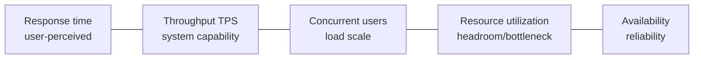

# Key Performance Indicators of Information System Performance Requirements

## 1. Overview

### A. Definition
> A non-functional requirement (NFR) that defines the **performance targets an information system must meet in a quantitative and measurable way**. It is expressed as numerical targets such as response time and throughput, and becomes the objective basis for design, construction, acceptance, and SLA contracts.

Performance requirements specify not "what it does (function)" but "**how fast and how stably it does it (quality)**." Even if the functional requirements are met, a system is regarded as a failure if its performance is poor — for example, if a query works but takes 30 seconds, users will not use that system. Therefore, performance must be treated as a core requirement no less than function.

### B. Background of Emergence and Necessity
If performance requirements remain in **vague expressions** such as "fast, stable," developers, the commissioner, and the acceptance reviewer come to have different expectations, causing disputes at the completion stage. This is because the number of servers and the architecture needed differ completely depending on whether it is "within 3 seconds" or "within 10 seconds." Quantified performance indicators (1) become the basis for **capacity planning and architecture design**, (2) provide the **acceptance criteria for load testing**, and (3) enable objective judgment of **SLA/task fulfillment**. This is why performance requirements must be pinned down with numbers from the start.

## 2. Key Performance Indicators

Performance indicators move interconnectedly. As **concurrent users** increase, the **throughput** requirement grows, and when throughput reaches its limit, **resource utilization** saturates and **response time** surges. Therefore, the indicators must be defined **together**, not individually.

- **Response Time**: The time taken from when a user sends a request until they receive the result, directly reflecting **user-perceived performance**. Using only a simple average hides a few slow requests, so it is practical to define it on a percentile basis, such as "**95th percentile within 3 seconds**."
- **Throughput/TPS**: The number of items processed per unit time (transactions per second), indicating **the amount of work the system can handle (capability)**. If response time is from the individual-request perspective, throughput is from the overall-processing perspective.
- **Concurrency (number of concurrent users)**: The scale of users connected/being processed at the same point in time, defining the size of the load. One must distinguish 'connected users' from 'active users who actually generate requests' to avoid over- or under-estimation.
- **Utilization**: The usage ratio of CPU/memory/disk I/O/network, showing **headroom and bottlenecks**. Typically, CPU 70–80% is set as the threshold to leave headroom even at peak.
- **Availability**: A reliability indicator expressed as uptime (e.g., 99.9% → about 8.8 hours of downtime allowed per year), backed by **MTBF/MTTR**.
- **Scalability**: The ability to maintain performance by adding resources when load increases, specifying whether to scale up or out.

| Indicator | Perspective | Definition Example |
|---|---|---|
| **Response time** | User-perceived | 95%ile within 3 seconds |
| **Throughput (TPS)** | System capability | 500 TPS |
| **Concurrent users** | Load scale | 10,000 active |
| **Resource utilization** | Headroom/bottleneck | Peak CPU 80% or below |
| **Availability** | Reliability | 99.9%, MTTR 30 minutes |
| **Scalability** | Growth response | Auto-scaling support |

## 3. Considerations When Writing Requirements

Performance targets are meaningful only when defined **together with measurement conditions**. This is because even the number "500 TPS" has a completely different difficulty of achievement depending on whether it is at normal times or peak, and whether the data is 100,000 records or 100 million. Therefore, one specifies the following together.

- **Specify measurement conditions**: Pin down as premises the peak/normal distinction, data volume, and concurrency level.
- **Quantifiability/verifiability**: Prescribe the number, unit, target value, and the **measurement method** together, agreeing even on "how it will be confirmed."
- **Peak-load basis**: For systems with instantaneous surges, such as year-end tax settlement or course registration, one must estimate based on the **maximum-load point** to prevent actual failures.
- **SLA linkage**: Align the contracted service level (e.g., availability 99.9%, response-time target) with the requirement numbers to clarify the boundary of responsibility.

## 4. Verification Methods

Defined targets must be verified by testing. **Performance (load) testing** confirms whether the indicators are met at the target load, **stress testing** confirms the limit point (critical load), and **soak (endurance) testing** confirms degradation such as memory leaks under long-term operation. A **BMT (Benchmark Test)** compares candidate products/architectures under identical conditions to pre-verify the achievability of the targets, and at the operations stage, **APM** continuously monitors actual indicators to catch SLA violations early.

| Method | Timing | Object of Confirmation |
|---|---|---|
| **Performance/load testing** | Construction/acceptance | Meeting target-load indicators |
| **Stress testing** | Construction | Limit point/failure behavior |
| **BMT** | Before adoption | Product/architecture comparison |
| **APM monitoring** | Operations | Continuous indicators/SLA |

## 5. Considerations and Implications
- **Direct connection to design**: Performance requirements determine capacity planning and architecture (caching, load balancing, DB indexing), so they must be fixed early in the requirements-definition phase; changing them later incurs large re-design costs.
- **Bottleneck analysis and tuning**: When a target is not met, rather than blindly adding servers, first find the bottleneck (slow queries, lock contention) through profiling, and combine scale-up/out with code/query tuning.
- **Trade-off**: Performance, cost, and complexity conflict. Excessive performance targets waste cost, so set an **appropriate level based on actual workload**.
- **Outlook/linkage**: With cloud **auto-scaling** and **Observability**, performance management is becoming automated and continuous, and in an MSA environment, per-service indicators and distributed tracing become the core of performance management.

---

> **In one line**: Performance requirements are non-functional requirements that define *response time, throughput (TPS), concurrent users, resource utilization, availability*, and the like in a quantitative and verifiable way together with peak load and measurement conditions; they become the basis for capacity planning and architecture and are verified and managed through performance testing, BMT, and APM.
