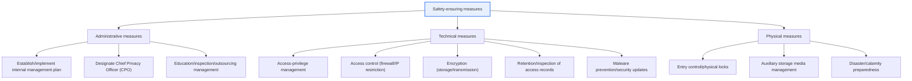
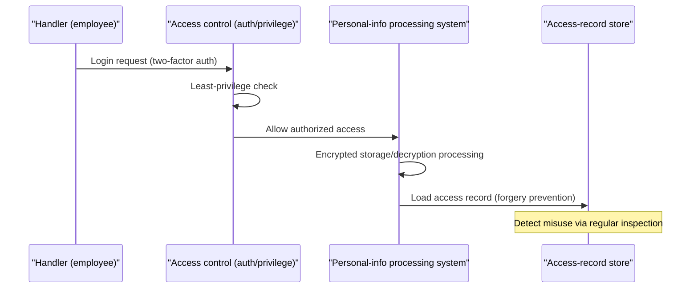

# Standard for Measures to Ensure the Safety of Personal Data

## 1. Overview

### A. Definition

> The **Standard for Measures to Ensure the Safety of Personal Data** is a notice (administrative rule) based on the "Personal Information Protection Act" that prescribes the minimum standards of administrative, technical, and physical protective measures a personal information controller must comply with to **prevent the loss, theft, leakage, forgery, alteration, or destruction** of personal data.

The core purpose of this standard lies in codifying personal-data protection not as an '**abstract effort**' but as a '**concrete and verifiable minimum obligation**.' Merely declaring in law that one should "manage personal data safely" has no effectiveness. If it is unclear what and to what level must be done to have fulfilled the safety measures, businesses find it hard to comply and supervisory bodies find it hard to judge violations. So this notice **pins down the minimum items to be implemented** — establishing an internal management plan, access-privilege management, access control, encryption, retention and inspection of access records, malware prevention, physical safety measures, and disaster/calamity preparedness — thereby securing predictability and enforceability.

However, requiring the same level uniformly of all organizations is unrealistic. Demanding that a large platform with annual revenue in the trillions and a small business with a few employees equip the same security infrastructure would be over-regulation and an unrealizable burden. So this standard **differentially applies the level of measures according to the scale (number of data subjects) and sensitivity (whether it includes sensitive information/unique identifying information) of the personal data processed**. It is a 'differentiation by type' structure in which stricter measures apply to large controllers handling massive sensitive information, and relatively relaxed measures apply to small controllers. (The specific type classification and applicable items may change with revisions of the notice, so in actual application one must check the latest notice's appended table.)

### B. Background of Emergence and the Three Axes of Protective Measures

A substantial number of personal-data-leak incidents originate not from advanced hacking but from **the absence of basic measures** — unauthorized queries by employees without privileges, non-deletion of departed employees' accounts, passwords stored in plaintext, neglected access records. This standard is the minimum safety net to prevent such 'incidents caused by not observing the basics.' Safety-ensuring measures consist of three axes: **administrative measures** dealing with people and systems, **technical measures** controlling by technology, and **physical measures** blocking physical access; defense is not completed by any one alone. Even applying the best encryption (technical), if privilege management (administrative) is lax, data leaks through a legitimate account; and even with perfect access control (technical), it is useless if server-room entry (physical) is open. Only when the three axes operate as **Defense in Depth**, filling each other's gaps, does protection become effective.

## 2. The Safety-Measure Framework — Defense in Depth of the Three Axes

The above framework is a structure that erects, layer upon layer, the lines of defense 'who accesses (privilege/authentication),' 'how they access (control/records),' 'unreadable even if leaked (encryption),' and 'cannot physically enter (entry control).' Below, we examine the core measures of each axis along with their principles.

## 3. Administrative Measures — Establishing and Implementing the Internal Management Plan

> The **internal management plan** is a **comprehensive internal management guideline** for the safe processing of personal data, a system that documents and actually implements the designation of a Chief Privacy Officer (CPO), the composition and roles of the protection organization, access-privilege management, education, and outsourcing/leakage response.

The reason the internal management plan is at the center of administrative measures is that the root of security incidents lies not in technical defects but in **the absence of management of people and procedures**. Organizational management is established only when one **defines in documents and implements accordingly** who is ultimately responsible for personal data (CPO), to whom which access privileges are granted, changed, and revoked, and by what procedures employee education and incident response/reporting are done. If there is only a document and no implementation (a so-called 'regulation in the drawer'), that itself is a violation, and in actual supervision practice, too, 'whether it is implemented against the plan' becomes a key inspection item.

In particular, access-privilege management must be based on the principle of least privilege and separation of duties. One grants only the minimum scope needed for the work, and must change/revoke privileges without delay upon personnel transfer or departure. Given that a substantial number of actual large-scale leak incidents originated from 'accounts that were still alive despite departure' or 'privileges that were broader than necessary,' management of the privilege lifecycle (grant→change→revoke) is the vital point of administrative measures. Also, when outsourcing personal-data processing externally, one must specify in the contract that the trustee observe the safety measures and manage/supervise them regularly — because outsourcing does not transfer responsibility along with it.

| Item Included | Content | Practical Implication |
|---|---|---|
| **Responsibility structure** | CPO designation, define protection org/roles | Clarify accountability, secure decision line |
| **Access-privilege management** | Grant/change/revoke criteria, least privilege | Immediately revoke departed/transferred privileges |
| **Education/inspection** | Regular education, internal inspection/improvement | Prevent human error/insider threats |
| **Outsourcing management** | Trustee contract/supervision | Controller retains responsibility after outsourcing |
| **Response plan** | Leakage-incident response/reporting procedure | Reporting/notification system within the golden time |

## 4. Technical Measures — Access Control, Encryption, Access Records

Technical measures are the means of enforcing the management policy by system. First, **access control** restricts access to the personal-information processing system to authorized persons. One applies a safe authentication means (e.g., two-factor authentication added to account/password), controls external access with a safe access means such as a VPN or with allowed-IP restriction, and places automatic disconnection after a certain period of non-use (session timeout). This is the first line of defense that has 'only legitimate people access, via a legitimate path.'

Second, **encryption** is the last line of defense that makes the content unreadable even if personal data is leaked. Sensitive information such as unique identifying information (resident registration number, etc.), passwords, and biometric information must be encrypted at storage, and especially **passwords are stored with one-way encryption (a safe hash function) that cannot be decrypted**. This is so that even a system administrator cannot know the original password, and so that the original password is not exposed even if the entire database is leaked. Adding a per-account **Salt** neutralizes **Rainbow Table** attacks. Also, when sending and receiving personal data over an information/communication network, one encrypts the transmission segment with SSL/TLS, and must separately have **key management procedures** for generating, using, storing, and destroying encryption keys — because the safety of encryption ultimately converges on the safety of key management.

Third, **retention and inspection of access records** provide traceability and deterrence. One retains records of access to the personal-information processing system (account, access date/time, information of the data subject processed, work performed, etc.) for a certain period (longer for sensitive information/mass processing, etc.), manages them safely so they are not forged, altered, stolen, or lost, and inspects them regularly. Access records are the basis for after-the-fact tracing of 'who did what and when' when an incident occurs, and the very fact that 'records are kept' has the effect of deterring insider misuse in advance. Beyond this, malware prevention (antivirus/security updates) and protective measures at output/copying are also included in technical measures.

| Object | Application Method | Purpose |
|---|---|---|
| **Access control** | Safe authentication, IP restriction/VPN, session timeout | Only authorized persons access |
| **Encryption at storage** | Encrypt unique identifying/biometric info | Unreadable if leaked |
| **Password** | **One-way encryption (hash) + salt** that cannot be decrypted | Original unavailable even to admins/leakers |
| **Encryption in transit** | SSL/TLS on the send/receive segment | Defend against interception in transit |
| **Access records** | Retention for a period/forgery prevention/inspection | Secure traceability/deterrence |
| **Key management** | Encryption-key generation/use/storage/destruction procedures | Guarantee the effectiveness of encryption |

## 5. The Effectiveness of Measures Seen Through Cases

Why the three axes must go together is well shown by actual incident types. First, the common cause of incidents where personal data was leaked on a large scale at a certain telecom/retail company was in many cases 'neglected vulnerabilities/insufficient access control' — cases that could have been prevented by observing merely the basics of technical measures (security updates/access restriction). Second, a case where passwords were stored in plaintext and all account passwords were exposed simultaneously with a DB leak shows that the single measure of one-way encryption would have lowered the grade of the incident from 'fatal' to 'limited.' Third, an insider leak due to a departed employee's undeleted account or excessive privileges reveals that no matter how good the encryption, it is useless if the administrative measure (privilege lifecycle management) collapses. As such, the measures are mutually complementary, and a gap in one axis wholly neutralizes the effort of the other axes.

The sequence below shows how a normal access passes in turn through the controls of the three axes. If any one of the stages — authentication (administrative/technical) → privilege check (administrative) → processing encrypted data (technical) → loading access records (technical) — is missing, a hole opens in the line of defense.

Physical measures are also a premise of this flow. One must control entry to the computer room/data storage room (entry-history management), control the carry-in/out of auxiliary storage media (USB/external hard drives), and store documents/media containing personal data with locking devices. A backup/recovery system prepared for disasters such as earthquakes and fires is also included in safety measures in a broad sense — because Availability, too, is an element constituting the safe processing of personal data.

## 6. In Depth — Legal Integration and Expansion to Privacy by Design

The recent trend in this field is in two directions. First, the **integration and reorganization of regulation**. As the regulation of personal-data safety measures, previously dualized into online (Information & Communications Network Act) and offline (Personal Information Protection Act), was unified and reorganized into the Personal Information Protection Act system, businesses came to follow a single integrated standard. The details of the regulation (type classification, items, retention periods, etc.) keep changing with revisions of the notice, so in practice one must always check the latest notice and the Personal Information Protection Commission's commentary.

Second, **the shift from after-the-fact defense to prior prevention (Privacy by Design)**. Beyond measures that block after a leak, the weight is shifting toward collecting minimal personal data from the start, lowering identification risk with pseudonymization/anonymization (PET, Privacy Enhancing Technologies), and pre-diagnosing risks with a Privacy Impact Assessment (PIA) before introducing a new system. Furthermore, in the AI/big-data era, as the combination and use of pseudonymized data expands, the scope of 'safety measures' is expanding beyond traditional access control to data-level de-identification technologies such as re-identification prevention and Differential Privacy. That is, safety-ensuring measures are not a fixed checklist but a living standard that evolves along with the technology/threat environment.

## 7. Considerations and Implications (Engineering-Professional Perspective)

1. **Differentiated application by scale/sensitivity is the principle.** One sets the level of measures to match the type/volume of personal data processed, avoiding both an excessive burden on small businesses and under-protection for mass controllers. Accurately identifying which type one's company belongs to is the starting point of implementation.

2. **The balance of administrative/technical/physical is the key.** Investing in only a specific axis wholly breaches the defense through the gap in another axis. Even focusing on encryption (technical), one must equip privilege-lifecycle management (administrative) and server-room entry control (physical) together to complete defense in depth.

3. **Secure traceability and deterrence with retention/inspection of access records.** By recording, retaining without forgery/alteration, and regularly inspecting who accessed which personal data and when, one deters insider misuse in advance and, at an incident, enables cause identification and accountability confirmation. A record is a measure only up to 'inspecting,' not merely 'keeping.'

4. **Expansion to prior prevention (PbD/PIA/PET) is the strategic direction.** Because after-the-fact response cost greatly exceeds prior-prevention cost, one must embed minimal collection, de-identification, and impact assessment at the design stage. The more AI/pseudonymized-data use increases, the greater the importance of data-centric safety technologies such as re-identification prevention and Differential Privacy.

5. **Evidence of implementation and continuous improvement are the key to supervision/dispute response.** Rather than stopping at establishing a plan, one runs the PDCA cycle of education/inspection/improvement and must leave evidence of implementation (logs, inspection records, education history) to prove 'the duty of care was fulfilled' if an incident occurs.

6. **Do not miss that availability, too, is part of safety.** Beyond preventing leakage/destruction, one must also equip a backup/recovery system prepared against data loss from disasters/calamities/ransomware for 'safe processing' to be complete. Balanced assurance of confidentiality, integrity, and availability (CIA) is the basic triangle of information security.

## References
- Personal Information Protection Commission, "Personal Information Protection Act" and subordinate notices (Standard for Measures to Ensure the Safety of Personal Data) — https://www.pipc.go.kr
- National Law Information Center, Personal Information Protection legislation — https://www.law.go.kr
- Korea Internet & Security Agency (KISA), personal-information-protection guidance/materials — https://www.kisa.or.kr

---

> **In one line**: The Standard for Measures to Ensure the Safety of Personal Data is a defense-in-depth system that differentially prescribes *administrative (internal management plan/privilege management), technical (access control/encryption/access records), and physical* measures according to scale/sensitivity; it mandates storage/transmission encryption and one-way encryption of passwords, and is now expanding toward prior prevention through Privacy by Design, PIA, and de-identification technologies.
