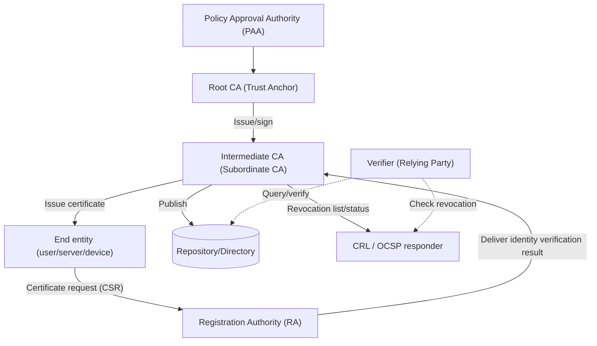
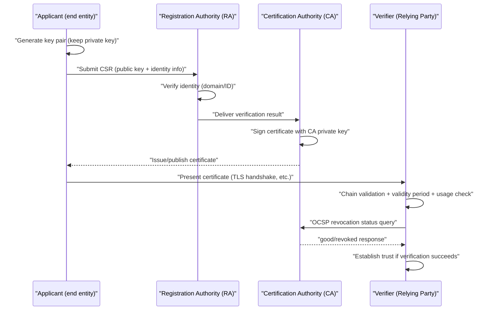

# Public Key Infrastructure (PKI)

## 1. Overview

### A. Definition

> **Public Key Infrastructure (PKI)** refers to the overall system of hardware, software, policies, procedures, and personnel required to issue, manage, verify, and revoke **certificates that electronically bind a public key to the identity of its owner (subject)**, so that public key (asymmetric) cryptography can be used trustworthily in real services. The core is to guarantee that "this public key truly belongs to this subject" through the digital signature of a trusted third party, the **Certification Authority (CA)**.

PKI is not a single product or algorithm but a **trust infrastructure** that makes public key cryptography socially and technically operable. Whereas symmetric key cryptography presupposes a secret key shared securely in advance, public key cryptography performs encryption and signature verification with a public key that anyone can see, thus solving the key distribution problem in principle. But there is a decisive pitfall. Unless it can be guaranteed that "the public key I have just obtained truly belongs to my communication partner," a **man-in-the-middle (MITM) attack** becomes possible, in which an attacker disguises their own public key as the other party's. PKI solves this identity-public key binding problem through certificates and the CA's signature chain.

### B. Background and Need

As the Internet became the foundation of commerce, government administration, and finance, demand exploded for simultaneously ensuring **confidentiality, integrity, authentication, and non-repudiation** between parties who had never met. With symmetric keys alone, one cannot open a secure channel with a stranger with whom prior key sharing is impossible, and with public keys alone, the identity assurance problem described above remains. In particular, transactions can only take place if there are **technically verifiable answers** to questions such as "Is this website really the bank?" in e-commerce and "Is this signature really that person's?" in electronic documents.

These demands ultimately boil down to the problem of "how to scale trust." Having every party individually verify and exchange each other's public keys grows combinatorially as the number of users increases and is unrealistic. PKI introduces a **hierarchical delegation of trust** structure topped by a small number of **Trust Anchors (root CAs)**, so that users need only trust a very small number of roots to automatically verify the countless certificates delegated beneath them. Given that today's web HTTPS (TLS), digital signatures and electronic tax invoices, code signing, email security (S/MIME), VPN and device authentication, and Korea's joint certificate (formerly accredited certificate) system all run on PKI, PKI can be called the de facto substructure of digital trust.

## 2. Overall Structure and Components

PKI consists of **policy and certification entities** that create certificates, **repositories** that store and distribute them, and **End Entities** that actually use and verify certificates. The structural diagram below shows their relationships and the flow of trust.

The **Certification Authority (CA)** is the heart of PKI; it issues certificates containing the end entity's public key and identity information by **digitally signing them with its own private key**. The CA's signature is itself a declaration that "I vouch for this binding." The top-level **root CA** has a self-signed certificate, and because this root public key is preloaded into the **trust store** of browsers and operating systems, it becomes the starting point of all verification. Since leakage of the root private key would collapse the entire trust system, it is usually kept in an offline **HSM (Hardware Security Module)**, and only intermediate CAs are operated online in normal times.

The **Registration Authority (RA)** is the point of contact that verifies the applicant's identity before a certificate is issued. If the CA expresses trust through a "signature," the **real-world identity verification** on which that trust rests is the RA's job. For example, for a server certificate it verifies domain ownership, and for a personal certificate it verifies through ID documents or in-person checks whether the identity claimed by the applicant is true, then passes the result to the CA. The RA's level of verification determines the certificate's trust level (DV, OV, EV).

**Repositories and revocation information services** make issued certificates and their status publicly available and queryable. In addition to obtaining the certificate chain, the verifier must check whether the certificate has **not been revoked early** within its validity period. For this purpose, the **CRL (Certificate Revocation List)**, a list of serial numbers of revoked certificates, and **OCSP (Online Certificate Status Protocol)**, which queries the status of individual certificates in real time, are operated. Finally, **End Entities** are users, servers, IoT devices, and so on that actually use certificates, and the side that trusts and verifies certificates is specifically called the **Relying Party**.

### A. Two Uses of Public Key Cryptography — Confidentiality and Non-Repudiation

Public keys guaranteed by PKI are used for two broad purposes, and understanding them separately is the starting point for designing certificate usage (KeyUsage). First, for **confidentiality**, the sender **encrypts with the recipient's public key**, and only the recipient decrypts with their private key. However, because public key cryptography is computationally heavy, in practice a **hybrid method (digital envelope)** is used, in which a symmetric session key is wrapped with the public key and delivered. Second, for **authentication, integrity, and non-repudiation**, the reverse applies: the signer **signs with their private key**, and anyone verifies with their public key. Since only the signer holds the private key, a valid signature becomes evidence that "that person signed it and it has not been altered since."

Here the need for PKI becomes clear again. Without a mechanism guaranteeing that the public key used for signature verification really belongs to the signer, an attacker could disguise a document signed with their own key as the victim's. A certificate guarantees exactly this "public key-identity" binding with the CA's signature, making both encryption and digital signatures trustworthy. Therefore, in practice, signing key pairs and encryption key pairs are often issued separately, because their management policies are opposite: signing keys prohibit backup and recovery for non-repudiation, whereas encryption keys may require key escrow for data recovery.

### B. Structure of an X.509 Certificate

Certificates circulating in PKI follow the international standard **X.509 v3** format. A certificate contains identifying information for the Subject and Issuer, the subject's public key, the validity period, a serial number, and various **extensions** that restrict usage, and the issuing CA's digital signature is attached to the whole. Among the extensions, **KeyUsage/ExtendedKeyUsage** restricts the key to signing or encryption, and to server authentication or code signing, and **SAN (Subject Alternative Name)** specifies the list of domains the certificate vouches for. Today's browsers verify domain matching based on SAN rather than CN (Common Name).

| Component | Role | Impact of Leakage/Error |
|---|---|---|
| Root CA | Apex of trust, self-signed | Collapse of all trust (rebuild required) |
| Intermediate CA | Delegated issuance, online operation | Mass reissuance of subordinate certificates |
| RA | Identity verification | Risk of fraudulent certificate issuance |
| CRL/OCSP | Provides revocation status | Mistaken trust in revoked certificates |
| HSM | Private key storage and operations | Forged/tampered signatures if key is stolen |

## 3. Certificate Lifecycle and Verification Procedure

The core of PKI operation is lifecycle management of certificates, flowing through **issuance → use → renewal → revocation**. Below is the detailed flow of issuance and verification.

In the **issuance phase**, the applicant first generates a key pair on their own device or server. The private key is never exported; only a **CSR (Certificate Signing Request)** containing the public key and identity information is submitted to the RA. After the RA's identity verification, the CA signs the certificate and issuance is complete. The fact that the private key never leaves the applicant's device in the first place is the technical foundation of non-repudiation.

The **verification phase** is where the real value of PKI is realized. Starting from the presented certificate, the verifier follows the issuers to construct the **certificate chain (chain of trust) leading from intermediate CA → root CA**, verifies each step's signature with the upper-level public key, and confirms whether it ultimately reaches a root that it holds in its trust store. Trust is established only when the chain extends to the root, each certificate is within its validity period, the usage (EKU) and domain (SAN) match, and finally it is confirmed **via CRL/OCSP that it has not been revoked**. If any of these fails, the browser displays a warning and blocks the connection.

The **revocation phase** is the procedure for invalidating a certificate even before its validity period ends if a private key leak, affiliation change, or misissuance occurs. CRLs have the limitation of reduced freshness since they are distributed periodically, while OCSP is real-time but carries the burden of querying the CA on every connection and the problem of privacy exposure. To compensate, **OCSP Stapling**, in which the server obtains the OCSP response in advance and attaches it to the handshake, is widely used. The trade-offs between the two approaches are summarized below.

| Category | CRL | OCSP |
|---|---|---|
| Method | Bulk distribution of revocation list | Real-time query per certificate |
| Freshness | Delayed by the issuance interval | Real-time (as of response time) |
| Verifier burden | Growing list download size | Query on every connection (mitigated by Stapling) |
| Privacy | Low exposure | Visited sites exposed to the CA |
| Availability | Cacheable | Verification impossible if responder fails |

Both approaches share the same challenge — "does revocation information reach the verifier in time?" — and this is the background of the recent policy trend of **shortening validity periods themselves to reduce dependence on revocation**.

### A. Long-Term Signatures and the Persistence of Non-Repudiation

The legal effect of a digital signature is maintained only if it can be proven **in the future** that the certificate was valid at the time of signing. If, after a certificate has expired or a CA has disappeared, a dispute arises over "whether that signature was valid at the time," non-repudiation is shaken. To solve this, **Long-Term Validation (LTV)** formats (e.g., PAdES, XAdES, CAdES) are used, which attach a **trusted timestamp (TSA)** to the signature value to fix the signing time and seal the certificate chain and revocation information (OCSP, CRL) needed for verification together with the signature. This is the key mechanism by which PKI provides real legal trust in areas requiring evidence for years to decades, such as electronic contracts, electronic tax invoices, and electronic document archiving.

## 4. Comparison of Trust Models and Application Cases

There are several models for organizing trust in PKI, and they are not simply implementation differences but choices arising from the conflicting requirements of **trust scalability, resilience, and interoperability**.

| Trust Model | Structure | Advantages | Limitations |
|---|---|---|---|
| Hierarchical | Single root at the apex | Simple verification, clear management | Total collapse if root is leaked |
| Cross-certification | Horizontal certification between CAs | Inter-domain interoperability | Complex path discovery |
| Bridge CA | Mediated by a neutral hub | Advantageous for multi-organization integration | Bridge operational burden |
| Web of Trust | Mutual signing between users | No central authority needed | Hard to quantify trustworthiness |

The hierarchical model is the approach adopted by the web PKI; verification is simple, but trust is concentrated in the root. In contrast, PGP's **Web of Trust** forms trust without a central authority as users sign each other's keys, but it is hard to objectify "how much to trust," making it unsuitable for large-scale operation. In environments such as government and finance where PKIs of different organizations must be interconnected, a **Bridge CA** with a neutral hub is used. The U.S. Federal Bridge CA (FBCA) is a representative example, tying together PKIs operated independently by each agency into a single trust framework.

A case that dramatically exposed the vulnerability of trust models was the 2011 **DigiNotar** incident in the Netherlands. About 500 forged certificates for major domains such as Google were issued from this compromised CA and actually exploited for man-in-the-middle interception; ultimately, browsers removed its root from their trust stores en masse, and the CA went bankrupt. This incident painfully drove home the fundamental weakness of hierarchical trust — that **if even one of the hundreds of trusted CAs is breached, all users are threatened** — and the need for a monitoring mechanism (CT) to detect misissuance even after the fact. Certificate Transparency, introduced afterward, is a direct product of this lesson.

Concrete application cases include, first, **web HTTPS/TLS**. Most of the world's web traffic is encrypted with TLS, and that trust is maintained by hundreds of root CAs embedded in browsers and operating systems and by the standards (Baseline Requirements) of the **CA/Browser Forum** that oversees them. Second, Korea's **joint certificate (formerly accredited certificate)** system has formed a hierarchical PKI with KISA at the top and accredited certification authorities such as the Korea Financial Telecommunications & Clearings Institute and Koscom, and has been used for electronic finance and e-government. Third, **code signing** allows software publishers to sign executables with their certificates so that users can verify tampering and origin. Fourth, in the IoT field, there are growing cases of embedding certificates in hundreds of millions of devices to give them **device identity**; at this scale manual issuance is impossible, so automation becomes essential.

## 5. Advanced — Automation, Transparency, and Recent Trends

The bottleneck of traditional PKI was **manual issuance and renewal** of certificates. As incidents of service outages caused by missed expiration dates recurred, the **ACME (Automated Certificate Management Environment) protocol** for automating this was standardized (RFC 8555), and Let's Encrypt popularized free, automated certificates based on it, greatly raising the HTTPS adoption rate. Recently, the CA/Browser Forum has been tightening policy toward shortening the maximum validity period of server certificates (from several years → hundreds of days, and even shorter in the long run), a trend in which **PKI operation without automation is effectively becoming unsustainable**. Shortening validity periods also compensates for the freshness limits of revocation information, because the certificate expires soon and the window for abuse of a leaked key naturally narrows.

In terms of monitoring trust, **CT (Certificate Transparency)** is important. In the past, there were incidents in which some CAs misissued certificates without the domain owner's knowledge or were compromised and issued forged certificates. CT requires all issued server certificates to be recorded in public, append-only logs, allowing domain owners to continuously monitor certificate issuance for their domains. Today, major browsers do not trust certificates not registered in CT logs, so CT has gone beyond after-the-fact detection to become effectively a precondition for issuance. **CAA (Certification Authority Authorization)** records, with which a domain owner uses DNS to restrict which CAs may issue certificates for their domain, are also used together as a mechanism to curb misissuance.

In terms of operating models, separating an organization-internal **private (internal) PKI** from the public PKI has recently become the standard design. The browser-trusted public PKI is used for externally exposed web services, while for mTLS between internal servers, workloads, and devices, short-lived certificates are automatically issued in bulk by an internal CA operated by the organization itself. This separation allows external trust policies (shortened validity, mandatory CT) and internal operational flexibility to be optimized separately, and also blocks the risk of internal certificates polluting the public trust store. Cloud providers' managed PKI services and automatic certificate issuance by service meshes are accelerating this trend.

The most fundamental recent trend is the **Post-Quantum Cryptography (PQC) transition**. Signatures and key exchange in current PKI depend on RSA and ECDSA, and if a sufficiently large quantum computer emerges, these will be neutralized, making it possible to forge certificate signatures themselves. Accordingly, the U.S. NIST finalized lattice-based signature and key encapsulation algorithms (e.g., ML-DSA, ML-KEM) as standards in 2024, and the PKI industry is preparing a gradual transition through **hybrid certificates** that contain both legacy and PQC algorithms in a single certificate. However, considering the **"Harvest Now, Decrypt Later (HNDL)"** threat, in which ciphertext stored today is decrypted in the future, the urgency of the transition is higher for institutions handling long-term retention data.

## 6. Considerations and Implications

First, **protection of root keys and the integrity of CA operations** are the top priority. Root private keys must be kept in offline HSMs, physical access must be distributed among multiple approvers (m-of-n control), and operations must be documented through regular audits and in accordance with the CP/CPS (Certificate Policy / Certification Practice Statement). If the apex of trust collapses, everything beneath becomes meaningless, so investment here determines the resilience of the entire system.

Second, **the effectiveness of revocation checking** must be secured. CRLs are limited by distribution delay, and OCSP by performance, availability, and privacy problems. A design is needed that combines OCSP Stapling, Must-Staple, and shortened validity periods to reduce the risk of mistakenly trusting forged certificates due to revocation failure. It must be borne in mind that a state of "revoked but not checked" is no different from not being revoked at all.

Third, **automation and visibility of the certificate lifecycle** are the keys to operational stability. Since large-scale service outages due to expiration and misissuance recur, along with ACME-based automatic renewal, **CLM (Certificate Lifecycle Management)** tools that discover and track all certificates within the organization should be introduced to eliminate "shadow certificates." With validity periods shortening, manual work soon becomes a cause of incidents.

Fourth, **crypto-agility and PQC preparedness** are strategic challenges. Systems should be designed so that algorithms, key lengths, and CAs can be replaced rapidly, and the cryptography used in assets should be inventoried (CBOM) to establish a PQC transition roadmap. In particular, the public and financial sectors that handle long-term signatures and long-term archived documents need to proactively review when to adopt hybrid certificates.

Fifth, **linkage with new demands such as Zero Trust and IoT** must be considered. As mutual authentication (mTLS) spreads not only among users but also among workloads, devices, and services, issuance volume explodes, so an architecture design is required that distinguishes and runs in parallel, according to role, an internal PKI premised on automatic issuance of short-lived certificates (e.g., workload identity in a service mesh, SPIFFE/SPIRE) and the public PKI.

## References

- NIST, "Post-Quantum Cryptography Standardization", https://csrc.nist.gov/projects/post-quantum-cryptography
- IETF RFC 5280, "Internet X.509 Public Key Infrastructure Certificate and CRL Profile", https://datatracker.ietf.org/doc/html/rfc5280
- IETF RFC 8555, "Automatic Certificate Management Environment (ACME)", https://datatracker.ietf.org/doc/html/rfc8555
- CA/Browser Forum, "Baseline Requirements", https://cabforum.org/baseline-requirements/
- Certificate Transparency, https://certificate.transparency.dev/

---

> **In one line**: PKI is the substructure of digital trust that binds public keys and identities into X.509 certificates through CA digital signatures and makes them verifiable through hierarchical trust chains, revocation (CRL/OCSP), and repositories; today it is evolving along the axes of automation (ACME), transparency (CT), and the post-quantum (PQC) transition.
