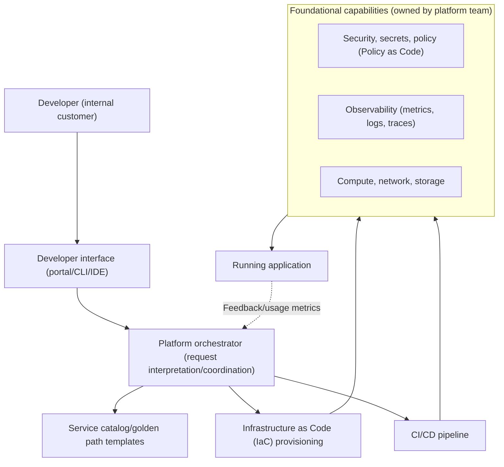
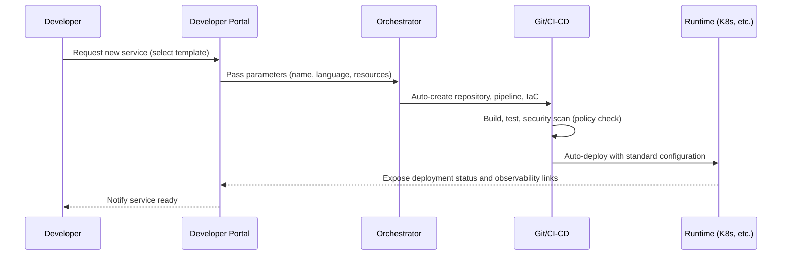

# Platform Engineering

## 1. Overview

> **Definition**: Platform engineering is an approach that productizes the infrastructure, tools, and standards developers need to build, deploy, and operate applications and provides them as a self-service **Internal Developer Platform (IDP)**, thereby lowering developers' cognitive load while simultaneously increasing the speed and stability of software delivery.

Platform engineering is a concept that rose to prominence around 2022, led by Gartner and the CNCF, and its background lies in limitations paradoxically produced by the success of DevOps.
DevOps broke down the wall between development and operations with the principle that "developers operate what they build (you build it, you run it)," but as cloud-native environments grew more complex, the breadth of knowledge a single developer must handle expanded explosively.
If every developer had to learn Kubernetes manifests, Helm charts, Terraform, CI/CD pipelines, observability configuration, secret management, and network policies, developers who should be writing business logic would have their time taken up by infrastructure problems.
This cognitive burden that one person must handle simultaneously is called **cognitive load**, and platform engineering takes managing this cognitive load as its core goal.

The second background is the conflict between autonomy and standardization.
If each team freely chooses its tools, fragmentation (tool sprawl) intensifies across the organization, making security policies, compliance, and cost control difficult and causing duplicate investment.
Conversely, if everything is controlled centrally, bottlenecks arise and developer autonomy is undermined.
Platform engineering reconciles autonomy and control by providing a "**paved road / golden path**," designed so that developers who follow that path automatically comply with organizational standards, security, and best practices without much deliberation.

The third background is a shift in thinking toward **treating the platform as a product**.
In the past, in-house infrastructure teams were passive service organizations that received and processed tickets, but platform engineering views internal developers as 'customers,' researches their needs, sets roadmaps, measures adoption and satisfaction, and continuously improves the platform.
In other words, platform engineering should be understood not as a simple combination of technologies but as a totality of organization, culture, and technology that applies a **product management perspective** to infrastructure.

## 2. Overall Structure of the Internal Developer Platform (IDP)

The IDP, the output of platform engineering, is a product that combines multiple layers.
The diagram below shows the overall skeleton in which, when a developer submits a request through an interface, the orchestrator interprets it and provisions the underlying infrastructure.

The **developer interface** layer is the face of the IDP and can be a web portal (e.g., Backstage), a CLI, IDE plugins, or the Git repository itself.
The key is to abstract things so that developers only need to declare "what they want (desired state)" without needing to know "how it is built."
For example, when a developer clicks "I need a PostgreSQL database" in the portal, the platform takes responsibility for what gets created behind the scenes, on which cloud, and with which security settings.

The **platform orchestrator** layer is the brain that converts declared requests into actual resources.
It selects standardized templates (golden paths), invokes IaC tools (Terraform, Crossplane, etc.), and connects the necessary pipelines.
An important design principle here is to set the appropriate level of abstraction exposed to developers.
Hiding too much eliminates flexibility, and hiding too little leaves cognitive load intact, so a balance is needed that handles the majority of cases simply while allowing exceptional requirements to access the lower layers (escape hatch).

The **foundational capabilities** layer comprises common functions owned and operated by the platform team, including security, observability, and compute.
In particular, if security and compliance are implemented as **Policy as Code (e.g., OPA)** and embedded in pipelines, policy violations are automatically blocked at deployment time without developers having to pay separate attention.
At this point, platform engineering naturally combines with DevSecOps.

## 3. Core Components and the Golden Path

The practical value of platform engineering is condensed in the concept of the 'golden path.'
A golden path is the most recommended standard route for performing a specific type of task (e.g., creating a new microservice), in which repository creation, CI configuration, security scanning, deployment, and monitoring connections are pre-assembled into a single template.
Developers automatically inherit all of the organization's best practices simply by using this template.

The diagram below shows the process by which a new service is created and deployed along the golden path.

These components are summarized below; each item is chosen not as a simple feature but for the purpose of improving Developer Experience (DX).

| Component | Role | Representative Technologies (Examples) |
|---|---|---|
| Developer portal | Self-service entry point, service catalog | Backstage, Port |
| Orchestration/provisioning | Declarative resource creation | Crossplane, Terraform |
| CI/CD and deployment | Continuous integration/delivery, GitOps | Argo CD, GitHub Actions |
| Policy and security | Policy as code, secret management | OPA, Vault |
| Observability | Metrics, logs, traces standards | OpenTelemetry, Prometheus |

It should be noted here that an IDP is not simply the set of these particular tools.
The same functions can be implemented with a commercial integrated platform (e.g., a managed IDP) or by assembling open source, and the appropriate configuration varies with organizational size and maturity.
Since small organizations often end up over-investing when trying to build a complete enterprise-grade IDP, an incremental approach that "solves the biggest bottleneck first with a thin platform" is recommended.

## 4. Relationship and Comparison with DevOps and SRE

Platform engineering should be understood not as replacing DevOps and SRE but as a **means of complementing and implementing them**, and clearly distinguishing this relationship is a key point of the answer.
If DevOps is the 'culture and philosophy' of collaboration between development and operations, SRE is the 'practical methodology (SLOs, error budgets, etc.)' for achieving reliability through engineering, and platform engineering is the 'product and means' that makes this culture and methodology repeatable across the entire organization.
In other words, DevOps provides the direction, and platform engineering provides the tools to realize it at scale.

The fundamental reason for the difference lies in 'who bears the cognitive load.'
In a pure DevOps model, each development team handles infrastructure complexity itself, whereas in the platform engineering model, a dedicated platform team absorbs that complexity and packages it into reusable form.
Therefore, pure DevOps is efficient when there are few teams, but as the organization grows and the same infrastructure work is duplicated across many teams, the return on investment of platform engineering rises sharply.

| Category | DevOps | SRE | Platform Engineering |
|---|---|---|---|
| Nature | Culture, philosophy | Reliability engineering methodology | Product, means |
| Focus | Dev-ops collaboration | SLOs, error budgets | Developer experience (DX), self-service |
| Cognitive load | Borne by each team | Standardized from a reliability perspective | Absorbed by the platform team |
| Output | Collaboration processes | Reliability metrics, automation | Internal Developer Platform (IDP) |

As cases showing concrete effects, many case studies report that after introducing golden paths, the initial setup time for new microservices was shortened from several days to tens of minutes, and pipelines that had differed from team to team converged on standard templates, allowing security vulnerability responses to be applied uniformly.
Conversely, failure cases are often cited in which a platform was forced top-down without researching developer needs, leading developers to bypass the platform (shadow platform) and actually intensifying fragmentation — a typical anti-pattern that appears when the platform is misused as a 'means of control' rather than a 'product.'

## 5. Advanced: Maturity and Recent Trends

Platform maturity generally progresses from an ad hoc collection of scripts → providing standard templates (golden paths) → a productized stage with a self-service portal → an optimization stage of continuous improvement based on usage metrics.
Metrics for measuring maturity combine the **DORA metrics** (deployment frequency, lead time for changes, change failure rate, time to restore), which look at developer delivery performance, with product-perspective metrics such as platform adoption rate, golden path compliance rate, and developer satisfaction (surveys).

Among recent trends, first, **AI-enabled platforms (AI-assisted IDPs)** are emerging.
In forms where the platform interprets and executes a natural language request such as "Deploy the payment service to staging," or summarizes relevant logs and traces when an incident occurs, AIOps, discussed earlier, and platform engineering are expanding their points of contact.
Second, from a sustainability perspective, there is a trend of incorporating **Green IT and FinOps integration**, which optimizes compute usage, as a basic platform function.
Third, in terms of standardization, discussions on platform capability models and interoperability specifications are progressing around the CNCF, showing a movement to reduce dependence on specific vendors.
However, since these trends change rapidly, it is safer in an answer to describe them as 'directions' rather than asserting specific products or versions.

## 6. Considerations and Implications

When adopting and operating platform engineering, the following must be considered comprehensively from a professional engineer's perspective.

First, **the appropriateness of timing and scale of adoption**. Building a platform requires a dedicated organization and substantial initial investment, so if an organization with few teams and little infrastructure repetition hastily builds a large-scale IDP, the return on investment falls. A desirable strategy is to start with a Minimum Viable Platform (MVP) approach that thinly solves the biggest bottleneck first and then expand incrementally.

Second, **governance that operates the platform as a product**. Internal developers must be viewed as customers, their needs researched and measured, and the roadmap managed; adoption should be driven voluntarily by offering an 'easier path,' not by mandate. Forcing it as a means of control tends to fail through bypassing (shadow IT).

Third, **the trade-off in abstraction level**. Excessive abstraction harms flexibility and makes handling exceptional situations difficult, while insufficient abstraction leaves cognitive load behind. A balance is needed that keeps most standard cases simple while designing exceptions to be able to access the lower layers (escape hatch).

Fourth, **internalization of security and compliance and organizational alignment**. Policies should be embedded as code in pipelines (shift-left) so that compliance is achieved without developers being conscious of it, while self-service and documentation must be provided in parallel so that the platform team itself does not become a single point of failure or bottleneck. In addition, the key to success is clarifying the boundaries of responsibility (RACI) among the platform team, SRE, security team, and development teams, establishing it as an organization-wide collaboration system.

## References

- CNCF Platforms White Paper — https://tag-app-delivery.cncf.io/whitepapers/platforms/
- Gartner, "What Is Platform Engineering?" — https://www.gartner.com/en/articles/what-is-platform-engineering
- Backstage (open source developer portal) — https://backstage.io/

---

> **In one line**: Platform engineering is an approach that productizes infrastructure, tools, and standards into a self-service Internal Developer Platform (IDP) that provides golden paths, lowering developers' cognitive load and realizing DevOps and SRE at organizational scale.
