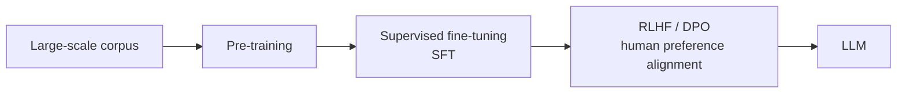

# The Evolution from PLMs (Pre-trained Language Models) to LLMs

## 1. Overview

### A. Definition
> A **PLM (Pre-trained Language Model)** is a transfer-learning-based language model (BERT and early GPT family) that **pre-trains** on general language patterns from a large corpus and is then **fine-tuned** for individual downstream tasks.

The core idea of a PLM is transfer learning: "**learn general language knowledge once at large scale, then adjust only slightly for each task**." Unlike earlier approaches that built a model from scratch for each task, it reuses context, grammar, and common sense gained from vast amounts of text, achieving high performance even with little labeled data.

### B. Characteristics of PLMs
The two pillars that made PLMs possible are **self-supervised learning** and the **Transformer**. Self-supervised learning creates learning signals from the text itself without humans attaching labels. BERT acquires bidirectional context through **MLM (Masked LM)**, which masks parts of a sentence and predicts them, while GPT gains generative ability by predicting the next token. The Transformer's Self-Attention computes the relationships among all tokens in a sentence in parallel, allowing words to be represented not by fixed dictionary meanings but as **dynamic embeddings that vary with context**.

| Characteristic | Description |
|---|---|
| **Transfer learning** | Reuses knowledge through a two-stage structure of pre-training → fine-tuning |
| **Self-supervised learning** | Learns without labels via MLM (BERT) and next-token prediction (GPT) |
| **Contextual embeddings** | Represents words dynamically according to context (handles polysemy) |
| **Transformer** | Enables scaling through Self-Attention-based parallel training |

## 2. Training Process from PLM → LLM

An LLM is not simply a scaled-up PLM; it is completed by adding a new stage, **Alignment**, on top of pre-training. A model that has only completed pre-training merely continues the next token well and does not "follow instructions in the way people want." Each stage has a clearly different purpose.

| Stage | Training Characteristics | Purpose |
|---|---|---|
| **Pre-training** | Acquires language and world knowledge via self-supervision (next-token prediction); enormous parameters, data, and compute | Forms the foundation of knowledge and language ability |
| **Supervised fine-tuning (SFT)** | Trains on human-created instruction-response data | Gives the ability to understand and carry out instructions |
| **Alignment (RLHF/DPO)** | Human preference reward model (RLHF) or direct optimization on preference pairs (DPO) | Aligns behavior to be helpful, honest, and harmless (HHH) |

### A. Pre-training
The model predicts the next token over tens of billions to trillions of tokens of text, and in the process, grammar, facts, and reasoning patterns are compressed into the parameters. Most of the cost is incurred here.

### B. Supervised Fine-Tuning (SFT)
By training on high-quality instruction-response examples such as "answer questions, summarize when asked to summarize," the pre-trained model is turned into an **assistant that follows instructions**.

### C. Alignment (RLHF/DPO)
A reward model is built from data in which humans rank multiple answers to the same question by preference and is optimized with reinforcement learning (RLHF), or the policy is optimized directly with preference pairs (DPO). This stage suppresses harmful and false responses and determines usability.

## 3. Scaling Laws and Emergence

The keys to explaining the qualitative leap to LLMs are **scaling laws** and **emergence**. As parameters, data, and compute are increased, performance improves predictably (Scaling Law), and interestingly, beyond a certain critical scale, abilities absent in smaller models **appear discontinuously (emergence)**. Representative examples are multi-step reasoning and **In-context Learning**, which solves new tasks using only examples in the prompt without changing parameters.

| Concept | Description |
|---|---|
| **Scaling Law** | Increasing parameters, data, and compute → predictable loss reduction |
| **Emergent abilities** | Reasoning, In-context Learning, etc. appear above a critical scale |
| **In-context Learning** | Performs tasks from prompt examples (Few-shot) without weight updates |

For example, arithmetic and reasoning abilities that were negligible at GPT-2 scale suddenly became meaningful in Few-shot settings at GPT-3 scale (hundreds of billions of parameters), a real-world case of emergence.

## 4. Considerations and Applications
As scale grows, risks grow along with capabilities. **Hallucination**, which produces plausible but factually incorrect answers, **bias** in training data, and **alignment failure** that deviates from intent must be managed through the alignment stage and red-team verification. In domain applications, rather than full retraining to reinforce knowledge and format, the standard combination is to inject format and capability via **PEFT (lightweight fine-tuning such as LoRA)** and up-to-date and proprietary knowledge via **RAG**. In settings where cost and latency are issues, strategies of placing **sLLMs** made lightweight through quantization and knowledge distillation on-premises are increasing. From a professional engineer's perspective, the key is to divide roles as "capability through fine-tuning, knowledge through RAG, safety through alignment and governance," designing a balance of reliability, cost, and security.

---

> **In one line**: A PLM is a *transfer learning model of pre-training + fine-tuning*; adding SFT and RLHF/DPO alignment and scaling it up, in accordance with scaling laws, turns it into an LLM with emergent abilities such as In-context Learning.
