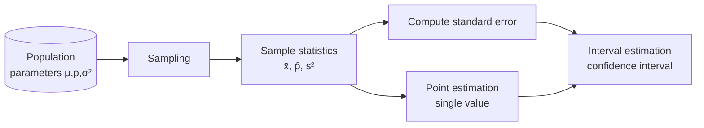

# Point Estimation and Interval Estimation

## 1. Overview

### A. Definition
> When the entire population cannot be surveyed, **statistical estimation** is the method of inferring the population parameters (population mean μ, population proportion p, population variance σ², etc.) **from statistics computed on a sample**. Pinpointing a parameter with a single value is **point estimation**, while presenting a probabilistic range within which the true value is expected to fall is **interval estimation**.

The fundamental reason estimation is needed is that the object we actually want to know is the population, but a complete enumeration is almost always impossible due to time, cost, and physical constraints. For example, to learn the average working hours of all adults nationwide, one cannot survey tens of millions of people, so the mean of a sample of a few thousand is used to "gauge" the population mean. Since the sample is a **random variable** whose value changes each time it is drawn, estimation inevitably carries error, and how that error is handled is what distinguishes point estimation from interval estimation.

### B. Background and Necessity
Point estimation gives "the single most plausible value," so it has the advantage of being intuitive and simple to compute and communicate, but it has the fatal limitation that **it says nothing about how trustworthy that value is (error/confidence)**. When a sample mean is 47.2 hours, point estimation alone cannot tell whether it is nearly equal to the true value or could deviate by about ±5 hours. Interval estimation emerged precisely to **express the magnitude of this uncertainty as well**. A decision-maker can make a far safer judgment from the information "between 45.8 and 48.6 at the 95% confidence level" than from "the mean is 47.2."

## 2. Processing Flow of Statistical Estimation

Estimation begins by drawing a random sample from the population and computing sample statistics. This statistic itself is the point estimate, and combining it with the **standard error (the standard deviation of the estimator)** to attach a margin of error yields an interval estimate. In other words, interval estimation is an extension that places the point estimate at the center and adds a band of uncertainty on either side; it is not a separate method unrelated to point estimation.

## 3. Point Estimation and the Properties of a Good Estimator

Point estimation takes as its estimate the statistic corresponding to the parameter, just as the sample mean x̄ estimates the population mean μ and the sample proportion p̂ estimates the population proportion p. The problem is that several statistics may estimate the same parameter (mean vs. median). Hence, criteria for choosing a "**good estimator**" are needed, and there are four representative ones.

| Property | Meaning | Why it matters |
|---|---|---|
| **Unbiasedness** | Expected value of the estimator = parameter (E[θ̂]=θ) | No systematic bias, so it is correct on average |
| **Efficiency** | Minimum variance | Among unbiased estimators, the less it fluctuates the more precise |
| **Consistency** | Converges to the parameter as n↑ | Grows closer to the correct answer as the sample grows |
| **Sufficiency** | Uses all information in the sample | Estimates without loss of information |

The key is the **harmony of unbiasedness and efficiency**. Even without bias, if the value fluctuates greatly (large variance) it cannot be trusted; conversely, even with small variance, if it leans to one side (bias) it is systematically wrong. For example, **the reason for dividing by n-1 rather than n** when computing the sample variance lies precisely in securing unbiasedness. Dividing by n systematically underestimates the population variance, so correcting with the degrees of freedom n-1 makes E[s²]=σ². Even so, point estimation is silent on the question, "how accurate is this value?"

## 4. Interval Estimation and the Confidence Interval

Interval estimation presents, together with a confidence level, the **confidence interval** within which the parameter is expected to lie. The confidence interval for the population mean takes the following form.

> **Confidence interval = point estimate ± (critical value × standard error)**, e.g., the 95% CI for μ = x̄ ± 1.96 · (σ/√n)

Here the standard error σ/√n indicates how scattered the sample mean is from sample to sample, and the critical value (1.96 for 95%) is the boundary on the distribution corresponding to the confidence level. A commonly misunderstood point is the interpretation of the confidence level. A "95% confidence interval" does **not** mean "there is a 95% probability that the true value falls within this interval"; rather, it denotes the reliability of the procedure: "**if one repeats sampling and interval computation infinitely by the same method, about 95% of those intervals will contain the true value**." This is because the true value is fixed and it is the interval that fluctuates.

Whether to use z (normal distribution) or t (t-distribution) for the critical value depends on the situation. **When the population variance σ² is known or the sample is sufficiently large (generally n≥30)**, the z-distribution is used by relying on the central limit theorem; but **when the population variance is unknown and the sample is small**, the **t-distribution**, with its thicker tails, is used to reflect the additional uncertainty introduced by substituting the sample standard deviation s. Concretely, if n=25, x̄=50, s=10, then using the t-value for 24 degrees of freedom (about 2.064), 50 ± 2.064·(10/5) = 50 ± 4.13, i.e., 45.87 to 54.13, becomes the 95% confidence interval.

## 5. Point Estimation vs. Interval Estimation

The two methods are not competitors but are in a **complementary relationship differing in the amount of information**. Point estimation provides the central value of interval estimation, and interval estimation clothes that center with the garment of confidence.

| Category | Point estimation | Interval estimation |
|---|---|---|
| Form of result | Single value | Interval (lower–upper) |
| Information provided | Estimate only | Estimate + confidence/error |
| Expression of precision | None | Expressed via confidence level/interval width |
| Strength of expression | Concise, intuitive | Conveys uncertainty as well |
| Mutual relationship | Center of the interval | Point estimate ± margin of error |

The two axes that determine interval width are the **confidence level and the sample size**. Raising the confidence level from 95% to 99% widens the interval to more surely contain the true value, creating a **trade-off** of reduced precision. Conversely, increasing the sample size n reduces the standard error σ/√n in inverse proportion to √n, so **the interval width narrows and precision rises**. In other words, the practical insight that interval estimation offers is that to obtain both "more certainty (higher confidence level)" and "more precision (narrower interval)" simultaneously, one ultimately has no choice but to secure more samples.

## 6. Considerations and Implications
- **Quantifying uncertainty**: Because interval estimation expresses the error and confidence of the estimate as well, it is more advantageous than a mere number for decision-making that reflects risk. It is especially effective in areas such as policy and quality control, where the basis for judgment matters.
- **Checking distributions and assumptions**: One must correctly choose z/t depending on normality, sample size, and whether the population variance is known; when assumptions are violated, intervals are obtained by nonparametric or bootstrap methods.
- **Linkage with AI/data analysis**: It is directly applied to confidence intervals for model performance metrics (accuracy, AUC), effect intervals in A/B tests, and quantifying prediction uncertainty, supporting trustworthy decision-making that goes beyond "point prediction."

---

> **In one line**: Point estimation concisely presents *a parameter with a single unbiased, efficient estimator* but cannot provide error information, while interval estimation presents a range together with a confidence level as *point estimate ± (critical value × standard error)*, expressing uncertainty as well; the two methods are complementary, with sample size and confidence level governing precision.
