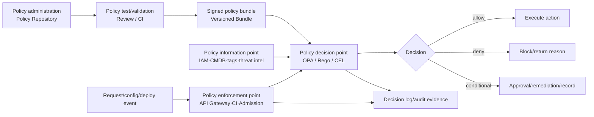
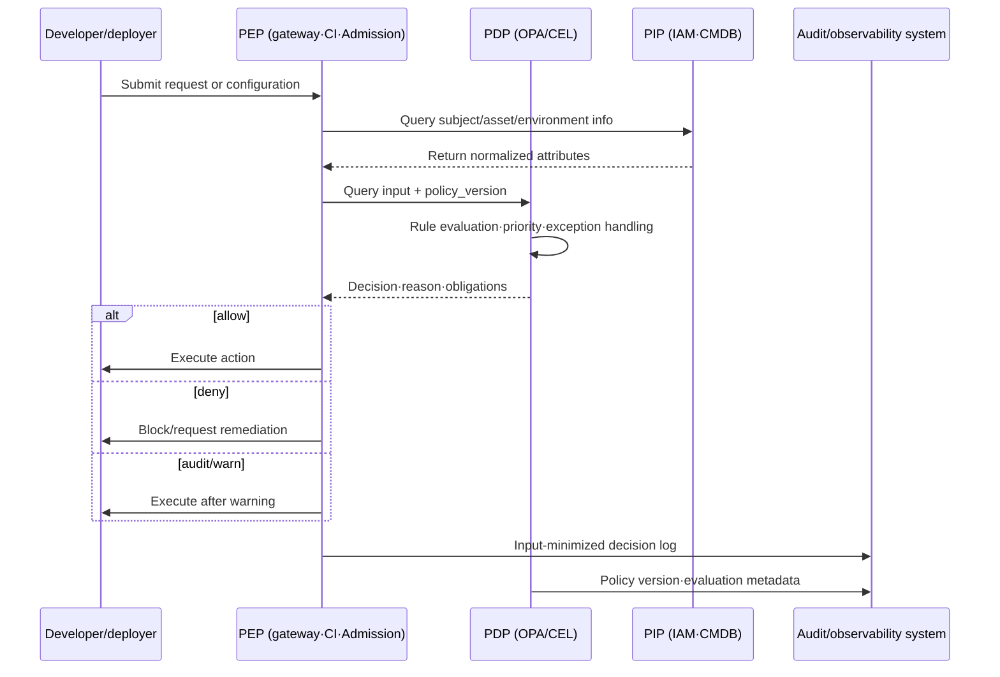

# Policy as Code and Executable Governance

## 1. Overview

> Policy as Code is an approach that expresses an organization's security, compliance, and operational rules not only in human-readable documents but as machine-readable code that can be version-controlled, validated, deployed, and executed.

An enterprise's IT environment is distributed across cloud, containers, APIs, IaC, and CI/CD. Therefore, a mere declaration that "operators must follow the security standard" makes it hard to actually control deployments. For example, internet-exposed services must use TLS, container images must be pulled from approved registries, and data stores containing personal information must be encrypted. If these rules are recorded only in a wiki or a checklist, the outcome varies with the time of inspection and the person in charge.

Policy as Code treats policy like source code. It decomposes requirements into conditions and effects, reviews rules in a repository, and deploys only the policies that pass automated tests and simulations to the execution environment. By separating policy into a distinct decision point rather than scattering it throughout application code, the lifecycles of policy changes and feature changes can be operated independently.

A representative policy engine, OPA (Open Policy Agent), provides the declarative policy language Rego and a policy query API. OPA's official documentation explains that OPA separates policy decision from enforcement so that it can be used across many layers such as microservices, Kubernetes, CI/CD pipelines, and API gateways. That is, OPA returns "allow/deny" or a structured judgment, and the calling system enforces that judgment as an actual block, allow, or modification.

The goal of Policy as Code is not only to strengthen controls. The core is to apply the same rules repeatedly across the development, validation, deployment, and operation stages, and to trace who changed which rule when and on what basis, thereby securing both speed and auditability.

### 1.1 Background and Necessity

First, the pace of infrastructure creation has outstripped the pace of human pre-review. A developer can create networks and databases with Terraform in minutes, so waiting only for the security team's manual approval becomes a bottleneck. Moving policy into automated pipeline checks allows fast changes while still upholding a minimum standard.

Second, the same business rule is duplicated across many tools. If image-source restrictions are implemented once in CI, once at the cluster entrance, and once in operational audit, differences in expression and omissions arise per tool. Keeping a common policy model and a decision interface with adapters at each enforcement point is more advantageous for consistency management.

Third, regulation and audit require not only the outcome but the basis. Linking a policy file's commit, review approval, test results, deployed version, and decision logs makes it possible to reproduce "why was this request blocked?" However, leaving personal information or secret values as-is in decision logs becomes a new risk, so input minimization and masking are needed.

### 1.2 Key Terms

| Term | Meaning | Perspective in a PE exam answer |
|---|---|---|
| Policy | Rules to be observed, exceptions, and scope of application | Formalizing business needs into conditions and effects |
| Policy Decision Point (PDP) | The component that evaluates input and returns a decision | Separation of a judgment engine such as OPA |
| Policy Enforcement Point (PEP) | The point that allows, denies, or modifies according to a decision | API gateway, CI, API server, etc. |
| Policy Administration Point (PAP) | The system that manages policy authoring, review, approval, and deployment | Repository and approval workflow |
| Policy Information Point (PIP) | Provides the user, asset, and environment information needed for a decision | Linkage with IAM, CMDB, tags, threat intelligence |
| Policy Bundle | A unit that packages policy and reference data for deployment | Basis for integrity, versioning, and rollback |
| Observe Mode | An operating mode that measures and records violations without blocking | Gradual adoption and false-positive tuning |

A policy is not a simple if statement but includes the context of the decision. The subject, action, resource, environment, time, risk level, and data classification enter the input, and the result need not end with a single allow/deny. For example, it may return an obligation and an explanation together, such as "allow, but record the reason and require administrator approval."

## 2. Structural Principles of Policy as Code and Conceptual Diagram

### 2.1 Separation of Policy Decision and Enforcement

The Policy Decision Point judges "does this request satisfy the rules?", while the Policy Enforcement Point is responsible for "into what technical action shall the judgment result be translated?" Keeping this separation allows the same policy to be reused across an HTTP API, a message consumer, an IaC check, and Kubernetes Admission.

Conversely, implementing authorization logic directly in each application leads to per-service interpretations. Policy fragments—one service checking only the admin role, another checking even the resource owner. The PDP provides a common judgment, while clearly bounding the PEP to execute according to its own protocol and failure handling.

In the structure above, the PAP means the code repository and the approval process. Merely centralizing policy files is not sufficient; the reason for change and the scope of application must be managed together. CI performs syntax checks, unit tests, regression tests, performance tests, and checks for prohibited functions or out-of-range conditions.

The PIP matters when policy requires external facts. If a user's role, an asset's owning organization, the sensitivity of data, and an image's signature status do not enter as trustworthy data, the PDP's decision cannot be accurate either. Therefore, the source, refresh interval, freshness, and authority of PIP data are managed as preconditions of the policy.

### 2.2 Policy Input–Decision–Effect Model

Policy input is normalized as a structured request such as JSON. Generally, `subject`, `action`, `resource`, and `context` are set as the base axes; in the cloud, account, region, tags, and network location are added, and in personal-data processing, data classification, purpose, and retention period are added.

A decision includes at least `allow` and `deny`, but also carries the explanation needed for operations. Including `reason`, `obligations`, `matched_rules`, `policy_version`, and `risk_score` allows the PEP and the audit system to use the same judgment result.

An effect does not mean only blocking. One must distinguish mutate, which normalizes a value; warn, which leaves a warning; require-approval, which sends to a review queue; and audit, which marks an item as a target for post-hoc inspection. If effects are mixed indiscriminately, users find it hard to understand "why was the deployment successful but later flagged as a violation?"

In this flow, whether the PEP calls the PIP directly or the PDP does so is decided by the deployment topology and security boundaries. For latency-sensitive API requests, use a short-TTL cache, but put an invalidation strategy in place so that events such as permission revocation do not linger in the cache. In contrast, high-risk data access may prioritize verifying the latest attributes and limit caching.

### 2.3 Declarative Rules and Policy Languages

A declarative policy expresses "what state is allowed" rather than "how the program is executed." This lets policy authors write control objectives without knowing all the infrastructure implementation details. However, being declarative does not automatically remove ambiguity, so a glossary and input schema are needed.

OPA's Rego is a declarative language that defines rules over hierarchical structured data. OPA evaluates input and returns structured results, which can be queried via an HTTP API, CLI, library, and so on. The core is that the application does not hold judgment logic directly but delegates the decision to OPA.

In Kubernetes, requests to create, modify, or delete objects can be checked by policy at the Admission stage. The API server sends an Admission Review to OPA and, upon receiving the response, allows or denies the request; one must consider the "deny-first" characteristic whereby if even one of several Admission Controllers denies, the entire request is denied.

Kubernetes's declarative Admission Policy also provides a way to evaluate CEL (Common Expression Language) inside the API server, unlike webhooks. Per the official documentation, `ValidatingAdmissionPolicy` is used for constraint validation and `MutatingAdmissionPolicy` for object modification at admission, and a separate binding object connects the policy object to its targets and scope.

## 3. Application Areas and Implementation Procedures

### 3.1 SDLC/CI/CD Policy

At the development stage, checks verify that secret keys are not included in source, that licenses are on the approved list, and that dependency vulnerabilities do not exceed thresholds. Because fast feedback is important for policy at this stage, it runs on every commit/pull request and should give developers the failed rule and a remediation example.

At the build stage, the artifact's provenance, build tool version, dependency list, and test pass status are evaluated. The policy is not as simple as "fail unconditionally if there is even one vulnerability"; it must also consider severity, exploitability, exposure scope, mitigation measures, and exception expiry dates together.

At the deployment stage, checks verify the approved image registry, signature or attestation, least-privilege service accounts, network boundaries, and resource requests/limits. GitHub's official documentation explains that using the Sigstore Policy Controller, one can configure deployment of only images that have valid artifact attestation. Such supply-chain policy becomes the basis by which consumers verify where and how an image was built.

Policy is not placed only as a single pipeline stage. Even if checked before deployment, manual changes or drift can occur in the actual cluster, so it is re-validated by Admission and periodic audit. If the rules for pre-checks and runtime checks differ, a control gap arises, so the same policy or a semantically equivalent policy is used.

### 3.2 IaC/Cloud Governance

IaC such as Terraform, CloudFormation, and Kubernetes manifests can be converted into policy input before the actual infrastructure state is created. Prohibiting public settings on shared object storage, requiring encryption keys, restricting to allowed regions, applying minimum tags, and prohibiting excessive permission grants are checked at the planning stage.

The advantage of checking at plan time is that developers can see the differences before a change is blocked. On the other hand, there is a limitation that one cannot know both the state after application to actual resources and the attributes provided by external systems. Therefore, plan checks, apply-permission control, periodic drift checks, and cloud-event-based re-evaluation are combined.

Policy input must include account, organization, and environment information. Even for the same database, public test access may be allowed in a development account but prohibited in a production account. Rather than hard-coding such exceptions in code, they are managed as explicit exception objects with environment attributes and expiry dates.

### 3.3 API/Microservice Authorization

API authorization differs from whether authentication succeeded. Authentication confirms who the subject is, while policy judges whether that subject may perform a specific action on a specific resource. Fine-grained decisions are made by putting user, service, resource owner, HTTP action, request origin, time, and risk signals into the policy input.

RBAC grants permissions to roles, so operation is simple, but problems of role explosion and excessive permissions arise. ABAC secures flexibility through attribute combinations, but attribute quality and policy complexity become important. Rather than pitting the two models against each other, Policy as Code can use base roles via RBAC while supplementing high-risk actions, data grades, and environmental conditions via ABAC.

At runtime, default deny is the principle. Fail-open, which allows requests when the policy engine fails, offers high availability but carries great security risk; fail-closed, which denies all requests, is safe but propagates failure widely. The behavior should be differentiated by business criticality and data sensitivity, and an auditable fallback path must be prepared even during failure.

### 3.4 Kubernetes Admission and Runtime

Admission is the boundary that checks resources entering the API server before they are stored. Validating policy denies requests that do not satisfy conditions, and mutating policy can supplement default labels, security contexts, and resource values. Using only mutation can create the misconception that even dangerous values specified by the user are automatically made safe, so validation must be linked after mutation.

Pod Security Admission is a policy enforcement feature built into Kubernetes that applies the `privileged`, `baseline`, and `restricted` isolation levels to namespaces. `enforce` denies violating Pods, `audit` marks them in audit events, and `warn` warns the user but allows the request. In a phased rollout, one first grasps the current situation with warn and audit, then transitions to enforce starting from lower-risk namespaces.

Webhook-based policy engines have good extensibility but must account for network latency, certificate expiry, endpoint failures, and recursive calls. TLS, timeouts, failure policy, high availability, and policy caching between the API server and the policy engine are defined as operating standards. In a structure that sends all requests to a remote engine, it can become a bottleneck at large scale, so evaluation latency and concurrency are measured.

### 3.5 Data/Personal-Information Protection

Data policy expresses who may process which items for what purpose and for how long. Normalizing data classification, processing purpose, retention period, cross-border transfer status, masking necessity, and destruction status as attributes allows the same judgment to be reused across ETL, APIs, and analytics platforms.

Policy must be linked to the data governance catalog. If the catalog lacks sensitivity and owner, the policy engine does not receive input, and if the input is stale, wrong allowances or excessive blocking occur. Data quality, lineage, and ownership must be managed as reliability indicators for policy information.

Decision logs should retain only minimal information such as an identifier hash, data grade, purpose code, and policy version instead of raw personal information. Log access itself is also subject to a separate policy, and when the retention period passes, it is destroyed or aggregated. It should be made clear that Policy as Code does not automatically guarantee personal-information protection; it is a means of translating minimal collection and purpose limitation into executable rules.

## 4. Policy Lifecycle and Operational Governance

### 4.1 Translating Requirements into Executable Rules

Before authoring policy, separate the subject, action, resource, condition, and effect of the natural-language requirement. Turn a sentence like "critical systems shall be operated securely" into a decidable sentence such as "a request to create public object storage in a production account is allowed only when an encryption key is present and there is no public ACL."

Each policy carries its scope of application, exception conditions, violation message, owner, risk level, effective date, and expiry date. A policy with no exceptions is easily circumvented in reality, and an exception with no expiry becomes a permanent vulnerability. Exceptions are made into separate approval objects to track change history and termination conditions.

### 4.2 Testing and Validation

Policy testing must include normal allow, clear deny, boundary values, missing attributes, malicious input, exception expiry, and policy conflicts. A policy that passes only a single example fails to reflect the diversity of operational data. Fix the input schema and run backward-compatibility checks when the schema changes.

Regression testing verifies that business that was previously allowed is not interrupted by a new policy. Conversely, it also tests that existing policy does not allow a new attack path. Measuring rule coverage and the actual rate of violations manages the fact that "many tests" does not equal "sufficient control."

Policy performance is also a quality item. For API authorization, evaluation latency, bundle loading time, cache hit rate, and concurrent request throughput are measured; for Admission, stability during bulk deployments and API server restarts is measured. As policy grows more complex, one must balance performance and explainability.

### 4.3 Deployment, Approval, and Rollback

Policy deployment is separated from application deployment but follows the same change-management principles. It proceeds in the order of code review, automated tests, security-team approval, signed-bundle creation, deployment to the target environment, and outcome observation. The policy version is recorded in the decision log so that it can be reproduced by which rule a specific request was evaluated.

Applying block mode from the start can cause business interruption and circumvention. Violations are collected in observe mode, impact and false positives are analyzed, and then the rollout proceeds through warn mode in some environments and limited enforce mode to organization-wide application. However, rules that must be blocked immediately, such as authentication bypass or high-risk data leakage, are given an exceptional emergency path.

Rollback is implemented by redeploying the previous policy bundle. Rollback authority is not granted to operators alone but requires post-hoc approval and a recorded reason. Because a policy rollback can re-allow an unsafe state of the application, the minimal set of prohibition rules is managed as a separately protected area.

### 4.4 Monitoring and Audit

Policy operating metrics are insufficient with allow/deny counts alone. Per-policy violation rate, exception usage rate, post-warning remediation rate, decision latency, PDP error rate, bundle version distribution, and the number of assets without applied policy are viewed together. When metrics change sharply, one investigates while distinguishing policy-change errors from attack activity.

Deny messages must be specific enough for developers to fix, but must not expose internal structure or sensitive information. Provide the user with the rule ID, violated attribute, and remediation method, while retaining a correlation ID and full diagnostic information in the internal log.

Audit must link policy code, review approval, test results, deployment time, applied targets, decision logs, and exception approvals. Doing so allows proving both control design and actual operational effectiveness together. Retaining only policy files without leaving enforcement logs remains not executable governance but documented intent.

## 5. Comparison, Cases, and Exam Linkage

### 5.1 Comparison with Similar Approaches

| Category | Traditional document policy | Application-embedded rules | Policy as Code |
|---|---|---|---|
| Expression | Natural language·checklist | Per-service source code | Declarative policy code |
| Change tracking | Manual document history | Tied to application releases | Repository review·version·approval |
| Timing of application | Post-hoc inspection–centric | At the running service's runtime | All stages: dev·deploy·runtime·audit |
| Reusability | Depends on interpretation | Low across services | High via common PDP and adapters |
| Failure risk | Variance by person in charge | Policy duplication/omission | Central failure·policy complexity |
| Key complement | Automated inspection | Common library | Testing·observation·rollback·high availability |

Document policy is strong at explaining the organization's purposes and principles. It can hold parts hard to fully automate, such as legal interpretation, exception approval, and ethical judgment. However, documents alone make it hard to prove that they have been applied identically to all systems.

Application-embedded rules understand domain context deeply, but duplication and inconsistency grow as services increase. Policy as Code raises consistency by separating out common rules, but putting all business semantics into a central policy engine can turn the policy repository into a giant monolith. One must design the boundary between common security standards and domain-specific judgment.

### 5.2 Case: Container Supply Chain and Cluster Deployment

Suppose a hypothetical financial platform deploys containers to a Kubernetes production cluster. Organizational policy requires use of an approved registry, verification of a signature or build attestation, `restricted`-level Pod security, specification of CPU/memory requests, and prohibition of public services in production namespaces.

In the first stage, CI inspects manifests and image metadata. It flags unapproved registries, images without attestation, privileged containers, and missing resource limits as warnings or failures. Here it provides the file path, rule ID, and remediation example so developers can fix them.

In the second stage, cluster Admission re-validates the same core rules. This is because manual applications that bypassed CI, or requests coming from other pipelines, must pass through the same boundary. A Policy Controller that inspects supply-chain attestation can verify an image's attestation and trust root to judge whether deployment is allowed.

In the third stage, operational audit compares actual objects against policy-expected values. It finds cases where policy changed or where existing resources were manually modified and generates remediation tickets. That is, by linking pre-checks, admission control, and post-hoc audit, a single control failure does not cascade into a total protection failure.

The core of this case is not to "block everything." New applications start in enforce mode, legacy namespaces in observe/warn mode, and the transition proceeds in phases according to risk level and remediation rate. Exceptions include the service owner, reason, compensating controls, and expiry date.

### 5.3 Answer Composition Strategy for the PE Exam

In an essay answer, first present the definition and background of Policy as Code and pose the gap between document policy and executable policy as the problem. Then presenting the structural diagram of PDP·PEP·PAP·PIP and the input-decision-effect flow reveals the systematic nature of the concept.

In the body, select three or more from SDLC, IaC, API authorization, Kubernetes Admission, and data protection, and explain their timing of application and control effects. For each application area, rather than merely introducing tools, describe which policy is evaluated with which input, what effect is produced on violation, and what logs are left.

At the end, summarize from the PE perspective the trade-offs of testing, observation, exceptions, rollback, high availability, and personal-information minimization. Do not conclude that "automation makes it safe"; mentioning policy quality, input-data reliability, operational failures, and accountability makes it an in-depth answer.

## 6. Deeper Dive: Directions for Executable Governance

Policy as Code can be extended beyond a rule repository for the security team alone into a foundation for the organization's executable governance. Managing cost-tag omissions, region restrictions, data retention periods, model usage conditions, and architecture standards in the same lifecycle allows technical standards and business goals to be connected to the deployment process.

However, as policies grow, mutual conflict and policy fatigue arise. Make explicit the priority of organizational policy, business-unit policy, environment policy, and service exceptions, and decide which strategy—deny, higher-policy precedence, or administrator approval—to adopt on conflict. Predicting the impact before a change with a policy graph and impact analysis is also needed.

In AI agents and automated workflows, the subject becomes not only people but models, agents, and service accounts. The subject that executed the request, the delegation chain, tool calls, data purpose, and whether a human approved must be included in the input; a simple user role alone is not sufficient. For high-risk actions, combine least privilege, short token lifetimes, explicit approval, and action logging.

In an environment where policy decisions are distributed, consistency of decisions matters. If regional PDPs use different bundles, the same request can yield different results, so bundle hash, effective time, and deployment status are observed. For edge environments with network disconnection, one decides in advance whether to use the last approved policy for a limited period or to switch to a safe mode.

Policy code itself is also an object of supply-chain protection. Apply branch protection of the policy repository, signed commits, reviewer separation, removal of secrets from test data, bundle signing, and verification of deployment targets. This is because if an attacker changes the policy, they can neutralize controls without even fixing an application vulnerability.

## 7. Considerations and Implications

### 7.1 Policy Quality and Ambiguity

Translating natural-language policy directly into code leaves ambiguous exceptions and accountability gaps. First agree on terms, attributes, allowed ranges, prohibited ranges, exceptions, and expiry with business owners, and turn them into decidable test cases.

### 7.2 Reliability of Input Data

Even if the PDP is accurate, wrong decisions result if IAM roles, asset tags, or data classification are wrong. Manage the source, last-updated time, and owner of attributes, and define safe defaults and alerts when critical attributes are missing.

### 7.3 Availability and Failure Handling

Because the central policy engine is a common control point, design for high availability, regional distribution, caching, timeouts, and failure isolation. Rather than fixing one of fail-open and fail-closed as an organization-wide constant, decide by business/data risk level.

### 7.4 Gradual Enforcement and User Experience

Blocking all policy violations immediately makes practitioners try to circumvent the policy. Set the stages of observe → warn → partial enforce → full enforce and their transition criteria, and integrate policy into developer experience by providing violation messages and automatic-remediation methods.

### 7.5 Exceptions and Accountability

Exceptions are a realistic operational device but easily degenerate into permanent bypasses. Make the approver, reason, risk acceptor, compensating controls, expiry date, and re-review cycle mandatory fields, and automatically alert on exceptions nearing expiry.

### 7.6 Personal Information and Audit Logs

Policy decision logs are useful for audit, but copying the entire input becomes a privacy violation. Store only the minimal attributes needed for the purpose, tokenize/mask sensitive fields, and control log-access authority and retention period by policy as well.

### 7.7 Standardization and Domain Autonomy

Centralize organization-wide common security standards, but if a single team monopolizes even the detailed rules of business domains, it becomes a bottleneck. A federated model is realistic in which the policy interface and common attribute model are standardized, and central governance validates the policies owned by domain teams.

### 7.8 Measuring Outcomes

Treating the number of policies or lines of code as an outcome only increases complexity. Measure high-risk changes blocked, time to remediate policy violations, exception reduction rate, time to prepare audit evidence, policy evaluation latency, and business interruption due to failures together to confirm the balance of control and productivity.

## References

- Open Policy Agent, "Open Policy Agent (OPA) and policy-as-code" — https://openpolicyagent.org/docs
- Open Policy Agent, "OPA for Kubernetes Admission Control" — https://www.openpolicyagent.org/docs/kubernetes
- Kubernetes, "Pod Security Admission" — https://kubernetes.io/docs/concepts/security/pod-security-admission/
- Kubernetes, "Explore Validating and Mutating Admission Policies" — https://kubernetes.io/docs/tutorials/cluster-management/admission-policies/
- GitHub Docs, "Kubernetes admissions controller" — https://docs.github.com/en/actions/concepts/security/kubernetes-admissions-controller

---

> **In one line**: Policy as Code is an executable control approach that versions, validates, and deploys policy as declarative code and connects the PDP's judgment with the PEP's enforcement, making security, compliance, and operational governance repeatable from development to runtime.
