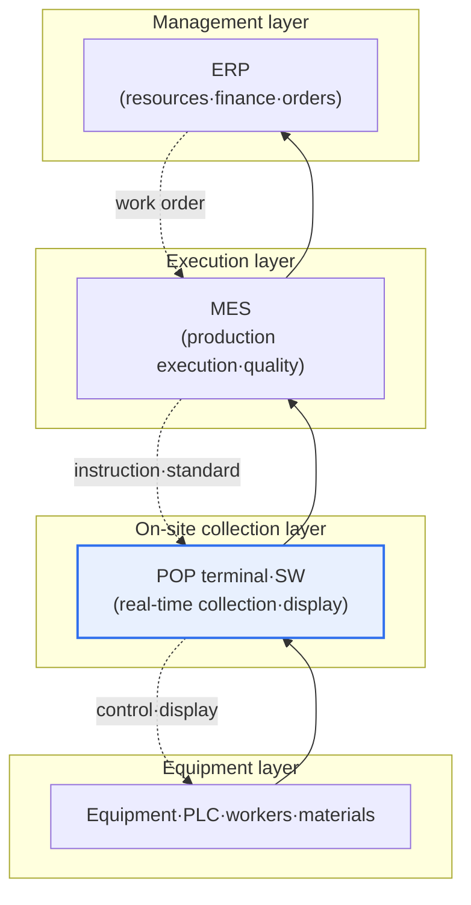
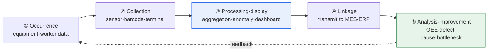

# POP (Point Of Production)

## 1. Overview

### A. Definition

> **POP (Point Of Production)** is a system that collects and processes information arising on the production floor **immediately at the time of occurrence (real-time) and at the place of occurrence (on-site)** for use in production management. It corresponds to the production version of POS (Point Of Sales), which manages the retail point of sale, and is the data-collection layer that connects on-site equipment and workers with upper-level information systems.

The core value of POP is 'securing real-time shop-floor visibility on the production floor.' In factories of the past, workers wrote production results and defects by hand in a paper work log, and this was entered in bulk at the office after a day or a shift ended. In this method, managers had no way to know how the line was running "at this very moment" or how many defects were arising at which process. By the time a problem was recognized, defects had already occurred en masse, and the response was always after the fact.

POP fundamentally eliminates this delay and inaccuracy. It automatically collects the data coming from equipment, workers, and materials—that is, information such as production volume, operating status, defects, and work time—at the very moment and place it occurs. Then managers can grasp the floor via a real-time dashboard and respond immediately when an anomaly arises, and they manage productivity and quality with accurate data recorded by machines rather than by human memory or handwriting. In short, POP is a layer that 'makes the previously invisible floor visible,' and only with this real-time, accurate data can the MES and ERP above it make trustworthy judgments.

### B. Background and Necessity

As the axis of competition in manufacturing shifted from mass production to high-mix low-volume production, short lead times, and strict quality, market responsiveness became impossible with a management style that tidied up the floor after the fact. Manual, after-the-fact entry carried three chronic problems. First, the data was inaccurate (misentries, omissions, estimated entries). Second, the data was delayed and could not be used for real-time decision-making. Third, it was hard for people to record detailed data such as equipment utilization or defect causes one by one.

Overlaid on this, as the current of smart factories and digital transformation converged, the demand grew stronger to secure floor data in real time and improve productivity, quality, and delivery simultaneously. POP is the answer to this very demand, taking on the role of automatically collecting data at the frontline of the floor and accurately supplying it to upper systems. That is, the necessity of POP lies not in simple automation but in laying the starting point of data-driven manufacturing.

## 2. System Composition and Position in the Layers

POP consists of hardware terminals that collect data from on-site equipment and workers, and software that processes, displays, and transmits it, and is linked with the upper-level MES (Manufacturing Execution System) and ERP. In the automation pyramid, POP sits at the lowest data-collection/on-site interface layer, acting as a bridge between physical equipment (sensors, PLCs) and information systems.

As shown in the diagram above, data flows from bottom to top (on-site results → MES → ERP), and instructions come down from top to bottom (orders/plans → work orders → on-site display). POP is the frontline contact of this bidirectional flow, sending accurate results data upward and displaying work orders and quality standards to the floor downward.

Looking at the components a little more concretely, they are as follows. Input devices consist of barcode/QR/RFID readers, touchscreen terminals, and sensor/PLC signal lines connected directly to equipment. A worker scans the barcode on a work order to signal work start, enters the finished-product quantity by touch, and the equipment's run/stop signals are captured automatically by sensors. POP software displays the incoming signals on screen in real time and, after primary processing (aggregation, unit conversion, anomaly determination), transmits them upward.

| Component | Role | Example |
|---|---|---|
| **Input devices** | On-site data collection | Barcode·RFID·touch panel·sensor·PLC |
| **POP terminal·SW** | Real-time collection·display·primary processing | On-site kiosk, display board, aggregation logic |
| **Upper linkage** | Data transmission·instruction receipt | MES·ERP interfaces, communication protocols |

## 3. Collected/Utilized Information and the Utilization Process

The data POP handles is broadly divided into production results, equipment status, work information, and quality. What matters is that each item does not end with mere number collection but is processed into real-time management indicators that lead to on-site improvement.

Production results are production volume, good/defect quantities, and process progress, enabling real-time comparison of actual vs. plan to detect delivery delays early. Equipment status is run/stop/fault signals; accumulating these can compute equipment utilization and, further, **OEE (Overall Equipment Effectiveness = availability × performance × quality)**. Work information is worker, work time, and process information; comparing actual work time against standard time locates bottleneck processes. Quality data is defect type and point of occurrence, revealing in real time which defects concentrate at which process and which equipment, becoming the basis for root-cause analysis.

| Category | Collected content | Utilization indicator |
|---|---|---|
| **Production results** | Production volume·good/defect·progress | Actual vs. plan, delivery compliance rate |
| **Equipment status** | Run·stop·fault | Utilization, OEE |
| **Work information** | Worker·work time·process | Deviation from standard time, bottleneck |
| **Quality** | Defect type·point of occurrence | Defect rate, cause Pareto analysis |

When this cycle of collection → processing → linkage → analysis → improvement turns in real time, managers can deal not with 'what happened yesterday' but with 'what is happening now and what must be changed.' This is the shift in the management paradigm that POP creates.

## 4. Comparison with POS and MES

POP conceptually originated from POS, but its target and purpose differ, and it must be distinguished from MES by a layer relationship to avoid confusion. Treating them as the same merely because the names are similar creates role duplication or omission in system design.

| Category | POS | POP | MES |
|---|---|---|---|
| Target point in time | Point of sale | Point of production | Overall production execution |
| Main purpose | Real-time sales/inventory management | Real-time on-site data collection | Integrated management of production planning·execution·quality |
| Layer | Store contact point | On-site collection layer | Execution management layer |
| Data direction | Sales→headquarters | Floor→upper | Instruction↔result coordination |

The relationship between POP and MES is especially often confused. POP is a collection layer that focuses on 'how to gather data up accurately and in real time,' while MES is an execution management layer that oversees work orders, scheduling, quality, and traceability based on the data thus raised. By analogy, POP is the eyes and hands of the floor, and MES is the brain that receives that sensory information to make judgments. In real projects, it is common to see MES spinning idly because the on-site data-collection foundation—i.e., POP—is weak when attempting to introduce MES. Without accurate results data, even the best MES merely processes garbage data elaborately.

## 5. Deeper Dive: Evolution of POP in the IoT/Smart-Factory Era

Whereas traditional POP was a semi-automatic method in which people entered data by touch or barcode, recent POP is evolving into automatic collection that reduces human intervention through IoT sensors and equipment communication. Behind this change lie two axes.

The first is **standardization of connectivity**. In the past, communication specifications differed per piece of equipment, making it very hard to integrate data from heterogeneous equipment. To solve this, industrial standard protocols such as **OPC-UA (Open Platform Communications Unified Architecture)** have spread. OPC-UA provides a vendor- and platform-independent information model and secure communication, helping collect and link data from different equipment in a standard format. In Germany, which led Industry 4.0, standards for equipment information such as the Asset Administration Shell (AAS) are added on top to raise interoperability. As standardization advances, POP develops from a collector tied to specific equipment into a data hub closer to plug-and-play.

The second is **advancement of data utilization**. As automatic collection raises the volume and accuracy of data, that data can be extended beyond real-time monitoring alone to analysis and prediction. For example, the results gathered up by POP are used as input data for **Predictive Maintenance (PdM)**, which accumulates vibration/temperature data from equipment sensors to detect faults in advance; quality prediction, which learns process data to predict defects; and, further, **Digital Twin**, which virtually replicates the floor for simulation. In the smart factories of actual automobile, semiconductor, and electronics conglomerates, POP/equipment data flows into MES and data lakes and becomes the source data for AI-based quality and equipment management.

In summary, POP has developed 'from the era when people wrote by hand → the era when they scanned with terminals → the era of automatic collection by sensors/IoT and analysis by AI,' and in the smart factory the standing of POP has been elevated from a simple input window to the first gateway to data-based intelligence.

## 6. Considerations and Implications

From a PE perspective, POP introduction and operation must consider the following.

1. **Data accuracy and real-time nature are prerequisites for the trust of upper systems**: If POP raises inaccurate or delayed data, all judgments of MES and ERP are contaminated. Raising the proportion of automatic collection and placing input validation and anomaly determination to guarantee source-data quality must be the top design goal.

2. **Securing interoperability based on standard protocols**: Heterogeneous equipment must be linked via standards such as OPC-UA to enable expansion and integrated analysis. A closed collection structure locked to a specific vendor holds back smart-factory expansion in the long run, so standardized, open architecture should be reviewed first.

3. **Clarifying role division with MES and ERP**: The layers and responsibilities of POP (collection), MES (execution management), and ERP (business resources) must be clearly divided to avoid functional duplication or omission. In terms of adoption order, layering MES without a solid POP foundation is prone to failure, so a phased roadmap that stabilizes the on-site data-collection foundation first is desirable.

4. **Designing for extensibility toward analysis and intelligence**: The data model and storage/linkage structure must be designed to be extensible so that it can lead beyond simple monitoring to OEE management, predictive maintenance, quality prediction, and digital twins, to maximize the reuse value of the data.

5. **On-site acceptance and security**: The UI and operating processes that workers actually use must fit the floor for data to be gathered properly. At the same time, as OT (operational technology) networks connect to IT, cyber-security threats grow, so network separation, authentication, and protocol security (such as OPC-UA security features) must be designed together.

## References

- OPC Foundation, OPC-UA overview: https://opcfoundation.org/about/opc-technologies/opc-ua/
- Plattform Industrie 4.0 (Germany's Industry 4.0): https://www.plattform-i40.de/
- Korean Agency for Technology and Standards / smart-manufacturing materials (smart-factory reference model) overview

---

> **In one line**: POP is a system that *automatically collects production-floor information in real time at the time and place of occurrence*, an on-site collection layer that gathers equipment/worker data and links it with MES and ERP; through standard-based interoperability such as OPC-UA and intelligence extensions such as predictive maintenance and digital twins, it becomes the data foundation of the smart factory and the starting point of data-driven production management.
