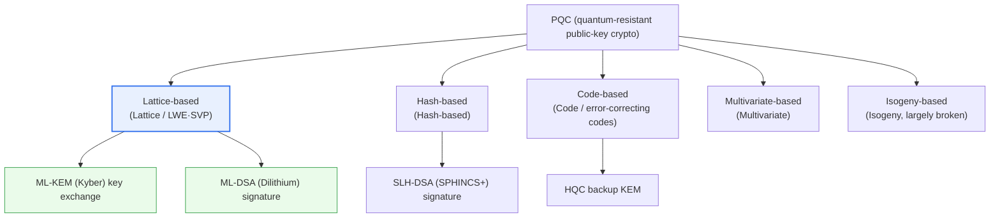
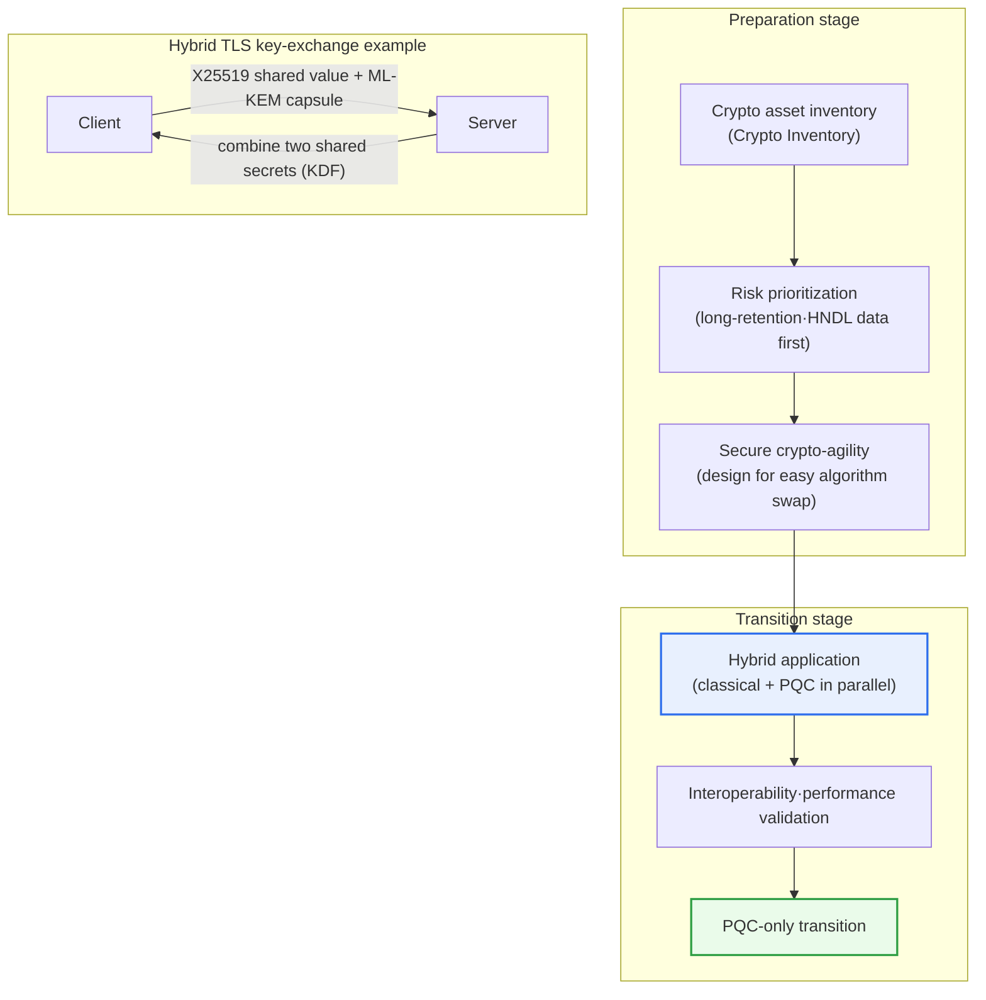

# Post-Quantum Cryptography (PQC)

## 1. Overview

### A. Definition
> **Post-Quantum Cryptography (PQC)** is a public-key cryptographic technology **based on mathematical problems believed to be hard to solve in polynomial time even by a large quantum computer**, a 'Quantum-Resistant Cryptography' that prepares for the era in which quantum computers neutralize existing public-key cryptography. The point that it **operates as-is on today's ordinary computers and networks**, not on special quantum equipment, is essentially different from Quantum Key Distribution (QKD).

The fundamental reason PQC is urgent lies in the fact that '**a quantum computer can break today's public-key cryptography wholesale**.' Public-key cryptography such as RSA and ECC guarantees security by relying on problems—like integer factorization and the discrete logarithm—that are practically unsolvable by existing (classical) computers. For example, RSA-2048 takes as its basis of security the fact that factoring a 2048-bit composite number requires more time than the age of the universe with classical algorithms. Yet if a sufficiently large quantum computer runs **Shor's algorithm**, it can solve integer factorization and the discrete logarithm in **polynomial time**, so RSA, ECC, DH, DSA, and ECDSA are in principle neutralized all at once. The foundations of internet trust—HTTPS (TLS), digital signatures (code signing, e-government authentication), VPNs, blockchain wallets, and so on—are shaken simultaneously.

What must be distinguished here is that **the magnitude of the shock to public-key cryptography and to symmetric-key cryptography differs**. Symmetric keys (AES) and hashes (SHA-2/3) receive only the square-root speedup of **Grover's algorithm**, so it goes no further than reducing the search space from 2^n to 2^(n/2). That is, AES-128 is weakened to an effective strength of about 64 bits, but AES-256 is still safe at the 128-bit class, and hashes are defended by lengthening the output.

In the end, **what a quantum computer breaks head-on is 'public-key' cryptography, while symmetric keys can be handled by doubling the key length**. This is why PQC discussion concentrates on the signature and key-exchange (public-key) areas. Put the other way, the basis for an organization preparing for the quantum era to set a dual (二元) strategy of 'raise symmetric keys to AES-256, replace public keys with PQC' also comes from this asymmetric shock.

What is even more frightening is the '**Harvest Now, Decrypt Later (HNDL)**' threat. It is a scenario in which an attacker stores encrypted communications wholesale now and retroactively decrypts them once a quantum computer appears in the future. Data that must remain secret for **10–30 years or more**, such as medical records, state secrets, resident-registration information, and trade secrets, is in effect already exposed to risk even today, when quantum computers do not yet exist. Therefore, the approach of 'let's change it when quantum computers are commercialized' is already too late. PQC preemptively responds to this threat by building cryptography on new mathematical problems—lattices, hashes, codes, etc.—that are hard even for quantum computers. Whereas QKD 'distributes' keys securely by quantum physics (state collapse upon observation), PQC's practical strength is that it can be **immediately ported to existing systems** with pure software algorithms. [[quantum-crypto]]

### B. Threat Background and Urgency of Response
In summary, three factors press for the PQC transition. First, the **in-principle collapse of public-key cryptography** by Shor's algorithm. Second, a **threat that has already begun even before the commercialization of quantum computers** due to HNDL. Third, because replacing the cryptography of large-scale infrastructure takes years to over a decade, counting backward from 'the moment a quantum computer useful to hackers appears (Q-Day),' **even starting right now is tight**.

The combination of these three factors is often expressed by '**Mosca's Theorem (Mosca's Inequality)**.' It is the logic that if the sum of the period the data must be protected (X) and the period it takes to transition the system to PQC (Y) is greater than the time remaining until quantum computers appear (Z) (X+Y>Z), it is already at risk. For example, if data that must be protected for 30 years (X=30) is transitioned over 5 years (Y=5) and quantum computers appear 20 years later (Z=20), then since 35>20, this data has, as of today, in effect already entered the danger zone.

### C. Characteristics
The character of PQC is summarized by the following characteristics.

- **Runs on classical hardware:** Executed in software on existing CPUs, servers, and networks without special quantum equipment, so it is immediately portable.
- **Public-key replacement–centric:** It replaces the key-exchange (KEM) and digital-signature areas that are threatened head-on, while symmetric keys and hashes are complemented by raising key length.
- **Multi-family parallelism:** Different mathematical problems—lattices, hashes, codes, etc.—are adopted in parallel to distribute the risk should a specific family be broken.
- **Accompanying size/performance cost:** Key, ciphertext, and signature sizes grow relative to existing ones, increasing bandwidth, latency, and storage burdens.
- **Standard-driven diffusion:** The roadmaps of standardization and regulatory bodies such as NIST and NSA drive the adoption pace.

## 2. Types of PQC-Based Problems and the Overall Structure

PQC is not a single specific algorithm but a collective term for several families built on different mathematical problems believed to be 'hard even for quantum computers.' The reason there are multiple families is **risk distribution**. Because one must be able to switch to another family even if one family is broken in the future, standardization bodies also adopt problems of different character in parallel.

**A. Lattice-based.** Currently mainstream. It relies on the hardness of the Shortest Vector Problem (SVP) of finding the shortest vector in an n-dimensional lattice, or of Learning With Errors (LWE), which solves noisy linear equations, and its variant Module-LWE. The reason lattice-based became mainstream is clear. Key and ciphertext sizes are far smaller than code-based, key generation and encryption/decryption speeds are fast so **the balance of performance and size is the best**, and both key exchange (KEM) and signatures can be implemented within a single mathematical structure, making it general-purpose. However, the security of lattice problems partly rests on empirical trust that they have 'not yet been broken' mathematically, so parameter selection and side-channel defense demand care.

**B. Hash-based.** Its security basis reduces to only one thing—the collision resistance of the hash function—so **its assumption is the most conservative and its trust is highest**. SPHINCS+ (standard name SLH-DSA) is representative, a stateless signature with no need to manage state. Its drawbacks are that signature size is large at tens of KB and signature generation is slow, so it suits uses like firmware signing where one 'signs rarely but must verify for a long time, reliably.' It largely plays the role of a safety valve (conservative alternative) in case lattice-based should waver in the future.

**C. Code-based.** It relies on the fact that decoding of error-correcting codes is generally NP-hard. Proposed as the McEliece cryptosystem in 1978, its strength is a long track record of **surviving over 40 years without a major attack**, but application is limited because public keys are very large, at the hundreds-of-KB to MB class. NIST's later selection of the code-based HQC as the backup KEM described later was also with the intent of securing a reserve means based on 'different mathematics' from lattices.

**D. Multivariate- and isogeny-based.** The problem of solving simultaneous multivariate polynomial equations (Multivariate) and the elliptic-curve isogeny (Isogeny) problem were also candidates. However, these two families are **a cautionary counterexample showing that the security of PQC is by no means absolute**. The multivariate signature Rainbow was **effectively broken** by Beullens in 2022, and the isogeny KEM SIKE was likewise **effectively broken with computation at the level of an ordinary laptop** by Castryck–Decru in the same year. These events remain representative cases that empirically demonstrated the necessity of Crypto-Agility, which will be emphasized later in 'Considerations.'

| Type | Underlying problem | Strength | Weakness |
|---|---|---|---|
| **Lattice** | LWE·Module-LWE·SVP | Best speed/size balance, general-purpose (KEM·signature) | Debate over security margin |
| **Hash** | Hash collision resistance | Minimal assumption·highest trust | Large signature size·slow |
| **Code** | Hardness of code decoding | 40 years of verification track record | Very large public key |
| **Multivariate** | Multivariate polynomials | Short and fast signatures | Rainbow broken (2022) |
| **Isogeny** | Elliptic-curve isogeny | Small keys | SIKE broken (2022) |

## 3. NIST Standardization and Migration Architecture

The decisive turning point in the spread of PQC was **the standardization by the U.S. NIST**. NIST launched an open call in 2016 and went through years of verification by the worldwide cryptographic community, and in **August 2024 finalized the first three PQC standards**. The lattice-based Key Encapsulation Mechanism (KEM) CRYSTALS-Kyber was standardized as **FIPS 203 (ML-KEM)**, the lattice-based signature CRYSTALS-Dilithium as **FIPS 204 (ML-DSA)**, and the hash-based signature SPHINCS+ as **FIPS 205 (SLH-DSA)**. Following this, the lattice signature Falcon is in preparation as **FIPS 206 (FN-DSA)**, and in March 2025 NIST additionally selected the code-based **HQC** as a reserve KEM of a different family from lattices (standardization expected around 2027) to distribute risk. After the standards are finalized, it is safe to cite each algorithm by fixing its exact version and parameters.

In summary, the NIST standard family is as follows.

- **FIPS 203 (ML-KEM, formerly CRYSTALS-Kyber):** Lattice-based Key Encapsulation Mechanism (KEM). As the main key-exchange standard, it provides the ML-KEM-512/768/1024 parameters.
- **FIPS 204 (ML-DSA, formerly CRYSTALS-Dilithium):** Lattice-based digital signature. Recommended as the default for general-purpose signatures.
- **FIPS 205 (SLH-DSA, formerly SPHINCS+):** Hash-based stateless signature. With conservative assumptions, it plays the role of a safety valve for the lattice family.
- **FIPS 206 (FN-DSA, formerly Falcon):** Lattice-based signature. With small signature size, it is advantageous for bandwidth-constrained environments; it is in preparation.
- **HQC (code-based backup KEM):** As a reserve key-exchange means based on mathematics different from lattices, it undergoes separate standardization.

Below is a detailed diagram showing the **migration process and hybrid deployment architecture** by which an actual organization transitions to PQC. The key is that it is not 'replace all at once' but a phased transition of '**inventory → prioritization → hybrid parallelism → full transition**.'

**A. Why the hybrid approach is the realistic answer.** If one suddenly moves to PQC-only during the transition period, one bears at once the risk that a flaw is discovered in the future in the PQC algorithm itself (the precedent of Rainbow and SIKE) and compatibility problems with legacy systems. So a hybrid is recommended in which **an existing classical cipher (e.g., X25519) and PQC (e.g., ML-KEM-768) are performed together and the two shared secrets are combined with a KDF**. This way, the session is protected as long as either one is safe, offsetting the transition-period risk of 'the classical cipher is already safe, PQC is unverified.'

In practice, **Google and Cloudflare deployed the X25519+Kyber (X25519MLKEM768) hybrid at scale in TLS between 2022 and 2024**, and **Apple introduced PQ3 into iMessage in 2024 and Signal introduced PQXDH in 2023**, combining lattice-based key exchange into messenger end-to-end encryption. This is a concrete case showing that PQC is already operating at the scale of hundreds of millions of users, beyond the laboratory. What they have in common is that all started as a 'classical+PQC' hybrid, a prudent choice given the uncertainty of early standardization.

**B. The realistic cost of performance and size.** The PQC transition is not free. Representatively, ML-KEM-768's public key is about 1,184 bytes and the capsule (ciphertext) is about 1,088 bytes, **about 10–20 times larger** than an ECC key of merely tens of bytes. This means the TLS handshake packet grows larger and can cause IP fragmentation or delay in the initial round trip (RTT). Signatures are the same, with SLH-DSA signatures reaching several KB to tens of KB. Therefore, in bandwidth- and memory-constrained environments such as embedded/IoT, algorithm and parameter selection becomes a design trade-off in itself.

## 4. Comparison with QKD

PQC is easily confused with QKD (Quantum Key Distribution), but the two solve the problem at entirely different layers. QKD is a hardware technology that **distributes keys physically securely** using the polarization state of photons, placing its security in the physical law that the quantum state is disturbed and thus detected upon eavesdropping. PQC, in contrast, is **software based on the difficulty of computation (computational complexity)**. This difference leads directly to a difference in deployment method. QKD needs dedicated optical-communication equipment and repeaters, so construction cost is high and there are distance constraints, whereas PQC can be applied across the entire internet with only a software update. So in practice, roles are divided as '**PQC for the replacement of public-key cryptography, QKD for key distribution in special high-security segments**,' and they are seen not as mutually exclusive but as complementary.

| Category | PQC (quantum-resistant crypto) | QKD (quantum key distribution) |
|---|---|---|
| **Basis** | Mathematical problems (computational complexity, SW) | Quantum-mechanical physics (collapse upon observation, HW) |
| **Operating environment** | Existing systems·general-purpose internet | Dedicated optical equipment·repeaters |
| **Applicability** | Broad·low-cost via software replacement | Requires infrastructure construction·distance constraints |
| **Role** | Replaces public-key crypto (key exchange·signature) | Protects a key-distribution channel for a specific segment |
| **Maturity** | NIST standards finalized, large-scale commercial deployment | Pilot·special-network centered |

## 5. Deeper Dive: Domestic and International Trends and Expected Exam Directions

**A. Global transition roadmap.** The U.S. presented, through the NSA's **CNSA 2.0**, a schedule that effectively mandates the PQC transition for national security systems by the early 2030s, and through the White House **NSM-10** and related law it compels federal agencies to inventory cryptography and establish transition plans. NIST too is issuing transition guidance (such as the IR 8547 draft) and is discussing a schedule for the phased deprecation of existing algorithms. The core of recent trends is that standards are moving from the stage of being 'created' to being 'compulsorily implemented.'

**B. Domestic trends.** Domestically as well, through the **KpqC (Korean PQC) competition** led by KISA, the National Intelligence Service, and others, homegrown quantum-resistant cryptographic algorithms have been discovered and verified, and domestic candidates in lattice-based, code-based, and other categories have passed selection stages. However, since detailed selection results and standardization schedules are matters that get updated, when writing an answer it is safer to describe centered on the fact that 'a homegrown PQC competition has been conducted under KISA's lead' and to confirm the latest finalized details with the most recent materials. Because the public and financial sectors have extensive e-government and certificate systems, the domestic migration is expected to be approached as a long-term roadmap of '**crypto asset inventory → hybrid certificates → full transition**.'

**C. Expected exam directions and answer strategy.** From a PE perspective, PQC is highly likely to be set as an essay problem that bundles together (1) the Shor/Grover algorithms and the difference in shock to symmetric vs. public-key crypto, (2) the families and uses of the four NIST standards, (3) the urgency of transition viewed through HNDL and Mosca's inequality, and (4) the migration strategy centered on hybrid and crypto-agility. Composing it in the causal flow of '**why must we transition now (HNDL) → what do we change to (NIST standards) → how do we change (hybrid·agility)**' rather than a mere listing of definitions makes it an in-depth answer.

## 6. Considerations and Implications

1. **Preemptive migration is not a choice but a matter of timing management.** According to the HNDL threat and Mosca's inequality (X+Y>Z), one must, starting now, inventory and begin transitioning from the data and systems that require long-term protection. 'Respond when quantum computers appear' cannot protect data that has already been exfiltrated.
2. **Securing Crypto-Agility is the essential capability.** As the breaking of Rainbow and SIKE shows, even a specific PQC algorithm can waver in the future, so designing the architecture to be configurable and swappable rather than 'hard-coding' the algorithm is the fundamental response to standard changes and vulnerability discovery.
3. **Hybrid parallelism is the realistic solution for the transition period.** Performing the classical cipher and PQC together and combining the two shared secrets protects the session as long as either is safe, mitigating both unverified risk and compatibility problems at once. The actual deployments of Google, Apple, and Signal support this.
4. **The practical trade-offs of performance, size, and side-channels must be designed together.** One must select parameters considering the bandwidth/latency from increased key/signature sizes, the resource constraints of embedded environments, and side-channel (timing) defense of lattice implementations.
5. **PQC, QKD, and symmetric-key strengthening are not mutually exclusive but a layered combination.** A multi-layer strategy of PQC for public-key replacement, QKD for key distribution in special segments, and raising symmetric keys to the AES-256 class is the realistic blueprint of the cryptographic system for the quantum era.

## References
- NIST, "Post-Quantum Cryptography" (FIPS 203/204/205, HQC selection): https://csrc.nist.gov/projects/post-quantum-cryptography
- NSA, "Commercial National Security Algorithm Suite 2.0 (CNSA 2.0)": https://www.nsa.gov/Press-Room/News-Highlights/Article/Article/3148990/
- Cloudflare, "The state of the post-quantum Internet": https://blog.cloudflare.com/pq-2024/
- Apple, "iMessage with PQ3": https://security.apple.com/blog/imessage-pq3/

---

> **In one line**: PQC is *quantum-resistant public-key cryptography built on lattice-, hash-, and code-based mathematical problems that are hard to solve even by a quantum computer (Shor's algorithm)*; because of the 'Harvest Now, Decrypt Later' threat it must be transitioned starting now, and the NIST standards (ML-KEM·ML-DSA·SLH-DSA) and the hybrid and crypto-agility strategies are its core.
