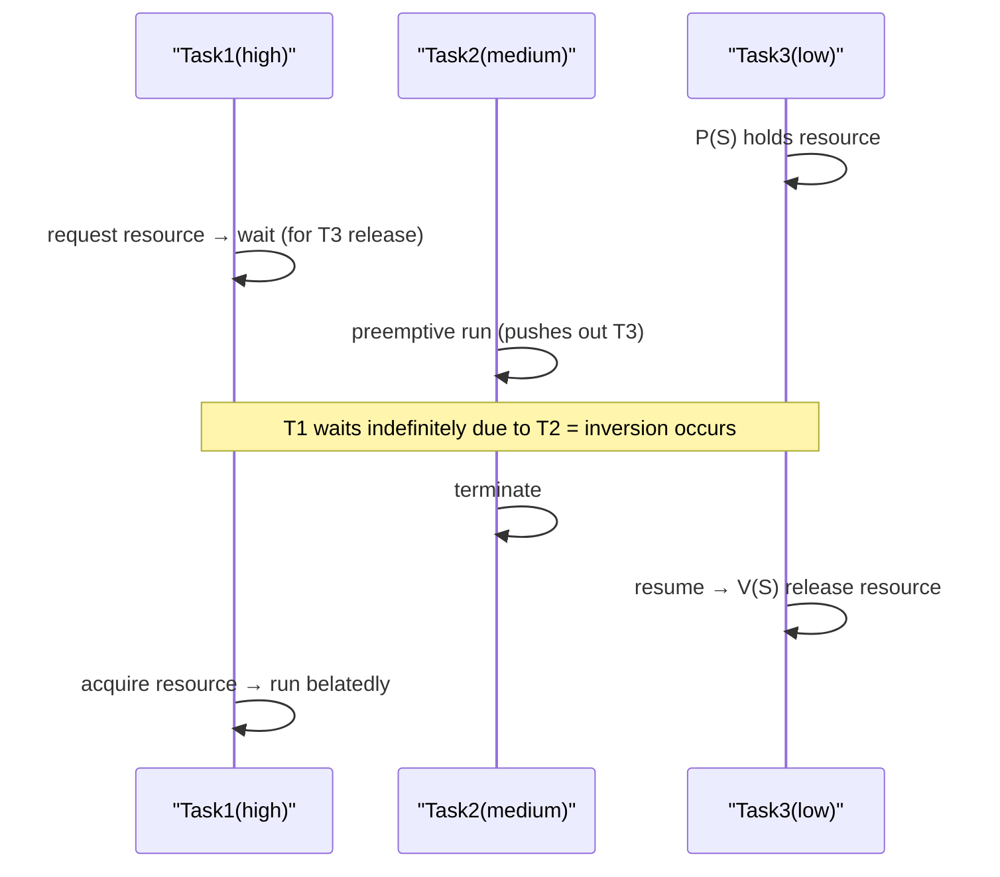

# Priority Inversion

## 1. Overview

### A. Definition
> **Priority Inversion** is a phenomenon in real-time scheduling in which **a high-priority task ends up running later because it waits for a shared resource held by a low-priority task**. The priority order is in effect turned upside down, so the low-priority work overtakes the high-priority work.

The reason priority inversion is dangerous lies in the fact that '**the most urgent job is held hostage by the most trivial one**.' A real-time system (RTOS) grants high priority to urgent tasks that must meet deadlines, and the scheduler is designed always to run the highest-priority task among the ready tasks first. As long as this rule is upheld, response time is predictable. Yet the moment several tasks share one shared resource (e.g., a global buffer protected by a semaphore), this predictability can collapse.

The seed of the problem is mutual exclusion. If a high-priority task requests the same resource while a low-priority task has locked it, the high task has no choice but to wait until the low task releases the resource. Up to here, this is 'normal waiting' that is inevitable so long as mutual exclusion is used. The real problem arises when, during that wait, **a medium-priority task cuts in**, pushes aside the low task holding the resource, and takes the CPU. Because the task holding the resource cannot run, it cannot release the resource either, and in the end the highest-priority task waits endlessly on account of a medium task lower than itself. The point that the upper bound of this waiting time cannot be predicted is fatal in a real-time system.

In fact, in 1997 NASA's Mars rover **Mars Pathfinder** experienced a fault of repeatedly rebooting after landing, and its cause was precisely this priority inversion. When the low-priority task holding the resource was pushed aside by the medium-priority communication task and could not release the resource, the watchdog timer that monitored the deadline of the high-priority management task reset the system. This case shows that priority inversion is not a theoretical risk but a real defect that endangers actual missions.

### B. Conditions of Occurrence
Priority inversion occurs when three conditions overlap. First, tasks share a **shared resource protected by mutual exclusion**. Second, priority is distinguished into **three or more levels** (high, medium, low). Third, while the low task holds the resource, a **medium-priority task can preempt**. If even one of these is missing, an inversion leading to unbounded delay does not hold. For example, if there are only two priority levels, waiting for the resource ends within the finite critical-section time.

## 2. Case of Occurrence (Based on P/V Operations)

Looking in time order at the process by which inversion unfolds through a semaphore's P (acquire) and V (release) operations, it is as follows. Suppose Task1 has the highest, Task2 the medium, and Task3 the lowest priority.

At first, the low-priority Task3, while running, locks the shared resource with P(S). During this, Task1 wakes and requests the same resource, but since Task3 already holds it, Task1 enters a waiting state. Up to here, it is a bearable delay that will soon be released once Task3's short critical section passes.

The decisive moment when inversion holds is when **Task2 becomes ready** at this point. Since Task2 has higher priority than Task3, the scheduler pushes aside Task3 and runs Task2. Task2 does its own work, unrelated to the resource, but as a result Task3 cannot get the CPU and even loses the chance to release the resource with V(S). Consequently, Task1, which is waiting for the resource, keeps waiting until Task2 finishes.

Here the essence of inversion is revealed. The highest-priority Task1 ran later than the medium-priority Task2, which has nothing to do with the resource. Moreover, if many Task2s pile up or run repeatedly, Task1's waiting time can theoretically grow indefinitely, entering a state where 'the upper bound of the delay cannot be computed.' The response-time guarantee, which is the very reason for a real-time system's existence, collapses at this point.

## 3. Solution Techniques

The solutions to priority inversion are all commonly based on the idea of '**temporarily raising the priority of the low-priority task holding the resource to block preemption by a medium-priority task**.' If the task holding the resource is made to quickly exit the critical section and release the resource without being pushed aside by a medium task, the high task's waiting time is bounded by the length of the critical section.

| Technique | Principle | Characteristics |
|---|---|---|
| **Priority Inheritance** | The resource-holding task (T3) temporarily inherits the priority of the waiting high task (T1) to run quickly and release the resource | Responds when it occurs, simple to implement |
| **Priority Ceiling** | A ceiling priority is set per resource, so upon holding the resource it is immediately promoted to that ceiling → prevents deadlock and inversion | Preemptive prevention, prevents even deadlock |

### A. Priority Inheritance Protocol
The **Priority Inheritance Protocol (PIP)** is a method that responds at the moment inversion is detected. When the high-priority Task1 begins to wait for the resource held by Task3, Task3 at that moment 'inherits' Task1's high priority. Task3, whose priority has risen, is not preempted by the medium-priority Task2, so it quickly finishes its own critical section and releases the resource with V(S). As soon as it releases the resource, Task3 returns to its original low priority, and the waiting Task1 obtains the resource and runs.

The actual solution to the Pathfinder incident was precisely this priority inheritance. The fact that they remotely patched the software from Earth to turn on the inheritance option for the problematic semaphore and thereby fixed the rebooting phenomenon symbolically shows the effectiveness of this technique. However, priority inheritance has the limitation that, when several resources are intertwined, **chained blocking**—where inheritance follows one after another—arises, making delay computation complex, and it does not prevent deadlock itself.

### B. Priority Ceiling Protocol
The **Priority Ceiling Protocol (PCP)** is a method that prevents the problem in advance. For each shared resource, the highest priority among the tasks that can use that resource is designated in advance as the 'ceiling.' The moment any task holds that resource, it is immediately promoted to that ceiling priority regardless of its own original priority. This way, the task holding the resource is not pushed aside by a medium task in the first place, and further, the situation where different tasks lock several resources in a crisscross fashion is blocked at the source, so **even deadlock and chained blocking are prevented**.

The two techniques differ in character. Whereas priority inheritance is a 'reactive' type that raises priority after the fact when inversion actually occurs, priority ceiling is a 'preventive' type that raises to the maximum immediately upon grabbing the resource. In terms of preventive effect and deadlock prevention, the ceiling is superior, but it entails the design burden of having to accurately compute and manage the ceiling per resource. So commercial RTOSes (VxWorks, FreeRTOS, etc.) usually provide priority inheritance as the default option for mutexes and use the ceiling protocol selectively in systems where safety is extremely important.

## 4. Deeper Dive — Practical Application and Verification Perspective

In practice, priority inversion is a type of defect where 'the symptom is clear but the cause is hidden.' On the surface it appears in the form of a certain high-priority job intermittently missing its deadline, but since there is no problem in that job's own code and an unrelated resource contention is the root cause, reproduction and tracing are difficult. So a preventive approach is important: at the design stage, inventory the priority spectrum of the tasks using each shared resource, and explicitly apply the inheritance/ceiling protocol to resources spanning three or more levels.

From a verification perspective, **Response Time Analysis** and estimation of **Worst-Case Execution Time (WCET)** are core. Applying priority inheritance/ceiling bounds the upper limit of the time (blocking time) by which a high task can be delayed by a low task to 'one critical-section length,' so this can be put in as the blocking term of a schedulability analysis (e.g., RMA, Rate Monotonic Analysis) to quantitatively prove whether deadlines are met. In domains that follow safety standards such as avionics (DO-178C) and automotive (ISO 26262), such proof of time-boundedness is included in certification requirements, so preventing priority inversion becomes a matter not of function but of safety.

Meanwhile, in recent multi-core real-time systems, the problem becomes more complex. When tasks are distributed across cores, a situation arises where a task on one core waits for a resource held by another core, and to handle this, multi-core resource-sharing protocols such as MSRP and MrsP are being researched and applied. Because the detailed techniques and scope of application are a continually developing area, when actually adopting them it is advisable to confirm the protocols supported by the RTOS and hardware in use with official documentation.

## 5. Considerations and Implications (PE Perspective)

1. **It is an essential factor governing the reliability of real-time systems.** In real-time systems that must strictly meet deadlines, priority inversion produces unpredictable delays leading directly to deadline violations, so the RTOS supports priority inheritance/ceiling as a default or optional feature of mutexes. Using a mutex with an inheritance feature instead of a plain semaphore alone can reduce a considerable portion of the risk.
2. **Understand and choose the trade-offs of the techniques accurately.** Priority inheritance is simple to implement and responds when it occurs, but the possibility of chained blocking and deadlock remains; priority ceiling prevents even deadlock but requires the design cost of computing and managing the ceiling per resource. One must choose according to the system's safety grade and the degree of resource entanglement.
3. **Minimizing shared resources is the most fundamental prevention.** Reducing shared resources between tasks of different priorities in the first place and, where unavoidable, keeping the critical section as short as possible reduces the blocking time itself, so the room for inversion and the delay bound shrink together. An approach that eliminates shared state itself through lock-free data structures or message-queue-based design is also valid.
4. **Time-boundedness must be quantitatively proven.** Applying a protocol is not an end in itself but a means to bound the worst-case blocking time and prove deadline compliance through schedulability analysis. In safety-critical systems this proof is a certification requirement, so it must be integrated into the design and verification process together with WCET estimation and response-time analysis.

## References
- What Really Happened on Mars? (Mike Jones, NASA JPL case summary) — https://www.rapitasystems.com/blog/what-really-happened-software-mars-pathfinder-spacecraft
- FreeRTOS — Priority Inheritance/Mutexes documentation — https://www.freertos.org/Real-time-embedded-RTOS-mutexes.html

---

> **In one line**: Priority inversion is *a phenomenon in which a high-priority task runs unpredictably late due to a low task holding a resource and a medium task preempting*; it is solved by priority inheritance (temporary inheritance of the waiting task's priority) and priority ceiling (immediate promotion to a per-resource ceiling, preventing even deadlock), and ultimately prevented by minimizing shared resources and critical sections.
