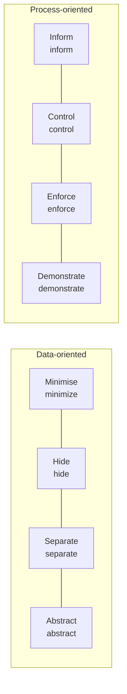

# PbD (Privacy by Design)

## 1. Overview

### A. Definition
> A personal-information protection methodology, devised by Ann Cavoukian (Information and Privacy Commissioner of Ontario), that **proactively embeds privacy protection from the moment of designing** systems, services, and business processes. It was enshrined in law as GDPR Article 25, "**Data Protection by Design and by Default**."

The core idea of PbD is to make privacy **not a feature added after the fact, but a default specification of the design**. That is, privacy protection is not placed as a separate option that the user must turn on; rather, the most protected state becomes the default even when no setting is made. This reverses the traditional approach of "build it first and fix it when problems arise."

### B. Background and Necessity
Personal-information protection of the past was a **reactive, symptomatic** method of responding after a leak incident had erupted. However, in the big-data, IoT, and AI environment, data is collected, combined, and reused on a vast scale, so once leaked, recovery is virtually impossible and reactive response cannot prevent harm. Also, inserting privacy after a system is completed incurs large redesign costs and is prone to omission. Hence the demand grew that protection must be embedded **structurally at the design stage**, and this is the background against which PbD was adopted as a principle of regulations in various countries, including GDPR.

## 2. The 7 Foundational Principles of PbD

The 7 principles prescribe the philosophy of "when, what, and how" to protect. In particular, the 4th principle, **Positive-Sum**, shows PbD's originality — it does not view privacy and security (or convenience) as a zero-sum where "gaining one means losing the other," but takes the perspective that good design can **achieve both**.

| # | Principle | Meaning |
|---|---|---|
| 1 | **Proactive** | Prepare before occurrence, not after an incident |
| 2 | **Privacy as the Default** | Maximum protection is the default even without settings |
| 3 | **Embedded into Design** | Included in the design itself, not as an add-on feature |
| 4 | **Full Functionality (Positive-Sum)** | Compatibility of privacy with security/convenience |
| 5 | **End-to-End Protection** | Protection across the entire span from collection to destruction |
| 6 | **Visibility and Transparency** | Disclose the processing verifiably |
| 7 | **Respect for User Privacy (User-Centric)** | Prioritize the interests of the data subject |

## 3. The 8 Strategies of PbD

If the 7 principles are the 'philosophy,' Jaap-Henk Hoepman's 8 strategies are the **engineering guidelines** for actually implementing them. They divide into 4 that handle the data itself (data-oriented) and 4 that handle the processing (process-oriented).

The data-oriented strategy is to handle personal information "**as little, as invisibly, as scattered, and as generalized as possible in the first place**." **Minimise** collects only the data strictly necessary for the purpose (reducing collection itself fundamentally reduces leak risk), **Hide** blocks exposure with encryption and access control, **Separate** divides data across multiple stores to make identification-by-combination hard, and **Abstract** handles data as aggregates/categories instead of individual values to lower identifiability.

The process-oriented strategy is to "**make the processing transparent, let the subject control it, enforce the rules, and prove compliance**." **Inform** notifies what is processed and why, **Control** lets the data subject exercise the rights of consent, access, and deletion, **Enforce** places technical and organizational controls so that the policy is actually observed, and **Demonstrate** proves the fact of compliance via logs and audits to secure **accountability**.

| Category | Strategy |
|---|---|
| **Data-oriented** | Minimise·Hide·Separate·Abstract |
| **Process-oriented** | Inform·Control·Enforce·Demonstrate |

## 4. Comparison with Article 3 Principles of the Personal Information Protection Act

PbD's strategies, as it happens, correspond in large part to our **Personal Information Protection Act Article 3 (principles of personal-information protection)**. This is because both systems commonly start from the universal principles of **minimal collection, purpose limitation, safety, transparency, and accountability**. For example, not receiving a resident registration number unnecessary to the service at sign-up simultaneously satisfies PbD's Minimise and the minimal-collection principle of Article 3.

| PbD strategy | PIPA Article 3 |
|---|---|
| **Minimise** | **Minimal collection** necessary for the purpose |
| **Inform·Control** | Data subject **notification·consent·rights guarantee** |
| **Enforce·Demonstrate** | **Safety-securing measures·accountability** |
| **Hide·Separate** | Safe management (encryption·access control·separation) |
| **Abstract** | **Anonymization·pseudonymization** |

## 5. Considerations and Implications
- **Linkage with DPIA**: PbD is concretized as a process that identifies and mitigates privacy risks early in design through a **Privacy Impact Assessment (DPIA/PIA)**. Only when design and assessment form a pair does effectiveness arise.
- **Technical implementation via PET**: The 8 strategies are actually implemented with Privacy Enhancing Technologies (PET) such as pseudonymization/anonymization, **differential privacy**, **homomorphic encryption**, and federated learning.
- **Trade-off**: Data minimization and abstraction raise privacy but lower the precision (utility) of data analysis. While aiming for Positive-Sum, one must find the **balance point of privacy vs. utility** through design for each purpose.
- **Outlook**: As the AI/big-data era demands data utilization and protection simultaneously, PbD is establishing itself not as a choice but as an **essential design principle** and a prerequisite for regulatory compliance.

---

> **In one line**: PbD is a methodology that *embeds privacy proactively and as a default from the design stage*, in which the 7 principles (especially Positive-Sum) and the data-/process-oriented 8 strategies correspond to the minimal-collection, safety, transparency, and accountability principles of PIPA Article 3, and are implemented via DPIA and PET.
