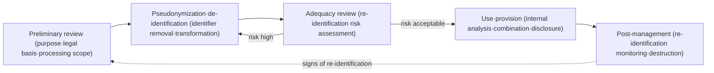
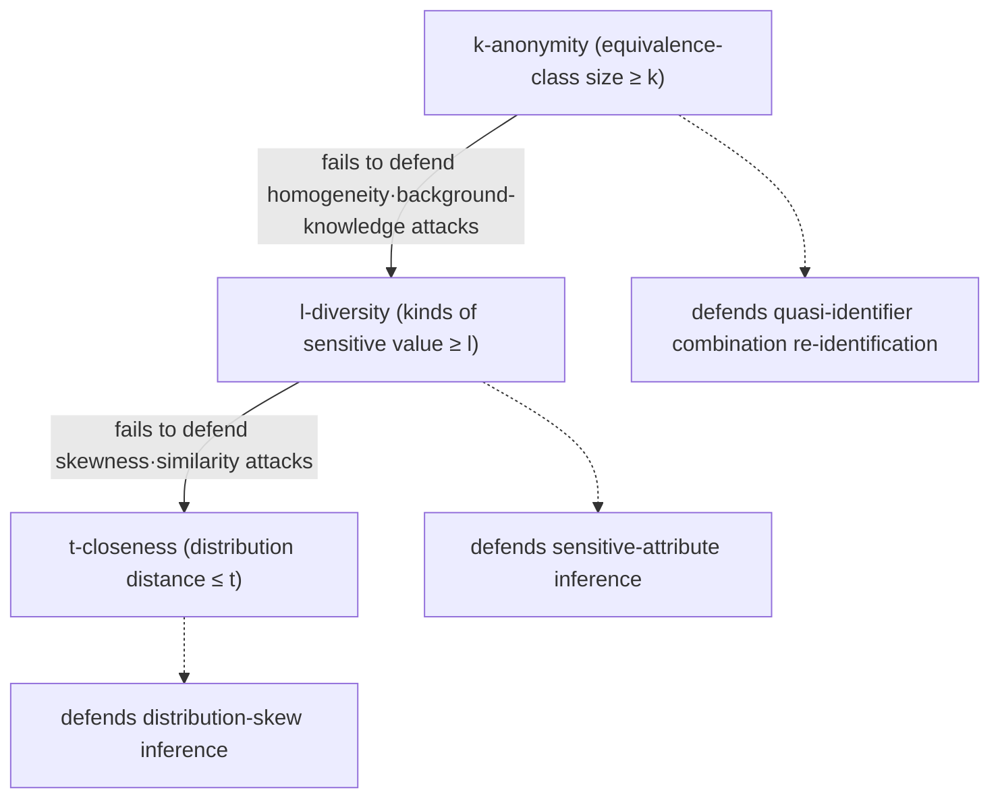

# Personal-Information De-identification Measures and Privacy Protection Models (k-anonymity·l-diversity·t-closeness)

## 1. Overview

> **Definition**: Personal-information de-identification measures are a series of technical and administrative processing steps that remove or transform identifiers so that a specific individual cannot be recognized within a dataset; k-anonymity, l-diversity, and t-closeness are privacy protection models that quantitatively judge how well the result withstands re-identification.

As the data economy has spread, organizations have gained a strong incentive to utilize the personal information they hold for statistics, research, and AI training, but using the original as-is runs into the wall of consent and purpose limitation under personal-information protection law.
To resolve this, simple anonymization that erases direct identifiers such as name and resident registration number has long been used, but in practice incidents where individuals were re-identified through this method alone have occurred repeatedly.
The heart of the problem is that the power to pinpoint an individual lies not in a single identifier but in the **combination** of multiple quasi-identifiers such as sex, date of birth, and postal code, and in the **linkage** with externally already-public data.
Therefore, today's de-identification must be designed and verified from the perspective of re-identification risk—"can the individual be recovered from the remaining data?"—rather than "what was erased?"

De-identification is not an end in itself but a balancing device that reconciles the two conflicting values of data utilization and personal-information protection.
Processing too strongly makes the analytical utility of the data disappear so the purpose of use cannot be achieved; conversely, processing too loosely leaves re-identification risk, incurring legal and ethical liability.
A PE must not stop at listing the pros and cons of individual algorithms but must design governance that judges the appropriate level of protection by comprehensively considering the processing purpose, data sensitivity, use environment (internal use vs. external disclosure), and the acceptable level of residual risk, and that documents the basis for it.

## 2. Processing Procedure of De-identification and Types of Information

### 2.1 Overall Processing Procedure

Korea's "Guidelines for Processing Pseudonymized Information" (Personal Information Protection Commission, revised Feb. 2024) and the former "Guidelines for Personal-Information De-identification Measures" prescribe de-identification not as a one-off transformation but as a cyclical procedure of **preliminary review → processing → adequacy review → safe management**.
This means that de-identification is not a task that ends once the data is processed, but a control activity that must re-measure the risk of the result and continually manage whether there are re-identification attempts.

At the preliminary review stage, one clarifies the processing purpose and applies data minimization, leaving only the minimum items necessary for that purpose.
The core judgments at this stage are whether the purpose falls within the scope permitted by Article 28-2 of the Personal Information Protection Act, such as statistics, research, and AI training, and whether controls are in place to exclude attempts to recognize a specific individual.
At the processing stage, one combines the five techniques explained later to lower identification risk, but only by also lowering the combination risk of quasi-identifiers does it become valid de-identification.
The adequacy review quantifies with models such as k-anonymity whether the processing result actually withstands re-identification, forming an iterative structure that returns to the processing stage if insufficient.
At the post-management stage, administrative controls—monitoring re-identification attempts, access control, destruction after the purpose is achieved, and immediate suspension of processing and notification if re-identification occurs—are continued.

### 2.2 Classification of Data Item Types

To design de-identification, one must first distinguish the role each column plays in re-identification.
This is because, even for the same processing, the risk contribution and processing strategy differ completely depending on whether the target is an identifier, a quasi-identifier, or sensitive information.

| Type | Definition | Example | Default processing direction |
|------|------|------|----------------|
| Identifier | Pinpoints an individual by itself | Full name, resident registration number, mobile phone | In principle deletion·pseudonymization |
| Quasi-identifier | Pinpoints an individual when combined | Sex, date of birth, postal code, occupation | Risk mitigation via categorization·generalization |
| Sensitive Attribute | Privacy violation upon exposure | Disease, income, religion, political leaning | Protect value diversity·distribution |
| De-identification-irrelevant attribute | Irrelevant to pinpointing an individual | Season, product category | Generally kept as original |

What is especially important here is the quasi-identifier.
In 1997, in the U.S., L. Sweeney re-identified the governor from publicly released Massachusetts state-employee medical records using only sex, date of birth, and postal code (ZIP), and showed that the combination of these three items alone uniquely pinpoints about 87% of the U.S. population.
This case broke the conventional wisdom that "erasing direct identifiers makes it safe," and became the direct catalyst for the emergence of a quantitative protection model (k-anonymity) for quasi-identifier combinations.

## 3. The 5 De-identification Techniques

Korea's guidelines present de-identification processing techniques in five broad categories.
Each technique does not by itself guarantee complete safety, and the principle is to apply them in combination according to the role and risk of each data item.

**Pseudonymization** is a technique that hides the original value by replacing an identifier with another value, such as changing Hong Gil-dong to an arbitrary serial number or alias.
There are encryption, tokenization, and mapping-table methods, and what distinguishes it from other techniques is that if the additional information that can reverse the mapping (the pseudonym key) is stored separately, re-linkage is possible when needed.
Therefore, pseudonymized information is in a state where "a specific individual cannot be recognized without additional information," and unlike fully anonymized information, it still legally carries the obligation of safety measures on par with personal information.

**Aggregation** is a method that converts individual records into statistical values such as sum, average, and maximum, eliminating individual-level observation.
For example, replacing individual income with the average income of a region/age group makes individual tracing hard, but in a group with very few samples, individual values can be back-calculated from the average alone, so the minimum aggregation unit must also be controlled.

**Data Reduction** is a method that removes altogether items with high identification risk or outliers.
A few elderly, high-income outliers have high uniqueness in themselves and become a starting point for re-identification, so processing that trims the upper/lower outliers or partially deletes them is needed.

**Generalization** is the core technique that groups concrete values into ranges/categories to lower uniqueness.
Generalizing "1985-03-21" to "born in the 1980s" and "Yeoksam-dong, Gangnam-gu, Seoul" to "Seoul" increases the number of people with the same value, making it hard to pinpoint an individual; this becomes the main means of achieving the k-anonymity dealt with later.

**Masking** is a method that hides part of a value with asterisks and the like; processing the latter digits of a resident registration number or the middle digits of a phone number with `*` is representative.
It is easy to apply immediately in screen display/operating environments, but if the masked portion can be inferred from other data, the protective effect is limited.

## 4. Privacy Protection Models: k-anonymity·l-diversity·t-closeness

No matter how much de-identification processing is done, without a criterion to judge "is this safe enough?", it becomes arbitrary processing.
Privacy protection models are the yardstick for quantitatively judging re-identification risk, and as one moves from k-anonymity → l-diversity → t-closeness, they developed in the direction of complementing the loopholes of the preceding model.

### 4.1 k-anonymity

k-anonymity is the first quantitative model, presented by Sweeney in 2002, and aims to ensure that records with identical quasi-identifier values always exist in the dataset in numbers of **k or more**.
A bundle of records sharing the same quasi-identifier combination is called an equivalence class, and if the minimum size of the equivalence class is k, an attacker can only narrow a specific individual down to one of the k people within it.
For example, if k=5, there are always at least 5 people corresponding to the combination "born in the 1980s·Seoul·male," so with quasi-identifiers alone the re-identification probability is limited to 1/5 or less.

The larger the k value, the stronger the protection, but that much more categorization/deletion occurs and data utility drops, so k is a representative trade-off parameter of protection vs. utilization.
However, k-anonymity has the fundamental limitation that it only controls quasi-identifiers and does not look at the values of the sensitive information itself.
If the disease of all 5 people in a certain equivalence class is "stomach cancer," an attacker can infer the disease with 100% certainty just by knowing the target belongs to that set (homogeneity attack).
Also, if an attacker can exclude specific values using background knowledge, the remaining candidates narrow sharply (background knowledge attack).

### 4.2 l-diversity

l-diversity is a complementary model proposed by Machanavajjhala et al. in 2007, requiring that each equivalence class contain **l or more well-distinguished values** for the sensitive information.
By enforcing the diversity of sensitive attributes that k-anonymity neglected, this mitigates homogeneity attacks and background-knowledge attacks.
That is, the diseases of the 5 people "born in the 1980s·Seoul·male" are made to distribute into at least l kinds rather than concentrating in the single value stomach cancer, so that the disease cannot be determined by membership alone.

However, l-diversity too only looks at the "number of kinds" of values and cannot consider their **distribution and semantic similarity**.
Even if there are three kinds—stomach cancer, liver cancer, lung cancer—within an equivalence class satisfying l=3, the sensitive fact that all are "cancer" is still revealed as-is (similarity attack).
Also, if 9 of 10 have stomach cancer and only 1 has a cold, there are two kinds, but the probability is overwhelmingly stomach cancer, so protection is neutralized (skewness attack).

### 4.3 t-closeness

t-closeness is a model presented by N. Li et al. in 2007, restricting the distribution of sensitive information within each equivalence class to **differ from the distribution of the entire dataset by at most t**.
The distance between distributions is often measured by a metric such as EMD (Earth Mover's Distance), and the smaller t is, the more each set's distribution resembles the overall average, reducing the additional information obtainable from membership.
By this, it can control even the skewness and similarity attacks that l-diversity could not block, providing the strongest protection among the three models.

However, matching the distribution to resemble the whole requires that much more distortion/categorization, so the loss of data utility is the greatest and the computational cost is also high.
Therefore, in practice, rather than choosing among the three models exclusively, a phased design—using k as the base and additionally applying l and t when the sensitive attribute is important—is common according to the nature of the sensitive information and the purpose of use.

| Model | Defended attack | Object of control | Limitation |
|------|----------------|-----------|------|
| k-anonymity | Quasi-identifier combination re-identification | Equivalence-class size | Homogeneity·background-knowledge attacks |
| l-diversity | Homogeneity·background-knowledge attacks | Number of kinds of sensitive value | Similarity·skewness attacks |
| t-closeness | Similarity·skewness attacks | Distance of sensitive-value distribution | Utility loss·computational cost |

## 5. Comparison and Re-identification Incident Cases

The difference among the three models arises from "what is controlled."
k-anonymity looks only at the **set size** of quasi-identifiers, so it passes even if the sensitive value is skewed to one side; l-diversity enforces the **kinds** of values but cannot see the distribution and meaning; t-closeness matches the **distribution itself** to the whole, so it is the strongest but incurs great utility loss.
Therefore, for data where sensitive attributes such as disease and income are central to the analysis, t-closeness-family control is needed, while for quasi-identifier-centered use, an appropriate k value alone enables effective protection.

Actual incidents show both the necessity and the limits of de-identification at once.
In 2006, the U.S. AOL released about 20 million search logs, with user identifiers changed to arbitrary numbers, for research, but specific individuals were re-identified by the press using search-term combinations alone (place names, names, disease searches, etc.), and the data was immediately withdrawn.
In 2008, Narayanan and Shmatikov combined the anonymous movie-rating data released by Netflix with public IMDb ratings to re-identify many subscribers, empirically demonstrating the risk of **external data linkage** of quasi-identifying information.
Domestically as well, as demand grows to combine and utilize data from multiple institutions, it is institutionalized that through a **combination expert institution** designated by the Personal Information Protection Commission, the pseudonymized information of different personal-information controllers is safely combined and its adequacy is reviewed before export.

## 6. Deeper Dive: Pseudonymized-Information Special Provisions and Latest Trends

With the 2020 revision of the three data laws, the concept of **pseudonymized information** was introduced into the Personal Information Protection Act, providing a special provision that allows processing pseudonymized information without the data subject's consent, limited to the purposes of statistics compilation, scientific research, and public-interest record preservation.
This was a turning point that elevated de-identification from the level of a voluntary guideline to a statutory institution, giving legal basis and obligations to the entire process of pseudonymization → use → combination → safety measures.
Because pseudonymized information, unlike fully anonymized information, is still an object of management, safety measures such as separate storage of additional information, prohibition of re-identification, and suspension of processing and notification upon re-identification are mandated.

The technical environment is also changing rapidly.
The Personal Information Protection Commission's "Guidelines for Processing Pseudonymized Information," through the February 2024 revision, newly addressed pseudonymization methods for **unstructured data such as voice, image, and video**, going beyond the existing structured (tabular) data, and utilization schemes for AI training.
For unstructured data, the face or voice itself becomes an identifier, so domain-specific techniques such as masking, blurring, and synthesis are needed, and for large-scale AI training data, one must also consider the new risk that the model memorizes and leaks training data at the level of the entire dataset rather than individual records.
Also, whereas the k-anonymity family "assumes the attacker's background knowledge in a limited way," **Differential Privacy**, dealt with as a separate topic earlier, provides a mathematical guarantee that assumes no background knowledge, so the two are increasingly reviewed together as complementary.
Expected exam directions frequently require essay-form answers such as "the relationship between the 5 de-identification techniques and the 3 privacy models," "the pseudonymized-information combination procedure and the role of the combination expert institution," "comparison of de-identification and differential privacy," and "pseudonymization of unstructured/AI training data."

## 7. Considerations and Implications

From a PE perspective, de-identification is not a choice of technique but risk-based decision-making, and the following must be comprehensively considered.

- **Risk-based judgment of the appropriate protection level**: The larger the k·l·t values, the safer, but they sacrifice utility, so they must be set based on the processing purpose, data sensitivity, use environment (internal closed use vs. external disclosure), and acceptable residual-risk level, and the basis for the judgment must be documented. External disclosure requires a far higher k and a stronger model than internal use.

- **Managing the trade-off of utilization and protection**: Excessive categorization/deletion distorts analysis results and induces wrong decisions, so data-utility indicators (information loss rate, analysis accuracy) must be measured together, and one must aim for the minimum processing necessary to achieve the purpose.

- **Constant control of combination and external-data risk**: As in the Netflix and AOL cases, re-identification mostly occurs from external data linkage, so combination should be controlled through the designated combination expert institution, and even after disclosure, re-identification risk must be reassessed as new public data emerges.

- **Lifecycle governance and post-management**: Since de-identification is not a one-off transformation but a cycle of preliminary review–processing–adequacy review–post-management, procedures for access control, monitoring re-identification attempts, destruction after purpose achievement, and response upon re-identification must be embedded in the organization's personal-information protection system.

- **Combination strategy with linked technologies**: Since no single model can block all risks, one must combine pseudonymization, categorization, and masking, and design a multi-layer defense that jointly applies differential privacy and PET (Privacy Enhancing Technologies) when sensitive attributes are central or repeated queries are expected.

## References

- Personal Information Protection Commission, "Guidelines for Processing Pseudonymized Information" (revised Feb. 2024): https://www.privacy.go.kr/front/bbs/bbsView.do?bbsNo=BBSMSTR_000000000049&bbscttNo=20658
- L. Sweeney, "k-anonymity: A Model for Protecting Privacy", 2002: https://dataprivacylab.org/dataprivacy/projects/kanonymity/kanonymity.pdf
- A. Machanavajjhala et al., "l-Diversity: Privacy Beyond k-Anonymity", 2007: https://personal.utdallas.edu/~muratk/courses/privacy08f_files/ldiversity.pdf
- N. Li et al., "t-Closeness: Privacy Beyond k-Anonymity and l-Diversity", 2007: https://www.cs.purdue.edu/homes/ninghui/papers/t_closeness_icde07.pdf

---
> **In one line**: De-identification measures (pseudonymization·aggregation·reduction·generalization·masking) lower identification risk, and k-anonymity (set size)·l-diversity (kinds of value)·t-closeness (value distribution) quantitatively verify re-identification risk; the key is lifecycle governance that manages combination/external-data risk and utility loss on a risk basis.
