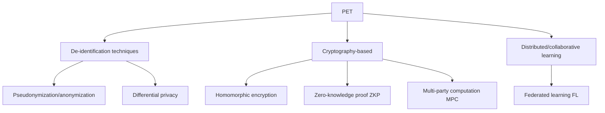

# Privacy Enhancing Technologies (PET)

## 1. Overview

### A. Definition
> A collective term for technologies that **eliminate or minimize the risk of identifying personal information while preserving the utility (usability) of data**. They achieve both compliance with Korea's Three Data Acts and GDPR and the use of data.

### B. Background and Need
Data utilization and privacy protection have traditionally been regarded as a **zero-sum relationship**. To use data it must be shared, but sharing exposes individuals. In particular, several cases (e.g., the re-identification of Netflix's anonymized rating data) have shown that simple anonymization alone cannot prevent **re-identification attacks**, which combine data with other datasets to single out individuals again. PETs are a family of technologies that emerged to break this zero-sum game, **reconciling utilization and protection (positive-sum)** through approaches such as "obtaining only the computation result without revealing the data" or "mathematically hiding individual contributions." As demand grows for large-scale data sharing for AI training, PETs are becoming a key means of complying with privacy regulations.

## 2. Classification Scheme

PETs are divided into three branches according to their underlying principle. **De-identification techniques** transform the data itself to reduce identifiability; they are simple because the processed data can be used as-is, but the risk of re-identification does not completely disappear. The **cryptography-based** family computes on data while it remains encrypted (homomorphic encryption), proves only a fact without revealing the original (ZKP), or lets multiple participants compute jointly while each hides its own data (MPC). Their security guarantees are strong, but computation and communication costs are high. The **distributed/collaborative learning** family is federated learning, which trains at each location without gathering data in one place and shares only the model, eliminating data movement itself.

## 3. Key Technologies

Each technology has a different trade-off in terms of "what it hides and what it gains." **Pseudonymization/anonymization** is the most basic method, replacing identifiers such as names and resident registration numbers with pseudonyms or masking; its legal basis is clear and processing is simple, but the risk of re-identification through combination of quasi-identifiers remains. **Differential Privacy (DP)** adds carefully calibrated noise to statistical results to mathematically limit (quantified by ε) "the effect on the result of whether a specific individual is included in the data," with accuracy and protection strength being inversely related. **Homomorphic Encryption (HE)** performs addition and multiplication operations on ciphertext without decryption, so the original is not exposed even when entrusted to the cloud, but computation is very slow. **Zero-Knowledge Proof (ZKP)** proves only the fact that "one knows the value / satisfies the condition" without disclosing the secret value and is used in authentication and blockchain. **Multi-Party Computation (MPC)** allows multiple institutions to compute only a joint function without disclosing their respective data, and **Federated Learning (FL)** gathers and aggregates centrally only the model parameters obtained through local training instead of the original data.

| Technology | Principle | Strength | Limitation (Trade-off) |
|---|---|---|---|
| **Pseudonymization/anonymization** | Replace/remove identifiers | Simple, legal basis | Residual re-identification risk |
| **Differential Privacy (DP)** | Add noise to statistics | Mathematical guarantee (ε) | Loss of accuracy |
| **Homomorphic Encryption (HE)** | Compute in encrypted state | Strong confidentiality | High computation cost |
| **Zero-Knowledge Proof (ZKP)** | Prove facts without disclosure | Used in authentication, blockchain | Complex proof design |
| **Multi-Party Computation (MPC)** | Joint computation without sharing | Multi-institution collaborative analysis | Communication overhead |
| **Federated Learning (FL)** | Share only parameters | No data movement | Risk of model inversion |

## 4. Application Cases

PETs show their true value especially in domains where data movement is legally or competitively difficult. In **finance**, multiple banks run a joint fraud detection model via MPC without handing customer data to each other, detecting cross-institution anomalous transactions that none could catch alone. In **healthcare**, since patient data cannot leave the hospital, disease diagnosis models are jointly developed via federated learning, in which each hospital performs only local training and the models are aggregated. In **statistics and the public sector**, when publishing population statistics, noise is added with differential privacy to simultaneously protect individual respondents and preserve statistical utility (actually adopted by the U.S. Census Bureau).

| Field | Application |
|---|---|
| **Finance** | Inter-institution joint fraud detection analysis (MPC) |
| **Healthcare** | Inter-hospital federated learning (FL) |
| **Statistics/public sector** | Publishing statistics based on differential privacy |
| **Data combination** | Combining pseudonymized data, data safe zones |

## 5. Considerations and Implications
- **Limits of single technologies and combination**: No single technique is complete, so techniques are combined. For example, since federated learning (FL) alone may allow the original data to be inferred from the parameters, noise is added via **FL + DP**, and MPC and HE are combined to secure both collaboration and confidentiality.
- **Practical tuning of performance and accuracy**: The computation and communication costs of HE and MPC and the accuracy loss of DP are obstacles to practical adoption, so the key is to adjust the level of protection (ε, etc.) and performance to business requirements.
- **Parallel institutional and governance measures**: Technology alone is insufficient; for sustainability, privacy must be built in from the design stage by applying the Three Data Acts, the pseudonymized information system, and the **Privacy by Design (PbD)** principle together.

---

> **In one line**: PETs are a family of technologies — *pseudonymization/anonymization, differential privacy, homomorphic encryption, ZKP, MPC, and federated learning* — that **reconcile data utilization with privacy protection**; the key is to understand each technique's security-performance trade-off, combine them (e.g., FL+DP), and apply them alongside institutional frameworks and PbD.
