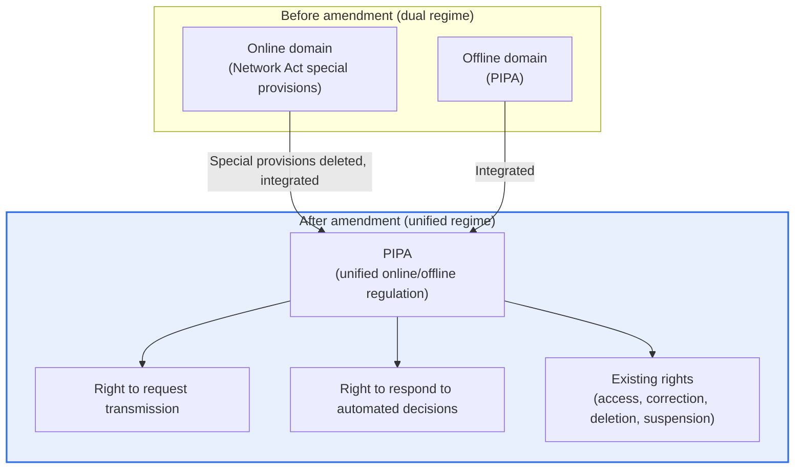
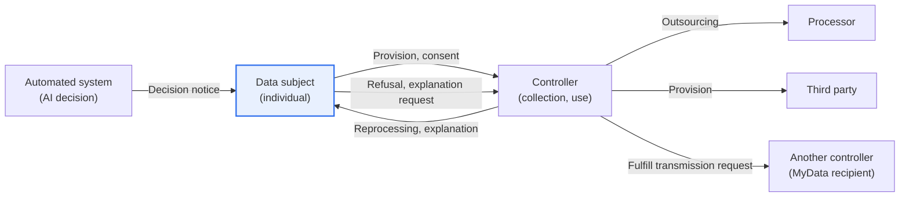

# Amendment to the Personal Information Protection Act (2023)

## 1. Overview

### A. Definition
> The **2023 amended Personal Information Protection Act (PIPA)** is a comprehensive revision promulgated on March 14, 2023 and, in principle, in force from September 15 of the same year. Its core is to unify regulation that had been split between the online and offline domains into a single regime and to newly introduce the **right to request transmission of personal information** and the **data subject's rights regarding automated decisions**, thereby pursuing *both the revitalization of the data economy and the strengthening of data subjects' rights at the same time*.

The definition alone does not convey the weight of this amendment. Since its enactment in 2011, PIPA had been revised several times, but a dual regime persisted for a long time: the online domain was governed by special provisions of the Network Act (Act on Promotion of Information and Communications Network Utilization and Information Protection), while the offline domain was governed by PIPA. Even for the same "personal information leak," the applicable provisions, penalty surcharges, and procedures differed between online and offline businesses, causing considerable confusion for regulated entities. With the so-called "Three Data Acts" amendment in 2020, much of the Network Act's personal information provisions moved to PIPA, but they remained in the form of special provisions. The 2023 amendment deleted these special provisions and completed a regime in which **a single law governs consistently**.

### B. Background and Necessity
The direction of the amendment can be summarized as "**broaden utilization, but thicken rights**." Behind it lay two demands that appear to conflict. The first is the **industrial demand**. As MyData, artificial intelligence, and the platform economy spread, there was a growing call to open an institutional channel for safely moving, combining, and utilizing scattered personal data under the individual's control. When data is locked inside a particular company, innovation by late entrants is blocked, and data subjects cannot switch to services more favorable to them.

The second is the **civic demand**. It is hard to know where and how one's information is being used, and awareness grew of the problem that, in an era when artificial intelligence decides hiring, lending, and insurance underwriting without human involvement, people cannot raise any objection to such decisions. The fact that the EU's GDPR, in force since 2018, had already codified the right to data portability and rights regarding automated processing also directly stimulated domestic legislation.

To accommodate both demands in a single law, the regulatory framework itself needed to be restructured. In other words, the inevitable consequence of the amendment was to unify regulation to increase predictability while granting data subjects new rights that return the fruits of data utilization to them. Utilization without protection of data subjects loses trust, and protection without a utilization base shrinks industry, so the two cannot be separated.

### C. Basic Features of the Amendment
The amended Act consists of four pillars: ① **integration (unification)** of the regulatory regime, ② **expansion** of data subject rights (right to request transmission, right to respond to automated decisions), ③ **rationalization** of the legal bases for data utilization (performance of contract, etc.), and ④ **strengthening the effectiveness of sanctions** for violations (penalty surcharges based on total revenue). Each pillar is described in prose below.

## 2. Change in the Regulatory Regime Before and After the Amendment

First, we survey the overall structure of how the regulatory framework changed. The figure below shows the pre-amendment dual regime being integrated into the post-amendment unified regime, together with the set of rights granted to data subjects.

Before the amendment, even for identical processing of personal information, the governing provisions and sanction levels diverged depending on whether the business was an "information and communications service provider." After the amendment, a single statute—PIPA—consistently governs all controllers, and data subjects can exercise, in addition to the existing rights to request access, correction, deletion, and suspension of processing, the right to request transmission and the right to respond to automated decisions. The key change is that regulatory predictability increased while the list of rights expanded.

| Category | Before amendment | After amendment |
|---|---|---|
| **Regulatory regime** | Online/offline dual (Network Act special provisions remaining) | Unified under PIPA |
| **Data subject rights** | Access, correction, deletion, suspension of processing | + Right to request transmission, right to respond to automated decisions |
| **Bases for collection/use** | Consent-centric | Bases such as performance of contract rationalized and clarified |
| **Video devices** | Fixed CCTV-centric | New standards for mobile video devices (drones, etc.) |
| **Penalty surcharge basis** | Revenue related to the violation | A certain percentage of total revenue (excluding revenue unrelated to the violation) |

## 3. Key Amendments in Detail

### A. Unification of Online and Offline Regulation
Regulatory unification may look like mere tidying of provisions, but its practical significance is large. In the past, for the same breach incident, online businesses were subject to the penalty surcharge, notification, and reporting provisions of the Network Act special provisions, while offline businesses were subject to PIPA provisions, leading to frequent fairness controversies and interpretation disputes. With the deletion of the special provisions, this boundary disappeared, and the principle of **same conduct, same regulation** was established.

From the regulated entity's perspective, the number of laws to consult is reduced to one, lowering the compliance burden. However, for offline businesses that had been subject to relatively lax application, online-level strengthened standards are now extended, so in some areas the actual regulatory intensity has increased. Therefore, it is more accurate to understand "unification" not as "relaxation" but as "upward leveling of standards."

Unification is also the foundation for the newly introduced rights to operate identically regardless of online/offline distinctions. If the right to request transmission and the right to respond to automated decisions applied only to certain channels, their effectiveness would suffer; a single legal regime prevents this.

### B. Right to Request Transmission of Personal Information
The right to request transmission (Article 35-2) is the right of a data subject to **request that their personal information be transmitted to themselves or to a third party they designate (another controller)**. It serves as the general legal basis for MyData services and is the starting point for extending MyData—which had been implemented on a limited basis in the financial sector under the Credit Information Act—to all sectors.

The core of this right is "data portability." If a data subject can move their information accumulated at business A to business B, lock-in effects are mitigated, competition among businesses is promoted, and the data subject can gather data scattered across many places into one location to enjoy new services such as integrated asset management or health management. A representative example is a service that gathers financial information scattered across multiple banks, card companies, and insurers into a single app to provide customized financial advice.

However, the right to request transmission could not be fully implemented immediately upon promulgation. Because enforcement decrees and notices defining the scope of transmittable information, standard application programming interfaces (APIs), transmission intermediaries, and security requirements had to be prepared first, a **phased, sector-by-sector implementation** approach was adopted. In practice, some sectors such as healthcare and telecommunications have confirmed their implementation dates first, while others such as energy have been given preparation periods, gradually expanding the scope (specific dates may change with amendments to the enforcement decree). In an exam answer, it is safe to describe it with the structure "general legal basis established, followed by phased implementation by sector."

### C. Data Subject's Rights Regarding Automated Decisions
The rights regarding automated decisions (Article 37-2) **took effect on March 15, 2024**, one year after promulgation. This scheme allows a data subject, when a decision that has a **significant impact** on their rights or obligations is made solely through processing by a **fully automated system** (including systems applying artificial intelligence technology), to **refuse** that decision or **request an explanation or review** of it.

This right operates in three broad branches. First, the **right to refuse** allows the data subject to reject a decision made without human involvement and request reprocessing by a human. Second, the **right to request an explanation** allows them to request an explanation of the criteria and processing procedure of the decision. Third, the data subject can additionally submit information favorable to them and **request a review** of whether to reflect it in the decision. For example, picture a consumer whose loan was rejected by an AI credit scoring system requesting an explanation of the grounds and submitting omitted income documents to request a re-evaluation.

Note that this right is not unlimited. Where it is necessary to conclude or perform a contract, or where the data subject has given separate consent, the exercise of the right to refuse may be restricted; even then, the right to request explanation and review is guaranteed, balancing the interests involved. Also, because it is limited to "fully automated" processing, decisions in which a human substantively intervenes and reviews are, in principle, not covered. For companies, the task becomes classifying for themselves which decisions fall under this provision, and building explainable AI (XAI) capabilities and objection-handling procedures.

### D. Rationalization of Collection/Use Bases and Mobile Video Information Processing Devices
The amended Act also reorganized the legal bases for collecting and using personal information. Past practice was close to a de facto "consent supremacy," and the custom of obtaining separate consent even for information obviously necessary for contract performance produced perfunctory consent. The amended Act clarified non-consent processing bases, such as **when necessary for concluding or performing a contract**, rationalizing the regime so that substantive consent is concentrated where it is truly needed. The intent is to reduce "consent fatigue" and enhance the genuineness of consent.

In addition, in response to the spread of **devices that capture video while moving**, such as drones, autonomous vehicles, and wearables, the Act went beyond provisions centered on fixed CCTV and established new operating standards for **mobile video information processing devices**. It institutionalized a balance between filming in public places and data subjects' ability to recognize it—for example, by requiring that the fact of filming be indicated through lights, sounds, or signs when filming for business purposes. It is a case of the law following behind to fill a gap created by new technology, showing a typical legislative response to technological change.

These two changes appear to point in opposite directions but actually share one principle. Rationalizing collection/use bases is a direction of "reducing formal consent to revive substance," while the mobile video device provisions are a direction of "guaranteeing recognizability even for new filming means." Both reveal the consistent philosophy of the amended Act in that they place not "the form of consent" but "the data subject's substantive awareness and control" at the center of protection.

This philosophy leads in practice to a redesign of the consent management system. Instead of reducing indiscriminate requests for consent, consent must be obtained in a clearer, easier-to-understand way for truly necessary processing, and its history must be managed. Distinguishing mandatory from optional consent, and designing so that refusing optional consent brings no disadvantage in using the service, is consistent with the purpose of the amendment.

### E. Strengthening the Effectiveness of Sanctions
The amended Act raised the basis for calculating penalty surcharges to **total revenue**. Previously, "revenue related to the violation" was used as the basis, and there was criticism that the actual amounts imposed were small relative to the seriousness of the violations. The amended Act, in principle, caps surcharges at a certain percentage of total revenue, while also providing a safeguard against excessive sanctions by **excluding revenue unrelated to the violation**. This change is a strong incentive for large businesses to recognize personal information protection not as a cost but as a core risk.

## 4. Personal Information Processing Entities and Data Flows

To understand the context in which the rights actually operate, we need to see how personal information flows between entities. Below is a detailed diagram adding the transmission and automated-decision response flows introduced by the amendment to the flows between processing entities.

The **data subject** is the owner of the personal information and the subject of consent and rights exercise. The **controller** collects, uses, and manages it, and may outsource tasks to a **processor** or provide it to a **third party**. The amendment added two flows. One is the flow in which data **moves to another controller** following the data subject's transmission request; the other is a circular flow in which the data subject **refuses or requests an explanation** of a decision made by an automated system and the controller responds. In other words, the structure evolved from one in which data flowed only in one direction to one in which the data subject can intervene in the direction and outcome of the flow.

| Entity | Role |
|---|---|
| **Data subject** | Owner of personal information; gives consent, exercises rights |
| **Controller** | Collects, uses, manages; fulfills transmission and explanation duties |
| **Processor** | Performs processing entrusted to it |
| **Third party** | Receives information and processes it for its own purposes |
| **Transmission recipient** | Another controller receiving data via a transmission request |

## 5. Comparison with Foreign Legislation and Cases

The two new rights in the amended Act were strongly influenced by the EU GDPR. The GDPR provides the right to data portability in Article 20 and rights regarding automated decisions, including profiling, in Article 22. Korea's right to request transmission and right to respond to automated decisions share this concern, but differ in that while the GDPR prescribes them generally and comprehensively, Korean law adopts a gradual approach of **specifying them through sector-specific enforcement decrees**.

The intensity of sanctions is also worth comparing. The GDPR can impose fines of up to **4% of worldwide annual turnover or EUR 20 million, whichever is higher**, for serious violations. The shift to a total revenue basis in Korea's amended Act can be seen as a move to keep pace with such global standards and secure the effectiveness of sanctions. However, a distinctive feature of Korean law is its emphasis on proportionality through the buffer of "excluding revenue unrelated to the violation."

As a domestic application case, MyData in the financial sector (personal credit information management business), established first under the Credit Information Act, serves as a pilot model for the right to request transmission. Experience has accumulated with tens of millions of users viewing and managing information from multiple financial institutions in a single app, and the amended Act provides the legal foothold to extend this model to non-financial sectors such as healthcare and telecommunications.

Meanwhile, the difference in approach between the two regimes also shows in their implementation methods. Whereas the GDPR regulates rights collectively as a Regulation directly applicable in member states, Korean law sets only the skeleton of the rights in the parent statute and delegates detailed requirements to subordinate norms (enforcement decrees and notices) and sector-specific implementation dates. This has the advantage of dispersing the impact by reflecting the data characteristics and readiness of each industry, but also the disadvantage of increasing uncertainty about implementation timing and scope, making it difficult for companies to plan. Therefore, in practice it is realistic to continuously track legislative and administrative pre-announcements of subordinate norms and build response systems in stages.

## 6. Advanced: Latest Trends and Expected Exam Directions

Since implementation, the Personal Information Protection Commission has been progressively preparing subordinate norms. For automated decisions, the enforcement decree and detailed guidelines such as the "Standards for Measures on Automated Decisions" have been issued, specifying practical criteria such as which decisions constitute a "significant impact" and to what level explanations must be provided. For the right to request transmission, amendments to the enforcement decree covering standard APIs, intermediaries, and security requirements for expanding MyData to all sectors continue, with sector-specific implementation dates being set sequentially.

From an exam perspective, likely formats include: ① explaining the **concept, requirements, and limits** of the right to request transmission and the right to respond to automated decisions, respectively; ② requiring a **comparison** with the GDPR; or ③ asking about corporate **response measures (consent design, transmission processing procedures, XAI, objection-handling systems)**. In addition, answers that link to AI-related legislation (the AI Basic Act, ISO/IEC 42001, etc.) and describe the topic in an integrated way from the perspective of "algorithmic accountability" can be highly rated. Similar/related topics include MyData, the Three Data Acts, pseudonymized information, Privacy Impact Assessment (PIA), and Privacy by Design (PbD).

As an answer structuring strategy, it is effective to clearly present the amendment philosophy of "simultaneously strengthening utilization and rights" in the overview; describe regulatory unification, the right to request transmission, the right to respond to automated decisions, and strengthened sanctions in the body, each including requirements and limits; and visualize the data flow and the rights-operation structure with concept diagrams. In the conclusion, it is desirable to address corporate compliance restructuring, algorithmic accountability, and global alignment together to reveal insights from a Professional Engineer's perspective.

## 7. Considerations and Implications

1. **Establishing the general legal foundation for MyData expansion**: The right to request transmission allows individuals to move their data across services, promoting new industries based on data mobility. However, effectiveness is secured only when standard APIs, intermediaries, and security requirements are prepared first, so the key is to align the pace of institutional design with infrastructure buildout.
2. **Institutionalizing algorithmic accountability**: Because human involvement and explanation can now be requested for automated decisions, companies must build explainable AI (XAI) capabilities to explain the grounds of decisions and procedures for human reprocessing. This is a task directly connected to AI governance (ISO/IEC 42001).
3. **Restructuring compliance systems**: Consent methods (mandatory vs. optional), transmission request processing, automated decision response channels, and mobile video device operating standards must be newly organized. Penalty surcharges strengthened on a total revenue basis elevate personal information protection to the top of management risks.
4. **The design philosophy of balancing utilization and protection**: The amended Act strikes a balance not by relaxing or tightening regulation alone, but by opening channels for utilization while attaching the safeguard of rights to those channels. A Professional Engineer should be able to design systems and processes beyond individual provisions, from the perspective of the policy goal of "a virtuous cycle of data utilization and data subject trust."
5. **Securing global alignment**: Sanction and rights regimes that keep pace with international standards such as the GDPR also work in favor of domestic companies' overseas expansion and cross-border data transfers (e.g., adequacy decisions). Alignment with international standards is both a compliance cost and a competitive advantage.
6. **Continuous monitoring of phased implementation**: For schemes like the right to request transmission, where subordinate norms and sector-specific implementation dates are confirmed sequentially, implementation dates and scope may change, so legislative pre-announcements and notices must be tracked continuously. Rather than asserting unconfirmed detailed requirements, one should understand the skeleton and progressively concretize response plans as each sector is confirmed.

## References

- National Law Information Center, Personal Information Protection Act (full text) — https://www.law.go.kr/법령/개인정보보호법
- Personal Information Protection Act Article 37-2 (Data subject's rights regarding automated decisions, etc.), CaseNote — https://casenote.kr/법령/개인정보_보호법/제37조의2
- Partial amendment bill to the Personal Information Protection Act passed by the National Assembly (2023), Lexology — https://www.lexology.com/library/detail.aspx?g=18cd2484-6641-4305-842e-d192f33f4df0
- Data subject's right to respond to automated decisions under PIPA, Law Times newsletter — https://www.lawtimes.co.kr/LawFirm-NewsLetter/196490

---

> **In one line**: The 2023 amended PIPA raised both data utilization and data subject rights through *unification of online/offline regulation, the right to request transmission (the basis for MyData), rights to refuse and request explanation of automated decisions, and strengthened penalty surcharges based on total revenue*, and companies must respond to the balance between utilization and protection by reorganizing consent design, transmission processing procedures, explainable AI, and objection-handling systems.
