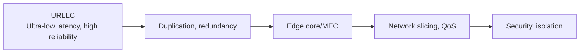

# Considerations for Building a Private 5G Network

## 1. Overview

### A. Definition
> A 5G network **built and operated exclusively within a limited area, such as the organization's own buildings or factories**, by a specific company or institution. Instead of renting a mobile operator's public network, the organization directly owns and controls the network. In Korea it has been institutionalized as **e-Um 5G** (2021–), with the 4.7GHz and 28GHz bands allocated directly to demand-side companies.

The essence of a private network is that **the user organization holds ownership and control of the network**. Because a public network is shared by many subscribers, it is difficult to individually guarantee the requirements of a particular factory (ultra-low latency, data security, specific coverage). A private network secures dedicated resources solely for that area, realizing the **deterministic performance and data sovereignty** that mission-critical industries require.

### B. Background and Necessity
Industrial sites such as smart factories, autonomous logistics, and remote healthcare want the flexibility of wireless, but existing Wi-Fi is vulnerable to interference, handover, and security issues, and wired connections have no mobility. Sending manufacturing data out over external carrier networks is also unwelcome for security reasons. Among the three key characteristics of 5G — **eMBB** (enhanced mobile broadband), **URLLC** (ultra-reliable low-latency communication), and **mMTC** (massive machine-type communication) — industrial demand for URLLC in particular, together with local data processing, is the background behind private networks. Placing a local core and MEC on site allows data to be processed with low latency without leaving the premises, meeting the requirements of OT (operational technology) environments.

The original question asks for both **① measures to ensure stability and reliability** and **② measures to avoid interference** when building a private network, so both axes are covered below.

## 2. Measures to Ensure Stability and Reliability

In a factory where robots and AGVs are controlled wirelessly, a single momentary network outage translates directly into a production stoppage or safety accident. Therefore, the stability of a private network is secured through **defense in depth** that ensures "the service does not stop even when a failure occurs."

- **Applying URLLC**: Targeting 1ms-class ultra-low latency and 99.999% (five-nines) high-reliability transmission, techniques such as **short TTI**, pre-scheduling, and retransmission (HARQ) are used. It is essential for latency-sensitive real-time control (robot arms, safety stops).
- **Redundancy**: Each segment—core, transport, power, base stations—is duplicated to eliminate **single points of failure (SPOF)**, with automatic switchover (failover) to a standby path in case of failure. A private network without redundancy cannot achieve its availability targets.
- **Edge computing (MEC)**: Placing the core and compute close to the site **minimizes dependence on backhaul (external network) and round-trip latency**. The ability to maintain service continuity locally even when external lines are cut contributes greatly to stability.
- **Network slicing**: A single physical network is divided into purpose-specific logical networks, **isolating them and guaranteeing QoS** so that control traffic and general traffic do not affect each other. It prevents situations where surging video traffic crowds out control signals.
- **Security and isolation**: The dedicated network is physically and logically isolated, and mutual authentication, encryption, and access control are applied to block external intrusion and data leakage.
- **Monitoring**: Performance and failures are monitored in real time and SLAs are managed to catch anomalies early.

| Measure | Core mechanism | Effect secured |
|---|---|---|
| **URLLC** | Short TTI, HARQ | Low latency, high reliability |
| **Redundancy** | SPOF elimination, failover | Availability |
| **MEC** | Local processing, minimal backhaul | Continuity, low latency |
| **Slicing** | Logical network isolation, QoS | Traffic guarantee |
| **Security** | Isolation, authentication, encryption | Confidentiality, integrity |

## 3. Measures to Avoid Interference

Factories contain many metal structures and machines, causing severe radio reflection and shielding, and interference with adjacent cells or other wireless devices degrades performance. Because interference lowers the signal-to-noise ratio and directly undermines URLLC reliability, it is addressed at three levels—planning, physical, and coordination—as follows.

- **Frequency planning and allocation**: Channels are deliberately assigned per cell, and with **frequency reuse**, adjacent cells use different channels to reduce co-channel interference. Interference with operators in adjacent bands is also coordinated in advance.
- **Beamforming and low-power cells**: Concentrating signals toward users with directional antennas (**beamforming**) reduces radiation in unnecessary directions, decreasing cell-edge interference. Lowering output with **small cells** and deploying them densely narrows per-cell coverage, making interference easier to manage.
- **Interference coordination (ICIC/eICIC)**: Resources and power are cooperatively coordinated between cells, and **power control** and scheduling mitigate interference for cell-edge users.
- **Radio environment optimization**: Prior **RF measurement and simulation (RF design)** identifies dead spots and interference points, and shielding materials and repeaters are placed appropriately to improve the indoor radio environment.
- **Spectrum sharing and coexistence**: When sharing a common band, coexistence with other systems is achieved through mechanisms such as **LBT (Listen-Before-Talk)**.

| Measure | Principle | Effect |
|---|---|---|
| **Frequency planning** | Reuse, adjacent-band coordination | Co-channel interference ↓ |
| **Beamforming, low power** | Directivity, low output | Cell-edge interference ↓ |
| **Interference coordination** | ICIC/eICIC, power control | Cell-edge performance ↑ |
| **RF optimization** | Measurement, shielding, relaying | Handling dead spots and reflection |

## 4. Considerations and Implications
- **Cost-effectiveness**: Because dedicated spectrum fees, equipment, and operating staff are costly, private 5G should be applied first to processes that actually need wireless flexibility and low latency. Choose between **self-built vs. operator-managed (managed service)** models according to organizational capabilities.
- **Availability and security first, given OT characteristics**: At manufacturing and medical sites, a momentary outage directly means loss or safety issues, so redundancy and physical/logical isolation are mandatory, not optional. Unlike IT security, consider the priority in which **availability comes before confidentiality**.
- **Trade-offs and outlook**: Denser cells reduce interference but increase handovers and deployment costs. The technology is expected to evolve toward 5G-Advanced and 6G, **deterministic networking (TSN integration)**, and AI-based autonomous optimization (SON), expanding into **core infrastructure for digital transformation** in smart factories, autonomous logistics, and remote healthcare.

---

> **In one line**: Private 5G (e-Um 5G) provides *organization-dedicated 5G with ultra-low latency, high reliability, and data sovereignty*; it secures stability and reliability through URLLC, redundancy, MEC, and slicing, and interference avoidance through frequency planning, beamforming, interference coordination, and RF optimization, while balancing cost and availability.
