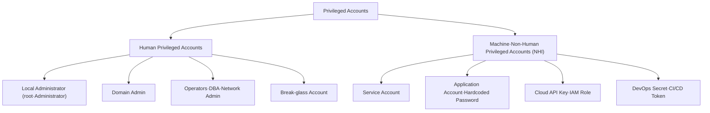
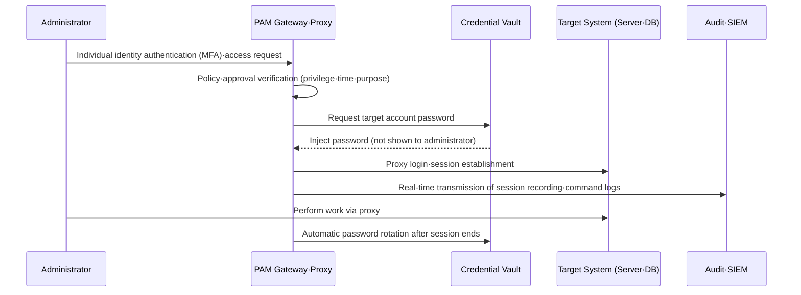

# Privileged Access Management (PAM)

## 1. Overview

> **Privileged Access Management (PAM)** is a security management framework that identifies, stores (vaults), controls, monitors, and revokes the privileged accounts and privileged sessions that hold broad authority over systems, data, and infrastructure. Its purpose is to control and trace "who did what, when, and with which privileges," thereby minimizing damage from privilege misuse and account takeover.

Managing ordinary user accounts and managing privileged accounts differ in the sheer magnitude of the risk involved. When an ordinary account is compromised, the damage is confined to that user's scope of work; but when a privileged account such as an administrator (root/Administrator), a service account, or a DBA account is compromised, the attacker can change system-wide settings, delete logs, exfiltrate large volumes of data, and even destroy backups. In reality, many breaches escalate from an initial intrusion through **privilege escalation** and **lateral movement** to acquire domain administrator rights, and in this process privileged accounts become the core attack target.

The reason privileged accounts are hard to manage lies in the fact that they are numerous and scattered, and that the majority are non-human rather than human accounts. Privileges are held not only by OS administrator accounts, but also by service accounts that applications use to connect to databases, passwords hardcoded in scripts, batch accounts used by schedulers, cloud API keys, and secrets in DevOps pipelines. These tend to remain after the responsible staff member has left, to share the same password across many systems, or to sit unchanged for years. Such ownerless, drifting accounts are called **orphan accounts / zombie accounts**, and PAM's first task is precisely the full discovery of these privileged accounts.

PAM is a sub-domain of Identity and Access Management (IAM), but its goals and control intensity differ. Whereas IAM addresses the broad problem of "granting the right permissions to every user," PAM focuses on "densely controlling a small number of powerful permissions." As Zero Trust spreads, PAM is being redefined beyond a mere account-password safe into a core pillar that realizes session-level verification, least privilege, and the elimination of standing privilege (ZSP, Zero Standing Privilege).

The essence of PAM can be compressed into three characteristics. The first is **centralized control**, consolidating scattered privileged credentials into a single vault to unify the point of management. The second is **least privilege and minimal exposure**, granting only the necessary privileges at the necessary time to eliminate standing exposure. The third is **complete traceability**, mapping and recording every privileged action against an individual identity to enable post-incident accountability and auditing. These three characteristics correspond respectively to the security goals of reducing the attack surface, minimizing the window of damage, and securing accountability.

It is also worth noting the background of how PAM evolved into a distinct domain. Early on, administrators managed server passwords by jotting them down in spreadsheets or memos; this later evolved into the **Password Vault** form, storing shared passwords in a central vault. However, once it became clear that a vault alone could not control "what was done after the password was retrieved," session management—proxying, relaying, and recording the session itself—was combined with it. Recently, as awareness has grown of the need to eliminate standing privilege itself, the center of gravity has shifted to JIT and ZSP. In short, the history of PAM can be summarized as a flow from "hiding passwords" through "controlling and recording actions" to "not holding privileges on a standing basis at all," and this aligns precisely with the philosophy of Zero Trust.

## 2. Types of Privileged Accounts and the Scope of PAM Control

To design PAM, one must first structurally grasp "what constitutes a privileged account." Because privilege exists broadly not only in human accounts but also in machines and applications, failing to categorize the types leaves gaps in the scope of control. The concept diagram below shows the full structure of the branches in which privileged accounts exist.

First, **human privileged accounts** are accounts that actual people use for administrative purposes. These include a server's root, Windows' Administrator, Active Directory's Domain Admin, a database's DBA account, and the enable account of a network device. Because it must be possible to trace the cause when an incident occurs, individual identifiability is important; yet when several administrators share a common root account, a fundamental problem arises in that "who did it" cannot be pinned down. PAM requires authentication under an individual identity first even when using a shared account, and it records that mapping in logs to secure accountability.

Domain administrator accounts in particular become the ultimate target of attacks because they can seize the trust foundation of the entire organization. In an Active Directory environment, an attacker who acquires domain administrator rights can secure virtually unlimited persistence through attacks such as the Golden Ticket, which forges Kerberos authentication tickets. Therefore, PAM classifies high-impact accounts such as domain administrators and enterprise administrators into a separate highest tier, and it applies parallel controls that separate the layers (Tiering) so that these are used only on a dedicated management terminal (PAW, Privileged Access Workstation).

Second, the **break-glass account** is a top-tier account that is normally sealed and opened only in emergency situations where access through normal paths is impossible, such as a PAM system failure or a large-scale disaster. As the metaphor "break the glass to retrieve it" suggests, it is designed so that opening it itself triggers a strong alert and the password is immediately reset after use. If a break-glass account is not provided, PAM itself becomes a single point of failure and instead harms availability, so it must be designed as a safeguard that balances control and availability.

Third, **machine/non-human identity (NHI, Non-Human Identity)** is the fastest-growing object of control recently. As microservices, containers, and serverless spread, far more service accounts and secrets than humans are automatically created and destroyed. For example, for a single web application to connect to a DB, cache, message queue, and external APIs, it needs numerous credentials, and if these are embedded in plaintext in source code or configuration files, a single leak of the configuration management system exposes them all. PAM separates such secrets from code, stores them in a vault, and has applications dynamically retrieve them via API at runtime.

Non-human identities are difficult to control because, unlike human accounts, their explicit owner is unclear and interactive authentication such as MFA is hard to apply. If a single service account is reused across many systems, one leak spreads to cascading damage, and carelessly changing the password can simultaneously cause failures in linked batch and integration systems, so even rotation must be handled cautiously. Therefore, for non-human identities, PAM accurately maps where they are used (identifying dependencies), then controls the scope of rotation, and where possible replaces static passwords themselves with short-lived dynamic credentials, adopting a strategy that fundamentally lowers the risk of leakage.

| Control Target | Representative Example | Key Risk | PAM Control Method |
|-----------|-----------|-----------|----------------|
| Human administrator account | root, Administrator, DBA | Misuse; untraceable shared accounts | Proxy access after individual authentication; session recording |
| Break-glass account | Break-glass | Standing exposure; misuse | Sealing; opening alerts; rotation after use |
| Service account | Batch·daemon accounts | Unchanged passwords; sharing | Automatic rotation; restricted scope of use |
| Application secret | Hardcoded passwords·tokens | Mass exposure on code leak | Secret vault; dynamic lookup |
| Cloud credential | API Key, IAM Role | Excessive privilege; long persistence | Short-lived tokens; JIT issuance |

## 3. Core Functions and Architecture of PAM

A PAM solution weaves several independent functions into a single control flow. It is important to understand the processing path from the moment an administrator attempts to access a privileged resource, through the end of the session, to the auditing. The core components are broadly divided into the **Vault** that stores and rotates credentials, the **proxy/gateway** that relays, isolates, and records sessions, the **policy engine** that makes policy decisions, and the **audit/analytics layer** that accumulates and analyzes history. Physically these are multiple components, but from the administrator's perspective they must operate as a single access gateway to ensure usability. Below is a representative access-processing architecture of PAM.

**First, Credential Vaulting and password rotation.** PAM's starting point is to keep the passwords and keys of privileged accounts unknown to humans. All privileged passwords are kept in an encrypted vault, and the administrator connects to the target system through PAM without directly seeing the password. When the session ends, the password is immediately reset to a random value (automatic rotation), so even if a credential is leaked through screen capture or the like, it cannot be reused. For example, in a next-generation financial system, a policy is applied to rotate the DBA account password every 24 hours or after each single use, so that even if partner personnel are resident on-site, they cannot privately keep the account.

**Second, session management and isolation (PSM, Privileged Session Management).** The administrator does not connect directly to the target server but goes through the PAM proxy (jump server). In this structure, PAM records every session as video and text, and can detect and block dangerous commands (e.g., `rm -rf`, `DROP TABLE`) in real time. Because the administrator's terminal and the target system are not directly connected, even if the administrator's PC is infected, an isolation effect arises whereby malware does not propagate straight to the target server.

**Third, applying least privilege (PEDM, Privilege Elevation and Delegation Management).** Instead of granting administrators standing root privileges, only the necessary commands are elevated and executed on the spot. Fine-grained Linux sudo policies, per-application privilege elevation in Windows, and application whitelisting fall into this category. Users normally log in with ordinary privileges, and privileges are raised only within an approved scope when performing specific administrative tasks, so the attack surface is greatly reduced.

**Fourth, Just-In-Time (JIT) provisioning and Zero Standing Privilege (ZSP).** The traditional approach grants privileges to administrators in advance, and this "standing privilege" itself becomes the attack target. JIT grants privileges only temporarily at the moment of request/approval and revokes them once the work is done, aiming for a state in which, for most of the time, no one holds any privilege (ZSP). In cloud environments, it is implemented by issuing short-lived tokens that expire in units of tens of minutes instead of permanent IAM keys. For example, rather than granting a developer who needs to perform nighttime deployments standing production management rights in advance, if a 30-minute privilege is issued only during the scheduled work window in conjunction with change-management ticket approval and then automatically revoked, then even if the account is compromised, the time during which the privilege is alive is extremely short, minimizing the window of damage.

**Fifth, audit and behavior analytics (Audit·UEBA).** PAM does not merely log all privileged access and commands; it combines User and Entity Behavior Analytics (UEBA) to detect anomalous patterns that differ from the norm. For example, if a certain DBA queries, at dawn, a large personal-information table that they do not usually access, then even if the authentication is normal, PAM can raise the risk score to require additional authentication or block the session. Because such accumulated session records are also used as evidence for post-incident forensics and regulatory audits, log integrity (tamper prevention) and retention-period management must be designed together.

These five functions ultimately amount to controlling the entire lifecycle span of privileged accounts. The control flow of PAM can be summarized as a lifecycle as follows.

- **Discovery:** Conduct a full survey of all privileged accounts, secrets, and orphan accounts within the organization to secure the list of control targets.
- **Vaulting:** Migrate credentials to an encrypted vault and remove plaintext passwords from code and documents.
- **Control:** Restrict access via request, approval, least privilege (PEDM), and JIT, and enforce routing through the proxy.
- **Monitor:** Record and analyze sessions, and detect and block anomalous behavior in real time.
- **Rotate·Revoke:** Rotate passwords after use and revoke temporary privileges to eliminate standing exposure.

## 4. Comparison with Similar Concepts and Adoption Cases

PAM is often confused with IAM and IGA, but their focus differs. IAM is a broad umbrella addressing the identity, authentication, and authorization of all users in an organization, and IGA (Identity Governance and Administration) is the governance domain within it specialized in the appropriateness of authorization, certification cycles, and auditing. PAM, within that, focuses on the **real-time control of a small number of accounts and sessions with powerful privileges**, and in this respect has the highest control density. The three concepts are not substitutes but hierarchically complementary: IGA determines "who should have which privileges," and PAM controls "how those powerful privileges are actually used."

| Category | IAM | IGA | PAM |
|------|-----|-----|-----|
| Target | All users | All privileges·roles | Privileged accounts·sessions |
| Focus | Authentication·SSO·authorization | Privilege appropriateness·certification·audit | Vaulting·session control·least privilege |
| Timing | Standing login | Periodic review | Real-time per access·session |
| Representative control | MFA, provisioning | Access Certification | Password rotation, session recording, JIT |

PAM must also be understood as distinct from access control models. Whereas access control models such as DAC, MAC, and RBAC define the policy logic of "which subject can access which object," PAM overlays operational controls—credential storage, session relaying, and behavior monitoring—on the privileged accounts to which that policy is applied. In other words, if an access control model is the rule, PAM is closer to the enforcement and monitoring infrastructure that makes that rule actually observed for powerful privileges. The two concepts do not conflict; they combine in a relationship where PAM handles the enforcement of the privileged domain on top of the access control policy.

Looking at practical adoption cases, the effect of control becomes clear. For example, when an organization in which many administrators and partner personnel accessed servers with a shared root introduces PAM, proxy access after individual identity authentication is enforced, and "who did what" is left as session recordings. This not only shortens the time for incident investigation but also has the effect of automating audit response and regulatory compliance (e.g., ISMS-P access control and account management controls, and access-privilege management and access-log retention under the standards for measures to ensure the safety of personal information). As another case, when a development organization that hardcoded DB passwords in source code introduces a secret vault and removes credentials from the code, the actual passwords are not exposed even if the configuration management repository leaks. Statistically, too, a substantial portion of breaches originate from credential misuse, so vaulting, rotating, and applying least privilege to privileged credentials is assessed as a control with a high risk-reduction effect relative to the investment.

Conversely, one must also understand the failure patterns that frequently appear during adoption in order to design effectively. The representative pitfalls are as follows.

- **Vaulting only, actions neglected:** Even if passwords are placed in a vault, without session recording and command control one cannot prevent misuse after the privilege is retrieved. Vaulting and session management must go together.
- **Omission of non-human identities:** If only human administrators are controlled and service accounts and API keys are left out, the machine identities that make up the majority of the actual attack surface remain exposed.
- **Excessive control inducing circumvention:** If the approval process is too slow, business users bypass PAM by creating separate accounts or using paths outside control, actually enlarging the blind spots. Control intensity must be differentiated on a risk basis.
- **No break-glass design:** Enforcing PAM alone without a break-glass account makes recovery itself impossible when PAM fails, causing an availability crisis.
- **Log integrity not secured:** If session logs can be tampered with, they lose their validity as audit evidence. Integrity must be guaranteed through separate storage, hash chains, and SIEM integration.

## 5. Deep Dive — Extension to Cloud/DevOps Environments and Latest Trends

Traditional PAM developed on the premise of on-premises servers and human administrators, but as cloud, containers, and DevOps spread, the objects and methods of control are being fundamentally reshaped. First, there is the **explosion of non-human identities**. In microservices and serverless environments, machine identities outnumber humans by tens of times, and their secrets are created and destroyed on short cycles. Accordingly, the existing method of rotating static passwords alone has limits, so **Secrets Management**—dynamically issuing short-lived credentials at runtime—and workload identity integration have become essential extension areas of PAM.

Second, there is the **shift toward a JIT/ZSP focus**. In the cloud, long-lived API keys cause great damage when leaked, so the method of issuing role-based short-lived tokens only at the time of request is becoming standard. This inverts the model of "grant privileges in advance and revoke later" into "grant only when needed and revoke immediately," meeting precisely with the least-privilege principle of Zero Trust. This shift also has an advantage from an audit perspective: without standing privilege, there is no need to review each time "why is this privilege currently granted," and the legitimacy of privilege usage can be traced from the issuance history alone, reducing the burden of Access Certification. Third, there is the **combination with CIEM (Cloud Infrastructure Entitlement Management)**. CIEM, which continuously analyzes and reduces excessive permissions and unused permissions granted in multicloud, has emerged as the core of cloud privilege management and is trending toward complementary integration with PAM and CNAPP.

Fourth, on the standards/framework side, PAM is strengthening session-level verification by combining with the Policy Enforcement Point (PEP) of the Zero Trust Architecture (NIST SP 800-207), and domestically as well, the ISMS-P certification criteria and public/financial security guidelines explicitly require privileged account management, access-log retention, and least privilege. In particular, systems that process large volumes of personal information are required to retain administrator account access logs for a certain period or longer and prevent tampering, and to grant access privileges minimally and differentially, so PAM becomes a practical means of automating such compliance requirements. Going forward, in an **agentic AI** environment where AI agents autonomously manipulate systems, how to control and audit the privileges granted to non-human AI agents is expected to emerge as a new challenge for PAM. As for likely exam directions, a composition is probable that ① explains PAM's components and architecture, ② describes the JIT/ZSP concepts in connection with the least-privilege principle, and ③ discusses the differences among IAM, IGA, and PAM and their linkage with Zero Trust.

## 6. Considerations and Implications

From a professional engineer's perspective, PAM should be approached not as a mere solution deployment but as a redesign of account and privilege governance, considering the following comprehensively.

- **Adoption strategy (phased introduction):** Raise maturity in the order of full discovery of privileged accounts → vaulting and password rotation → session control and recording → least privilege (PEDM) → JIT/ZSP. Enforcing all controls from the start causes great operational resistance, so a risk-based approach that applies first to high-risk domain administrator and DBA accounts is realistic. The key to success is to measure both the control effect and the operational burden at each maturity stage, finding the point where control does not excessively hinder business productivity, and adjusting the pace of rollout accordingly.

- **Availability trade-off (avoiding a single point of failure):** Because the PAM proxy becomes the gateway for all privileged access, if PAM itself goes down, operations and emergency response can be paralyzed. Together with redundancy and high-availability configuration, a break-glass account must be designed to balance control and availability.

- **Performance measurement metrics:** Quantify the adoption effect through metrics such as the proportion of vaulted privileged accounts, the reduction in the number of accounts holding standing privilege, the proportion of unchanged passwords (stale credentials), session-recording coverage, and anomaly detection/response times (MTTD/MTTR), using these as the basis for continuous improvement.

- **Accountability and regulatory compliance:** Even when using shared accounts, one must secure individual identity mapping and session logs so that "who did what and when" can be reconstructed. Design log retention periods and integrity (tamper prevention) to align with the access control and account management requirements of ISMS-P and the access-log retention and access-privilege management requirements of the standards for measures to ensure the safety of personal information.

- **Extension to non-human identities and secrets:** Controlling only human accounts leaves the larger attack surface of service accounts, API keys, and CI/CD tokens neglected. The scope of control must be broadened to machine identities by combining secret vaults, dynamic credentials, and CIEM.

- **Linkage technology perspective:** PAM maximizes its effect when linked with Zero Trust (ZTNA), SIEM/SOAR, IGA, and CNAPP. PAM should be positioned within an integrated security operations framework that correlates session anomalies with SIEM, responds automatically with SOAR, and checks privilege appropriateness through IGA's periodic access certification.

- **Organization and process perspective:** PAM is not completed by technology deployment alone; the responsible parties and procedures for granting, approving, and revoking privileges must be redefined to align with change management and Separation of Duties (SoD) principles. Without a governance routine that separates requester, approver, and performer and periodically re-reviews the status of privileged accounts, controls loosen again over time.

- **Outlook:** As the privileges of non-human identities and AI agents explode, human-centric PAM will shift its center of gravity to workload and agent identity management. "Zero Standing Privilege (ZSP)," which minimizes static credentials and combines short-lived, dynamic identities with continuous verification, is expected to become the target state of privilege management.

## References
- NIST SP 800-207, Zero Trust Architecture — https://csrc.nist.gov/pubs/sp/800/207/final
- CISA, Zero Trust Maturity Model — https://www.cisa.gov/zero-trust-maturity-model
- Korea Internet & Security Agency (KISA), ISMS-P Certification Criteria Guide — https://isms.kisa.or.kr
- OWASP, Secrets Management Cheat Sheet — https://cheatsheetseries.owasp.org/cheatsheets/Secrets_Management_Cheat_Sheet.html

---
> **In one line**: PAM is a security control framework that identifies, vaults, applies least privilege to, monitors, and revokes privileged accounts and sessions; through password rotation, session recording, and JIT/ZSP it minimizes damage from privilege misuse and account takeover, and it is extending its scope of control to the cloud, non-human identities, and Zero Trust.
