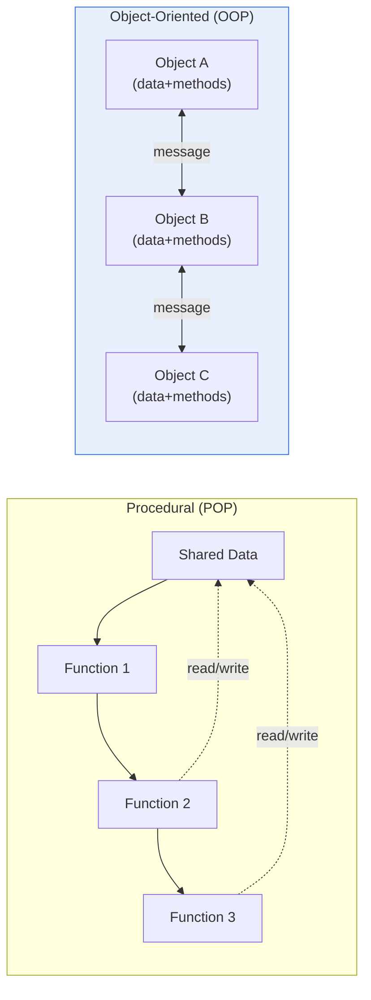
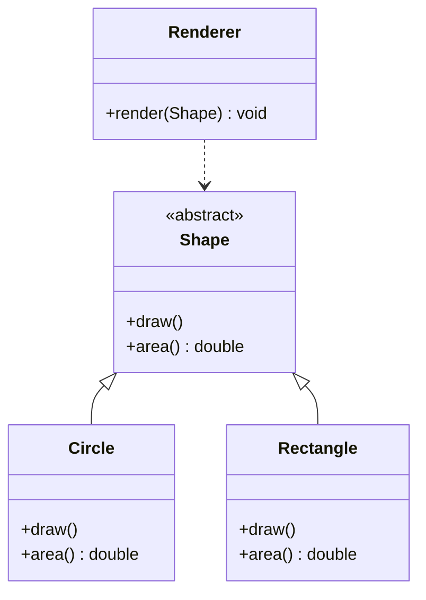

# Procedural Programming (POP) and Object-Oriented Programming (OOP)

## 1. Overview

### A. Concept

> **Procedural-Oriented Programming (POP)** is an approach that structures a program as a **sequential execution flow of a series of functions (procedures)**, whereas **Object-Oriented Programming (OOP)** is an approach that bundles data and the functions that handle that data into **objects**, structuring a program through message exchange (interaction) among objects.

The fundamental reason for comparing these two paradigms is not merely that "their syntax differs," but the essential question of software engineering: **when software grows large and lives long, around what should the structure be organized so that maintenance and management costs stay low?** It is a long-standing rule of thumb that the total cost of software is far greater in maintenance and change than in initial development (surveys repeatedly report that 60–80% of total lifecycle cost occurs in the maintenance phase), and what governs this cost is precisely the **ripple scope of change**. The two paradigms control "how far the impact spreads when a change occurs" in different ways.

**Procedural programming** takes 'what it does (actions/functions)' as the skeleton of the program. Data structures come first, and functions that process that data in order flow from top to bottom. It naturally meshes with Top-Down decomposition, which breaks a problem into 'large task → small task,' and because the execution flow is laid bare in the code, it is intuitive and free of clutter for small, simple programs. However, as scale grows, data becomes shared and exposed across many functions (especially global data), so changing one data structure requires fixing every function that touches that data together, and it becomes hard for a person to trace how far the impact of a modification reaches. In other words, because data and functions are separated, coupling ends up in a state that 'looks loose but is actually widely spread out.'

**Object-oriented programming** solves this problem by flipping it to be 'data-centric.' It **encapsulates** mutually related data and the functions that handle that data into a single object, hides the data inside the object (information hiding), and allows access only through methods, which are the public passageways. Then, even if the data representation changes, the change is confined to the interior of that object (because the outside knows only the interface), and by reusing common structure through inheritance and polymorphism, only the differing parts can be extended. In summary, if procedural programming sees the world as 'a flow of functions,' object-oriented programming sees the world as 'objects that cooperate with one another while holding responsibilities.' The more large-scale, long-operating, and change-prone the software, the greater the value of this structural localization.

### B. Background of Emergence and Necessity

Procedural programming took hold within the structured programming current of the 1970s, as an attempt to tidy up 'spaghetti code' tangled by GOTO abuse into control structures of sequence, selection, and iteration together with function decomposition; C, Pascal, and Fortran represent it. However, as software in which state and interaction exploded—such as GUIs and large-scale business systems—emerged from the 1980s onward, the recognition of a 'software crisis,' that function decomposition alone could not handle the complexity, spread. Here, taking over the class concept of Simula, Smalltalk implemented pure object orientation, and C++ and Java disseminated object orientation to industry, rising to become the standard paradigm for large-scale collaborative development. In other words, the emergence of OOP arose not from a matter of 'syntactic taste' but from the practical needs of **managing complexity and dividing labor at the team level**.

| Category | Central Viewpoint | Worldview | Representative Decomposition Method |
|---|---|---|---|
| **Procedural** | Functions (actions) | Sequential processing flow | Functional decomposition (Top-Down) |
| **Object-oriented** | Objects (data + actions) | Cooperating objects | Responsibility division (roles·cooperation) |

## 2. Structural Comparison of the Two Paradigms

The concept diagram below shows the difference in how the two paradigms arrange data and functions. In procedural programming, data is placed outside the functions and shared among many functions, whereas in object-oriented programming, data goes inside each object and travels only via messages.

The consequence this structural difference produces in practice is clear. Consider, for example, a program that handles a bank account balance. In procedural programming, data called `balance` exists globally, and functions such as `deposit()`, `withdraw()`, and `printStatement()` directly read and write it. To enforce the rule that the balance must not become negative, the same check must be duplicated in every function that touches `balance`, and if a developer who adds a new function omits the check, the rule is broken. In object-oriented programming, `balance` is hidden as `private` inside an `Account` object and can be decreased only through the `withdraw()` method, so the balance invariant can be guaranteed in one place. The practical benefit of encapsulation is that it **attaches the rules about data to the place where the data lives**.

| Category | Procedural (POP) | Object-Oriented (OOP) |
|---|---|---|
| **Basic unit** | Function (procedure) | Object (class) |
| **Data handling** | Global·shared (exposed) | Encapsulated (hidden) |
| **Reuse mechanism** | Function calls (limited) | Inheritance·composition·polymorphism (easy) |
| **Change impact** | Spreads widely (hard to trace) | Localized within the object |
| **Performance** | Relatively fast·lightweight | Overhead of abstraction·dynamic dispatch |
| **Representative languages** | C, Pascal, Fortran | Java, C++, C#, Python |
| **Suitable domain** | Small-scale·sequential processing·systems·embedded | Large-scale·complex·frequently changing business systems |

The performance item is easily misunderstood, so it is necessary to spell out the reasons. Object orientation's polymorphism entails **dynamic dispatch** (virtual function table lookup) that decides at runtime which method to call, so it incurs a slight cost over a direct function call. The indirect costs of per-object memory allocation and reference tracing, and of virtual machine environments (such as the JVM), are also added. However, this difference is negligible in most business systems and does not offset the large benefit of maintainability and extensibility. Conversely, in domains where cycle-level performance and deterministic behavior are important, such as kernels, device drivers, and real-time control, C-based procedural programming still dominates. In other words, performance should be understood not as an 'absolute superiority' but as a **trade-off depending on the application domain**.

## 3. In-Depth on the Four Pillars of Object Orientation

OOP's maintenance and reuse benefits arise from the following four characteristics meshing together. We view each characteristic not as a mere definition but from the perspective of 'why it lowers the cost of change.'

**A. Encapsulation** bundles data and the methods that handle it into one unit and hides the internal representation from the outside (information hiding). Its core effect is a 'firewall of change.' Because the outside knows only **what** the object can do (the public interface) and not **how** it does it (the internal implementation), external code is unaffected whether the internal data structure is changed from an array to a hashmap or the calculation formula is optimized. As with the account example above, invariants can be maintained in one place, preventing rules from scattering throughout the code.

**B. Inheritance** is when a subclass inherits and reuses/extends the attributes and behaviors of a superclass. It reduces duplication by gathering common code into the superclass, but it also has the vulnerability that the superclass and subclass are strongly coupled, so a change to the superclass ripples across all subclasses. Therefore, modern design recommends "Composition over Inheritance," and inheritance tends to be used only restrictively for 'true is-a relationships.'

**C. Polymorphism** is the property of responding differently by object to the same message. For example, even if `draw()` is called identically on various shapes of type `Shape`, a circle and a rectangle are each drawn in their own way. Because the calling side need not know the concrete type, adding a new shape class does not touch existing calling code. This is the technical foundation of the OCP (Open-Closed Principle) discussed later. The class diagram below shows the typical structure in which inheritance and polymorphism mesh. An abstract superclass (`Shape`) defines `draw()`, subclass implementations each override it, and the using side (`Renderer`) depends only on the abstract type.

In this diagram, the change of adding a new shape (e.g., `Triangle`) ends with adding one more class that inherits `Shape`, and because `Renderer` depends only on the `Shape` abstract type, no recompilation or modification is needed. In procedural programming, one would have to modify the branch statements inside the processing function corresponding to `Renderer`, and whether this 'extension without modification' is possible creates the extensibility gap between the two paradigms.

**D. Abstraction** models only the essential attributes from the problem domain and hides unnecessary details. Using interfaces and abstract classes to define only 'what it does' and leaving 'how' to the implementations, it separates high-level policy from low-level details.

| Characteristic | Core Mechanism | Benefit from a Maintenance Perspective |
|---|---|---|
| **Encapsulation** | Information hiding, public interface | Isolates internal changes from the outside |
| **Inheritance** | Hierarchical inheritance of traits | Reuse of common code (but beware coupling) |
| **Polymorphism** | Dynamic dispatch | Existing code unchanged upon extension |
| **Abstraction** | Interfaces·abstract classes | Separates policy from implementation |

## 4. Comparative Cases and Practical Implications

How the difference between the two paradigms manifests at actual code scale becomes clear when viewed through a 'requirements change' scenario. Consider the common change of "adding a new device type" in a monitoring system that handles dozens of device types. In a procedural implementation, code that handles device kinds via `switch`/`if` branches is scattered across many functions (registration, display, aggregation, alarms), so adding one type requires finding and fixing all those branch statements, and missing even one place becomes a defect. In object orientation, if each device is made a class that implements a common interface, a new type ends with adding one class and the existing code keeps working thanks to polymorphism. That the change point shrinks from 'N places' to '1 place' is the quantitative reason OOP is preferred in large-scale systems.

That said, the conclusion "OOP is always right" is dangerous. The Linux kernel is large-scale software of over 20 million lines, yet it is written and maintained in C-based procedural programming (it mimics only the polymorphism it needs using structs and function pointers), owing to domain characteristics of performance, portability, and hardware-close control. Conversely, large-scale enterprise web services are built on object-oriented frameworks such as Spring (Java), with hundreds of people collaborating, and here layer separation and extensibility matter more than performance. Moreover, as functional programming (FP) rises, a 'third axis' that secures concurrency and testability through immutable data and pure functions has entered practice. In the end, paradigm choice is not a competition of superiority but an **engineering judgment of fitness to domain characteristics (performance, change frequency, team size, concurrency requirements)**.

## 5. Deep Dive — Design Principles and Multi-Paradigm Modern Languages

Object orientation does not automatically confer benefits merely by using its syntax. Poorly designed, it instead only increases complexity through class explosion and excessive abstraction (so-called 'abuse of object orientation'). Hence the true value of OOP emerges when combined with the **SOLID principles** and **design patterns**. SOLID comprises ▲SRP (Single Responsibility), ▲OCP (Open-Closed: open to extension, closed to modification), ▲LSP (Liskov Substitution), ▲ISP (Interface Segregation), and ▲DIP (Dependency Inversion), and the benefit seen earlier that 'a new type is added merely by adding a class' is in fact produced by the combination of OCP and polymorphism. Design patterns (Strategy, Observer, Factory, etc.) formalize these principles into reusable cooperative structures. From a design perspective, the goal is always **high cohesion and low coupling**, and this is a universal principle pursued equally in procedural programming as well. [[module-cohesion-coupling]]

Modern languages do not force a single paradigm. Python, C++, JavaScript, and Kotlin are **multi-paradigm** languages that support procedural, object-oriented, and functional styles together within one language, and Java too has substantially adopted functional elements with lambdas and streams from version 8. In practice, it is natural to mix paradigms to fit the problem, such as "data transformation pipelines in a functional style, domain models and state management in object-oriented style, and performance-critical loops in procedural style." Therefore, from a professional engineer's perspective, the important competency is not to argue "which paradigm is superior," but to **select and combine the paradigm suited to the nature of the given problem and explain its trade-offs**.

## 6. Considerations and Implications

1. **Choice matching the problem and scale comes first.** For small, performance- and determinism-critical embedded, systems, and real-time domains, procedural programming (C) is advantageous, while for large, frequently changing business and service systems that require team collaboration, object orientation is advantageous. The two are not substitutes but domain-specific options, and a wrong choice comes back as maintenance cost.

2. **Paradigms coexist and mix.** Now that multi-paradigm languages have become standard, rather than insisting on a single 'correct paradigm,' a design sensibility that combines the strengths of each paradigm per problem (procedural = simplicity·performance, object-oriented = structure·extensibility, functional = immutability·concurrency) is required.

3. **True value emerges when combined with design principles.** Object orientation too, used without SOLID and design patterns, only increases complexity. The reuse and maintenance benefits are realized only atop the universal principle of raising cohesion and lowering coupling, which is a constant of software engineering transcending paradigms. [[module-cohesion-coupling]]

4. **Transition and outlook: concurrency and large-scale data are changing the paradigm landscape.** As shared mutable state becomes the root of concurrency bugs in multicore and distributed environments, the share of functional elements emphasizing immutability is growing. What will be required of developers going forward is, beyond mastery of a specific paradigm, a **paradigm literacy** that moves among multiple paradigms as the situation demands. A professional engineer must be able to prescribe paradigms and languages by weighing performance, extensibility, concurrency, and team competency together when making architectural decisions.

## References

- Wikipedia, "Object-oriented programming" — https://en.wikipedia.org/wiki/Object-oriented_programming
- Wikipedia, "Procedural programming" — https://en.wikipedia.org/wiki/Procedural_programming
- Robert C. Martin, "The Principles of OOD (SOLID)" — https://blog.cleancoder.com/uncle-bob/2020/10/18/Solid-Relevance.html

---

> **In one line**: Procedural programming, placing *the sequential flow of functions* at the center, is efficient for small-scale, performance, and systems domains but becomes hard to maintain as changes ripple widely with scale, whereas object-oriented programming *encapsulates data and behavior into objects* and localizes and extends change through inheritance and polymorphism, suiting large-scale, complex systems; in modern practice, benefits are realized by combining paradigms to fit the nature of the problem and pairing them with SOLID and design principles.
