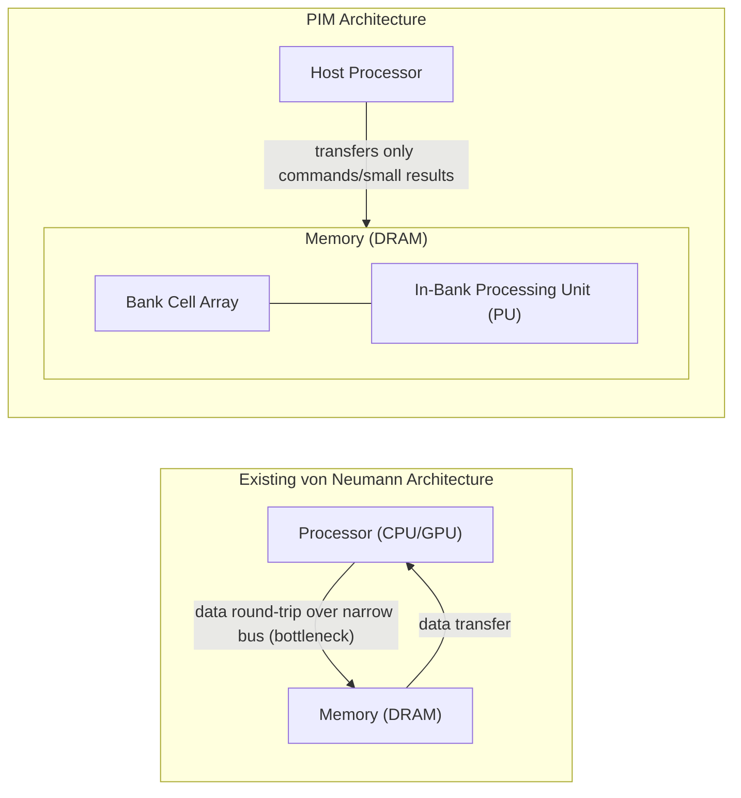
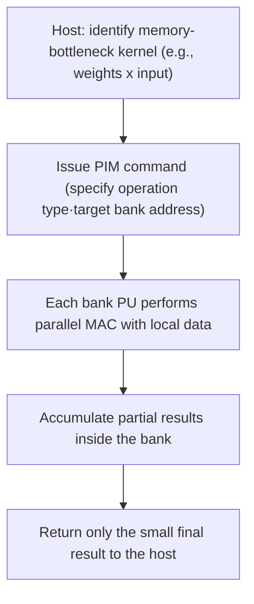

# Processing-in-Memory (PIM)

## 1. Overview

### A. Definition
> **Processing-in-Memory (PIM)** is a semiconductor architecture that **integrates computation units (simple ALUs, multiply-accumulators, etc.) inside memory (DRAM, etc.)** that used to only store data, so that computation is **performed directly at the location where the data resides** without moving the data to the processor. Based on the idea of "Bring compute to data," it alleviates the fundamental bottleneck of the von Neumann architecture.

In the traditional von Neumann architecture, computation devices such as CPUs and GPUs and memory are physically separated, connected by a relatively narrow bus. All data needed for computation must travel through this bus from memory to the processor, and while computational performance has improved dramatically over the decades, memory bandwidth and latency have not kept up commensurately. As a result, the **Memory Wall** phenomenon—in which the processor idles while waiting for data—has intensified. To bypass this wall, PIM processes data immediately inside the memory bank rather than bothering to send it all the way to a distant processor. Samsung Electronics' HBM-PIM (Aquabolt-XL) and SK hynix's GDDR6-based AiM (Accelerator-in-Memory) are representative commercialization cases.

### B. Background of Emergence and Necessity
Behind PIM's rise, three pressures overlap. The first is the **structural deepening of the Memory Wall**. Processor computation volume grows greatly every year, but the growth rate of the bandwidth for reading data from memory falls short of it, so that data movement has come to govern total execution time and performance. This gap is especially pronounced in AI inference and training, where large-scale matrix and vector operations repeat. The second is the **energy cost of data movement**. Today, the power spent moving data off-chip is far greater than the computation itself, and it is generally known that fetching an operand from off-chip memory consumes tens of times or more the energy of a single floating-point operation. A substantial portion of data center power is thus wasted on this "data round-trip." The third is the **surge in memory-bound workloads**: as tasks with low operational intensity but vast data access—such as embedding lookups in recommendation systems and weight reads in LLM inference—increase, a phase has become common in which memory holds things back no matter how many compute units are added. As these three pressures interlock, PIM, which "computes right in memory," has emerged as a realistic alternative.

## 2. Architectural Structure and Operating Principle

The core of PIM lies in **where in the memory hierarchy to place the compute units**. The structure diagram below shows the difference in data flow between the existing von Neumann architecture and the PIM architecture.

In the von Neumann architecture (left), vast raw data travels back and forth across the bus, whereas in the PIM architecture (right), **computation finishes inside the bank and only a small amount of data such as commands and final results travels to the host.** This greatly reduces off-chip traffic, alleviating both the bandwidth bottleneck and power consumption together. Here, the source of the performance gain is not simply "faster because it's closer," but that it directly exploits the **bank-level parallelism** inside DRAM. Unlike off-chip bandwidth, which is narrowed by being bound to the number of external pins, inside the chip there are many banks in parallel, so if the compute unit attached to each bank computes simultaneously, the **effective internal bandwidth expands to several times that of off-chip**.

### A. Types by Placement Location of the Compute Unit
PIM's character changes greatly depending on at which point in the memory the compute engine is integrated. **Bank-level PIM (PIM-B)** attaches a small compute unit to each DRAM bank; it draws out internal parallelism to the maximum for the greatest bandwidth benefit, but the die-area constraint is large. Samsung HBM-PIM belongs to this family, placing a multiply-accumulate (MAC) unit in each bank to accelerate AI computation. **Buffer/logic-die PIM** concentrates compute engines **on the bottom logic (base) die** in structures where multiple DRAM dies are 3D-stacked like HBM; it offers high process flexibility and is good for holding complex computation, but the movement from bank to logic die remains. **PNM (Processing-Near-Memory)** is near-computation in the broad sense, placing a separate accelerator next to the memory module (DIMM) or controller; it is easy to integrate into existing systems, but the benefit is smaller than PIM tightly attached to the cells. In practice, these are mixed to fit the purpose.

### B. Analog vs. Digital Methods
From the circuit perspective of performing computation, there are also two branches. **Digital PIM** places conventional digital compute engines (MAC, etc.) near the memory to perform exact computation; with high precision and stability, most current commercial products adopt it. **Analog PIM**, by contrast, uses the physical phenomena of the memory cell array itself for computation. For example, when voltage is applied to a Crossbar-shaped cell array, by Ohm's law (current = voltage × conductance) and Kirchhoff's law (summation of currents), **multiply-accumulate (matrix-vector product) occurs physically in a single step.** This can theoretically achieve extreme energy efficiency, but securing precision is difficult due to device variation, noise, and the ADC conversion burden, so it is still closer to the research and early-commercial stage. These two methods form a trade-off of "accuracy vs. efficiency."

### C. Offloading Operation Flow
The process by which PIM actually processes computation can be summarized as "the host directs and the memory computes." The procedure diagram below depicts the flow when a kernel such as a matrix-vector product is delegated (offloaded) to PIM.

The heart is steps 3–4. Vast raw data does not leave the bank, and because **each bank's compute unit computes simultaneously using only the values stored in its own bank**, off-chip transfer is minimized. What returns to the host is only the small accumulated result. Thanks to this structure, the larger the data, and the more the task is a streaming workload that scans data once without reuse, the greater PIM's relative benefit.

### D. Comparison with Similar Concepts
PIM is often confused with neuromorphic and in-memory computing within the larger current of data-centric computing, so it is necessary to clarify the boundaries. **GPU/NPU** still separate compute engines from memory and maximize compute parallelism, so the data movement bottleneck itself remains. **Neuromorphic chips** are a separate paradigm that emulates the brain's neurons and synapses and operates in an event-driven (spike) manner; their purpose is ultra-low-power cognitive computation, and they do not aim to resolve a general memory bottleneck as PIM does. PIM, by contrast, in that it "moves computation into memory" while retaining the existing DRAM ecosystem, has relatively high **compatibility with and immediate applicability to current systems**. In other words, PIM is closer to a practical complement targeting the specific problem of the memory bottleneck than to a radical replacement.

## 3. Type Comparison and Application Cases

The point PIM targets differs by memory type. The table below compares and organizes the representative methods, but the **reason** for each choice is explained in prose afterward.

| Category | Base Memory | Compute Location | Main Target Workload | Representative Case |
|------|-----------|----------|----------------|----------|
| HBM-PIM | High-bandwidth stacked DRAM (HBM) | In-bank MAC | LLM·large-scale AI inference | Samsung Aquabolt-XL |
| AiM | GDDR6 | Bank-adjacent computation | Generative AI acceleration | SK hynix GDDR6-AiM |
| CXL-PIM/PNM | DDR5 + CXL | Module/controller-adjacent | Recommendation·in-memory DB | Each vendor's CXL memory expansion |
| Analog PIM | ReRAM·SRAM crossbar | Cell-array physical computation | Edge inference (ultra-low-power) | Research·early-commercial |

The reason HBM-PIM targets LLMs is that ultra-large-model inference is a **typical memory-bottleneck task** that repeatedly reads vast weights. If a compute engine is attached to each bank of HBM, which already has the greatest bandwidth, then multiply-accumulate can be finished internally without sending weights off-chip, raising both effective bandwidth and power efficiency at once. Samsung has presented results showing that, when HBM-PIM is applied, performance rises greatly and energy consumption drops to less than half for certain AI workloads. Conversely, CXL-based PNM targeting recommendation systems and in-memory DBs is because these are **large in capacity but irregular in access (embedding lookups, etc.)**, so large-capacity scalability and standard-interface integration matter more. In other words, even for the same PIM, the optimal point differs depending on the workload's nature (bandwidth-sensitive vs. capacity-sensitive).

### A. Standardization and Ecosystem Challenges
For PIM to become an industry standard beyond the lab, standardization of software and interfaces is decisive. No matter how fast the hardware is, **if developers cannot use it easily with the existing programming model, it will not be adopted.** To this end, JEDEC has been discussing reflecting PIM-related specifications in memory standards, and software-stack research is proceeding in parallel to help compilers and runtimes automatically decide which computations to offload to memory. Combination with standard D2D and CXL is also important; for example, because CXL provides memory coherence and pooling, it becomes the channel through which PIM/PNM accelerators are naturally integrated into the system.

## 4. Considerations and Implications (Professional Engineer's Perspective)

- **Adoption strategy — selective offloading**: PIM is not a panacea; its benefit is large **only in memory-bound sections**. Compute-bound tasks are still advantageous on GPU/NPU, so a **heterogeneous division-of-labor** design that profiles workloads and assigns only bandwidth-sensitive kernels to PIM is key. The practical approach is to determine the bottleneck type with the Roofline model and then decide placement.
- **Trade-off — area·heat·precision**: The DRAM die is a process optimized for low power and high density, so there is limited area and thermal headroom to insert compute logic. Enlarging the compute engine reduces cell capacity, and choosing the analog method raises efficiency but shakes precision. Deciding the boundary of **"how much inside memory, and what outside"** is the essential design challenge.
- **Software ecosystem dependency**: For hardware performance to translate into real-use performance, support from compilers, libraries, and frameworks (e.g., deep learning frameworks) is essential. If standardization is insufficient, adoption is delayed by per-vendor fragmentation, so **alignment with open standards** such as JEDEC and CXL should be the top criterion for the adoption decision.
- **Outlook — reorientation of AI semiconductors around memory**: As the Memory Wall emerges as the greatest constraint on AI performance, HBM advancement, CXL memory pooling, and PIM are likely to develop complementarily. Going forward, AI infrastructure design is expected to be reoriented around **minimizing data movement (Data-centric Computing)** as much as adding compute engines, and PIM is expected to evolve, combined with neuromorphic, CXL, and chiplets, into a heterogeneously integrated memory-compute platform.

---
> **In one line**: PIM is a data-centric semiconductor architecture that places compute engines inside memory to compute on the spot without moving data, thereby alleviating the von Neumann Memory Wall and the power of data movement; its success or failure hinges on a heterogeneous strategy that selectively offloads bandwidth-bottleneck AI workloads and on securing standards and ecosystem.
