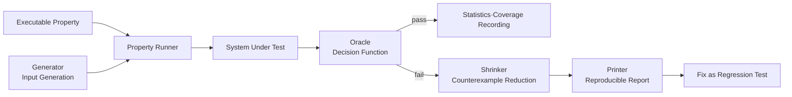
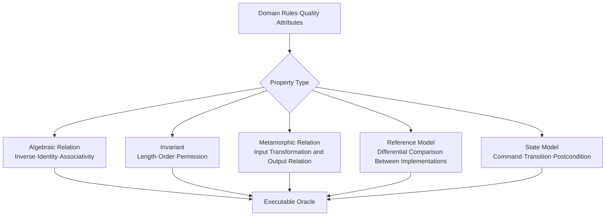

# Property-Based Testing and Generation-Based Quality Verification

## 1. Overview

> Property-Based Testing (PBT) is a testing technique that, instead of enumerating individual inputs and expected results in advance, writes as an executable specification the properties that must always hold over a broad set of inputs and verifies them with the many cases a generator produces.

In software testing, example-based testing quickly verifies representative inputs chosen by a person. However, real failures occur where the test author finds it hard to enumerate in advance—boundary values, empty structures, unexpected combinations, long sequences. PBT reframes this problem into one of input generation and specification verification.

The core of PBT is not the simple notion of "feeding in many random inputs." One first defines the invariants, symmetries, before-after relationships, or reference models of the system under test; a generator explores the valid input space; and when a failure occurs, a shrinker finds a reproducible minimal counterexample. Therefore, the quality of generation and the quality of properties govern the reliability of the tests.

For example, for a sort function, rather than merely matching the result for a specific array `[3, 1, 2]`, it is easier to find generalized defects by describing that, for all input arrays, it must satisfy length preservation, non-decreasing order of the result, and preservation of the element multiset. Duplicate removal, negatives, empty arrays, and extreme integer ranges can all be explored automatically under the same properties.

PBT developed from functional programs, but it has now expanded to many languages such as Python, Java, JavaScript, Rust, Java, Scala, and C#, and to the verification of APIs, databases, and distributed systems. However, since it does not test all inputs, the bias of the generation distribution and the omission of properties must be handled as separate quality-management concerns.

### 1.1 Background of Emergence and Necessity

First, the approach of increasing the number of examples quickly hits limits as the input space grows. When the length and character kinds of strings, the nesting of JSON, permission combinations, and temporal ordering are all combined as a Cartesian product, the test cases a person must manage explode.

Second, when a person directly designs failing inputs, they easily skew toward normal distributions. A PBT generator can be designed to deliberately include boundary values such as 0, empty collections, maximum/minimum values, duplicates, and special characters. What matters is a distribution matched to domain risk rather than uniform randomness.

Third, automatically generated tests lower development productivity if they cannot explain the cause of a failure. Combining shrinking with printing to reduce an input of hundreds of elements to a counterexample of a few elements lets developers quickly grasp the failure condition and the direction of the fix.

### 1.2 Goals and Scope of Application

The goal of PBT is not code coverage itself but "repeatedly confirming an important behavioral specification over diverse valid inputs." Therefore, it is realistic to introduce it as a way to complement unit testing, contract testing, regression testing, security verification, and model-based testing.

Targets with a clear input-output relationship, such as arithmetic functions or parsers, yield fast adoption benefits. Conversely, targets with an unclear correctness oracle, such as visual layout or subjective recommendation quality, first require defining metamorphic relations, invariants, and differential comparison.

## 2. Components of PBT and Its Execution Structure

The PBT runner combines the property and the generator to produce many inputs and passes them to the system under test. For each input it judges whether the oracle is true or false, and if false, it does not immediately discard the original input but begins the shrinking process.

Generators are divided into primitive-value generators and combinator generators. They produce primitive values such as integers, strings, and booleans, and combine these into lists, trees, records, and domain objects. For values with many constraints, such as valid orders, permissions, or SQL queries, reflecting the constraints at the generation stage is more efficient than simple filtering.

A property is an executable specification that takes the input of the system under test and renders a boolean judgment. The representative form is `forall x, P(x)`, and in actual execution it seeks a counterexample to the universal proposition through a finite sample. Therefore, "it passed" does not mean a proof over all inputs but that no counterexample was found in the chosen generation space.

The oracle is the criterion for judging the result. One can use a reference implementation that directly computes the expected result, an invariant of the result, the equivalence of two implementations, or the relationship between before and after states. If the oracle itself shares the same defect, the test can pass, so one must maintain a model independent of the target code.

The shrinker replaces a failing input with smaller candidate inputs. It tries numbers toward closer to 0, lists toward fewer elements, and trees toward less depth and fewer branches. The shrink result is not always the global minimum, but obtaining a local minimum that is easy for a person to understand and reproduce is what matters in practice.

| Component | Main Responsibility | Design Question |
|---|---|---|
| Property | Express the behavior that must always hold | What should be regarded as an invariant? |
| Generator | Explore the input space and tune the distribution | How much to produce valid values·boundary values·rare combinations? |
| Runner | Manage repetition, time limits, seeds, parallelization | How to reproduce a failure? |
| Oracle | Judge pass·fail | Is it independent of the reference model? |
| Shrinker | Search for the minimal counterexample | Does it preserve domain constraints? |
| Reporter | Output input·seed·environment | Can the developer reproduce it immediately? |

## 3. Property Design Types and Specification

Properties must be designed before generators. If you build the generator first, random values become plentiful but it becomes unclear what the test guarantees. In a professional engineer's answer, explaining in the order "target behavior → invariant or relationship → generation space → failure handling" clarifies the verification logic.

### 3.1 Algebraic Properties and Invariants

Algebraic properties express relationships among operations. `reverse(reverse(xs)) = xs` is the round-trip relation of list reversal, and `sort(sort(xs)) = sort(xs)` is the idempotency of sorting. One can verify the core semantics of an implementation without enumerating specific results.

Invariants are conditions that must be preserved before and after processing. For sorting, the count and multiplicity of elements must be preserved and the result must be in non-decreasing order. For an account transfer, one can set conditions such as preservation of the total balance, prohibition of negative balances, and the atomicity of a single transaction as state invariants.

Algebraic laws have the advantage that properties are concise, but the laws do not cover all the semantics of the domain. Even if a sort result preserves order and the multiset, the additional requirement of stable sorting needs a separate property. One must document the scope of the specification to prevent overly lenient pass judgments.

### 3.2 Metamorphic Properties

For systems where computing the correct answer is difficult, one confirms the relationship between results after transforming the input. For example, changing an image's brightness uniformly should keep the classification result unchanged, or adding an irrelevant document to search results should not unduly change the order of the existing top results.

Functions where a single correct answer is hard to produce—such as encryption, compression, and translation—can also apply metamorphic relations. The result restored after compression must equal the original, and the result decrypted after encryption must equal the plaintext. However, if one does not confirm that the relation matches the actual requirement, one ends up enforcing a wrong invariant.

Metamorphic testing is also useful for checking the bias and robustness of AI systems, but "invariance under transformation" is not always desirable. For example, there are also services where changing the date should change the fee. One must explicitly distinguish the elements that must be identical from the elements that must differ before and after the transformation.

### 3.3 Model-Based·State-Based Properties

For CRUD APIs or distributed state systems, the order of commands matters more than a single function call. A state model keeps an abstract reference state and defines the transitions and postconditions of `create`, `update`, `delete`, and `read` commands. The generator produces command sequences and, at each step, compares the actual system state with the model state.

For example, in a shopping-cart model, one can execute adding a product, increasing quantity, deletion, and payment cancellation in random order. If the actual service shows a state different from the model, the shrinker reduces the command sequence to present the minimal failing order. Including concurrency, one must record the execution order and the observation timing together.

The model must express only the core state to be verified, not replicate the entire system. If the model uses the same data structures and algorithms as the implementation, it can pass even when the same error is reproduced. The principle is to compare an independent, simple model with the actual implementation.

## 4. Generator and Shrinker Design

### 4.1 Input Space and Distribution

Uniform randomness is simple but may fail to produce enough dangerous inputs. For a string parser, one must deliberately weight the empty string, Unicode combinations, null characters, very long tokens, and invalid encodings. For financial calculations, decimal-point boundaries, rounding boundaries, maximum amounts, and negative signs are key.

Generators can be divided into primitive generators, combinator generators, and constraint generators. Combinator generators recursively build lists or trees, and constraint generators produce only objects satisfying domain invariants. In recursive structures, one places a size parameter and a maximum depth to prevent infinite generation and runaway execution time.

The ratio of valid to invalid inputs must also be managed strategically. Grammar validation of a parser produces many valid documents to confirm the normal path, but for error-handling properties it also generates invalid grammar at a certain ratio. Discarding with a simple `filter` increases generation cost, so where possible satisfy the condition within the generator itself.

Execution statistics form the basis for judging generator quality. Observe the number of inputs per partition, the maximum depth, the proportion of empty values, the exception types, and whether each code path is reached, and adjust generation weights for regions that are too rare. Do not conclude that the test count alone is sufficient.

### 4.2 Shrinking and Minimal Counterexamples

Shrinking is a search problem of making the failing input small. For a list, try prefix/suffix removal and element reduction; for an integer, reduce toward the 0·1·sign boundaries; for a string, reduce length and character complexity. For domain objects, one must design shrink candidates so as not to break validity constraints.

The external shrinking method applies a shrink function to values after generation. It is straightforward to implement and easy to combine with existing generators, but the generator's invariants may be broken during shrinking. The integrated shrinking method reduces the choices in the generation process, making it easier to preserve validity, but the coupling between the generator structure and the shrink logic can become high.

A minimal counterexample does not necessarily mean the global minimum. The runner may stop at a local minimum, considering time and cost. Therefore, the report should record not only the input but also the generation seed, framework version, environment settings, and execution command so that the same counterexample can be reproduced.

When fixing a shrunk result as a regression test, preserve both "the input that reproduces the current bug" and "the property that describes the requirement." Fixing only the counterexample blocks a specific defect but may miss similar variants, while keeping only the property weakens the concrete reproducibility before and after the fix.

## 5. Adoption Procedure and CI/CD Operation

PBT adoption proceeds in the order of target selection, property specification, generator writing, small-scale execution, counterexample shrinking, and CI incorporation. Rather than randomizing the entire system from the start, choose a module with clear input-output boundaries, such as a computation function or parser.

Local execution sets a small test count and maximum time for fast feedback, and the PR stage detects change defects with deterministic seeds and a limited execution volume. The nightly or release pipeline applies multiple seeds, larger structures, state sequences, and long-running execution.

Reproducibility is not fully guaranteed by storing only the random seed. The generator's version, dependent libraries, operating system, time zone, database initial state, and parallel execution order can affect the result. Record this information in the CI log and serialize the failing input so it can be reproduced even if the seed differs.

The test-failure policy differs according to the nature of the property. For safety, security, and monetary-calculation invariants, it is appropriate to block the build on even a single failure. For statistical quality or exploratory metamorphic tests, one can register the failing counterexample as an issue and adjust the blocking level after root-cause analysis.

## 6. Comparison with Existing Techniques

Example-based testing is easy for a person to read and the failure cause is clear. PBT explores the input space broadly and reuses common rules. The two are not competitors; the relationship is that representative business scenarios are fixed with example tests, and boundaries, combinations, and invariants are reinforced with PBT.

Fuzzing often mutates bytes or structure to detect abnormal inputs and vulnerabilities, and utilizes execution feedback. PBT focuses on executable domain properties and valid generation. Combining structure-aware fuzzing with PBT can broaden coverage and error paths while producing grammatically valid inputs.

Mutation testing evaluates the sensitivity of a test suite by checking whether the tests catch artificial code mutations. PBT is a way of generating inputs and mutation testing is a way of evaluating test quality, so they can be used together. If the properties are too weak, the mutation survival rate appears high.

Formal verification can, through mathematical proof or model checking, cover all states satisfying certain assumptions. PBT is strong at finding actual execution counterexamples at the boundaries of implementation, environment, and libraries rather than at proof. For safety-critical core algorithms, one combines formal verification, PBT, and example testing hierarchically.

| Category | Example-Based Testing | PBT | Fuzzing | Formal Verification |
|---|---|---|---|---|
| Input selection | Chosen by a person | Generator·strategy | Mutation·feedback | Model·constraint based |
| Oracle | Expected value | Property·model | Crash·exception·vulnerability signal | Logical specification |
| Strength | Understanding and debugging | Generalization·boundary exploration | Parser·memory error detection | Comprehensive guarantee possible |
| Limitation | Combinatorial explosion | Difficulty of writing properties | Lack of meaningful correct answer | Modeling·proof cost |
| Suitable place | Core scenarios | Invariants·contracts | Attack surface·abnormal inputs | High-risk algorithms |

## 7. Application Cases

### 7.1 Sort Function

A sort function's properties can consist of whether the result is in non-decreasing order, whether the input and output element multisets are the same, and whether the result length is the same. One also adds the idempotency property that re-sorting a sorted result must yield the same thing.

The generator produces empty arrays, single elements, duplicate arrays, and mixtures of negatives and large integers. If a faulty implementation removes duplicates, the shrinker can present a minimal counterexample such as `[0, 0]`. This counterexample narrows the defect cause to "omission of multiset preservation" rather than "order."

### 7.2 JSON·Protocol Parser

For a parser, one can set a round-trip property that a valid document, after being converted to an AST and serialized again, retains its meaning. One also sets a safety property that the parser must not abnormally terminate the process for arbitrary input and must fail with an allowed error type.

The generator adjusts nesting depth, array length, key duplication, Unicode, escapes, and numeric boundaries. If the maximum depth is not limited, stack exhaustion can occur, so make the resource limit itself a test requirement. The failure counterexample records the original text, parsing stage, environment, and seed together.

### 7.3 API and Database State

An API contract can be verified by the round-trip relation of serializing the request and deserializing the response, the consistency of HTTP status codes and body schemas, and the invariant of unauthorized requests. A state-based generator produces sequences of create·modify·delete·retry·duplicate requests.

For a database, one sets as properties the balance total before and after a transaction succeeds, uniqueness constraints, and prevention of duplicate creation after a retry. If an external payment or message broker is involved, use a test double and an isolated environment, and block personal information and secrets so that actual production data does not flow into the generator.

## 8. Deep Dive: State·Concurrency·Generative AI Verification

State-based PBT extends simple function testing to service-operation behavior testing. Separating the command generator, precondition, execution function, model transition, and postcondition lets one automatically explore long state sequences of shopping carts, caches, locks, and workflows.

For concurrent systems, sequential properties alone are not enough. One must generate interleaved execution, delays, retries, message duplication, and order reversal on the same resource, and define as an oracle the level the system guarantees, such as linearizability or eventual consistency.

Coverage-guided PBT can observe execution paths, branches, and feedback to weight inputs that create new paths. However, high code coverage does not mean complete verification of the business rules. Interpret the coverage metric together with the semantic scope of the properties.

Generative AI systems have no single correct answer or produce probabilistic output, so one can design as properties format consistency, forbidden words, presence of evidence, stability under input transformation, and differences between models. Enforcing identity even on the creativity of the output can misjudge a normal variation as a defect, so separate the allowable range from the evaluation criteria.

The latest frameworks are developing toward providing generator combination, automatic shrinking, state machines, parallel execution, and coverage feedback. However, rather than depending on the features of a specific framework, it is desirable to first set the principles of properties, data distribution, oracles, and reproducibility as the organization's testing standard.

## 9. Considerations and Implications

### 9.1 Completeness of Properties

If properties are weak, one misses important defects even after passing many inputs. Starting from requirements, risk lists, and failure cases, distinguish the invariants to preserve from the allowable changes.

Property review is performed separately from code review. A domain expert confirms the meaning of the rules, and a developer confirms executability and oracle independence. One also reviews whether the expression "always" matches the actual contract scope.

### 9.2 Generator Bias and Efficiency

If the generator produces only easy normal values, the exploration scope is narrow even with many tests. Reflect boundary values, rare combinations, abnormal inputs, and patterns found in actual failures as weights and examples.

If filter-based generation discards most candidates, execution time is wasted and the distribution is distorted. Use combinator generators and constraint generators, and verify the generation ratio per partition with statistics.

### 9.3 Failure Counterexamples and Operational Quality

Storing reproducible counterexamples is a core deliverable of automation. Preserve the input, seed, framework version, environment, and command sequence, and if personal information or secrets are included, apply masking and access control.

Promote the shrunk counterexample to a regression test, but do not let it replace the original property. Even after the counterexample is resolved, reinforce the generator and properties to find the same class of defect.

### 9.4 CI Cost and Quality Gates

Separating fast execution at the PR stage from deep execution at night secures both developer feedback and exploration depth. Operate by the criteria of maximum time, failure rate, new counterexamples, and partition coverage rather than the number of tests.

Treating random failures as flaky tests and unconditionally retrying can hide defects. First fix the seed and input to reproduce, then decompose the cause of non-determinism into concurrency, time, and external dependencies before deciding the retry policy.

### 9.5 Security·Privacy·Safety

Even if generated data resembles actual customer information, do not copy production personal information. Apply synthetic data, secret detection, log masking, and test-environment isolation.

Code with a broad attack surface, such as parsers, authentication, authorization, and cryptographic processing, handles abnormal inputs and permission combinations as a separate risk category. Connect discovered security counterexamples to reproducible security regression tests and the vulnerability management process.

### 9.6 Roadmap from a Professional Engineer's Perspective

In stages, start with core pure functions and data transformations, expand to API contracts and state models, then broaden the scope to distributed, concurrent, and AI systems. At each stage, reuse property templates and organization-wide common generators.

Measure performance not by the number of tests but by early defect discovery, counterexample analysis time, regression recurrence rate, and semantic coverage of risk areas. When the roles of example testing, PBT, fuzzing, mutation, and formal techniques are arranged without overlap, the cost-effectiveness of the test portfolio rises.

## References

- [Haskell QuickCheck package documentation](https://hackage.haskell.org/package/QuickCheck) — basic concepts of property specification, generator combination, and random case execution.
- [Hypothesis strategies documentation](https://hypothesis.readthedocs.io/en/latest/data.html) — APIs related to strategy combination, dynamic generation, recursive generation, and input shrinking.
- [Hypothesis official repository](https://github.com/HypothesisWorks/hypothesis) — overview and execution examples of the Python property-based testing framework.
- [Programmable Property-Based Testing](https://arxiv.org/html/2602.18545v1) — the structure of properties, generators, shrinkers, printers, and runners, and recent research directions.

---

> **In one line**: Property-based testing is a verification strategy that explores a broad input space with executable invariants and domain generators and connects shrunk counterexamples to regression tests to generalize quality.
