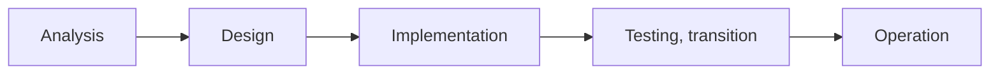

# Public Database Standardization Management (Preventive Quality Management, 2023.04)

## 1. Overview

### A. Definition and Background
> A pre-emptive (preventive) quality management standard presented by the Ministry of the Interior and Safety in the "Public Database Standardization Management Manual" (2023.04) for the **provision, opening, and utilization of high-quality public data**, which **prevents errors from the system construction stage**.

Public data is the source of citizen services, policy decisions, and private-sector use (MyData, AI training), so a single data error **spreads and amplifies** across multiple institutions and services. Whereas conventional quality management leaned toward a **post-hoc (corrective) approach** of finding and fixing errors after data had already accumulated, the core of this manual is shifting the center of gravity toward **blocking errors before they occur** by embedding standards at design and construction time.

### B. Necessity
Post-hoc cleansing is costly because data that was already incorrectly entered or linked must be traced and reverted, and errors in data already distributed or linked are hard to recall. For example, if each department uses "resident registration number / resident no. / resident registration No." inconsistently without standard terms, mapping and cleansing work is repeated with every subsequent linkage or integration. **Fixing standard words, domains, and terms in advance at the analysis stage** can eliminate such repeated costs and consistency errors at the source, which is why a preventive approach that "embeds quality from the construction stage" is required.

## 2. Preventive Quality Management Activities by System Construction Stage

Quality management activities are placed across all SDLC stages because **the later an error is discovered, the more exponentially the cost of fixing it grows**. If requirements and standards are not captured at the analysis stage, errors harden into code and data through design and implementation, and at the operation stage one pays the expensive price of cleansing and rebuilding. Therefore, the following lines of defense are placed at each stage.

| Stage | Preventive quality management activity | Purpose |
|---|---|---|
| **Analysis** | Define data requirements and standards; establish standard word and standard domain dictionaries | Prevent naming/semantic confusion due to missing standards |
| **Design** | Standards-compliant data modeling; design integrity and constraint rules | Secure model consistency and referential integrity in advance |
| **Implementation** | Build DB reflecting standards; apply constraints (NOT NULL, FK, CHECK) | Block invalid values from being entered at all |
| **Testing, transition** | Quality diagnosis and verification; verify data cleansing and migration consistency | Prevent loss/distortion during migration |
| **Operation** | Continuous quality monitoring and improvement; periodic diagnosis | Manage quality degradation (drift) during operation |

In particular, **constraints at the implementation stage** are a representative example of preventive control. If domain and CHECK constraints are placed on columns, values outside the valid range cannot be stored in the first place, making the post-hoc task of finding and deleting outliers unnecessary.

## 3. Preventive Quality Management: 4 Diagnostic Areas and 9 Diagnostic Items

Diagnosis consists of four areas following an **upstream-to-downstream flow**: "Are standards properly defined → Are those standards reflected in the model → Do the actual values and structures comply with the standards and rules?" If the upstream (standardization) collapses, no matter how thorough the downstream (value/structure) diagnosis is, it cannot prevent fundamental errors, so there are dependencies among the areas.

| Diagnostic area | Representative diagnostic items | What it ensures |
|---|---|---|
| **Standardization** | Standard words, standard domains, standard terms | Consistency of terminology and meaning |
| **Model quality** | Data model consistency, naming rule compliance | Reflection of standards in the model, structural consistency |
| **Value quality** | Compliance with mandatory values (NOT NULL) and valid values (domain) | Accuracy and completeness of actually stored values |
| **Structure, integrity** | Referential integrity, code consistency | Consistency of relationships and code values |

> Under these four areas, pre-diagnosis is performed with a total of **9 diagnostic items** (standard words, standard domains, standard terms; data model consistency, naming rules; mandatory values, valid values; referential integrity, code consistency, etc.).

For example, code consistency diagnosis checks "whether the gender code column contains any values other than the standard code set (1/2/9)," and by linking this check to the standard term and standard domain definitions, it cross-verifies that values, structures, and standards do not diverge from one another.

## 4. Expected Effects

| Effect | Content | Rationale |
|---|---|---|
| **Quality improvement** | Pre-emptive removal of errors and duplicates, securing consistency | Minimizing error inflow by blocking at input time |
| **Cost reduction** | Reduced post-hoc cleansing and rework costs | Avoiding fix costs that grow the later they are addressed |
| **Enhanced usability** | Reliability and reusability of open/linked data ↑ | Standardization eases inter-agency linkage and integration |

## 5. Considerations and Implications
- **Linkage with data standardization and governance systems**: The manual's standard word and domain dictionaries are effective only when maintained and updated on top of enterprise-wide data governance (standards management organization and processes). Even if standards are created, without an owner they drift apart again over time.
- **Quality foundation for open data, MyData, and AI training data**: As public data is reused for private services and AI training, source quality directly determines the quality of derived services. Its strategic value is great in that it blocks the "garbage in, garbage out (GIGO)" problem upstream.
- **Automation and organization**: Run the diagnostic items periodically with automated diagnostic tools, and establish a dedicated quality management organization and roles to institutionalize the prevention–diagnosis–improvement cycle.
- **Trade-off**: Initial standard setting and modeling require more time and staff, but this is a far cheaper up-front investment compared to the costs of post-hoc cleansing and error propagation.

---

> **In one line**: The Public DB Standardization Management Manual places *preventive quality management activities at every construction stage (analysis through operation)* and performs pre-diagnosis with *9 diagnostic items across 4 diagnostic areas: standardization, model, value, and structural integrity*, blocking errors before they occur and spread and securing the quality foundation for open, linked, and AI training data.
