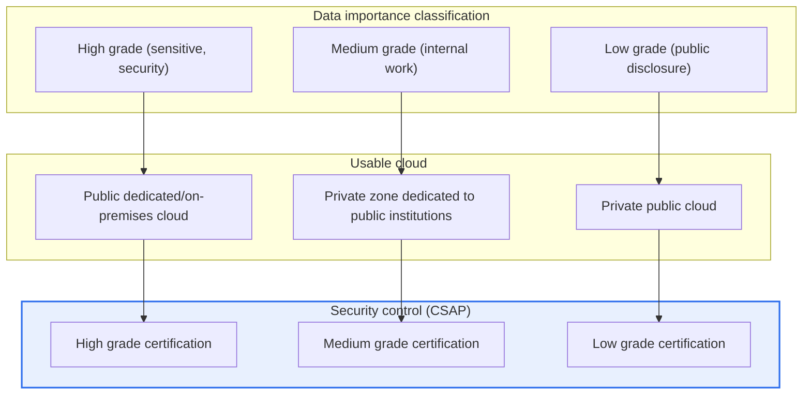
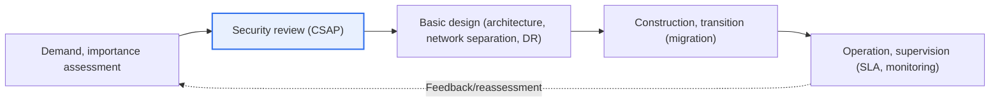

# Use of Private-Sector Cloud in the Public Sector

## 1. Overview

### A. Definition
> **Use of private-sector cloud in the public sector** is a procurement and operating model in which government and public institutions, instead of building and operating their own computer rooms (on-premises), **lease verified private cloud (public or dedicated) services** provided by commercial providers to build and operate information systems. It takes the inherent cloud benefits of flexibility and cost efficiency, but is decisively distinguished from private-sector cloud adoption in that, because of the special nature of the public sector handling citizens' sensitive information and national services, it **must also satisfy security and data sovereignty requirements**.

What makes the public sector's use of private cloud special is the dual constraint that it "**must satisfy efficiency and security/sovereignty at the same time**." When a private company adopts cloud, its decision criteria are generally economic and technical utility such as total cost of ownership (TCO), speed to market, and scalability. The public sector, however, must additionally weigh the protection of citizens' personal information, preventing core national data from leaking abroad, and the social repercussions of service outages. Private cloud offers clear benefits—rapid resource acquisition, elastic scaling, and the conversion of capital expenditure (CAPEX) into operating expenditure (OPEX)—but because much public data includes sensitive information such as resident registration numbers, health, and taxation data as well as national security-related information, not just any cloud can be used.

Therefore, the Korean public sector differentiates the usable clouds according to the importance (sensitivity, impact) of the data, prioritizes services that have obtained **CSAP (Cloud Security Assurance Program)** certification, and complies with control requirements such as logical network separation, domestic data storage, and encryption. In other words, the core proposition of this topic is the balance of "taking the private sector's innovation and economies of scale while placing them under the public sector's security control framework," and where to set this balance point becomes the decision criterion running through all stages of policy, design, and supervision.

### B. Background and Necessity
Three overlapping trends lie behind the full-scale use of private cloud in the public sector. First is the policy of **Digital Platform Government (DPG) and cloud-native transformation**. The government seeks to reorganize information systems fragmented by ministry and agency into an open, interconnected cloud-based structure, which requires mature cloud infrastructure as a vessel for cloud-native technologies such as microservices, containers, and serverless. Self-built infrastructure (IaaS) alone makes it hard to keep up with these latest managed services (PaaS, SaaS).

Second is the **inefficiency of self-building**. When each institution builds a computer room and buys and operates servers, initial investment and maintenance burdens are high, resource utilization is low, and it is difficult to respond elastically to demand spikes (traffic surges for disaster relief fund applications, university admissions, etc.). As cases of public services with heavy concurrent access collapsing right after launch repeated, the need for cloud capable of elastic scaling came to the fore.

Third is the **maturation of verification systems**. In the past, the trust question "Can the cloud really meet the security level the public sector requires?" was an obstacle, but with institutional foundations such as the CSAP certification scheme, the Cloud Computing Act, and the "Plan for Cloud Conversion and Integration of Public Institutions' Information Systems," the basis for using verified private cloud was established. These three trends interlocked to shift the policy stance from "self-build first" to "consider private cloud first (Cloud First)."

## 2. Overall Structure and Usage Types

Public use of private cloud is not simply a matter of renting servers but of designing **data importance → usable cloud → security control level** as a single chain. The concept diagram below shows the overall structure, and the next one shows the detailed flow of the actual adoption procedure.

Unpacking what this structure means in prose: the public sector first **classifies the data handled by the target system according to importance**. "High" grade data, such as national security or citizens' sensitive information whose leak or damage would have large repercussions, is placed in the most tightly controlled environment (public dedicated cloud or on-premises); "medium" grade data centered on internal administrative work goes into a dedicated zone that isolates and hosts only public institutions; and "low" grade data centered on already-public information can go into a general private public cloud. The key point is that **the same highest level of control is not applied to all data**. Doing so would be safe but would sacrifice both cost and flexibility. Conversely, uniformly lowering controls would expose sensitive information to risk. Hence "differentiated control proportional to importance" becomes the only realistic solution that preserves both efficiency and safety.

The mechanism that guarantees the substance of control here is **CSAP (Cloud Security Assurance Program)**. CSAP is a scheme in which a third party evaluates and certifies whether cloud services provided to the public sector meet certain security standards (administrative, physical, and technical controls), going through an application → evaluation → certification process for each service type (IaaS, PaaS, SaaS). Because the certification grade system corresponds to the data importance grades, institutions can ensure safety with the rule "for this data, use only services certified at this grade or higher." Using certified services reduces the burden of institutions performing individual security reviews from scratch each time and enables objective comparison of security levels between providers.

### A. Evaluation Perspectives by Service Type and Shared Responsibility
Private cloud is layered into IaaS, PaaS, and SaaS; the higher the layer, the broader the scope for which the provider (CSP) is responsible and the narrower the scope the using institution directly controls. Without an accurate understanding of this **Shared Responsibility Model**, security gaps arise from the misconception that "the provider will take care of everything."

| Service type | Key evaluation perspective | Using institution's responsibility | CSP's responsibility |
|---|---|---|---|
| **IaaS** | Infrastructure security, isolation/network separation | OS, middleware, apps, data | Physical facilities, hypervisor, network |
| **PaaS** | Platform security, development environment control | Apps, data, accounts | OS, runtime, platform |
| **SaaS** | Application security, data protection/access control | Data, accounts, configuration | Entire app, infrastructure |

In IaaS, the institution is directly responsible for everything above the operating system (patches, accounts, firewall rules, data encryption), so control freedom is high but so is the management burden. Moving toward SaaS, the provider takes responsibility for most things, but that does not mean the institution's responsibility disappears. **Responsibility for account and permission management and configuration, and above all for the data itself, remains with the using institution in every type.** The fact that many actual cloud incidents stem not from provider infrastructure flaws but from users' access permission misconfigurations (e.g., mistakenly setting a storage bucket to public) illustrates the importance of this responsibility boundary well.

## 3. Adoption Procedure and Basic Design

The actual process of adopting private cloud proceeds through a lifecycle of "demand/importance assessment → security review → basic design → construction/transition → operation/supervision," with each stage taking the outputs of the previous stage as input and defining the next.

In the **demand/importance assessment** stage, the institution evaluates which systems to move to the cloud, when, and how much, and what grade of importance the data handled by those systems has. Because this assessment is the premise of all subsequent design, precisely identifying data flows and personal information processing is key. Overestimating the grade means bearing unnecessarily expensive controls, while underestimating it exposes sensitive information to risk.

In the **security review** stage, the institution confirms whether the service is CSAP-certified for the target grade, and checks whether a Privacy Impact Assessment (PIA) is required, domestic region storage requirements, and encryption and access control requirements. Following the certified-service-first principle, selecting from a catalog of already-verified services (such as the usage support system of the Digital Service Specialized Contract scheme) where possible streamlines procurement and review at the same time.

In the **basic design** stage, the architecture (availability zone and region configuration), logical network separation (separating the public business network from the internet network), disaster recovery (DR) and backup strategy, and data migration method from existing systems are finalized. In particular, since service continuity is a social obligation for the public sector, multi-availability-zone and multi-region designs are considered so that a single region failure does not lead to a total service outage. In the **construction/transition** stage, the actual migration is performed and data consistency before and after migration is verified; in the **operation/supervision** stage, SLA (availability, performance) compliance, cost, and security monitoring are continuously checked, and grades and controls are periodically reassessed.

### A. Choosing a Migration Strategy
The key decision running through the basic design and construction/transition stages is "how to move existing systems to the cloud." Migration strategies are typically classified into several types (the so-called 6R — Rehost, Replatform, Refactor, Repurchase, Retire, Retain) and applied differently according to system characteristics, budget, and deadlines. Rehosting (Lift & Shift), which moves legacy systems as-is without major modification, is fast and low-risk but does not fully realize the cloud's elasticity and managed-service benefits. Conversely, refactoring, which redesigns applications into containers and microservices, maximizes cloud-native benefits but is high in time, cost, and technical difficulty.

In the public sector, since service outages translate directly into inconvenience for citizens, rather than an aggressive big-bang conversion, it is safer to migrate step by step starting with low-importance systems to accumulate experience and operational capabilities. It is also essential to maintain encryption and access control during migration so that personal and core data are not exposed in temporary storage or logs, and to verify consistency by comparing record counts and checksums before and after migration. Neglecting this verification means data omissions and duplicates are discovered only in the operation stage, coming back at far greater cost.

## 4. Comparison of Usage Structures and Application Cases

The public sector's cloud usage structures fall broadly into three types depending on "where, and with whom, the data is placed," and each choice has clear trade-offs.

| Structure | Characteristics | Advantages | Limitations |
|---|---|---|---|
| **Public dedicated cloud** | Isolated infrastructure used only by the public sector (e.g., NIRS G-Cloud) | Highest level of security and sovereignty | Constraints on scalability and latest services |
| **Private dedicated zone (public zone)** | Private CSP physically/logically isolated for public use | Private-sector innovation + isolation | Cost, dedicated certification required |
| **Private public cloud** | Use of general commercial cloud | Latest services, economies of scale | Unsuitable for high-grade data |

The fundamental reason for the differences among these three structures is that "**isolation level and innovation are in conflict**." A fully isolated public dedicated cloud is the safest in terms of data sovereignty and security, but makes it difficult to immediately use the latest managed AI and data services that the private sector releases rapidly, and resource scaling is also limited. Conversely, private public cloud enjoys the latest services and economies of scale but shares infrastructure with other customers, making it unsuitable for high-grade data. Therefore, in practice, a **hybrid** approach—placing low-grade citizen-facing services in the public cloud and sensitive internal systems in a dedicated zone or dedicated cloud—has become the realistic compromise.

As concrete cases, citizen-facing services with large, unpredictable traffic surges (e.g., national vaccination reservations, disaster relief fund applications) are better placed in private public cloud capable of autoscaling to cope with access surges right after launch than built in-house. In contrast, systems centered on sensitive information such as taxation and welfare benefits are placed in isolated environments meeting CSAP high-grade requirements to control leakage risk. In addition, standard business functions used in common by many institutions (email, collaboration, documents) are being shifted toward joint use of SaaS instead of individual builds, reducing duplicate investment.

### B. SLA and Operational Supervision in Practice
In the operation/supervision stage, an SLA (Service Level Agreement) is not a formal document but a contractual mechanism that enforces service quality. Public services codify availability (e.g., 99.9% or higher monthly), failure recovery time, and performance indicators in the SLA, and include compensation clauses such as fee reductions for shortfalls to secure provider accountability. However, since an SLA guarantees only infrastructure-layer availability and does not take responsibility for defects in applications running on top, institutions must operate their own monitoring and control systems in parallel to observe overall service quality. Also, in terms of cost, because cloud is billed per use, costs can snowball if left unattended, so it is desirable to include cost governance (FinOps), which continuously checks usage and idle resources, as part of operational supervision.

## 5. Advanced: Latest Trends and Policy Changes

Recent public cloud policy is evolving in several directions. First is the establishment of the **CSAP grading system**. As CSAP, formerly a single standard, was subdivided into high, medium, and low grades according to data importance, the entry threshold for private public cloud was lowered for low-grade systems, leading to discussions about conditional participation of global providers in the domestic cloud market. This can be understood as a trend of readjusting the policy balance between "security" and "industrial promotion and competition."

Second is the combination of **Digital Platform Government and cloud-native transformation**. Beyond Lift & Shift, which simply moves servers to the cloud, the goal is being raised toward redesigning the application structure itself with containers, microservices, and serverless to fully exploit the cloud's elasticity and open interconnection. Third is procurement innovation through the **Digital Service Specialized Contract scheme**, which enables cloud and SaaS to be contracted quickly on a catalog basis instead of through rigid conventional public procurement procedures. However, since the latest facts (detailed figures of grade criteria, the scope of global CSP participation, timing of institutional revisions) keep changing, it is safer to check the latest notices and guidelines and avoid definitive statements when applying this in actual answers or practice.

## 6. Considerations and Implications

1. **Differentiated application based on data importance is the overarching principle.** Applying the same controls to all systems is either inefficient (over-control) or risky (under-control). Varying the usable cloud and control level in proportion to importance and sensitivity grades is the only balance point that secures both efficiency and safety.
2. **Prioritizing CSAP-certified services yields both security and procedural efficiency.** Using certified services reduces the burden of individual security reviews, guarantees trust, and enables objective comparison between providers. Establishing rules that match certification grades to data grades is the core of practice.
3. **Clarify the Shared Responsibility Model and prepare an Exit (transition) strategy.** Document the responsibility boundaries between the using institution and the CSP for each service type, while recognizing that responsibility for data, accounts, and configuration always remains with the institution. At the same time, mitigate **vendor lock-in** with plans to fully return and migrate data upon contract termination or provider change.
4. **Manage data sovereignty, interoperability, and cost governance together.** Secure sovereignty through domestic region storage and encryption, increase interoperability through open standards and multi-cloud, and, from a FinOps perspective, continuously optimize usage-based costs (reclaiming unnecessary resources, using reservations and commitments) to ensure the efficiency benefits of cloud adoption are not offset by uncontrolled costs.

## References
- Ministry of Science and ICT, guide to the "Cloud Computing Service Security Assurance Program (CSAP)"
- Ministry of the Interior and Safety / Digital Platform Government Committee, policy materials on public sector cloud conversion and Digital Platform Government

---

> **In one line**: Use of private cloud in the public sector follows the lifecycle *demand/importance assessment → CSAP security review → basic design → construction/transition → operation/supervision*, and the key is to balance private-sector efficiency and innovation with public-sector security and data sovereignty through **differentiated control based on data importance, prioritizing CSAP-certified services, and the Shared Responsibility Model with an Exit strategy**.
