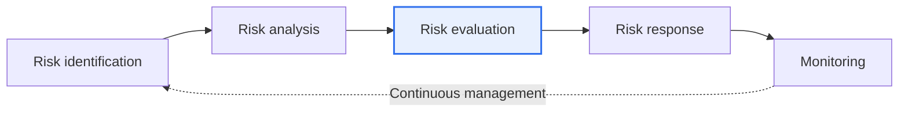
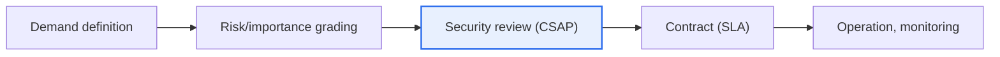

# Public Sector SaaS Usage Guidelines

## 1. Overview

### A. Definition
> The **Public Sector SaaS Usage Guidelines** are government guidelines that set out risk management, security, and contract (SLA) standards so that national agencies, local governments, and public institutions can **use SaaS (Software as a Service) safely and efficiently**. They respond to Digital Platform Government and cloud-native transformation.

When public institutions adopt SaaS, they can quickly use the latest features without building separate infrastructure, yielding significant gains in work efficiency and cost savings. However, because of SaaS's fundamental characteristic that **data and systems reside on the infrastructure of an external CSP (cloud service provider)**, it conflicts with concerns about the sovereignty and security of public data. The guidelines were prepared with the intent of **managing this conflict on a risk basis** rather than "banning it outright," securing both benefits and safety at the same time.

### B. Necessity
Public data varies in sensitivity. Handling publishable promotional materials and citizens' personal information under the same standard is both inefficient and risky. Therefore, a management principle that **applies differentiated** ranges of usable SaaS and levels of control according to data importance is needed. This differentiated management is the core logic running through the entire guideline.

## 2. Cloud Service Risk Management Principles and Criteria (A)

The basic philosophy of risk management is a **risk-based approach** and **self-responsibility of the using institution**. Instead of uniformly regulating all SaaS, each institution judges for itself the importance of the data it handles and takes responsibility for the corresponding controls. **CSAP (Cloud Security Assurance Program)** grades are used as the criterion for this judgment. CSAP divides the security level of cloud services into high, medium, and low, and matches them so that the more sensitive the data, the higher the certification grade of SaaS that may be used. Risk management does not end with a single review; it is a **continuous activity** cycling through identification → analysis → evaluation → response → monitoring.

| Category | Content |
|---|---|
| **Principles** | Risk-based approach, self-responsibility of the using institution, continuous management, differentiation by importance |
| **Criteria** | Data importance classification, CSAP grades (high, medium, low), service importance evaluation |
| **Core** | Determine the range of usable SaaS and control level according to data type and sensitivity |

For example, citizen petition services processing citizens' personal information are restricted to CSAP "high" grade SaaS, while internal collaboration document tools are permitted up to "medium/low" grades, matching data sensitivity to certification grades.

## 3. Establishing Security Measures and Security Review (B)

Security measures are designed to control **the entire process by which data moves, is stored, and is accessed**. Access control and account permissions ensure that only authorized users have access; encryption of transmission and storage segments protects content even in case of leakage; and logging and audit trails secure after-the-fact traceability. In particular, because where data is stored (data location and sovereignty) matters for SaaS, whether data is kept domestically is checked. Security review is **divided into before and after adoption**. Before adoption, CSAP certification is confirmed and, if necessary, a security review by the National Intelligence Service (NIS) is obtained; after adoption, the security level is maintained through continuous inspection and re-review.

| Category | Details |
|---|---|
| **Security measures** | Access control and account permissions, data encryption (in transit and at rest), logging and audit trails, data location and sovereignty, backup and continuity |
| **Security review** | (Before adoption) Confirm CSAP certification, NIS review if needed; (after adoption) continuous inspection and re-review |
| **Responsibility (SR)** | Clarify the scope of security responsibility between CSP and using institution according to the Shared Responsibility Model |

A concept that must be understood here is the **Shared Responsibility Model**. In SaaS, the CSP is responsible for the security of the infrastructure, platform, and application, but **the security of data, accounts, and access permissions belongs to the using institution**. Without knowing this boundary, institutions mistakenly assume "the CSP will take care of everything," neglect account management, and incidents follow.

## 4. Service Level Agreement (C)

An SLA (Service Level Agreement) is a **mechanism that nails down the quality and responsibilities of SaaS use by contract**. It sets availability and performance standards numerically with compensation for shortfalls, and prescribes notification and recovery procedures when failures occur. Particularly important for the public sector is the **data return and destruction (Exit Plan)** clause. Unless it is stipulated that data will be safely returned upon contract termination and completely destroyed on the CSP side, there is a risk of lock-in or of remaining data being leaked.

| SLA item | Content |
|---|---|
| **Availability** | Guaranteed service uptime (%), compensation for shortfalls |
| **Performance** | Response time and throughput standards |
| **Failure response** | Failure notification, recovery objectives (RTO/RPO), response procedures |
| **Data** | Data return and destruction (Exit Plan), ownership and migration |
| **Responsibility, compensation** | Scope of responsibility, penalties and damages, obligation to notify security incidents |

## 5. Adoption Procedure and Implications

Adoption proceeds in the order of demand definition → risk/importance grading → CSAP-based security review → SLA contract → operation and monitoring. The practical implications of this procedure are as follows.

- **Prioritize CSAP-certified SaaS**: Using already-verified certified services secures security while also simplifying the adoption review process.
- **Understanding the Shared Responsibility Model is key**: Design controls on the premise that the using institution always bears responsibility for data and account security.
- **Codify the Exit strategy in the contract**: Finalize data return, destruction, and migration plans at the contract stage to prevent lock-in and leakage risks.
- **Continuous monitoring**: Even after adoption, constantly check the security level and SLA compliance to respond to changing risks.

---

> **In one line**: Public SaaS secures both safety and efficiency through the procedure *risk/importance-based management (CSAP grades) → security measures and security review → SLA contract*, and understanding the Shared Responsibility Model and codifying an Exit strategy are the keys to success.
