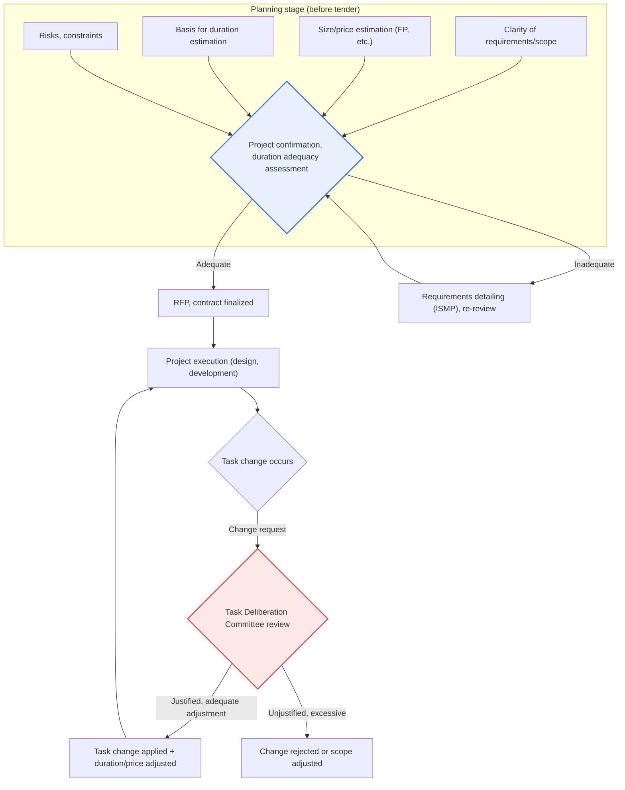
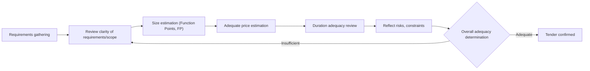

# Planning-Stage Review and Task Change Adequacy Assessment for Public Software Projects

## 1. Overview

### A. Definition and Background
> **Planning-stage adequacy review** is a procedure that verifies in advance, before a public SW project is tendered, whether its requirements, scope, size, duration, and price are realistic; **task change adequacy assessment** is a control mechanism that judges through a formal procedure whether additions, changes, and deletions of tasks arising during project execution are justified and reasonable. The common purpose of both schemes is to prevent project failure (delays, quality degradation, disputes) caused by poor planning and indiscriminate task changes.

The fundamental reason these assessments are needed is that "**a project fails if it starts wrong or wavers midway**." Public SW projects are often tendered with unclear requirements, tight schedules, and low prices, and tasks keep being added and changed during development until they spiral out of control. In particular, the ordering agency must fix the project size at the time of budgeting, but there is a structural limitation in that only a rough price is estimated before requirements are sufficiently detailed. As a result, after kickoff, additional requests of the "isn't this obviously included?" type (so-called scope creep) accumulate, and the contractor absorbs them within the contract price at the expense of quality.

Planning-stage adequacy assessment verifies in advance "**whether this project is feasible within this duration and scope in the first place**" to prevent unreasonable tenders, while task change adequacy assessment judges "**whether this change is justified and reasonable, and whether corresponding duration and price adjustments have been made**" to control indiscriminate scope expansion and unfair cost shifting. In other words, it is a double safeguard that manages risk at two gates: the entrance of the project (planning) and during execution (changes).

Institutionally, the Software Promotion Act (a full revision of the Software Industry Promotion Act in 2020), its subordinate notices, and the "Public Software Project Ordering and Management Manual" followed by ordering agencies serve as the basis for plan review and task deliberation. However, since detailed notice names and provisions are frequently revised, it is advisable to check the latest statutes and notices when applying them in practice.

### B. Necessity
To prevent recurring failures of public SW projects, the feasibility of project plans and the justification of task changes must be judged not by the arbitrary will of either the ordering agency or the contractor but by **objective criteria and formal procedures**. The necessity can be viewed at three levels. First is **budget efficiency**. Unreasonable low-price, short-term tenders actually increase rework and defect-repair costs, raising the total cost of ownership (TCO). Second is **quality and the stability of citizen services**. Failures of systems directly tied to citizens' lives—administration, welfare, taxation—are passed on as social costs. Third is **fair contractual relationships**. Only when price and duration adjustments corresponding to task changes are guaranteed can disputes between ordering agencies and contractors be reduced and the health of the SW industry ecosystem be protected.

## 2. Overall Structure — Flow of Plan Review and Task Change Control

Plan review and task change assessment are not separate events but a single risk management system linked across the project lifecycle (tender preparation → contract → execution → acceptance). The structure diagram below shows where the two gates are located and which outputs and bodies they interlock with.

What is noteworthy in this structure is the difference in nature between the two gates. Planning-stage assessment (G1) is a **preventive** control, a gate that filters out unreasonable projects so they never start. In contrast, task deliberation (G2) is an **in-progress corrective** control, a valve that keeps an already-started project from going off track. Because sufficiently detailing requirements at the planning stage (via ISMP, etc.) reduces changes during execution, the two gates complement each other.

## 3. Planning-Stage Review Items (Project Confirmation and Duration Adequacy)

The goal of planning-stage review is to determine "whether the project duration and price are realistic in light of the requirement scope and size." The detailed flowchart below shows the order in which the review is carried out.

### A. Clarity of Requirements and Scope
The first cause of poor planning is that projects are tendered with vague requirements. If requirements are described only abstractly, such as "all member management functions," the contractor and ordering agency each imagine a different scope, and this gap later explodes into task change disputes. Therefore, at the planning stage, one checks whether functional and non-functional requirements are organized to a **measurable and definitive level**. For example, rather than "fast response," they should be in a verifiable form such as "average response within 2 seconds at 1,000 concurrent users."

For large, complex projects whose requirements are not sufficiently detailed, it is recommended to precede the tender with a separate **Information Strategy Planning (ISP) or Information System Master Plan (ISMP)** project to concretize the requirements. Since ISMP aims to detail requirements to a level at which function points can be estimated, it greatly increases the reliability of subsequent size, price, and duration estimation.

### B. Adequacy of Size and Price
Once requirements are organized, size is quantified. The standard size measure for public SW projects is the **Function Point (FP)**, which has the advantage of measuring functional size from the user's perspective regardless of development language or technology, and is therefore widely used as the basis for estimating tender size and price. The development cost is calculated by applying the unit prices and adjustment factors of the software project pricing standard to the estimated FP, and direct expenses and profit are added to derive an adequate price.

The key here is filtering out the **risk of low-price tenders**. If the price is too low relative to size, the contractor reduces staffing or fills positions with less-skilled personnel, structurally degrading quality. In fact, excessive price competition (low-bid awards) in public SW projects has been identified as a cause of quality degradation and subcontracting problems, which is why direct purchase of commercial SW (separate ordering), expansion of remote development, and payment of adequate prices have been emphasized in policy.

### C. Adequacy of Duration
Even at the same size, a project fails if the duration is unrealistically short. That man-months cannot be compressed indefinitely was pointed out long ago by Brooks's Law ("adding manpower to a late software project makes it later"). At the planning stage, the **required duration is back-calculated** from the estimated size (FP) and productivity indicators, and the gap with the desired duration set by the ordering agency for budgetary and administrative scheduling reasons is checked. If the gap is large, the scope should be divided into phases (phased construction) or the duration made realistic.

For example, if a next-generation system is estimated at 3,000 FP and the desired tender duration is 8 months, by typical productivity indicators this is likely an unreasonable compression. In this case, the practical conclusion of the plan review is to present a roadmap that builds core functions first and splits the project into two phases.

### D. Risks and Constraints
Finally, one checks whether technical, staffing, organizational, and legal/institutional constraints have been reflected in the plan. Uncertainty from adopting new technology, stakeholder coordination from linking multiple agencies, compliance with personal information and security regulations, and the difficulty of migrating data from existing systems are all variables that determine schedule and cost. Whether such risks are identified and quantified in the plan, and whether response measures (contingency funds, buffer schedules) are prepared, is an important element in judging adequacy.

| Review item | Key question | Result if deficient |
|---|---|---|
| **Clarity of requirements/scope** | Are requirements measurable and definitive? | Scope disputes after kickoff, scope creep |
| **Adequacy of size/price** | Is size estimated (FP, etc.) and is the price adequate? | Low-price tender → quality degradation |
| **Adequacy of duration** | Is the duration realistic relative to size? | Unreasonable compression → delays, poor quality |
| **Risks/constraints** | Are technical, staffing, and regulatory constraints reflected? | Project derailed by unforeseen variables |

## 4. Criteria for Judging the Adequacy of Task Changes

### A. Why Task Changes Become a Problem
Task changes occurring after a project starts are themselves inevitable, because requirements evolve, laws and policies change, and some requirements only emerge after kickoff. The problem arises when changes are made **without justified grounds, formal procedures, or corresponding adjustments**. If the ordering agency adds functions without price or duration adjustments, saying "that much should be done anyway," the contractor makes up the loss with quality; conversely, if the contractor arbitrarily reduces scope, the ordering agency suffers. Hence a procedure that objectively deliberates on the justification and impact of changes is needed.

### B. Four Judgment Criteria
The adequacy of a task change is judged along the following four axes. The axes are not independent but intertwined, so if even one is off, the change can be assessed as inadequate.

First is the **justification of the reason for change**. It distinguishes whether the change is inevitable—such as changes in laws or policies, changes in higher-level plans, or essential requirements confirmed after kickoff—or an arbitrary expansion based on mere preference or convenience. Second is **scope/size impact**. The increase or decrease in function points relative to the original contract is quantified to understand the share the change represents in the overall project. Third is **schedule/cost impact**. If size increased, duration and price must be adjusted correspondingly; a change that demands only absorption without adjustment is inadequate. Fourth is **procedural compliance**. It checks whether the change was deliberated by a formal body such as the **Task Deliberation Committee** and whether contract change procedures (design change, contract amount adjustment) were properly carried out.

The Task Deliberation Committee is a body in which the ordering agency, the contractor, external experts, and others participate to deliberate on the justification and impact of changes; it is a mechanism that checks the power imbalance (ordering agency dominance) surrounding changes. If deliberation determines a change is justified, duration and price are adjusted accordingly; excessive or unjustified requests are rejected or the scope is readjusted.

### C. Adequate vs. Inadequate, Illustrated by Concrete Cases
For example, if after kickoff an amendment to the Personal Information Protection Act strengthens encryption and access control requirements so that related functions must be added, this is an **inevitable, justified change**, so it is adequate to adjust duration and price by the amount of the size increase. Conversely, if an ordering agency official demands that the screen design be completely overhauled several times out of personal preference while trying to keep price and duration unchanged, this is an **inadequate change** lacking both justification and corresponding adjustment, and must be controlled through task deliberation.

| Judgment criterion | Content | Requirement for an adequate determination |
|---|---|---|
| **Justification of reason for change** | Is it an essential, inevitable change? | Objective grounds such as changes in laws, policies, or higher-level plans |
| **Scope/size impact** | Size change relative to the original contract | Quantify increase/decrease with FP, etc. |
| **Schedule/cost impact** | Need for duration/price adjustment | Adjustment corresponding to the size change |
| **Procedural compliance** | Did it go through a formal procedure? | Deliberation by the Task Deliberation Committee, contract change carried out |

## 5. Advanced — Linkage with Related Schemes and Expected Exam Directions

Plan review and task change assessment are not standalone schemes but operate in conjunction with the entire public SW project management system. **Before tender**, requirements are detailed through ISP/ISMP, and separate ordering of commercial SW mitigates unreasonable integrated tenders. **During execution**, information system audit (phase-based audit, resident audit) continuously checks progress, quality, and task changes, and the PMO (a project management organization acting on behalf of the ordering agency) pre-reviews task change requests to reduce the burden of task deliberation. **At acceptance**, fulfillment against requirements is verified. In this way, plan review (entrance)–audit/PMO (progress)–task deliberation (changes)–acceptance (exit) form a single control chain.

As for policy trends, payment of adequate prices, expansion of remote development, improvement of subcontracting structures, and SW impact assessment have been continuously emphasized to reduce low-bid awards and task change conflicts. However, since detailed scheme names and scopes are frequently revised, it is safer to check the latest statutes and notices and use generalized expressions when writing answers.

From the perspective of the Professional Engineer exam, this topic is likely to be tested in connection with "causes of and countermeasures for public SW project failure," "task change management (Task Deliberation Committee)," "SW project price estimation (function points)," and "information system audit and PMO." An effective answer strategy is to ① first present the dual control structure of the planning stage (entrance) and task change (progress), ② develop the detailed judgment criteria of each gate with tables and prose, and ③ conclude with linked schemes such as ISMP, audit, and PMO, and policy trends.

## 6. Considerations and Implications

1. **Guaranteeing adequate price and duration is the precondition for quality.** Unreasonable low-price, short-term tenders actually increase total costs through rework and defect repair. Securing a price based on size (FP) and a realistic duration at the planning stage is the starting point of project success, and this is not a trade-off but, in the long run, also benefits the ordering agency.
2. **Control of task changes and justified adjustment must go hand in hand.** Indiscriminate scope expansion should be prevented, but it is fair to adjust duration and price correspondingly for justified changes. Emphasizing only control stifles even necessary changes, while emphasizing only adjustment encourages scope creep, so balance is key.
3. **Investing in preventive control (planning) is more efficient than corrective control (changes).** Detailing requirements with ISMP before kickoff reduces changes during execution itself. Fixing requirements up front fundamentally reduces cost and disputes more than handling requirement ambiguity later through task deliberation.
4. **The effectiveness of control should be raised through linkage with audit and PMO.** Because plan review and task deliberation easily end up as paper procedures, resident auditors and the PMO should constantly monitor actual progress and changes to back them up so that deliberation does not become a formality.
5. **The purpose of the schemes is not regulation but project success and the health of the industry ecosystem.** If control procedures are perceived only as a burden, they become formalities. The original effects of reduced disputes and improved quality appear when the ordering agency and contractor use the schemes as a cooperative mechanism for jointly managing risk.

## References
- National Law Information Center, Software Promotion Act: https://www.law.go.kr/
- Ministry of Science and ICT / National IT Industry Promotion Agency (NIPA), Software Project Price Estimation Guide: https://www.nipa.kr/
- National Information Society Agency (NIA), public informatization project management materials: https://www.nia.or.kr/

---

> **In one line**: Public SW projects prevent unreasonable tenders by verifying in advance, at the *planning stage*, the adequacy of requirement clarity, size (FP), duration, and price, and, *during execution*, deliberate on the justification, scope impact, schedule/cost, and procedure of task changes through the Task Deliberation Committee while guaranteeing corresponding adjustments, thereby controlling the two failure factors—poor planning and indiscriminate scope expansion—at the two gates of entrance and progress.
