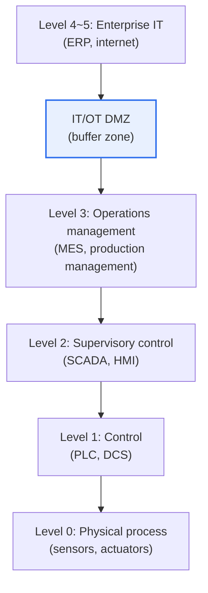

# The Purdue Model for Industrial Control Systems (ICS)

## 1. Overview

### A. Concept
> The **Purdue Model** is a **reference architecture that represents the components of an industrial control system (ICS) in multiple layers according to function and role**, hierarchically separating the IT (information technology) and OT (operational technology) domains to define the structure and security boundaries of industrial networks.

The fundamental reason the Purdue Model became the standard for industrial security is the idea that "**mixing the factory's physical equipment with the office's IT is dangerous, so divide them into layers and guard the boundaries**." An industrial site contains both an OT domain that controls actual physical equipment (sensors, PLCs, control systems) and an IT domain responsible for management and business (ERP, internet). Yet their requirements are opposite. For OT, safety and continuous operation are top priorities, so it cannot be stopped or patched casually, whereas for IT, data and connectivity matter. If the two are connected haphazardly, an attack entering via the internet could immediately manipulate physical equipment and cause physical disasters such as explosions or blackouts (Stuxnet is an example). To prevent this, the Purdue Model divides the system into layers from the physical site (bottom) to the enterprise (top) and places clear boundaries between each layer. In particular, it places a buffer zone (DMZ) between IT and OT so that threats from upper-level IT cannot propagate directly to lower-level OT. In other words, the Purdue Model is both a "map" for understanding and defending industrial systems and a "security boundary line."

### B. Background of IT/OT Convergence
As once-closed OT became connected to IT through smart factories and Industry 4.0, understanding the hierarchical structure and securing the IT-OT boundary became essential. [[isa-iec-62443]]

## 2. Layers and Characteristics of the Purdue Model

| Layer | Components | Characteristics |
|---|---|---|
| **Level 0** | Sensors, actuators | Actual physical process (field equipment) |
| **Level 1** | PLC, DCS, RTU | Basic control (direct equipment control) |
| **Level 2** | SCADA, HMI | Supervision and control (operator actions) |
| **Level 3** | MES, historian | Production operations management (upper OT) |
| **IT/OT DMZ** | Proxy, patch server | IT-OT buffer, boundary control |
| **Level 4~5** | ERP, internet, enterprise network | Enterprise business IT |

The lower the layer (0–1), the more real-time performance, availability, and safety matter; the higher the layer (4–5), the more data and connectivity matter. The key is the **IT/OT DMZ at Level 3.5**, which blocks threat propagation by making traffic pass through this buffer zone rather than connecting OT and IT directly.

## 3. Use from a Security Perspective

| Perspective | Content |
|---|---|
| **Boundary separation (Segmentation)** | Partitioning by layer and zone, isolating IT-OT with a DMZ |
| **Minimal communication** | Allow only necessary communication between layers (Conduit) |
| **Protect lower layers first** | Control direct access to physical equipment (L0–1) |

Combined with the **Zone and Conduit** concepts of the industrial security standard IEC 62443, the Purdue Model becomes the basis for segmentation design that divides and controls security levels by layer and zone.

## 4. Considerations and Implications

1. **IT/OT boundary security is the key.** Since most industrial cyberattacks infiltrate through IT and spread to OT, blocking threat propagation through the DMZ, network separation, and inter-layer access control is most important.
2. **Respond to blurring boundaries.** As cloud, IIoT, and remote maintenance spread, traditional layer boundaries are becoming blurred, so while building on the Purdue Model, identity-based controls such as zero trust must be added. [[zero-trust]]
3. **Consider the availability-first characteristic.** Since OT is difficult to shut down or patch, rather than applying IT security methods as-is, security suited to OT characteristics (real-time, safety) should be designed (centered on virtual patching and monitoring).

---

> **In one line**: The Purdue Model is *a reference architecture that divides ICS into layers from the physical process (L0) to enterprise IT (L4–5)*; it isolates the two domains with an IT/OT DMZ to block threat propagation and, combined with IEC 62443 zone/conduit segmentation, forms the foundation of industrial security.
