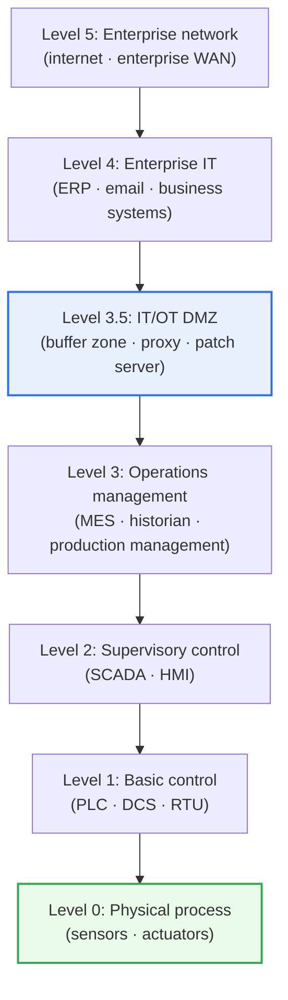
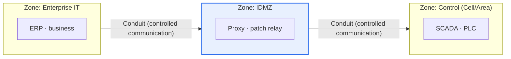

# The Purdue Model for Industrial Control Systems (ICS)

## 1. Overview

### A. Definition and Concept
> The **Purdue Model (Purdue Enterprise Reference Architecture)** is a **reference architecture that represents the components of industrial control systems (ICS) divided into multiple levels according to function and role**. It defines the structure and security boundaries of industrial networks by hierarchically separating the IT (information technology) and OT (operational technology) domains and placing a buffer zone between them.

The Purdue Model was devised in the early 1990s in computer-integrated manufacturing (CIM) research at Purdue University in the United States to layer the information and control flows of an enterprise, and later, combined with the ISA-95 (enterprise-control system integration) standard, it became the de facto standard map of industrial automation. Today, its functional hierarchy is used even more widely as the **baseline for industrial cybersecurity**.

The fundamental reason the Purdue Model became the standard for industrial security is the idea that "**it is dangerous for a factory's physical equipment and the office's IT to be indiscriminately mixed, so divide them into levels and guard the boundaries**." An industrial site contains both an OT domain that controls actual physical equipment (sensors, PLCs, SCADA) and an IT domain responsible for management and business (ERP, internet). But their requirements are opposite. OT puts safety and continuous operation (Availability) first, so it cannot be stopped or patched carelessly, and its lifecycle is long, at 10–20 years. IT, by contrast, values data confidentiality, integrity, and connectivity, and is updated frequently.

If the two are connected without any control, an attack that penetrates via the internet can directly manipulate physical equipment and cause physical disasters such as explosions, blackouts, and casualties. To prevent this, the Purdue Model divides the system into levels from the physical site (bottom) to management (top) and places clear boundaries and controls between each level. In particular, it places a buffer zone called the **Industrial DMZ (IDMZ)** between IT and OT, blocking threats from upper-level IT from propagating directly to lower-level OT. In short, the Purdue Model is both a "map" for understanding industrial systems and a "security boundary line" for designing defenses.

### B. Background of IT/OT Convergence and Necessity
In the past, OT was considered relatively free from security threats because it was a closed network (air-gap) cut off from the outside. However, as demand grew to collect and analyze production data in real time through smart factories, Industry 4.0, and the industrial IoT (IIoT), previously closed OT began to be connected to IT and the cloud. This connection increased productivity but simultaneously widened the attack surface. As a result, understanding the hierarchical structure and securing the IT-OT boundary became essential requirements for industrial safety, and the Purdue Model serves as the starting point for such segmentation design. [[isa-iec-62443]]

## 2. Hierarchical Structure of the Purdue Model

As shown above, the Purdue Model is composed of levels from the physical process (lowest, Level 0) to the enterprise network (highest, Level 5). The key principle for understanding this hierarchy is the directionality that **"the lower you go, the more real-time performance, safety, and availability matter; the higher you go, the more data, connectivity, and confidentiality matter."** Each level is examined from bottom to top.

### A. OT Domain — Levels 0–2 (Physical Process and Real-Time Control)
The lowest, **Level 0 (physical process)**, is the actual physical equipment consisting of actuators such as valves, motors, and pumps and sensors that measure temperature, pressure, and flow. Real-time physical phenomena on the order of milliseconds occur here, and since accidents lead directly to physical damage, safety is the absolute priority.

**Level 1 (basic control)** is where PLCs (Programmable Logic Controllers), DCS (distributed control systems), and RTUs are located to directly control Level 0 equipment. It is the level where control logic such as "close the valve if the temperature exceeds the threshold" runs, and malfunction or manipulation here leads directly to anomalies in the physical process. The very point Stuxnet targeted was this PLC.

**Level 2 (supervisory control)** is where SCADA (supervisory control and data acquisition) and HMIs (operator screens) are located, allowing operators to monitor process status and change setpoints. Levels 0–2 collectively form the "**Cell/Area Zone**," the core segment of real-time control. These three levels share the characteristic that downtime means production and safety losses, making it difficult to apply IT-style forced patching or rebooting as is.

### B. Boundary Level — Level 3.5 (IT/OT DMZ)
The security core of the Purdue Model is **Level 3.5, the IT/OT DMZ (IDMZ)**, located between Level 3 and Level 4. This buffer zone never connects OT and IT directly and forces all traffic to pass through it. The IDMZ hosts reverse proxies, patch distribution servers, replicas of the data historian, remote access jump servers, and the like, relaying and inspecting traffic so that traffic from upper-level IT cannot reach lower-level OT directly.

The design principle of the IDMZ is clear: **"No traffic traverses IT and OT; it terminates in the DMZ."** For example, instead of IT's patch server directly updating OT assets, patches are placed on a relay server in the IDMZ, and OT assets retrieve them only from there. This way, even if the IT network is infected with ransomware, the threat does not spread directly to the physical equipment.

### C. IT Domain — Levels 3–5 (Operations Management and Enterprise IT)
**Level 3 (operations management)** is the level that manages the operation of the entire plant, such as MES (manufacturing execution systems), production scheduling, and quality history management; it is the top of OT and the point where it meets IT. **Level 4 (enterprise IT)** handles site-level business IT such as ERP, email, and business systems, and **Level 5 (enterprise network)** handles the enterprise-wide WAN spanning multiple sites and internet connectivity. These upper levels are the domain where traditional IT security (patching, antivirus, access control) is applied normally.

| Level | Representative components | Function / characteristics | Priority value |
|---|---|---|---|
| **Level 5** | Internet, enterprise WAN | Enterprise network, external connectivity | Connectivity |
| **Level 4** | ERP, email, business systems | Site-level business IT | Confidentiality, data |
| **Level 3.5** | Proxy, patch server, jump server | IT-OT buffer, boundary control | Isolation, blocking |
| **Level 3** | MES, historian | Production operations management (top of OT) | Operational efficiency |
| **Level 2** | SCADA, HMI | Monitoring, operator control | Visibility |
| **Level 1** | PLC, DCS, RTU | Direct equipment control | Real-time performance |
| **Level 0** | Sensors, actuators | Physical process execution | Safety, availability |

## 3. Security Applications and Links to IEC 62443

The level concept of the Purdue Model is made concrete as practical defense design when combined with the **Zone and Conduit** concepts of **IEC 62443**, the international standard for industrial security. IEC 62443 reinterprets Purdue's rigid "levels" as "zones," logical groupings of assets, and "conduits," controlled communication paths between zones. Each zone is assigned a required Security Level (SL 1–4), and conduits permit only the minimum necessary communication through firewalls, unidirectional gateways (data diodes), and the like. In practice, it is often said that "**you draw the structure with Purdue and protect it with 62443**."

| Security perspective | Description | Practical application examples |
|---|---|---|
| **Segmentation** | Network division by level/zone, IT-OT isolation via IDMZ | VLANs, firewalls, zone separation |
| **Least Communication** | Only necessary inter-level communication allowed through conduits | Whitelisting, protocol restriction |
| **Protecting lower levels first** | Controlling direct access to physical equipment (L0–1) | Unidirectional gateways, jump servers |
| **Defense in Depth** | Multiple lines of defense at each level | Per-level monitoring and authentication |

Historical cases illustrate the need for this structure well. In 2010, **Stuxnet** penetrated a closed OT network via USB and then manipulated Siemens PLCs at Level 1 to physically destroy centrifuges at Natanz, Iran. In the **Ukrainian blackout (BlackEnergy)** of December 2015, attackers passed through the IT network to remotely access the control center of distribution companies and manipulated circuit breakers at about 30 substations, leaving about 230,000 people without power. In 2016, **Industroyer (CrashOverride)**, which directly speaks industrial protocols, paralyzed part of the Kyiv power grid for about an hour. All three cases share the common trait of penetrating via an IT path and spreading to OT, which proves why IT/OT boundary control is the vital point of industrial security.

### A. Fundamental Differences between IT Security and OT Security
The reason the Purdue Model deliberately separates IT and OT into levels is that the security priorities of the two domains fundamentally conflict. IT security traditionally values Confidentiality → Integrity → Availability, in that order. Since data leakage is the worst incident, the standard practice is to block the system and patch immediately when in doubt.

In OT security, by contrast, this priority is exactly reversed. Availability and safety come first, and confidentiality comes last. Since even a few milliseconds of delay or blocking of a control signal can cause the physical process to malfunction and lead to explosions or blackouts, the IT-style response of "block when in doubt" can itself cause a safety accident. Also, since OT assets are premised on 24-hour uninterrupted operation, rebooting for patches means production loss, and legacy equipment used for 10–20 years does not even support modern security features.

Because of these differences, transplanting IT security methods to OT as is can actually be dangerous. For example, active vulnerability scanning, common in IT, can bring down older PLCs, so passive monitoring is preferred in OT, and virtual patching (blocking vulnerability exploitation with IPS signatures) is widely used instead of real-time patching. The level separation of the Purdue Model is precisely the mechanism that provides physical and logical buffering so that these two conflicting security philosophies do not infringe on each other.

## 4. Advanced — Reinterpreting the Purdue Model in the Cloud and IIoT Era, and Zero Trust

The Purdue Model presupposes clear levels and boundaries, but real industrial networks are changing in a direction that blurs this premise. Cloud-based analytics, direct communication from IIoT sensors (communication that skips upper levels via MQTT and the like), private 5G networks, and remote maintenance, which surged after COVID-19, all break Purdue's assumption that "communication passes through the levels sequentially." For this reason, the debate "is the Purdue Model now obsolete?" continues.

The current practical consensus is that "**the Purdue Model remains valid as a conceptual map (a common language and segmentation thinking framework), but needs extension and supplementation as a literal implementation blueprint**." That is, rather than enforcing the level order as an absolute communication path, the levels are used as the basis for asset classification and boundary design, while actual control moves to identity-based mechanisms. The core of this is **Zero Trust**, the principle of "not using network location as a basis for trust (eliminating implicit trust) and verifying every access each time based on identity and context." [[zero-trust]]

In fact, the "Zero Trust for Operational Technology" guidance published by the US Department of Defense in 2025 still recognizes the Purdue Model and IEC 62443 as authoritative OT classification frameworks, while stating that the gaps created by IIoT, cloud, and remote access should be filled with IEC 62443 zones and conduits, zero trust verification, and hardware-enforced boundary controls at the IDMZ. Likely exam directions include "limitations of the Purdue Model and supplementation with zero trust," "segmentation design in IT/OT converged environments," and "SL design based on IEC 62443 zones and conduits."

## 5. Considerations and Implications

1. **IT/OT boundary security is the top priority.** Most major industrial cyber incidents, such as Stuxnet and the Ukrainian blackout, penetrated via IT and spread to OT. Therefore, blocking threat propagation with the IDMZ, network separation, inter-level access control, and unidirectional gateways is the vital point of defense. From a Professional Engineer's perspective, strategically allocating IT security budget and capabilities to the OT boundary is a key decision.

2. **Design security that respects OT's unique characteristics.** OT is hard to stop, reboot, or patch, has a long lifecycle, and has many legacy protocols (lacking authentication, such as Modbus). Therefore, rather than transplanting IT security methods as is, OT-specific security should be designed around virtual patching (IPS signatures), passive traffic monitoring (passive anomaly detection), and securing asset visibility.

3. **Respond to blurring boundaries with zero trust.** Traditional level boundaries are becoming ambiguous due to cloud, IIoT, and remote maintenance. A hybrid strategy is needed that uses the Purdue Model as the baseline for segmentation while supplementing it with zero trust access control based on identity and device posture and with IEC 62443 zone and conduit design.

4. **Manage continuously in connection with standards and governance.** The security architecture should be established consistently with IEC 62443 (zones, conduits, SL), NIST SP 800-82 (ICS security guide), and Korea's critical information infrastructure protection regime, and operated with a governance framework of asset identification → risk assessment → setting target security levels (SL-T) → continuous inspection.

5. **Reconcile the conflict between safety and security.** In OT, security controls can actually harm availability and safety (e.g., a firewall false positive blocking a control signal). The Professional Engineer's balance point is to review safety analysis and security design in an integrated manner so that security measures do not impair the safety and real-time performance of the physical process.

## References
- Fortinet, "What Is the Purdue Model for ICS Security?" — https://www.fortinet.com/resources/cyberglossary/purdue-model
- Zscaler, "What Is IEC 62443? Definition, Breakdown & Methodology" — https://www.zscaler.com/zpedia/what-is-iec-62443
- 4Secure, "The Purdue Model in 2026: Is It Still Fit for Purpose?" — https://www.4-secure.com/purdue-model-ics-security/
- Wikipedia, "Industroyer" — https://en.wikipedia.org/wiki/Industroyer

---

> **In one line**: The Purdue Model is *a reference architecture that divides ICS into levels from the physical process (L0) to enterprise IT (L5)*; it isolates the two domains with the IT/OT DMZ at Level 3.5 to block threat propagation, and, combined with IEC 62443 zones and conduits and with zero trust, it forms the foundation of industrial security in the era of IT/OT convergence.
